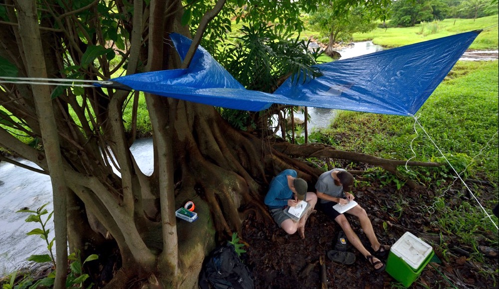

# Front Matters {.unnumbered}

## Acknowledgments {.unnumbered}

This Open Educational Resource (OER) was made possible with the support of a grant from the The Open/Alternative Textbook Initiative at Kansas State University and is archived at the [Institutional Repository Library of the University of Missouri-St. Louis](https://irl.umsl.edu/oer/36/).

I thank Tom Platt, John Coffin, Ryan Greenway, Madison Nobrega, and Libby Wilson, who have all made immeasurable contributions to the development of the learning materials included here. I especially thank Madison Nobrega for her relentless editing; her input has greatly improved this text. Last but not least, many thanks to the past students in Evolution courses at Kansas State University and the University of Missouri-St. Louis. It was your input that lead to this resource and that helps me to continuously improve it. Especially, the following people have graciously provided feedback on writing and content: Shaun Baughman, Caroline Gatschet, Aaron George, Karisa Leonard, Kate Odgers, and Andy Su.

## Copyright {.unnumbered}

© 2021-2025 by Michi Tobler

```{r cc, echo=FALSE}
knitr::include_graphics('images/cc.png')
```

This work is licensed under a [Creative Commons Attribution-NonCommercial-ShareAlike 4.0 International License](https://creativecommons.org/licenses/by-nc-sa/4.0/). You are free to copy and redistribute the material in any medium or format, and to remix, transform, and build upon the material provided you give the original author credit (attribution), you are not using the material for commercial purposes (NonCommerical), and you distribute your work under the same license as the original (ShareAlike).

If you would like to adopt and use this resource in any way, feel free to contact [Michi Tobler](mailto:tobler@umsl.edu) to obtain a copy of all source files.

## About the Author {.unnumbered}

Michi Tobler is the E. Desmond Lee Professor in Zoological Studies in the [Department of Biology](https://www.umsl.edu/biology/index.html) at the University of Missouri-St. Louis and a Senior Scientist at the [WildCare Institute](https://stlzoo.org/conservation/in-action/saint-louis-wildcare-institute) of the Saint Louis Zoo. His research focuses on mechanisms of adaptation and speciation, primarily using extremophile fishes as study systems. You can learn more about our research on his lab website: <https://sulfide-life.info/>

```{r mx, echo=FALSE, out.width='100%'}

```
