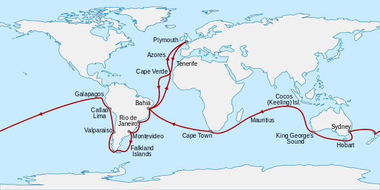

# (PART) Basic Concepts {.unnumbered}

# What Evolution Is

The notion of an ever-changing world is a relatively new idea in Western cultures. Dating back to the teachings of Greek philosophers, the world was long seen as permanent and unchanging. Its inhabitants were thought to be arranged on scale from lower to higher beings by a divine creator, with humans at the very top of the hierarchy. Until the early 1800s, most naturalists were primarily concerned with describing and cataloging life, which led to the modern classification system originally developed by the Swedish biologist Carolus Linnaeus.

By the time Charles Darwin was born in the early 19^th^ century, evidence for a changing world was accumulating. Geologists started to contemplate how slow, gradual processes could carve canyons into stone and change the course of rivers. The discovery of fossils indicated the past existence of organisms vastly different than today's and suggested a rich history with continuous change. And some scholars, like the French biologist Jean-Baptiste Lamarck (Figure \@ref(fig:lamarck)), started to formulate theories that could potentially explain the diversity of life. Budding evolutionary thought was not limited to Western cultures, and there were a number of pre-Darwinian Muslim scholars who articulated evolutionary ideas as well (Malik et al. 2018).

```{r lamarck, echo=FALSE, out.width='50%', fig.cap = "Jean-Baptiste de Monet Chevalier de Lamarck. Painted by Charles Thévenin, [Public Domain](https://creativecommons.org/share-your-work/public-domain/)."}

```

It was Lamarck, inspired by the similarities he observed across different species, who formulated the first theory of evolution. Lamarck argued that life was inevitably driven towards increasing complexity, essentially progressing along the scale from lower to higher beings established by the Greeks. He envisioned that simpler life forms, like microbes, continuously arise and eventually develop into higher forms, like plants and animals. Lamarck also believed that progress along this hierarchy allowed organisms to adapt to their environment, which was driven by an "inner need". He thought that the continuous use of a particular organ allowed for its proliferation and subsequent inheritance to the next generation. Perhaps most famously, Lamarck explained that the long neck of the giraffe was the product of a continuous stretching toward leaves high on the trees. So, across many generations of stretching, giraffe necks gradually reached their current size.

## Darwin and the Conception of a New Idea

When Darwin boarded the British Navy Ship HMS Beagle as a 22-year old, he was already well trained in geology, chemistry, and natural history. Darwin was hired as an unofficial naturalist and companion to the captain of the ship, Robert FitzRoy, and the five-year journey around the world allowed young Darwin to collect evidence of a changing world (Figure \@ref(fig:beaglemap)).

```{r beaglemap, echo=FALSE, out.width='100%', fig.cap = "Map of the Voyage of the Beagle. Map: Sémhur, [CC BY-SA 4.0](https://creativecommons.org/licenses/by-sa/4.0/)."}

```

Darwin's visit to the Galapagos Islands, and the specimens of reptiles and birds that he collected there, proved to be particularly inspiring. The Galapagos are an archipelago of 21 small islands, located over 900 kilometers off the coast of Ecuador, and situated right on the equator. Darwin not only noticed that the fauna of these islands was dominated by animals found nowhere else, but there also were differences in the species from one island to the next. Most importantly, bird specimens that Darwin believed to be blackbirds, warblers, wrens, and finches due to their different beak morphologies later all turned out to be just finches---the Darwin's finches we know today (Figure \@ref(fig:finches)). In his own words:

> "I have stated, that in the thirteen species of ground-finches, a nearly perfect gradation may be traced, from a beak extraordinarily thick, to one so fine, that it may be compared to that of a warbler. [...] Seeing this gradation and diversity of structure in one small, intimately related group of birds, one might really fancy that from an original paucity of birds in this archipelago, one species had been taken and modified for different ends."
>
> --- Darwin, 1889

If all the species were created with traits that fit the environments in which they are now found, why would the finches of the Galapagos Islands be so different from one another? Why do closely related species occupy niches that are filled by very different taxa in other regions? Observations like these, which Darwin made at many destinations throughout his travels, led him to suspect that the species we observe today have evolved from a shared ancestor.

```{r finches, echo=FALSE, out.width='100%', fig.cap = "Examples of Darwin's finches or Galapagos finches. Note the stark variation in beak sizes among the four species. Drawn by John Gould, [Public Domain](https://creativecommons.org/share-your-work/public-domain/)."}

```

Upon his return to England in 1836, Darwin settled near London and never traveled abroad again. Nonetheless, he remained a prolific scholar writing monographs about various topics, from geology to barnacles. Darwin was also a passionate pigeon breeder, and it was this unlikely hobby that provided additional insights for the formulation of his ideas. It led him to think about the forces that could drive the modification of species from one common ancestor to different descendants: 

> "It is, therefore, of the highest importance to gain a clear insight into the means of modification. [...] At the commencement of my observations it seemed to me probable that a careful study of domesticated animals and of cultivated plants would offer the best chance of making out this obscure problem."
>
> --- Darwin, 1859

In his endeavors of pigeon breeding, Darwin noticed two critical things: (1) Offspring tended to inherit the traits of their parents. (2) If he carefully selected breeders with desired traits generation after generation, he was able to shape the variation of colors, morphologies, and behaviors in his flock. It was his meticulous work as a natural historian, collecting evidence for his emerging ideas for over two decades, that ultimately allowed Darwin to formulate the basic tenets of evolutionary biology that still hold up today, after more than 150 years of scrutiny by the scientific community.

## Two Fundamental Insights

### The Pattern: Evolution is Descent with Modification {#predictions}

The first of Darwin's fundamental insights was the formal description of evolution as we understand it today. He described evolution as *descent with modification*, postulating the common ancestry of all living things. Hence, different species did not arise independently, but they derived from preexisting form. This insight arose from a careful analysis of patterns of similarities across species. Species that share a recent common ancestor share traits precisely because they inherited them from the shared ancestor. More distantly related taxa exhibit differences in their traits, because they have been on independent evolutionary trajectories for longer periods of time. This perspective describes the observable *pattern of evolution*.

Given Darwin's insight, here is a simple definition of evolution that we will rely on for now. As you will see, there are multiple modern definitions of evolution, and we will revisit different definitions throughout the book.

::: {.alert .alert-block .alert-info}
<b>Definition: Evolution</b>

Evolution is the change in the inherited traits of a population across successive generations, ultimately leading to the transformation of species through time (both in terms of changes of traits that occur within species and the origin of new species).
:::

The power of Darwin's idea of descent with modification is that we can treat it as a scientific hypothesis with empirically testable predictions. If Darwin's notion of evolution was right, we should be able to uncover evidence that:

1.  Species change through time (microevolution).
2.  Lineages split to form new species (speciation).
3.  Novel forms derive from earlier forms (macroevolution).
4.  Species are not independent but connected by descent from a common ancestor (common ancestry and homology).
5.  Earth and life on Earth are old (deep time).

We will revisit these predictions and examine the evidence for evolution in detail in [Chapter 2](evidence-for-evolution.html).

### The Process: Natural Selection is a Mechanism of Evolution

The second of Darwin's fundamental insights was the inception of a mechanism that could produce the observable pattern we call evolution (i.e., change in inherited traits across generations), which Darwin named natural selection.

::: {.alert .alert-block .alert-info}
<b>Definition: Natural Selection</b>

Natural selection is the process in which individuals with a particular trait exhibit higher reproductive success than individuals without that trait.
:::

Natural selection explains how the traits of a population change through time, and why organisms are well suited for their environment. Individuals that exhibit traits that are advantageous under certain environmental conditions have a higher chance of surviving and reproducing, making a disproportional contribution to the offspring of the next generation. If the relevant traits are heritable, their frequency increases across subsequent generations. This process not only leads to change in populations across generations, but said change specifically pertains to traits that are important for survival and reproduction in a given environmental context. In other words, the action of natural selection directly leads to adaptation. We will take a close look at how natural selection works in [Chapter 3](natural-selection-a-mechanism-for-change.html).

### Distinguishing between Pattern and Process

A key misconception is that evolution and natural selection are the same. People often use the two terms interchangeably, conflating patterns and processes of evolution. Distinguishing between the two is critical, because evolution and natural selection do not have to go in unison.

Evolution is a historical pattern of change that can---but does not have to---be caused by natural selection. Evolutionary change can also be driven by other forces that impact the composition of populations across generations. In Part II of this book, we will examine evolutionary forces other than natural selection, which include mutation, genetic drift, and migration. In natural populations, these four forces interact to shape evolutionary change across time.

It is also important to note that the action of natural selection does not necessarily lead to evolution. Natural selection can only cause evolution when it acts on heritable traits that are transmitted from parent to offspring. If that is the case, the offspring of successful individuals will carry the same traits that made their parents successful. However, not all traits are heritable. For example, selection on individuals exhibiting high muscle mass does not translate to evolutionary change if that muscle mass was acquired through exercise and diet. If natural selection acts on non-heritable traits, there is no evolutionary change.

::: {.alert .alert-block .alert-info}
<b>Explore More: Misconceptions about Evolution</b>

Despite the broad scientific consensus on the importance of evolutionary theory in understanding the diversity of life, people hold many misconceptions about evolutionary theory and processes, its implications, and its relation to religious beliefs. I encourage you to explore the fantastic [resource provided by The University of California Museum of Paleontology, which lists common misconceptions about evolution and clarifies these misconceptions](https://evolution.berkeley.edu/evolibrary/misconceptions_faq.php).
:::

### Population Thinking

Darwin's fundamental insights were possible because of a fundamental shift in how he thought about biological entities, from a typological perspective to what Mayr (1982) called "population thinking". Prior to Darwin, scholars viewed individual organisms as imperfect representations of a central Platonic type (the perfect manifestation of a species). Variation among individuals was considered to be meaningless noise that was either ignored or seen as a nuisance when describing and classifying species. In contrast, population thinking rejects the notion of an ideal representative and instead focus on the variants found within populations. Variation among individuals is not just meaningless noise that represents different degrees of imperfections from a preconceived idea, but it is the raw material for evolutionary change. In other words, what was meaningless noise to naturalists prior to Darwin suddenly became the very focus of evolutionary studies after. Mayr (1982) argued that this paradigm shift was one of Darwin's most important contributions to modern biology.

## Practical Skills: Getting Started with R

During this course, you will learn about evolution *and* practice being a scientist by visualizing and interpreting data on a weekly basis. To do so, we will use an open-source software called R. This section provides instructions for installing R and a companion program (RStudio) on your Mac or PC.

### What are R and RStudio?

R is a programming language for statistical analysis and data visualization, and over the past decades, it has become one of the most critical and universally used tools in the life sciences. RStudio is a convenient interface that allows you to easily write, organize, and execute your R code; it's the program we will use throughout the semester for weekly assignments. Note that RStudio will not run unless R is already installed.

### Installing R

To run R and RStudio on your system, complete the following steps in the right order (*i.e.*, you need to install R before you can install RStudio). Although we recommend the use of Windows or Mac OS for this class, R is also available for [Linux](https://cran.r-project.org/bin/linux/ubuntu/), and it can be installed on [Google Chromebooks](https://blog.sellorm.com/2018/12/20/installing-r-and-rstudio-on-a-chromebook/). Please note that any code used in this course has not been troubleshot on the latter two platforms.

#### For Windows {.unnumbered}

-   [Download the binary setup file for R 4.2.x](https://cran.r-project.org/bin/windows/base/)

-   Open the downloaded \*.exe file and follow the instructions to install R

-   [Download the binary setup file for Rtools40](https://cran.r-project.org/bin/windows/Rtools/)

-   Open the downloaded \*.exe file and follow the instructions to install Rtools

#### For Mac {.unnumbered}

-   Check the version on your operating system (click the Apple logo on your desktop and choose "About This Mac"). If your macOS version is 10.14 or older, please [first update your computer to a newer macOS version](https://support.apple.com/en-us/HT201541). If you do not update your computer first, R and RStudio may still install properly, but you will run into compatibility issues later in the semester when use different packages within R.

-   Download the .pkg file for R 4.2.x form the following link: <https://cran.r-project.org/bin/macosx/>

-   Open the downloaded \*.pkg file and follow the instructions to install R

### Installing RStudio

[Download the free, open-source version of RStudio Desktop](https://www.rstudio.com/products/rstudio/download/) by choosing the appropriate installer file for your operating system and then run it to install RStudio. If you are using Mac, make sure to move the RStudio app to your actual Applications folder (rather than starting it from the disk image).

### Checking the Successful Installation

Once you completed the steps above, we recommend that you launch RStudio and make sure it starts without any errors. If the installation was successful, the RStudio interface should look something like Figure \@ref(fig:interface):

```{r interface, echo=FALSE, out.width='100%', fig.cap = "Screenshot of the RStudio interface."}
knitr::include_graphics('images/rstudio_interface.png')
```

### Some R and RStudio Basics

This section was inspired by and used parts of "[Introduction to R](https://chem.libretexts.org/@go/page/7641)" by [Russell A. Poldrack](https://poldracklab.stanford.edu/), published on [LibreTexts](https://libretexts.org/) and licensed under [CC BY-NC](https://creativecommons.org/licenses/by-nc/4.0/).

Learning a programming language---like learning any language---can be intimidating. Still, it is a basic skill for any scientist. Starting in Chapter 2, you will work through R exercises that help you digest the basic concepts discussed in each chapter. We will show you exactly how to use RStudio to work through the exercises there. As you will see, most assignments in class will provide you with the majority of the code structure in a way that a few simple tweaks on your side will produce the desired outcome. But we encourage you to explore beyond what the exercises dictate. A willingness to experiment will make you a better programmer and scientist. Before we get to that stage, however, you need to build some basic fluency in R, so you can ease yourself into using this new tool.

#### The Console and Basic R Prompts {.unnumbered}

Let's begin with the fundamental building blocks of R and RStudio. As you open RStudio, the program window will look something like [Figure 1.4](#Fig1.4).The panel in the upper right contains your work space (Global Environment) as well as a history of the commands that you've previously entered. Any plots that you generate will show up in the panel in the lower right corner and you can also use that section to browse your folders for specific files. The panel on the left is where the action happens. It's called the Console. Every time you launch RStudio, it will have the same text at the top of the console telling you the version of R that you're running. Below that information is the command prompt (symbolized by `>`), where you can enter commands and R responds to those commands.

It's really simple, and you can try it out right now! Just type `2+2`, press enter, and R should respond right back with the response. It should look like this:

```{r basic1}
2+2
```

R pretty much operates like a calculator and can perform any calculation you might need. R can also deal with logical variables, and respond to queries about whether logic statements are true or false. For example, you can use logical operators [`>` (greater than), `<` (smaller than), `==` (equals), `!=` (not-equals)] to contrast statements, and R will assess them:

```{r basic2}
5*2>sqrt(100) #note that sqrt starts for square-root
```

```{r basic 2.2}
5*2==sqrt(100)
```

#### Working with Variables {.unnumbered}

One of the strengths of R is that it cannot only perform basic calculations using numbers, but it can handle variables, which are symbols that stand for values. You can designate a variable using `<-`. For example, we can assign the value 5 to x:

```{r basic3}
x <- 5
```

Notice when you run that code, you created a new variable x with the value 5 that shows up in your work space on the top-right panel. Once you have a variable defined, you can use it in calculations and logic statements as described above:

```{r basic4}
x^2
```

```{r basic5}
x==5
```

Designating variables allows you to write some complex code that processes data, and if you want to do the same thing with different data, you don't have to rewrite the code, you just redefine the input variables. For example you can designate three different variables:

```{r basic6}
x1 = 16
x2 = 12
x3 = 2
```

If you use these variables in a complex equation, you need to just write the equation once, and you can tweak the input variables to explore the effects of different values.

```{r basic7}
x1*(x1+x2+x3)/(x1^2+x2^2+x3^2)
```

#### Vectors {.unnumbered}

Variables are not only able to designate numbers, they can also designate lists of numbers (called vectors). You can create a vector (`y` in this case) using the `c()` function, and you can then call on `y` using `print()` for R to display the vector in the console:

```{r basic8}
y <- c(1,12,2,14)
print(y)
```

If you execute this code, you will again see the creation of a new variable y in your work space, which corresponds to a vector with four numbers.

You can call numbers within a particular vector by using square brackets along with the variable name and a the number that refers to a location within the vectors. So, if we want to extract the 3^rd^ number in our vector `y`, we simply type:

```{r basic9}
y[3]
```

We can also extract a range of values by using a colon. Let's say you want to extract the last two numbers in our vector:

```{r basic10}
y[3:4]
```

Finally, you can modify specific values within a vector by just combining some of the code you have already learned so far. For example, you can change the second value in our vector `y` from a 12 to 4:

```{r basic11}
y[2] <- 4
y
```

#### Using Functions {.unnumbered}

R can execute a wide variety of functions that take some input and provide an output based on the input. Functions can be applied to a simple number. For example the `sqrt()` function calculates the square-root of an input number. We can use it on our variable x that we defined above:

```{r basic12}
sqrt(x)
```

We can also apply the same function to a vector, in which case the function is applied to every number in the vector:

```{r basic13}
sqrt(y)
```

Sometimes we want to use the output of one function as an input for another function. In this case, it makes sense to store the output of a function in a new object:

```{r basic14}
sqrt.y <- sqrt(y)
print(sqrt.y)
```

Note that this code again created a new object called `sqrt.y` in your work space, and you can call on it using `print()` to display it in the console. We can now also use the new values as input for another function. For example, we can calculate the average of these values using the `mean()` function:

```{r basic15}
mean(sqrt.y)
```

Over the course of the semester, you will get to know a wide variety of functions in R that will allow you to make complex plots and analyze genetic and phenotypic data to make evolutionary inferences. R already knows a large number of functions upon installation, but you can essentially teach it limitless new functions by installing so-called libraries (or packages). There are [thousands of libraries for R](https://cran.r-project.org/web/packages/available_packages_by_name.html), and they contain functions to analyze and visualize all kinds of biological data, from the structure of genomes to the composition of ecological communities. You will learn how to install new libraries and apply the functions they contain in [Chapter 2](evidence-for-evolution.html#libraries).

#### Data Frames {.unnumbered}

The reality in biology is that we rarely deal with simple numbers or vectors. Rather, we typically collect complex data sets that contain a multitude of variables. For example, if we go out into natural populations to quantify trait variation, you might record information about an individual's sex, its health status, body size, and body mass. Instead of having a different variable designated for each of these pieces of information, we can combine all of the variables into a single object (table) called a data frame.

To assemble a data frame, we start by first defining individual variables. In the example below, I create two vectors with categorical variables (`sex` and `health.status`; note that different categories need to be contained in quotation marks), and two continuous variables (`body.size` and `body.mass`):

```{r basic16}
sex <- c("male", "female", "male", "female")
health.status <- c("healthy", "healthy", "sick", "sick")
body.size <- c(16.4, 12.2, 10.2, 8.9)
body.mass <- c(221, 199, 178, 159)
```

As before, executing this code will generate four different vectors in your work space. To combine all the information into a single data frame, we can use R's `data.frame()` function. Within the data frame, you can generate a variable name (before `=`) and assign a vector that you already created (after `=`):

```{r basic17}
df <- data.frame(sex=sex, health=health.status, size=body.size, mass=body.mass)
```

Executing this code will again generate a new object in your work space. You can view your data frame by double-clicking on it in the workspace or using the `View()` function in the console:

``` ruby
View(df)
```

The data frame should look similar to a spreadsheet you might know from Excel (Figure \@ref(fig:df1)):

```{r df1, echo=FALSE, out.width='50%', fig.align="center", fig.cap = "A view of the df data frame generated by the `View()` function."}

```

Each of the columns in the data frame contains one of the variables, with the name that we gave it when we created the data frame. We can access each of those columns using the `$` operator. For example, if we wanted to access the size variable, we would combine the name of the data frame with the name of the variable as follows:

```{r basic18}
df$size
```

This is just like any other vector, in that we can refer to its individual values using square brackets, as we did with regular vectors:

```{r basic19}
df$size[3]
```

In reality, you will rarely have to build your own data frame in this class, because we will provide you will real data from classic studies and our own research that you can read into R. You will learn how to do that in [Chapter 2](evidence-for-evolution.html#import-data).

#### Help Functions {.unnumbered}

If you ever run into issues or have question regarding how to use a particular function or package, you can access the documentation with instruction using the question mark symbol (`?`) followed by the function or package name. For example, `?sqrt` will provide the instructions for the `sqrt()` function.

## Additional Resources

### Alternative Evolution Textbooks

If you would like more in-depth reading materials about evolution, there are a number of excellent textbooks available. I particularly recommend the edited volume by Losos et al. with short articles about current topics in evolution, because it is freely available for online reading through most university libraries.

-   Bergstrom CT, LA Dugatkin (2018): [*Evolution*](https://wwnorton.com/books/Evolution/). Norton.

-   Emlen DJ, C Zimmer (2020): [*Evolution - Making Sense of Life*](https://www.macmillanlearning.com/college/us/product/Evolution/p/1319079865). MacMillan.

-   Futuyma DJ, M Kirkpatrick (2017): [*Evolution*](https://global.oup.com/ushe/product/evolution-9781605356051?cc=us&lang=en&). Oxford University Press.

-   Herron JC, S Freeman (2014): [*Evolutionary Analysis*](https://www.pearson.com/us/higher-education/program/Herron-Evolutionary-Analysis-5th-Edition/PGM296285.html). Pearson.

-   Losos JB, DA Baum, DJ Futuyma, HE Hoekstra, RE Lenski, AJ Moore, CL Peichel, D Schluter, MC Whitlock (editors) (2014): [*The Princeton Guide to Evolution*](https://press.princeton.edu/books/hardcover/9780691149776/the-princeton-guide-to-evolution). Princeton University Press.

### Evolution in the Primary Literature and the News

For some assignments, and to satisfy your innate curiosity, you may want to consider consulting other resources. You can browse through [the list of peer-reviewed journals that publish research related to evolution](http://evolution-textbook.org/content/free/notes/box_journal_list.html). If you want to find current research in the field, I also recommend the following websites, many of which provide lay summaries of recent papers:

-   [EurekAlert!](https://www.eurekalert.org/)

-   [Nature News](https://www.nature.com/news)

-   [Popular Science](https://www.popsci.com/)

-   [Science Daily](https://www.sciencedaily.com/)

-   [Science Magazine News](https://www.sciencemag.org/news)

-   [Science News](https://www.sciencenews.org/)

-   [Scientific American](https://www.scientificamerican.com/)

### R and RStudio Resources

This book will provide you with the background knowledge necessary to use R at the level you need to succeed in this class. Nonetheless, you will run into issues, and being able to troubleshoot errors is one of the most important coding skills. **Perhaps the most important tool during troubleshooting is... Google!** If you google your error message from R or specific questions you have, you will likely find that somebody else already had that problem. Question/answer threads associated with [Stack Overflow](https://stackoverflow.com/) usually are a very reliable resource for overcoming issues with coding. If you need additional resources or want to dig a little deeper, consider the following:

-   [Getting Started with R: An Introduction for Biologists](https://www.oxfordscholarship.com/view/10.1093/acprof:oso/9780199601615.001.0001/acprof-9780199601615) (this may be worth it if you consider attending graduate school to earn a M.S. or Ph. D.)

-   The [Statistical Tools for High-Throughput Data Analysis](http://www.sthda.com/english/) website has a number of fantastic R tutorials. The following may be helpful for you in this course:

    -   [Basic introduction to R and RStudio](http://www.sthda.com/english/wiki/r-basics-quick-and-easy)

    -   [Import data into R](http://www.sthda.com/english/wiki/importing-data-into-r)

    -   [How to make any ggplot](http://r-statistics.co/ggplot2-Tutorial-With-R.html)

    -   [Introduction to ggplot2](http://www.sthda.com/english/wiki/ggplot2-essentials)

    -   [Bar plots with ggplot2](http://www.sthda.com/english/wiki/ggplot2-barplots-quick-start-guide-r-software-and-data-visualization)

    -   [Histogram plots with ggplot2](http://www.sthda.com/english/wiki/ggplot2-histogram-plot-quick-start-guide-r-software-and-data-visualization)

    -   [Scatter plots with ggplot2](http://www.sthda.com/english/wiki/ggplot2-scatter-plots-quick-start-guide-r-software-and-data-visualization)

    -   [Box plots with ggplot2](http://www.sthda.com/english/wiki/ggplot2-box-plot-quick-start-guide-r-software-and-data-visualization)

## Reflection Questions

1.  How would you define evolution in your own words? How does your definition compare to the one given in this chapter? Are there other definitions of evolution? What are their strengths and weaknesses?
2.  What is the difference between evolution and natural selection?
3.  What do you think of the term "survival of the fittest"? Is it an accurate description of evolution? If not, why?
4.  Do you think evolution is a fact or a theory?
5.  Darwin once wrote (1859): "We see nothing of these slow changes in progress, until the hand of time has marked the lapse of ages." How long do you think it takes for evolution to take place?
6.  While Darwin understood that some traits are inherited from parents to their offspring, he did not know exactly how that happens. He was largely unaware of the work of his contemporary, Gregor Mendel, who worked out the foundational principles of genetics. Instead Darwin hypothesized that the body continuously emitted small particles he called gemmules that accumulated in the gonads and contributed heritable information to the gametes. How do you think Darwin's misconceptions about heredity impacted the validity of his evolutionary ideas? How have discoveries in classical genetics and later the discovery of DNA carrying the genetic instructions for the development and functioning of all organisms strengthened or weakened our understanding of evolution as conceived by Darwin?
7.  How does [Lamarck's view of evolution](https://en.wikipedia.org/wiki/Lamarckism) differ from our current understanding? What aspects did he get right, and what did he get wrong?

## References

-   Darwin, C. (1859). *On the origin of species based on natural selection, or the preservation of favoured races in the struggle of life*. John Murray.

-   Darwin, C. (1868). *The Variation of Animals and Plants under Domestication*. John Murray.

-   Darwin, C. (1889; original in 1839). *Journal of Researches Into the Natural History and Geology of the Countries Visited During the Voyage of H.M.S. "Beagle" Round the World, Under the Command of Capt. Fitz Roy*. Ward, Lock and Company.

-   Malik, A. H., Ziermann, J. M., & Diogo, R. (2018). An untold story in biology: the historical continuity of evolutionary ideas of Muslim scholars from the 8th century to Darwin's time. *Journal of Biological Education*, *52*(1), 3--17.

-   Mayr E. 1982. The Growth of Biological Thought: Diversity, Evolution, and Inheritance. Cambridge (MA): Harvard University Press.
