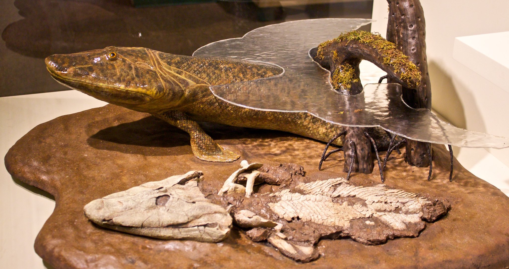

# Evidence for Evolution

```{r titleasty, echo=FALSE, out.width='100%'}
library(RColorBrewer)
knitr::include_graphics('images/chapter3_title.png')
```

Darwin described evolution as descent with modification. It turns out that he was not the only one to think about the ever-changing world in this way. Another prominent naturalist of the time, Alfred Russel Wallace, independently conceived the theory of evolution through natural selection. Like Darwin, Wallace conducted extensive fieldwork in the tropics and was a meticulous observer of the natural world. In 1858, Wallace wrote a letter to Darwin---who was by then an eminent scholar but had not published his views on evolution yet---detailing his own ideas about natural selection. This led to the joint publication of short abstracts detailing Darwin's and Wallace's views of evolution, and more importantly, it motivated Darwin to finish and publish his famous work, *On the Origin of Species*, in 1859. So, why does most of the credit for formalizing evolutionary theory go to Darwin rather than Wallace? Well, Darwin was undoubtedly first, ruminating on his ideas about evolution for decades before deciding to publish. As a consequence, he was able to introduce his views in much richer detail and provided many lines of evidence in support of his theory.

::: {.alert .alert-block .alert-info}
<b>Explore More</b>

To learn more about Alfred Russel Wallace, listen to "[*He Helped Discover Evolution, And Then Became Extinct*](https://www.npr.org/2013/04/30/177781424/he-helped-discover-evolution-and-then-became-extinct)", an NPR story published on the 100^th^ anniversary of his death.
:::

So, what evidence do we have that evolution is actually happening? What is the evidence for the occurrence of change in inherited traits across successive generations, the transformation of species through time, and the emergence of new species?

As mentioned in [Chapter 1](what-evolution-is.html#predictions), we can (must!) treat Darwin's idea of descent with modification as every other scientific hypothesis and develop testable predictions that are falsifiable with data. The idea of descent with modification makes five predictions that we can address with data:

1.  Species change through time (microevolution).
2.  Lineages split to form new species (speciation).
3.  Novel forms derived from earlier forms (macroevolution).
4.  Species are not independent but connected by descent from a common ancestor (common ancestry and homology).
5.  Earth and life on Earth are old (deep time).

This chapter takes a closer look at the different lines of evidence we have in support of evolution.

## Microevolution

Microevolution is the change in inherited traits of a population from one generation to the next, ultimately leading to the accumulation of changes and the transformation of species through time. *Heritable trait* in this context can refer to any phenotypic trait (for example the average beak size in a population of a bird) or a molecular trait (for example the frequency of alternative alleles at a particular locus). While changes in most traits from one generation to the next are subtle at best, strong natural selection can lead to significant and detectable evolutionary changes in very short periods of time. For example, check out the following video produced by the [Kishony Lab at Harvard Medical School](https://kishony.technion.ac.il/). They have designed a simple way to observe how bacteria evolve as they encounter increasingly higher doses of an antibiotic and adapt to survive---and thrive---despite of it.

<figure class="video_container">

<iframe width="800" height="450" src="https://www.youtube.com/embed/plVk4NVIUh8" title="YouTube video player" frameborder="0" allow="accelerometer; autoplay; clipboard-write; encrypted-media; gyroscope; picture-in-picture" allowfullscreen>

</iframe>

</figure>

You might say that bacteria are different. After all, assuming a generation time of 30 minutes, the two-week experiment described in the video represents over 670 generations of bacterial evolution. Translated to humans, that would represent about 17,000 years. Looking back that far in history, that was a time when humans exclusively lived as hunter-gatherers and just started to migrate into North America over the Bering Land Bridge...

One of the most persistent misconceptions about evolution is that it takes millions of years to occur. However, the reality is that microevolution---in principle---can happen in as little as one generation. Those short-term changes can be very hard to detect, because our measurement error of a trait of interest is often larger than the actual per-generation evolutionary change. Nonetheless, over the course of just a handful of generations, natural populations may exhibit significant evolutionary change that we can detect with high confidence using genetic markers (*i.e.*, measuring changes in allele frequencies) or phenotypic measurements.

The convergence of ecological and evolutionary timescales is a relatively recent insight. Darwin did not think that we would be able to directly observe evolutionary change over short periods of time:

> "We see nothing of these slow changes in progress, until the hand of time has marked the lapse of ages."
>
> --- Darwin, 1859

However, with technological breakthroughs that improved the precision of measurements we take in natural populations and with scientists' ability to track populations continuously through time, we have accumulated data across dozens of study systems---from microbes to vertebrates---documenting microevolutionary change within a few to a few dozen generations (see Hairston et al. 2005; Carroll et al. 2007). Here, I will briefly introduce you to evidence for rapid evolution gathered in one such study system (the threespine stickleback). In this chapter's case study, you will explore another example based on a time series of beak size variation of a species of Darwin's finch.

### The Case of Threespine Stickleback

Threespine stickleback (*Gasterosteus aculeatus*; Figure \@ref(fig:stickleback)) are a widely used system to study evolution and have been shown to rapidly adapt to novel environmental conditions. Stickleback are primarily marine and inhabit coastal waters throughout much of the Northern hemisphere. They are small fish (usually less than 8 cm in length) that exhibit exquisite adaptations to avoid predation in their environment: the sides of their body are covered in bony plates, and they have spines associated with their dorsal and pelvic fins that, when spread out, can dissuade a predator from capturing or consuming them.

```{r stickleback, echo=FALSE, out.width='100%', fig.cap = "Threespine stickleback (*Gasterosteus aculeatus*). Photo by Gilles San Martin, [CC BY-SA 2.0](https://creativecommons.org/licenses/by-sa/2.0), via Wikimedia Commons"}
knitr::include_graphics('images/Three-spined_stickleback.jpg')
```

Since the last ice age, as glaciers retreated and left behind a plethora of new streams and lakes, stickleback have also colonized freshwater habitats, which differ in many ways from the original marine habitats. Freshwaters not only exhibit a different water chemistry, but they also tend to harbor fewer predators and different food resources. Over the past 10,000-20,000 years, stickleback in freshwater environments have evolved a number of phenotypic differences compared to their marine ancestors, including a drastic reduction of the armor plates along the body and---in some instances---a loss of the pelvic spines (Jones et al. 2012). Moreover, stickleback have also adapted to different niches within freshwaters, and there are distinct morphs in streams and lakes, and in benthic and pelagic habitats within lakes (Hendry et al. 2013). Different freshwater ecotypes exhibit distinct body shapes and colorations and are adapted to consuming different types of prey items.

So, how long might it take for the evolution of the traits that vary so drastically across different stickleback forms? Sure, 20,000 years is a blink of an eye in the history of life on the planet, but it is still an eternity for any researcher that might want to observe evolution in action.

One hint at how fast stickleback might evolve comes from a fascinating natural experiment. In 1964, the Great Alaska Earthquake brought widespread destruction to the region and literally reshaped the regional topology. For example, multiple islands in the Prince William Sound and the Gulf of Alaska were lifted up further out of the ocean, creating new freshwater ponds where previously were none. In the time since the earthquake, stickleback have colonized these new freshwater ponds, and within just 50 years, they have evolved similar phenotypic traits that we know from stickleback in continental freshwaters (Lescak et al. 2015). Hence, adaptation to freshwaters upon colonization from the ocean may occur in a matter of a few decades rather than gradually over thousands of years of evolution.

To get a better understanding of just how fast evolution may proceed, researchers from the University of Basel in Switzerland decided to conduct a field experiment using lake and stream stickleback (Laurentino et al. 2020). The researchers first sequenced the genomes of lake and stream stickleback to detect the genomic regions that are differentiated between ecotypes and likely contain the genes involved in shaping the phenotypic differences between them. After that, they generated F2 crosses between the ecotypes, which is like shuffling a deck of cards from a genomic perspective: individual F2 offspring essentially exhibit a random mixture of genomic segments from their lake and stream ancestors. If these F2 hybrids were introduced into a stream environment, it is predicted that individuals that exhibit stream alleles in regions of the genome important for the expression of stream-specific phenotypic traits perform better than individuals with lake alleles. At a population level, this should lead to an increase in the frequency of alleles characteristic for stream stickleback. And, this is exactly what happened when the researchers actually conducted the experiment. More importantly, the predicted genetic changes were detectable within just one generation of F2 individuals being released into a stream habitat. So, when selection is strong and researchers have the capability to measure changes in traits with adequate precision, we can actually detect the small, generation-to-generation changes that ultimately accumulate to give rise to more conspicuous evolutionary changes that are easier to detect.

## Speciation

Speciation is the process by which new species arise. Before we dive into how speciation actually works, we should agree on what species actually are:

::: {.alert .alert-block .alert-info}
<b>Definition: Species</b>

A *biological species* is a group of organisms that can reproduce with one another in nature and produce fertile offspring. Species are characterized by the fact that they are reproductively isolated from other such groups, which means that the organisms in one species are incapable of reproducing with organisms in another species. (As you may know, there are alternative definitions of a species, which we will discuss in more detail in [Chapter 11](speciation-1.html).)
:::

In phylogenetic trees, speciation is depicted as a singular point that represents the moment one lineage splits into two (red circle in Figure \@ref(fig:speccont)). Although speciation can occur instantaneously, for example when polyploidization is involved (see [Chapter 11](speciation-1.html)), new species typically evolve gradually, from a single variable population, to populations within a species that are differentiated but still connected through gene flow, to distinct species that are completely isolated from each other (Figure \@ref(fig:speccont)). Movement along this "speciation continuum" is driven by the accumulation of reproductive barriers that prevent individuals from mating or successfully producing offspring with each other. Importantly, movement along the speciation continuum can be bidirectional, and reproductive barriers can disappear such that two species merge back together into one. If speciation is a gradual process, we should be able to observe all stages along the speciation continuum in nature, not just the endpoints of the speciation process with reproductively isolated species.

```{r speccont, echo=FALSE, out.width='100%', fig.cap = "Speciation is not typically an instantaneous process. Rather species evolve gradually along a speciation continuum."}
knitr::include_graphics('images/speciation_continuum.png')
```

### Ring Species

One phenomenon that perfectly illustrates the speciation continuum and provides evidence for ongoing speciation are so-called ring species, in which two reproductively isolated populations living sympatrically (red and brown in Figure \@ref(fig:ringspecies)) are connected by a geographic ring of populations that can interbreed. Such ring species arise when an original population disperses around a geographic barrier, and populations diverge gradually, for example as a consequence of adaptation to local environmental conditions. Once populations come into sympatry again behind the geographic barrier, sufficient differences have accumulated such that populations cannot interbreed with each other anymore.

```{r ringspecies, echo=FALSE, out.width='100%', fig.cap = "A schematic representing a ring species. Individuals are able to successfully reproduce with members of adjacent populations, as indicated by the black arrows. However, as populations disperse around a geographic barrier and diverge gradually, they are unable to reproduce when they come into contact again. This process represents a form of speciation occurring with gene flow."}

```

Several well-studied examples of ring species exist. For example, plethodontid salamanders of the *Ensatina eschscholtzii* complex have colonized different parts of California from the north and expanded southward around the Central Valley, which represents unsuitable habitat for salamanders. At the southern tip of the Central valley, salamander populations from the eastern and western mountain ridges that surround the valley came into secondary contact and are unable to interbreed due to the genetic changes that have accumulated during evolution in isolation (Pereira et al. 2011). Other examples of ring species include the herring and lesser black-backed gulls (genus *Larus*) that have a circumpolar distribution and cannot interbreed in northern Europe. In addition, greenish warblers (*Phylloscopus trochiloides*) form a ring species around the Himalayas (Irwin et al. 2005).

### Catching Speciation in Action

Evidence for ongoing speciation also comes from a wide variety of study systems that do not occur in a ring. Especially when populations are subject to strong natural selection (for example if they inhabit different habitat types), we do not only observe adaptive differentiation across populations but also the inadvertent emergence of reproductive isolation. As populations acquire traits that make them better suited to the environments they inhabit, individuals also tend to stop interbreeding with individuals from different populations that have different traits. This is called ecological speciation, and we explore this concept in more detail in [Chapter 11](speciation-1.html). As a consequence, we can often find populations along various stages of the speciation continuum.

*Timema* stick insects are a great example. These insects are distributed in the western United States, and different species of *Timema* have adapted to live and feed on different host plants. While most species are uniformly green, gray, or brown and live on broad-leaved host plants, several species have independently evolved a dorsal stripe that provides camouflage on needle-like leaves, providing protection from predators (Figure \@ref(fig:timema)). In at least one species, *T. cristinae*, both uniformly colored and striped populations exist depending on whether they live on host plants with broad or needle-like leaves. While these phenotypic differences within *T. cristinae* parallel differences between other *Timema* species, reproductive isolation between different *T. cristinae* populations utilizing alternative host plants is still incomplete (Nosil 2007). Hence, the different ecotypes represent intermediate stages of speciation. Similar variation along the speciation continuum has been uncovered in a wide variety of other natural study systems, and we will get to know some of them in more detail later in the book.

```{r timema, echo=FALSE, out.width='100%', fig.cap = "*Timema* stick insects have adapted to different host plants. Left: *T. cristinae* on one of its hosts, Greenbark (*Ceanothus spinosus*). Photo by [Aaron C](https://www.flickr.com/photos/90276319@N07/14165790793), [public domain](https://creativecommons.org/publicdomain/mark/1.0/). Right: *T. poppensis* on its host, Redwood (*Sequoia sempervirens*). Photo by [Moritz Muschick](https://www.flickr.com/photos/bmc_ecology/8592831488), [CC BY 2.0](https://creativecommons.org/licenses/by/2.0)."}
knitr::include_graphics('images/timema.png')
```

## Macroevolution

When discussing evidence for microevolution and speciation, we primarily turned to evidence from observations of living forms and from experiments. Here, we will consider a different type of evidence, fossils, which are simply the remains of prehistoric organisms. Fossils are usually petrified or preserved as a mold in rock, although the rapid thawing of permafrost accelerated by climate change has also revealed frozen fossils with amazing preservation of soft tissues (for example, check out [this story](https://www.smithsonianmag.com/history/well-preserved-30000-year-old-baby-woolly-mammoth-emerges-from-yukon-permafrost-180980388/) about the recent discovery of nun cho ga, a baby woolly mammoth). The mere fact that fossils exist and often represent forms that are distinct from any organisms alive today (Figure \@ref(fig:mammoth)) is testament to the ever-changing faunas and floras that have inhabited Earth through time. The fossil record also teaches us that extinction is an important aspect of evolutionary change, just as the generation of novel forms.

::: {.alert .alert-block .alert-info}
<b>Explore More</b>

If you are interested in learning more about what fossils teach us about evolution, I highly recommend Donald R. Prothero's book "[Evolution: What the Fossils Say and Why It Matters](https://cup.columbia.edu/book/evolution/9780231139625)".
:::

```{r mammoth, echo=FALSE, out.width='100%', fig.cap = "A woolly mammoth (left) and an American mastodon (right) facing each other, showing the physical differences between the two extinct animals. Illustration by [Dantheman9758](https://en.wikipedia.org/wiki/User:Dantheman9758), [CC BY-SA 3.0](https://creativecommons.org/licenses/by-sa/3.0/deed.en)."}
knitr::include_graphics('images/MammothVsMastodon.jpg')
```

### Geographic and Temporal Patterns of Succession

Perhaps the strongest evidence fossils provide for Darwin's notion of evolution is that they are not randomly distributed, neither in terms of geography nor time. The constant cycle of descent with modification and extinction has created predictable patterns in fossil deposits across the planet, which is evident as a succession of novel forms that are derived from earlier ones.

Patterns of succession are evident geographically, because there tends to be a regional correspondence between fossils and living forms. That is, we tend to find fossil relatives of extant species in the same areas where extant species live today. For example, marsupial fossils are particularly common in Australia just like living marsupials today. This is also reflected in the biogeographic distribution of extant forms, which frequently tracks the changing landmasses driven by continental drift. Marsupials are not only found in Australia but also South America, which were once connected through Antarctica in a large landmass called Gondwana until about 140 million years ago. The non-random distribution of fossils means that we can develop hypotheses and test predictions about the fossil record. For example, if the biogeographic distribution of marsupials was the consequence of a once contiguous distribution on Gondwana, we would predict the presence of marsupial fossils on Antarctica, which have indeed been found (Woodburne & Zinsmeister 1982).

Patterns of succession are also evident temporally, with fossils exhibiting more ancestral traits being found in older layers of rock compared to derived forms. Subsequently deposited rock layers can therefore shed light into the temporal dynamics of trait evolution and reveal entire time series that connect forms with disparate phenotypes. For example, we know that horses with their single hoof descended from multi-toed ancestors, because we have a time series of horse fossils that illustrates the toe reductions through time (Figure \@ref(fig:horse)).

```{r horse, echo=FALSE, out.width='100%', fig.cap = "Equine evolution, composed from skeletons of the State Museum for Natural History Karlsruhe, Germany. From left to right: Size development, biometrical changes in the cranium, reduction of toes on the left forefoot. Image by H. Zell, [CC BY-SA 3.0](https://creativecommons.org/licenses/by-sa/3.0), via Wikimedia Commons."}
knitr::include_graphics('images/Equine_evolution.jpg')
```

### Transitional Fossils

If novel forms are indeed descendants from earlier forms, the fossil record should capture evidence of what Darwin called the "transmutation of species". Hence, we should be able to find transitional fossils that exhibit traits common to both an ancestral group and its derived descendants. The first, and perhaps still one of the most spectacular, transitional fossil ever found was *Archaeopterix* (Figure \@ref(fig:archaeopteryx)), which shared traits with Mesozoic dinosaurs and modern birds. Its jaws contained sharp teeth, and it has wings with fingers and claws, a long bony tail, hyperextensible second toes (like *Velociraptor*'s), and feathers. Hence, *Archaeopterix* represents a transitional fossil between modern birds and non-avian dinosaurs (Ostrom 1976). Similar transitional fossils have been discovered to link the transition from aquatic to terrestrial vertebrates ([*Tiktaalik*](#tiktaalik)), from marine mammals to their terrestrial ancestors (*Pakicetus*, *Ambulocetus*, and *Remingtonocetus*), and from quadrupedal to bipedal hominids ([*Australopithecus afarensis*](human-origins-and-human-mediated-evolution.html)), among many others.

```{r archaeopteryx, echo=FALSE, out.width='100%', fig.cap = "*Archaeopteryx lithographica*, specimen displayed at the Museum of Natural History, Berlin, Germany. Photo by H. Raab, [CC BY-SA 3.0](https://creativecommons.org/licenses/by-sa/3.0/deed.en), via Wikimedia Commons."}
knitr::include_graphics('images/Archaeopteryx_lithographica.jpg')
```

## Common Ancestry and Homology

A key prediction of Darwin's notion of evolution is that species are not independent but connected by descent from a common ancestor. Phylogenetic trees (Figure \@ref(fig:ithink)) are representations of that connectedness, and if we were to travel back in time toward the root of the phylogenetic tree, we would expect lineages to merge into the origin of life, the original being from which all living forms descended (also known as the last universal common ancestor, or LUCA). In the absence of time travel, the critical evidence for common ancestry of all life is homology.

::: {.alert .alert-block .alert-info}
<b>Definition: Homology</b>

Homology is the similarity of the structure, physiology, or development of different species based upon their descent from a common evolutionary ancestor.
:::

```{r ithink, echo=FALSE, out.width='100%', fig.cap = "The original phylogenetic trees Darwin used to illustrate common ancestry. Left: The Tree of Life image that appeared in Darwin's *On the Origin of Species by Natural Selection* (1859). It was the book's only illustration. Right: Charles Darwin's original 1837 sketch, his first diagram of an evolutionary tree from his *First Notebook on Transmutation of Species* (1837). Illustrations by Charles Darwin, [Public Domain](https://creativecommons.org/publicdomain/zero/1.0/)."}
knitr::include_graphics('images/I_think.png')
```

Homology explains why all forms of life share certain characteristics. All forms of life, from microbes to plants and animals, share the same molecular building blocks: lipids that form the boundaries of cells and organelles, nucleic acids that encode information, proteins that play both structural and catalytic roles, and glycans that serve structure, energy storage, and regulatory purposes (Marth 2008). Different life forms, even those separated by billions of years of evolution, share these building blocks because they inherited them from a common ancestor.

Homologies also occur at a more narrow scope. For example, Darwin was puzzled by the structural similarity in the forelimbs of terrestrial vertebrates even though they serve entirely different functions (Figure \@ref(fig:homology)):

> What could be more curious than that the hand of a man, formed for grasping, that of a mole for digging, the leg of a horse, the paddle of the porpoise, and the wing of a bat, should all be constructed on the same patterns, and should include the same bones, in the same relative position?
>
> --- Darwin, 1859

How do these similarities in structure arise? Again, it is because all terrestrial vertebrates inherited this shared limb structure from their common ancestor. Rather than "inventing" different types of forelimbs for different purposes (grabbing, running, flying, swimming), evolution has gradually modified and repurposed existing forelimb structures for new functions.

```{r homology, echo=FALSE, out.width='100%', fig.cap = "Limbs of terrerstrial vertebrates exhibit the same structure, with homologous bones  (color-coded) that are arranged in the same order irrespective of function. Illustration by Волков Владислав Петрович, [CC BY-SA 4.0](https://creativecommons.org/licenses/by-sa/4.0), via Wikimedia Commons."}
knitr::include_graphics('images/homology.png')
```

Homologies occur in nested sets. Closely related species exhibit a higher number of homologies, because they inherited those traits from a shared ancestor. More distantly related taxa exhibit differences in their traits, because they have been on independent evolutionary trajectories for prolonged periods of time. Accordingly, analyses of homologous structures are used to infer phylogenetic relationships among taxa. We group species that share a lot of homologous traits closely together on a phylogenetic tree, while those that share few are further apart (see [Chapter 7](molecular-evolution.html) for more information).

::: {.alert .alert-block .alert-warning}
{width="20"} **Important Note**

Not all trait similarities are the consequence of homology. **Analogy** in biology describes similarity of function and superficial resemblance of structures that have different origins. For example, the wings of a fly, a moth, and a bird are analogous, because they evolved independently as adaptations to a common function (flying). Analogies are a consequence of convergent evolution, where unrelated lineages evolve similar traits, typically as adaptations to similar lifestyles or environmental conditions.
:::

### Shared Flaws

Perhaps the most compelling evidence for common ancestry comes from homologous structures that serve no purpose at all. The origin of these structures cannot be explained by adaptive evolution, and the only reason that some organisms exhibit functionless structures is because they have inherited them from an ancestor. I want to briefly introduce two such cases, vestigial organs and pseudogenes.

#### Vestigial Organs {.unnumbered}

Vestigial organs are rudimentary traits that lost some or all of the ancestral functions of the structure. Classic examples of vestigial organs in humans are the appendix (vestigial caecum), the coccyx (vestigial tail), and some muscles connected to the ear, which allow for ear mobility in other primates. Structural vestigial organs in other animals include remnants of limbs that are still expressed in some whales, snakes, and flightless birds (Figure \@ref(fig:vestigial)).

```{r vestigial, echo=FALSE, out.width='100%', fig.cap = "Vestigial limbs are common in tetrapods. A. Skeleton of a baleen whale showing the vestigial hindlegs (structure c). Illustration from Meyers Konversionlexikon, [Public Domain](https://creativecommons.org/publicdomain/zero/1.0/). B. Vestigial hindlegs (spurs) in a *Boa constrictor*. Photo by Stefan3345, [CC BY-SA 4.0](https://creativecommons.org/licenses/by-sa/4.0). C. Little spotted kiwi (*Apteryx owenii*) have vestigial wings that are completely invisible below the plumage. Photo by Judi Lapsley Miller, [CC BY 4.0](https://creativecommons.org/licenses/by/4.0)."}
knitr::include_graphics('images/vestigial.png')
```

One of the most fascinating examples of vestigiality comes from Mexican cavefish (*Astyanax mexicanus*) that are eyeless and completely blind as adults (Figure \@ref(fig:astyanax)). Cavefish actually start growing eyes during embryonic development, and the lack of eyes in adult fish is a consequence of the abortion of eye development within the first few days of the growing embryo. The eye in this case is a developmental (rather than a structural) vestigial organ that makes a transient appearance during certain embryonic stages. More importantly, cavefish actually possess all the genes required for the normal development of an eye. It turns out, eye abortion is initiated by signaling factors associated with the developing cavefish lens. Transplantation of a surface fish lens into a developing cavefish leads to the normal formation of an eye, just like transplantation of a cave fish lens into a surface fish embryo leads to eye abortion (Krishnan and Rohner 2017). If cavefish had originated independently, there would be no need for evolution to "create" the developmental machinery for eye development. Cavefish have that machinery because they lost eyes secondarily and inherited all the information for making an eye from their eyed surface ancestors.

```{r astyanax, echo=FALSE, out.width='100%', fig.cap = "Different forms of *Astyanax mexicanus*. Left: Cave form, which is completely blind and lacks body pigmentation as an adult. Right: An individual from a surface stream for comparison. Photos by [Daniel Castranova, NICHD/NIH](https://www.flickr.com/photos/nihgov/27589386037), [Public Domain](https://creativecommons.org/share-your-work/public-domain/)."}
knitr::include_graphics('images/astyanax.png')
```

#### Pseudogenes {.unnumbered}

Pseudogenes are inactive copies of functional genes in the genome and represent another kind of evolutionary "flaw". Pseudogenes arise when processed messenger RNA (mRNA) is reverse-transcribed and inserted back into the genome. Reverse transcription is typically associated with retrotransposons or the activity of retroviruses in cells. Because processed mRNAs lack introns and other genetic elements important for transcription and translation, the complimentary DNA (cDNA) that is built back into the genome ends up being functionless. Hence, pseudogenes essentially represent junk DNA invisible not only to the cellular machinery responsible for protein synthesis, but for natural selection as well.

The reason that pseudogenes are invisible for natural selection is that they make no contribution to the phenotype of an organism, neither good or bad. While copy mistakes (*i.e.*, mutations) that impair the function of normal genes are usually eliminated by selection, similar mutations in pseudogenes have no effect and just linger around. As generations pass, pseudogenes consequently tend to accumulate more and more mutations compared to the original functional gene they originated from. Since mutations in the genome occur at predictable rates, we can compare pseudogenes to their functional equivalents to estimate when pseudogenes first arose. Conducting such analyses for pseudogenes in the human genome revealed that some of them are really old---much older in fact than the human species. This suggests that those pseudogenes must have arisen in an ancient ancestor, which we share with other closely related species. If this is the case, we should be able to find the same pseudogenes in other primates, but only those that have diverged from a common ancestor after the origin of the pseudogene.

Friedberg and Rhoads (2000) put this hypothesis to the test (Table 2.1). The oldest pseudogene they investigated (CALM II 𝛙~3~), which has an estimated age of about 36 million years (Myr) based on the mutational difference from the functional equivalent, is found in all five species of primates that they investigated (including divergence times between 8 and 36 Myr). In contrast, the youngest pseudogene (𝛂-Enolase 𝛙~1~; 11 Myr old) is only found in chimpanzees and gorillas, the only primates that have diverged from the human lineage less than 11 Myr ago. Overall, the pattern of the presence and absence of pseudogenes is consistent with common ancestry. There is no reason for species to evolve the same pseudogenes independently in a predictable pattern. Rather, species share these "flaws" simply because they were passed down from one generation to the next, even as lineages split and formed new species.

+------------------------+------------+---------+-----------+---------+----------+----------+
|                        | Chimpanzee | Gorilla | Orangutan | Rhesus  | Capuchin | Hamster  |
+========================+:==========:+:=======:+:=========:+:=======:+:========:+:========:+
|                        | 8 Myr      | 9 Myr   | 16 Myr    | 25 Myr  | 36 Myr   | \>85 Myr |
+------------------------+------------+---------+-----------+---------+----------+----------+
| **𝛂-Enolase** 𝛙~**1**~ | \+         | \+      | \-        | \-      | \-       | \-       |
|                        |            |         |           |         |          |          |
| 11 Myr                 |            |         |           |         |          |          |
+------------------------+------------+---------+-----------+---------+----------+----------+
| **AS** 𝛙**7**          | \+         | \-      | \+        | \-      | \-       | \-       |
|                        |            |         |           |         |          |          |
| 16 Myr                 |            |         |           |         |          |          |
+------------------------+------------+---------+-----------+---------+----------+----------+
| **CALM II** 𝛙~**2**~   | \+         | \+      | \+        | \-      | \-       | \-       |
|                        |            |         |           |         |          |          |
| 19 Myr                 |            |         |           |         |          |          |
+------------------------+------------+---------+-----------+---------+----------+----------+
| **AS** 𝛙~**1**~        | \+         | \+      | \+        | \+      | \-       | \-       |
|                        |            |         |           |         |          |          |
| 25 Myr                 |            |         |           |         |          |          |
+------------------------+------------+---------+-----------+---------+----------+----------+
| **AS** 𝛙~**3**~        | \+         | \+      | \+        | \+      | \-       | \-       |
|                        |            |         |           |         |          |          |
| 25 Myr                 |            |         |           |         |          |          |
+------------------------+------------+---------+-----------+---------+----------+----------+
| **CALM II** 𝛙~**3**~   | \+         | \+      | \+        | \+      | \+       | \-       |
|                        |            |         |           |         |          |          |
| 36 Myr                 |            |         |           |         |          |          |
+------------------------+------------+---------+-----------+---------+----------+----------+

: Table 2.1: Pseudogenes that Friedberg and Rhoads (2000) detected in different primates (with hamsters as an outgroup). Individual pseudogenes identified in the human genome, along with their age estimates, are listed in rows. Different species with their estimated divergence times from humans are in columns. Symbols indicat the presence (+) or absence (-) of specific pseudogenes in a particular species.

### Why Homologies Matter

The fact that evolutionary novelties occur in nested sets as predicted by descent with modification provides strong evidence for common ancestry. The finding also has far reaching implications, because it underlies all biomedical research and applications. The reason we can study DNA repair mechanisms in bacteria to learn about their role in cancer development is because DNA repair mechanisms in bacteria and humans are homologous. The reason we can study cell cycle regulation in yeast is because both yeast and humans inherited the same regulatory machinery from a common ancestor. The reason we can study drug responses in rodents is because the physiological processing of many substances is mediated by homologous pathways in rodents and humans. And we can gain insights about neurophysiology and psychiatry from other primates, again because we all inherited our neurosystem from a common ancestor. The reason evolution is the unifying theory of biology is because it provides the critical framework for comparative studies among species, helping us to make sure that we are actually comparing apples to apples (*i.e.*, homologous structures). If not, inferences from comparative analyses can be deeply flawed.

## Deep Time

The last prediction of Darwin's idea of descent with modification is that Earth and life on it are old. The study of the age of Earth and the universe is not really a subject of biology (hence, I will only touch on this briefly). The age of Earth is chiefly studied by geologists who combine isotopic analyses with an understanding of radioactive decay (radiometric dating), and they have established that Earth is about 4.54 billion years old (see [Paul Braterman's article in *Scientific American*](https://www.scientificamerican.com/article/how-science-figured-out-the-age-of-the-earth/) if you want more information). Similarly, astronomers have estimated the age of the universe at 13.8 billion years by measuring the rate of expansion of the universe and extrapolating back to the Big Bang (see [Ethan Siegel's article in *Forbes*](https://www.forbes.com/sites/startswithabang/2019/12/10/this-is-how-astronomers-know-the-age-of-the-universe-and-you-can-too/?sh=31f9137d16d5)). Evidence for the age of life on Earth comes unsurprisingly from the fossil record. The oldest known fossils are cyanobacteria found in Australian rock formations. Radiometric dating has revealed that they are 3.5 billion years old. Hence, all evidence indicates that life on Earth has had incredibly long periods of time to evolve and create the diversity of organisms observable today.

## Correspondence of Different Lines of Evidence {#tiktaalik}

Inference in science is strongest when there is a clear correspondence between different lines of evidence that all support a central hypothesis (consilience). In fact, we can often use existing information to formulate testable hypotheses that then can be addressed with alternative approaches. You have have already learned about one such example in the context of pseudogenes. Estimating the age of pseudogenes by tallying the number of mutations between a pseudogene and its functional equivalent led to clear predictions about the phylogenetic distribution of pseudogenes to test for common ancestry.

The discovery of *Tiktaalik*, a transitional fossil between aquatic and terrestrial vertebrates discovered by a research team around Neil Shubin (Figure \@ref(fig:tiktaalik)), is another example for the role of interdisciplinary research in making discoveries that transform our understanding. *Tiktaalik* was not discovered haphazardly by a bunch of rock-loving paleontologists that were just looking for fossils. Its discovery was deliberate and testimony to the power of the scientific method. Wanting to find a transitional fossil that exhibited characteristics of both fish and early tetrapods, Shubin and his team first turned to molecular phylogenetic analyses of vertebrates. Essentially, they used DNA sequences to not only infer the evolutionary relationships between different vertebrate groups but also to date when different lineages split from each other (we will learn exactly how this works in [Chapter 7](molecular-evolution.html)). These analyses revealed that terrestrial vertebrates (Tetrapoda) are sister to the lungfishes (Dipnoi), a lineage from which they split between 350-425 million years ago (Figure \@ref(fig:vertphylo)). Any transitional fossils that exhibit traits intermediate between the two groups should consequently be found in rock layers of about that age. Accordingly, Shubin and colleagues took out a geological map of Earth in search of exposed rock formations of the correct age range, and they found some on Ellesmere Island in the Nunavut Territory of Canada. After a few disappointing field seasons, Shubin and his team indeed found a fossil with the predicted combination of traits in 2004. *Tiktaalik roseae*, as they named the newly discovered species, exhibited gills and scales like fish but also limb bones characteristic of today's land animals (Daeschler et al. 2006). It's the combination of multiple approaches rooted in molecular biology, evolutionary analyses, and paleontology that ultimately led to the discovery of this missing link. Looking for corresponding evidence from different research approaches leads to the most robust inference in science, an approach frequently used in evolutionary biology.

::: {.alert .alert-block .alert-info}
<b>Explore More</b>

If you want to learn more about the fascinating discovery of Tiktaalik and its implications for evolution and our own origins, I recommend you either read Neil Shubin's book "[*Your Inner Fish*](https://www.amazon.com/Your-Inner-Fish-Journey-3-5-Billion-Year/dp/0307277453)" or watch the [PBS series based on the book](https://www.pbs.org/your-inner-fish/).
:::

```{r tiktaalik, echo=FALSE, out.width='100%', fig.cap = "*Tiktaalik roseae*, artist reconstruction and cast of the fossil as displayed at The Harvard Museum of Natural History. Photo by [Maggie](https://www.flickr.com/photos/tankgrrl/4665662106), [CC BY-NC-ND 2.0](https://creativecommons.org/licenses/by-nc-nd/2.0/)."}

```

```{r vertphylo, echo=FALSE, out.width='100%', fig.cap = "A simplified phylogenetic tree of vertebrates. Terrestrial vertebrates (Tetrapoda) are part of the lobed-finned fishes (Sacropterygii) and split from their sister group (the lungfishes, Dipnoi) between 350 and 425 million years ago. The estimated range for potential transitional fossils is highlighted in gray, the age of the *Tiktaalik* fossil in red. "}

```

## Absence of Evidence...

A frequent argument of critics of evolutionary theory (and science in general) is that we cannot explain everything, and indeed there are some major open questions that remain largely unaddressed: How did life on Earth originate? What were the characteristics of the last universal common ancestor of Archaea, Bacteria, and Eukaryotes? How and why did the eukaryotic cell arise? How did the transitional forms between some major taxonomic groups look like? Why is it that so many species reproduce by having sex?

The fact that we do not know the answers to these questions, and many others like them, does not undermine what we do know about evolution and science. It is precisely why evolutionary biology is an exciting field of research. More importantly, **absence of evidence is not evidence for absence**. For example, gaps in the fossil record and a lack of transitional forms between some taxonomic groups does not negate what we have learned about evolutionary patterns and processes. Perhaps some of these key fossils have just not been found yet, or they may be completely lost to time (because fossilization is actually a rare process). Ultimately, the probability that evolution is true based on other evidence is high enough that a lack of a specific fossil cannot call it into question. Only novel evidence---for example, new fossils that directly contradict our current understanding---has the potential to reshape evolutionary biology. In other words, the burden of proof about any inaccuracies in our current understanding of evolution lies with the critic and not the untouched gaps in our current understanding. And as scientists, it is our day-to-day business to detect and correct those inaccuracies, rather than defending the *status quo* blindly.

## Case Study: Darwin's Finches

For the [first case study](exercises/BIOL520-ex1.zip), we will take a closer look at some evidence for microevolution, using one of the most iconic study systems in evolutionary biology, the Darwin's finches on the Galapagos Islands. These are the same finches that helped to inspire Darwin, but much of what we know about these finches comes from two biologists, Rosemary and Peter Grant, who have studied these birds in their natural habitats for many decades.

The Grants' primary study site is Daphne Major. With a size of less than half a square kilometer, it is one of the smallest islands in the Galapagos Archipelago (Figure \@ref(fig:daphne)). Daphne Major harbors a significant population of the medium ground finch (*Geospiza fortis*, Figure \@ref(fig:fortis)), which was the focus of much of the Grants' research. Over decades, they followed this finch population, not only keeping track of individual birds and their offspring, but meticulously measuring the population's phenotypic traits generation after generation. This resulted in a massive, long-term data set that allows us to ask key questions about microevolutionary change. For this exercise, we will take a look at the beak size data the Grants collected from 1972-1994.

Note that this week's case study also provides a general introduction to RStudio and RNotebooks. The practical skills required to complete the exercise are also explained in the section below.

::: {.alert .alert-block .alert-info}
<b>Explore More</b>

To learn more about Rosemary and Peter Grant, check out the [portrait that Emily Singer wrote for Wired](https://www.wired.com/2016/10/legendary-biologists-clocked-evolutions-astonishing-speed/). If you are interested in their work on finches, I can recommend the popular science book "[*The Beak of the Finch: A Story of Evolution in Our Time*](https://www.amazon.com/Beak-Finch-Story-Evolution-Time/dp/067973337X)" by Jonathan Weiner and "[*How and Why Species Multiply: The Radiation of Darwin's Finches*](https://www.amazon.com/How-Why-Species-Multiply-Evolutionary/dp/0691149992)" written by the Grants themselves.
:::

```{r daphne, echo=FALSE, out.width='100%', fig.cap = "Daphne Major, a small rugged island in the Galapagos. Photo by [Sam LaRussa](https://www.flickr.com/photos/blueshift12/16706932513), [CC BY 2.0](https://creativecommons.org/licenses/by/2.0/)."}
knitr::include_graphics('images/daphne_major.jpg')
```

```{r fortis, echo=FALSE, out.width='100%', fig.cap = "Medium Ground Finch (*Geospiza fortis*), Santa Cruz, Galapagos. Photo by [Putney Mark](http://www.flickr.com/photos/putneymark/1351694843/in/set-72157601810082531/), [CC BY-SA 2.0](https://creativecommons.org/licenses/by-sa/2.0/)."}
knitr::include_graphics('images/Geospiza_fortis.jpg')
```

## Practical Skills: R Notebooks and Plotting with ggplot

### R Notebooks

In the [last chapter](what-evolution-is.html#r), you learned how to enter commands in the RStudio console to receive an output from R. This showed you the general principle of how you can prompt R to execute any function you want. In reality, you will rarely work in the console, at least for this class. This is because RStudio provides the ability to create *R Notebooks* (\*.Rmd files) that allow you to combine text elements (formatted using the Markdown text formatting system) with chunks of code and the code output. Essentially, your R Notebook will contain multiple mini-consoles (the code chunks) with code that you can execute, and the output will be displayed immediately below. The big advantage is that you can create documents that contain computer codes, their outputs (like graphs), and explanatory text (e.g., instructions provided to you or interpretations of the results provided by you).

Each chapter comes with a downloadable \*.zip file that contains a folder with the materials for the accompanying exercises (see [Appendix B](r-exercises.html) or links on Canvas). Once unzipped, the folder contains a pre-formatted \*.Rmd file as well as additional files, like data sets and images. To avoid issues with the import of data and the display of images, it is important to you keep all files together in the same folder as you received them. If you want to move the files (for example from your *Downloads* folder to your *Class* folder), I recommend that you move the entire folder containing the exercise files (rather than the individual files).

Once you downloaded the files associated with the first exercise, you can open the \*.Rmd file by double-clicking, and it will automatically open in RStudio. As you can see, there are three main parts to an R Notebook file.

#### The Header {.unnumbered}

The header, which you can see at the beginning of the document, is delineated with three dashes (`---`) at the beginning and the end. It includes some code that is important for the formatting of output files. This section of the document is pre-formatted, and I would recommend not altering it; there is no reason for you to change the header for any exercises in this course. However, if you would like to learn more about the different header options for your use of R Notebooks in the future, you can find a good tutorial [here](https://bookdown.org/yihui/rmarkdown/html-document.html#table-of-contents).

#### Code Chunks {.unnumbered}

Code chunks are delineated with three ticks (`'''`) at the beginning and the end, and the `{r}` after the first set of ticks lets your computer know that you will be using the R programming language. You can always add a code chunk by clicking "Insert \> Code Chunk \> R" in the RStudio menu, although we usually already created all the chunks that you will need. Any text within a chunk, if written correctly, represents executable code, which R can interpret as a command to execute certain tasks. You can make your computer execute the code in a chunk by pressing the small, green play arrow in the top right corner of each chunk, or you can just highlight the code and press command+enter (control+enter on PC). When you execute the code, the output will automatically appear below the code chunk.

Sometimes you will find us using hash tags (`#`) within code chunks. Hash tags "silence" the code that follows on the same line, such that the computer jumps over that section when executing the code. That is useful for code annotation, and you will frequently see us using the hash tags to add instructions or explanations.

#### Text {.unnumbered}

The text in between code chunks is just that: text. We will use these sections to provide you with background information and discussion prompts, and you will use these sections to respond to questions and offer your interpretations of data. Sections where you need to write something are always highlighted in *italics* (designated with asterisks in the source code). You can use a variety of Markdown prompts to format your text (see [here](https://rstudio.com/wp-content/uploads/2015/02/rmarkdown-cheatsheet.pdf) for a cheat sheet), although the current version of RStudio allows you to change formatting with a click of a button, just like other word processing software.

#### HTML Preview and Output {.unnumbered}

A key strength of the R Notebook system is that you can output your notebook in a wide variety of file formats that automatically integrate text, code, and code output. In fact, this book has entirely been written in RStudio!

To generate an output, your R Notebook (including text, code chunks, and the outputs from your code) can be automatically "knitted" into an HTML file. You can click "Preview \> Preview Notebook" (or "Knit \> Knit to HTML") to see the live HTML file as you are working on your R Notebook (just make sure to save to update), and you can find the shareable \*.html file in the same folder as your \*.Rmd-file. The \*.html file will have the same file name as your \*.Rmd file with ".nb" added to it.

### Using Libraries {#libraries}

When you install R, your computer can understand and execute a number of commands. This is what is known as "Base R". The power of R, however, is that you can expand the number of commands your computer can understand by installing and loading additional R packages (also called libraries). There are R packages specialized for pretty much any area of biology, providing a capability to analyze data from the level of genes and genomes to ecosystem level processes. We will frequently use a package called `ggplot2`, which allows for plotting data.

#### Installing Libraries {.unnumbered}

To successfully complete some of the R exercises, you will need to install additional libraries. To download and install new R packages, go to "Tools \> Install Packages..." and type in the name of the package you want to install (*e.g.*, "ggplot2"). Alternatively, you can use the `install.packages()` command as in the following code chunk:

``` ruby
#To install ggplot2, execute the following code:
install.packages("ggplot2")
```

::: {.alert .alert-block .alert-warning}
{width="20"} **Important Note 1**

You only need to install packages once unless you re-install R. I recommend deleting code chunks with `install.packages()` prompts after you run them successfully, or you can silence them by adding a hash tag in front of the particular line of code. Failure to deactivate package installation code can lead to errors during the knitting of HTML outputs.
:::

::: {.alert .alert-block .alert-warning}
{width="20"} **Important Note 2**

Two common problems might occur when you are installing R packages. If it looks like you're installation process is just not making any progress, you might have to respond to queries in the Console:

1.  Some installations require updates of packages that are already present. In that case, you will see a prompt in the Console that looks something like this: `Update all/some/none? [a/s/n]:` Just enter "a" and press enter.

2.  Another common prompt is `Do you want to install from sources the package which needs compilation? [yes/no/cancel]:` In this case, enter "y" and press enter.
:::

#### Loading Libraries {.unnumbered}

To make use of installed libraries, you also need to load the libraries *every time* you use R (*i.e.*, every time you restart the program). You can do this with the `library()` command, and you will find a code chunk prompting you to load all required libraries at the beginning of each R Notebook. For example, the following code chunk loads the `ggplot2` library:

```{r lib}
#Note that loading a library does not lead to an output
library(ggplot2)
```

::: {.alert .alert-block .alert-warning}
{width="20"} **Important Note**

You have to re-load your libraries every time you restart RStudio. The most common error students in this class encounter is that a particular function cannot be found:

     Error in function.x(): could not find function "function.x"

This means that the function name is either misspelled, or the library containing a particular function has not been loaded (so R does not actually understand the command you are entering).
:::

### Importing Data {#import-data}

For most R exercises, you will work with real data sets that illuminate evolutionary concepts. Data sets will typically be provided as \*.csv files (which stands for comma-separated values). \*.csv files are essentially text files containing data tables, and you can also open these in any text editor or Excel. If you do so, you will see a data structure familiar from regular spreadsheets: different variables are organized in columns, and observations are organized in rows.

#### Setting Your Working Directory {.unnumbered}

Having a well-organized file structure is critical to avoid issues with coding, because you will frequently read in data files, and you need to make sure that R knows where to look for those files. Unless otherwise specified, R will only look for files you may want to import in a particular folder called the working directory. If you are not sure what your current working directory is, you can simply execute the command `getwd()` in the console, and R will tell your the current working directory.

If you move the exercise files around (or if you are working on your own projects), you need to make sure that R is looking for the files in the right folder. To do so, you need to set the working directory with the `setwd()` command using the path to your specific folder.

``` ruby
setwd("Path")
```

Note that the path on a Mac usually looks something like this: `/Users/michitobler/Documents`

On a Windows PC, it looks something like this: `C:\Users\michitobler\Documents`

::: {.alert .alert-block .alert-warning}
{width="20"} **Important Note**

If you don't want to deal with having to set your working directory, simply follow the advice from above: Retain your \*.Rmd file and all the additional files together in the same folder. If you open the \*.Rmd file by double-clicking, the working directory should be set automatically, and R will look in the right spot for files you may want to import.
:::

#### Reading a \*.csv File {.unnumbered}

To import data in the form of \*.csv files, you can use R's `read.csv()` function. In the code chunk below, you can import a simple test data set ([test_data.csv](data/test_data.csv)) provided with this chapter that includes three variables: sex, length, and mass of individuals in a population.

```{r readcsv}
#The line of code simply prompts the computer to read the "test_data.csv" file and generate a data.frame called test.data
#Note that the file encoding flag simply indicates that the file was generated on a Mac (the operating system I use). It helps to prevent issues for Windows users.
test.data <- read.csv("data/test_data.csv", fileEncoding = 'UTF-8-BOM')
```

If this worked correctly, you should now see a new data frame called `test.data` in your work space (Global Environment; top right panel). You can double click it to view it or execute `View(test.data)` in the console as described on [Chapter 1](what-evolution-is.html#data-frame). There should be three columns: sex, length, and mass.

### Graphing Data

A key learning objective of this course is that you learn to visualize and interpret data to address different evolutionary hypotheses. In the following sections, I will explain step by step (that is code line by code line) how to make a simple graph with our test data. Let's aim to make a scatter plot showing the relationship between length and mass of individuals in the population. The process is not much different than sketching a graph by hand and layering different parts of the graph on top of each other, just that you use words (code) to make the computer draw. To graph data, we will primarily use the `ggplot()` function that comes with the `ggplot2` library.

#### Defining the Axes and Coordinate System {.unnumbered}

The first step of making any graph is to define the axes and establish the coordinate grid that allows for the plotting of the data. To do this, R first needs to know what data frame the data is stored in (in our case, the data frame is called `test.data`). The axes are then defined by specifying the aesthetics `aes()` within the `ggplot` function, as shown below.

```{r coord}
#This line of code calls for the ggplot function (a plotting function) and makes a grid based on the test.data data frame, using length as the x axis and mass as the y axis
ggplot(test.data, aes(x=length, y=mass))
```

The output is a simple coordinate system based on the data we provided, with length as the x-axis and mass as the y-axis.

#### Adding a Layer with Data Points {.unnumbered}

The second step is to draw the actual data into the established coordinate system. To do so, you just need to tell the program what kind of graph you want to draw. Different graph types in ggplot are referred to as geoms (geometries), and a scatter plot is designated as `geom_point()`. You can add that to your existing code describing the coordinate system with a plus sign.

```{r points}
ggplot(test.data, aes(x=length, y=mass)) +
  geom_point()
```

For an overview of some of the graph types (geoms) ggplot offers, check [here](https://www.r-graph-gallery.com/). In the coming chapters, I will introduce you to a variety of geoms that you can use to visualize different types of data.

#### Adding a Trendline {.unnumbered}

Whenever we look at the relationship between two variables, we may want to add a trendline. You can add a trendline by adding the `geom_smooth()` function to your existing code. `method="lm"` within the `geom_smooth()` function indicates that we want to draw a straight line (linear model, `lm`). `se=FALSE` indicates that we do not want to draw a confidence interval around the estimated best-fit line. Change it to `se=TRUE` and see what happens.

```{r trend, message=FALSE}
#The code within the brackets of the geom_smooth command specifies some additional options, namely that we want to draw a straight line (method="lm") and that we do not want to show the confidence interval (se=FALSE).
ggplot(test.data, aes(x=length, y=mass)) +
  geom_point() +
  geom_smooth(method="lm", se=FALSE)
```

#### Changing the Axes Labels {.unnumbered}

The variable names in the data frame do not always provide the clearest description of what a variable means. We can modify the x and y axis labels using the `xlab()` and `ylab()` commands, respectively. Note that labels need to be written in quotation marks.

```{r labels, message=FALSE}
#Simply add the new label text in quotation marks
ggplot(test.data, aes(x=length, y=mass)) +
  geom_point() +
  geom_smooth(method="lm", se=FALSE) +
  xlab("Body length in cm") +
  ylab("Body mass in kg")
```

Note that an alternative way of changing the axes labels is to use the `labs()` function. Specifically, `labs(x="Body length in cm", y="Body mass in kg")` will provide the same result as the code used above.

#### Adding Additional Complexity {.unnumbered}

If you look at the data frame, you will see that we do not only have information about the length and mass of individuals in the population, but also their sex. So, we may want to account for potential sex differences in the relationship between length and mass. To do so, we can color-code individual points based on the sex of the individual by adding another term of the aesthetics of the `ggplot()` function (`color=sex`):

```{r groups, message=FALSE}
ggplot(test.data, aes(x=length, y=mass, color=sex)) +
  geom_point() +
  geom_smooth(method="lm", se=FALSE) +
  xlab("Body length in cm") +
  ylab("Body mass in kg")
```

As you can see, this not only changes the color of individual points, but it also draws a separate regression line for males and females. If you want to change the legend title, you can do this again with the `labs()` function: `labs(x="Body length in cm", y="Body mass in kg", color="Sex")` .

#### Optional: Changing the Theme {.unnumbered}

I honestly just hate the default theme of `ggplot()` with its gray background. But you can quickly alter the look of a graph by switching to a number of other possible themes. I personally like the `theme_classic()`, but you can customize the look of your graph with any theme you may like (see [here](https://www.datanovia.com/en/blog/ggplot-themes-gallery/#basic-ggplot)).

```{r theme, message=FALSE}
ggplot(test.data, aes(x=length, y=mass, color=sex)) +
  geom_point() +
  geom_smooth(method="lm", se=FALSE) +
  xlab("Body length in cm") +
  ylab("Body mass in kg") +
  theme_classic()
```

#### Optional: Changing to a Colorblind-Friendly Palette {.unnumbered}

ggplot uses a default color palette when you add color to a graph. You may not like that default color scheme, or---if you have impaired color perception---you may find it difficult to distinguish some of the default colors. One simple way of changing the color palette of your graph is to use the `RColorBrewer` package. If you want to use it, you first need to install that library on your computer, just like you did for `ggplot2` above:

``` ruby
#To install RColorBrewer, execute the following code in your Console:
install.packages("RColorBrewer")
```

`RColorBrewer` includes several color palettes, including options that have been developed for people with color blindness. To see the different colorblind-friendly options, you can simply use the following function:

```{r RColBrew, fig.height=3.5, fig.width=6}
display.brewer.all(colorblindFriendly = TRUE)
```

To change the color scheme of the graph generated with the `ggplot()`, you can simply use the `scale_color_brewer()` function to designate the desired palette:

```{r coltheme, message=FALSE}
ggplot(test.data, aes(x=length, y=mass, color=sex)) +
  geom_point() +
  geom_smooth(method="lm", se=FALSE) +
  xlab("Body length in cm") +
  ylab("Body mass in kg") +
  theme_classic()+
  scale_color_brewer(palette="Dark2")
```

#### Generating and Visualizing Aggregate Data {.unnumbered}

In the exercise associated with this chapter, you will not be plotting data from individuals but rather aggregate data that is compiled from many individuals and provides a mean and a measurement of variation around a mean for different sampling groups. To show you how we can visualize such data as mean (± variation), I am first calculating the mean and standard deviation (sd) of length separate for each sex based on the data above using the `ddply()` function from the `plyr` package.

```{r meancalc, warning=FALSE}
#Load the plyr package that includes the ddply function
library(plyr)

#Use the ddply function to calculate mean and standard deviation of length for each sex
sum.stat <- ddply(test.data,~sex,summarise,mean=mean(length),sd=sd(length))
print(sum.stat)
```

To visualize means and standard variations, we can again use the `ggplot()` function with sex on the x axis and the mean value of length on the y axis (note that we are now referring to the `sum.stat` data frame that we just created in the last code chunk). As before, we are using `geom_point()` to draw our data as points. In addition, we are using `geom_errorbar()` to draw the standard deviations around the mean in both directions. You already know all the other code elements from above.

```{r meanplot}
ggplot(sum.stat, aes(x=sex, y=mean)) +
  geom_point() +
  geom_errorbar(aes(ymin=mean-sd, ymax=mean+sd), width=0.1)  +  #widfth designates the width of the horizontal bars
  xlab("Sex") +
  ylab("Mean length [mm]") +
  theme_classic()
```

## Reflection Questions

1.  There is phenomenal variation in human height. The graph below shows variation among over 80 human populations (countries; in different colors) and across time (from 1897 to 1996). As you can see, there is a spread of about 20 cm in mean height among populations that has persisted through time. In addition, mean height has increased by an average of \~8 cm over 100 years (black line). Do you think the variation in height among the populations and the change through time are the product of evolution? Why? If you want to explore these data further, you can download them [here](data/human_height.csv). Data was originally retrieved from [*Our World in Data*](https://ourworldindata.org/human-height) ([CC BY 4.0](https://creativecommons.org/licenses/by/4.0/)).

```{r humansize, echo=FALSE, fig.cap="Mean height of male humans in different countries (by color) and across years.", message=FALSE, warning=FALSE}
    human.height <- read.csv("data/human_height.csv")

    ggplot(human.height, aes(x=Year, y=Mean.male.height..cm., color=Entity)) + 
        geom_point() +
        geom_smooth(color="black") +
        xlab("Birth year") +
        ylab("Mean male height [cm]") +
        theme_classic() +
        theme(legend.position = "none")
```

2.  The evidence for speciation discussed in this chapter hinged on a specific definition of speciation. What do you think are some of the disadvantages of that specific definition?
3.  Transitional fossils are a hallmark of evolution. However, we lack transitional fossils between many groups of organisms, especially between phyla that arose during the Cambrian explosion. Why do you think this is? How does this undermine evolutionary theory?

## References

-   Carroll, SP, AP Hendry, DN Reznick, CW Fox (2007). [Evolution on ecological time-scales](https://besjournals.onlinelibrary.wiley.com/doi/full/10.1111/j.1365-2435.2007.01289.x). *Functional Ecology* 21, 387--393.

-   Daeschler, EB, NH Shubin, FA Jenkins Jr. (2006). [A Devonian tetrapod-like fish and the evolution of the tetrapod body plan](https://www.nature.com/articles/nature04639). *Nature* 440, 757--763.

-   Darwin, C. (1859). [*On the origin of species based on natural selection, or the preservation of favoured races in the struggle of life*](https://www.biodiversitylibrary.org/item/122307#page/7/mode/1up). John Murray.

-   Friedberg, F, AR Rhoads (2000). [Calculation and verification of the ages of retroprocessed pseudogenes](https://pubmed.ncbi.nlm.nih.gov/10877945/). *Molecular Phylogenetics and Evolution* 16, 127--130.

-   Hairston Jr, NG, SP Ellner, MA Geber, T Yoshida, JA Fox (2005). [Rapid evolution and the convergence of ecological and evolutionary time](https://onlinelibrary.wiley.com/doi/full/10.1111/j.1461-0248.2005.00812.x). *Ecology Letters* 8, 1114--1127.

-   Hendry, AP, CL Peichel, B Matthews, JW Boughman, P Nosil (2013). [Stickleback research: the now and the next](http://www.evolutionary-ecology.com/open/ccar2833.pdf). *Evolutionary Ecology Research*, 15, 111--141.

-   Irwin, DE, S Bensch, JH Irwin, TD Price (2005). [Speciation by distance in a ring species](https://science.sciencemag.org/content/307/5708/414). *Science* 307, 414--416.

-   Jones, FC, MG Grabherr, YF Chan, P Russell, E Mauceli, J Johnson, ... DM Kingsley (2012). [The genomic basis of adaptive evolution in threespine sticklebacks](https://www.nature.com/articles/nature10944). *Nature* 484, 55--61.

-   Krishnan, J, N Rohner (2017). [Cavefish and the basis for eye loss](https://royalsocietypublishing.org/doi/10.1098/rstb.2015.0487). *Philosophical Transactions of the Royal Society of London B* 372, 20150487.

-   Laurentino, TG, D Moser, M Roesti, M Ammann, A Frey, F Ronco, B Kueng, D Berner (2020). [Genomic release-recapture experiment in the wild reveals within-generation polygenic selection in stickleback fish](https://www.nature.com/articles/s41467-020-15657-3). *Nature Communications* 11, 1928.

-   Lescak, EA, SL Bassham, J Catchen, O Gelmond, ML Sherbick, FA von Hippel, WA Cresko (2015). [Evolution of stickleback in 50 years on earthquake-uplifted islands](https://www.pnas.org/content/112/52/E7204). *Proceedings of the National Academy of Sciences USA* 112, E7204--E7212.

-   Marth, JD (2008). [A unified vision of the building blocks of life](https://www.nature.com/articles/ncb0908-1015). *Nature Cell Biology* 10, 1015--1016.

-   Nosil, P (2007). [Divergent host plant adaptation and reproductive isolation between ecotypes of *Timema* *cristinae* walking sticks](https://www.journals.uchicago.edu/doi/abs/10.1086/510634). *American Naturalist* 169, 151--162.

-   Ostrom, JH (1976). [*Archaeopteryx* and the origin of birds](https://onlinelibrary.wiley.com/doi/abstract/10.1111/j.1095-8312.1976.tb00244.x). *Biological Journal of the Linnean Society. Linnean Society of London* 8, 91--182.

-   Pereira, RJ, WB Monahan, DB Wake (2011). [Predictors for reproductive isolation in a ring species complex following genetic and ecological divergence](https://bmcecolevol.biomedcentral.com/articles/10.1186/1471-2148-11-194). *BMC Evolutionary Biology* 11, 194.

-   Woodburne, MO, WJ Zinsmeister (1982). [Fossil land mammal from Antarctica](https://science.sciencemag.org/content/218/4569/284). *Science* 218, 284--286.
