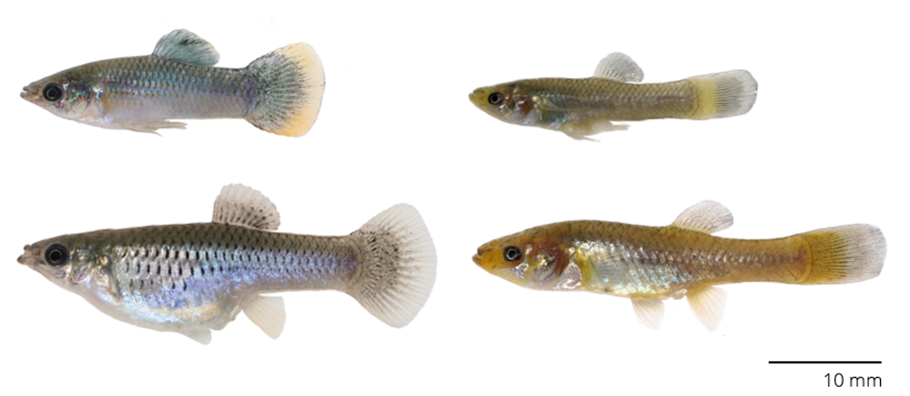

# A Mechanism for Change

Darwin's core contribution to science was not just his assemblage of evidence for the pattern of evolution ([Chapter 2](evidence-for-evolution.html)), but also the conception of a mechanism that could explain such patterns: natural selection. In doing so, he formalized an idea that humans have used for millennia to shape traits of agricultural crops, livestock, and companion animals. If you weed out the duds and promote the variants you desire, you end up with giant potatoes, hens that lay over 300 eggs a year, pigs that produce the most scrumptious bacon, and the most adorable puppies that steal your well-bred breakfast.

Humans have been domesticating plants and animals for various purposes for over 10,000 years, thereby shaping their evolution. The recipe for success was relatively simple: assess the traits of individuals in your stock, choose the ones with the desired traits for breeding, and keep doing just that, time and time again. While we---as humans---have a long history of selective breeding, it does not actually take that much time for artificial selection to have profound effects. The speed at which we can domesticate animals was illustrated by an experiment that aimed to better understand the evolution of dogs from wolves by selectively breeding foxes.

In 1959, Lyudmila Trut and Dmitri Belyaev started to selectively breed silver foxes (*Vulpes vulpes*) in a Russian fur farm (Dugatkin 2018). Breeders were selected based on their tameness. Foxes that were curious toward humans were retained, while those that were shy or even aggressive... well, they became coats for the Russian elite. Over a few decades, foxes in this experiment not only became tamer and tamer, but they also exhibited changes in a variety of other traits: their facial structure diverged, some exhibited floppy ears and curly tails, their coat colors changed, and some even started to make novel sounds (seriously... read about [*Pushinka the Barking Fox*](https://www.amazon.com/Pushinka-Barking-Fox-Unexpected-Friendship/dp/1943978468)**)**. Today, the foxes of this experiment still contribute to fur production, but you can also buy domesticated foxes as pets, even here in the United States. Selection on an apparently simple trait (tamness) lead to complex changes in the fox population in just a few decades.

::: {.alert .alert-block .alert-info}
<b>Explore More</b>

To learn about the famous fox experiment, check out [*How to Tame a Fox (and Build a Dog): Visionary Scientists and a Siberian Tale of Jump-Started Evolution*](https://www.amazon.com/How-Tame-Fox-Build-Dog/dp/022659971X) by Lee Dugatkin and Lyudmila Trut.
:::

Darwin, through his experience with pigeon breeding, was not only aware of the power of selective breeding and domestication, but he was also able to relate that process to the patterns of evolutionary change he observed in nature. This chapter will take you through Darwin's logic of natural selection.

## Darwin's Logic

Natural selection explains evolution based on first principles; deceivingly simple and equally powerful. Darwin made four key observations, also know as Darwin's postulates:

1.  Individuals in a population vary in their traits.

2.  Some of that trait variation is inherited from parents to their offspring.

3.  More offspring are produced in every generation than can possibly survive.

4.  Successful survival and reproduction of those offspring is not random but dependent on the traits they inherited from their parents.

If these four observations hold true, then the consequence is that the heritable traits that impact survival and reproduction will change from one generation to the next. Beneficial variants will become more common through time, ultimately causing adaptation to the prevailing environmental conditions.

While we intuitively know at least some of Darwin's postulates to be true, we should treat them all as hypotheses. We cannot only test whether the predictions of each postulate hold up, but we can also empirically test whether evolutionary change is really the consequence of the four postulates. In the following sections, we will take a closer look at the four postulates and discuss an actual case study of natural selection in the wild, building on what you learned about Darwin's finches in the last chapter.

### Variation

Individuals in a population vary in their traits. We know this to be true in humans; if you just look around the classroom, inter-individual differences become evident in many traits. While nearly all humans have one head, two eyes and ears, and five digits on each limb, we vary in body size, the relative proportions of morphological traits, the color of our skin, hair, and eyes, aspects of our physiology, as well as behavioral traits that make up our personalities. If you have ever cared for pets or plants in a garden, you will have some intuition about trait variation in those species, too.

From a practical perspective, the question is not so much *whether* individuals in a population vary, but which variable traits are actually important from a functional perspective. In other words, what traits should we actually be paying attention to as evolutionary biologists? For example, some humans have hair on their phalanges and some don't. Does that matter? Probably not... This is where careful natural history observations come into play. To ask meaningful questions about evolution in natural systems, we have to consider organisms as holistic entities consisting of interacting traits in the context of the abiotic and biotic factors comprising their environment. So before going out into natural populations and quantifying variation, we want to formulate concrete hypotheses about the role of specific traits in shaping organismal performance in terms of survival and reproduction.

Once relevant traits for study have been identified, quantifying actual trait variation is not too difficult. It is amazing what ground-breaking data sets were collected merely using a caliper. But depending on the nature of a trait, any other method might be used to quantify inter-individual differences, from the molecular composition of cells all the way up to behavioral responses. Variation of traits among individuals in a population is typically visualized using frequency histograms (like in Figure \@ref(fig:beaksizevariation)), and most traits in natural populations exhibit a normal distribution, where most individuals have intermediate trait values, and extreme trait values are more rare. We will explore why this is in [Chapter 8](the-evolution-of-quantitative-traits.html).

Ultimately, any variation we can observe and quantify in a population represents the raw material of evolution. Selection can act on variable traits, potentially causing evolutionary change---if said trait is heritable. If there is no variation, there can be no selection and accordingly no evolution, no matter how heritable a trait is.

### Heritability

Once variation in a potentially interesting trait is quantified, we have to test whether trait variation is heritable. Many---if not all---quantitative traits are not only shaped by genes inherited by the parents, but also by environmental factors. For example, a child's potential to grow tall is dependent on whether their parents were tall (*i.e.*, variation in genes that mediate growth) as well as adequate access to resources during the critical times in development. Similarly, the expression of certain colors in insects, fish, and birds is dependent on access to nutritional precursors and the genetically determined physiological capacity to turn those precursors into pigments deposited in tissues. Genetic and environmental effects work together to shape the variation of traits that we observe. So how can we determine the relative contribution of each?

Heritability measures the degree to which variation in a trait *in a population* is due to genetic variation. Thus, it is not a metric we can establish for a particular individual or a particular family; rather, we need to quantify the correspondence of parent and offspring traits across multiple families in a population. We can then plot offspring trait values as a function of their parents' trait values and calculate regression lines. The slope of those parent-offspring regressions is a measure of heritability (in particular, narrow-sense heritability, but we will learn more about this in [Chapter 8](the-evolution-of-quantitative-traits.html)). If the slope of the parent-offspring regression is close to one, it means there is almost perfect correspondence between parent and offspring traits, and heritability is high (blue line in Figure \@ref(fig:herit)). If the slope of the line is close to zero, there is no correspondence between parent and offspring traits; in this case, phenotypic variation is entirely shaped by environmental influences, and there is no heritability (green line in Figure \@ref(fig:herit)). Any slopes between zero and one (like the orange line in Figure \@ref(fig:herit)) indicate that genetic and environmental factors both contribute to shaping trait variation in a population.

```{r lp, include=FALSE}
library(ggplot2)
library(gridExtra)
library(RColorBrewer)
```

```{r herit, echo=FALSE, fig.cap="The slope of parent-offspring regressions reveal the degree of heritability. A slope of one indicates high heritability (blue line), while a slope of zero indicates no heritability (orange line). Intermediate slopes indicate that genetic and environmental effects both impact trait variation in a population.", fig.height=5, fig.width=5}
x <- c(0,1)
y1 <- c(0,1)
y2 <- c(.5,.5)
y3 <- c(.25,.75)

df <- as.data.frame(cbind(x,y1,y2,y3))
                   
ggplot(df)+
    geom_line(aes(x=x,y=y2), color="#66c2a5")+
    geom_line(aes(x=x,y=y3), color="#fc8d62")+
    geom_line(aes(x=x,y=y1), color="#8da0cb", size=1.5)+
    theme_classic()+
    theme(axis.text.x=element_blank(), axis.ticks.x=element_blank()) +
    theme(axis.text.y=element_blank(), axis.ticks.y=element_blank()) +
    xlab("Parent trait")+
    ylab("Offspring trait")
```

Just like variation is required for there to be selection, heritability is required to translate selection into evolutionary change. If there is no heritability in a trait, it cannot evolve. Evolutionary change in a trait is consequently not only shaped by selection, but also by the degree to which the trait is heritable.

### The Struggle for Existence

All organisms have the potential to produce more offspring than required to replace themselves. Hence, all populations have the potential for exponential growth. We see evidence for such exponential growth whenever we inoculate a Petri dish with bacteria, when invasive species are introduced into a new area, or when pathogens spread through a population of susceptible hosts. But eventually, exponential growth comes to an end when resources get more scarce and competition intensifies. Nutrients on the agar will dwindle, invasives gradually encroach on all available spaces, and hosts either die off or develop immunity. Resource limitation and competition ultimately stifle exponential growth, and thus, natural population growth is typically density-dependent, which can be described using logistic growth cruves. During logistic growth, a carrying capacity sets the threshold beyond which positive population growth becomes impossible, because the resources to sustain additional population growth are not available.

Darwin was not the first to recognize the relationship between population growth and resource availability. In fact, he was inspired by an earlier economist, Thomas Malthus, who voiced concerns in the late 1700s about the growth of agricultural food production lagging behind human population growth. Although the industrial and agricultural revolutions proved Malthus wrong (global food production largely kept pace with human population growth), he was right about one thing: the growth of any population can only continue if its resources grow as well. Hence, most natural populations remain relatively stable through time despite the potential for exponential population growth (Figure \@ref(fig:elephants)), aside from comparatively minor fluctuations across seasons and years.

```{r elephants, echo=FALSE, message=FALSE, warning=FALSE, fig.cap="Even animals with slow reprodictive rates have the potential for exponential growth. Depicted is the population size of African elephants in Kruger National Park, South Africa, after they were protected from hunting."}
elephants <- read.csv("data/3_elephants.csv")

ggplot(elephants, aes(x=year, y=pop.size)) +
    geom_point() +
    geom_smooth(method="glm", method.args=list(family=quasipoisson(link="log"))) +
    xlab("Year") +
    ylab("Population size") +
    theme_classic()
```

So where do all the extra offspring go? They die! Most individuals born succumb to a lack of resources, predators, or diseases long before they reach sexual maturity, and only a small fraction of offspring born in any generation survive long enough to reproduce. The consequence of this overproduction is fierce competition in every generation. This competition is what Darwin referred to as the struggle for existence. Natural selection is often particularly intense in populations that are close to their carrying capacity and in populations that are contracting.

### Non-Random Survival and Reproduction

Darwin's final proposition was that winners and losers in the struggle for existence are not determined by chance. Instead, specific traits and trait combinations lead to a higher probability of survival and reproduction. In a landscape plagued by drought, it is the plant with the deepest roots that has the best chance of persisting. In an stream rich in predators, the fish with the fastest escape response is most likely to dodge imminent attacks. In a forest with limited food resources, the parrot with the most efficient foraging strategy can garner enough food resources to produce and feed a clutch of young. Depending on the challenge at hand, individuals with specific traits or trait combinations will have a slight advantage over others.

Importantly, natural selection is not random. That does not mean natural selection is guided by conscious intent, as sometimes is insinuated. Rather, natural selection just happens because some variants have a disproportionate likelihood to survive and reproduce. As a consequence of natural selection's non-random nature, evolution by natural selection increases adaptation from one generation to the next.

A concept related to natural selection is fitness, which is used to describe the strength of natural selection on different variants. Fitness in biology is not a measure of an individual's physical prowess or health, but rather the relative contribution of a particular phenotype to the gene pool of the next generation.

::: {.alert .alert-block .alert-info}
<b>Definition: Fitness</b>

Fitness quantifies individual reproductive success and represents the average contribution to the gene pool of the next generation by individuals of the specified phenotype in a given environment.
:::

Fitness is relative in the sense that it is typically expressed for one phenotype in relation to another. For example, the fitness of mouse with a dark fur coat is higher relative to the fitness of a mouse with a light fur coat, because the darker coat color increases crypsis against the dark leaf litter of the forest habitat. Fitness is also context-dependent, and the relative fitness of two phenotypes may change depending on the environmental conditions. For example, in a mouse population inhabiting beaches, the light colored phenotype may have higher fitness, because it is better camouflaged against the light sand.

## Putting Darwin's Logic to the Test

The core strength of Darwin's postulates is that they can be treated as hypotheses, and we can use data from natural populations to test whether evolution by natural selection is happening. In this section, we will once again retrace the steps of Rosemary and Peter Grant. In [Chapter 2](evidence-for-evolution.html), you explored their data on beak size variation of the *Geospiza fortis* population on Daphne Major Island (Figure \@ref(fig:timeseries)). During a massive drought associated with an El Niño in 1977, there was a substantial increase of beak size over a short period of time. But does this change represent an evolutionary change caused by natural selection? If so, we would predict (1) observable variation in beak size in the *G. fortis* population, (2) that some of the beak size variation is heritable, (3) that the finches on Daphne Major are in fact facing a struggle for existence, and (4) that survival in the finch population is not random but related to beak size. Last but not least, we would also predict differences in beak size across generations.

```{r timeseries, echo=FALSE, fig.cap="Variation of relative beak size in *G. fortis* on Daphne Major Island  from 1972-1995. Positive numbers indicate larger beaks and negative number represent smaller beaks."}
time.series <- read.csv("data/3_finches_time_series.csv")

ggplot(time.series, aes(x=year, y=rel.beak.size)) +
  geom_point() +
  geom_line() +
  geom_errorbar(aes(ymin=rel.beak.size-st.err, ymax=rel.beak.size+st.err))  +
  xlab("Year") +
  ylab("Relative beak size") +
  theme_classic()
```

### Is there Variation in Beak Size?

To test whether there is variation in beak size within the *G. fortis* population, we can use a frequency histogram to plot raw beak size data collected by the Grants (Figure \@ref(fig:beaksizevariation)). As with most quantitative traits, beak size variation follows a normal distribution, with most individuals exhibiting intermediate beak sizes around 9.5 mm. However, the spread in beak sizes is vast; the smallest beaks measured just 6 mm, and the largest ones almost 14 mm. That is more than a two-fold spread! Therefore, there is clear variation in beak size that natural selection could potentially act upon; *i.e.*, we found evidence for Darwin's first postulate.

```{r beaksizevariation, echo=FALSE, fig.cap="Frequency histogram showing beak size variation in the *G. fortis* population before the drought in 1976. [Data](data/3_beak_size_variation.csv) from Boag and Grant (1984)."}
beak.size <- read.csv("data/3_beak_size_variation.csv")

beak.size.plot1 <- ggplot(beak.size, aes(x=beak.size, y=number.1976)) +
    geom_col() +
    xlab("Beak size [mm]") +
    ylab("Number of individuals") +
    theme_classic()
beak.size.plot1
```

### Is Variation in Beak Size Heritable?

To test whether beak size is heritable, the Grants tracked the development of individuals by banding them with unique markers and comparing beak sizes of parents and their adult offspring. Plotting the average beak size of each parental pair against the average beak size of their offspring reveals a clear positive relationship between the two variables, both for families studied in 1976 and 1978 (Figure \@ref(fig:heritability)). Parents with large beaks tended to raise chicks with large beaks, and parents with small beaks had chicks with small beaks. The slope of the regression lines for both years is almost 0.9, indicating a high heritability. So, beak size is not only variable but also highly heritable, providing evidence for Darwin's second postulate.

```{r heritability, echo=FALSE, message=FALSE, fig.cap = "Scatter plot showing the relationship between the beak size of the parents (average between mother and father) and their offspring (average across multiple siblings) measured separately in 1976 and 1978. [Data](data/3_parent_offspring.csv) from Boag (1983)."}
parent.offspring <- read.csv("data/3_parent_offspring.csv")
parent.offspring$year <- as.factor(parent.offspring$year)

ggplot(parent.offspring, aes(x=parent.beak, y=offspring.beak, color=year)) +
    geom_point() +
    geom_smooth(method = "lm", se=FALSE) +
    xlab("Average parent beak size [mm]") +
    ylab("Average offspring beak size [mm]") +
    theme_classic() +
    scale_color_brewer(palette = "Set2")
```

### Is there a Struggle for Existence?

As with any population that has a capacity for exponential growth and is trapped in a small area, the struggle for existence in Darwin's finches seems obvious, but election can be particularly strong when conditions are harsh and populations are contracting. Throughout the 1977 drought, finch populations on Daphne Major crashed from about 1,500 birds in March 1976 to to less than 200 birds in late 1977 (Figure \@ref(fig:popsize)). This represents a decline of over 85 % in less than two years. The Grants were able to show that this decline was primarily related to a limitation of food resources, as the lack of significant precipitation limited plant growth and seed production on the island. Consequently, the Grants witnessed struggle for existence first hand, finding support of Darwin's third postulate.

```{r popsize, echo=FALSE, fig.cap = "Population size of *G. fortis* on Daphne Major between July 1975 and January 1979. [Data](data/3_population_size.csv) from Boag and Grant (1981)."}
pop.size <- read.csv("data/3_population_size.csv")
pop.size$date <- as.Date(pop.size$date, format = "%m/%d/%Y")

ggplot(pop.size, aes(x=date, y=pop.size)) +
    geom_line(color="gray") +
    geom_point() +
    geom_errorbar(aes(ymin=pop.size-var, ymax=pop.size+var))  +
    xlab("Time") +
    ylab("Population size") +
    theme_classic()
```

### Is Survival Non-Random?

To test whether survival of birds was non-random in relation to beak size, we can compare the beak size distribution in individuals before the drought in 1976 and the birds that were left after the drought in 1978. As you can see in Figure \@ref(fig:survival), surviving birds on average had a larger beak size than individuals prior to the selection event. The Grants were also able to explain exactly why a larger beak size conferred a selective advantage. As the drought progressed, there was not only a decline in seed abundance, but the average seed also became larger and harder, because the smaller and softer seeds were eventually all eaten up by the finches. As seed quality changed, finches with larger beaks had a foraging advantage, because they were able to open larger and harder seeds more effectively. The disproportionate survival of individuals with larger beaks provides clear evidence for Darwin's fourth postulate.

```{r survival, echo=FALSE, message=FALSE, warning=FALSE, fig.cap = "Frequency histograms showing beak size variation in the finch population before the drought (top) and in the surviving individuals after the drought (bottom). The vertical red lines represent the mean beak size in each set. The beak size of the average survivor was slightly higher than the population average prior to the drought, indicating that natural selection happened. [Data](data/3_beak_size_variation.csv) from Boag and Grant (1984)."}
beak.size.plot1 <- beak.size.plot1 + geom_vline(xintercept = sum(beak.size$beak.size*beak.size$number.1976)/sum(beak.size$number.1976), color="red")

beak.size.plot2 <- ggplot(beak.size, aes(x=beak.size, y=number.1978)) +
    geom_col() +
    geom_vline(xintercept = sum(beak.size$beak.size*beak.size$number.1978)/sum(beak.size$number.1978), color="red") +
    xlab("Beak size [mm]") +
    ylab("Number of individuals") +
    ylim(0,12)+
    scale_y_continuous(breaks = seq(0, 12, len = 4))+
    theme_classic()

grid.arrange(beak.size.plot1, beak.size.plot2, nrow = 2)
```

### Did Non-Random Survival Lead to Evolution?

At this stage, we have shown heritable variation in beak size, strong selection caused by a massive drought, and non-random survival associated with beak size. However, we have not yet shown that evolution has occurred. We have only shown the action of natural selection. But testing the hypothesis of evolutionary change requires the documentation of changes across generations, not just differential survival within generations. To do so, we can can compare the beak size of offspring born before the drought (1976) to the beak size of offspring both after the drought (in 1978; these are the offspring of the survivors). As expected, based on the high heritability of beak size, we see that the average offspring in 1978 exhibited a larger beak than the average offspring in 1976 (Figure \@ref(fig:evolutionarychange)).

Taken together, these data sets conclusively show that the drastic change in beak size from 1976 to 1978 (Figure \@ref(fig:timeseries)) represents evolution by natural selection. The finch population adapted to a new reality, where the average food source was larger and harder. The Grants' pioneering work linked an evolutionary pattern that they observed to a concrete mechanism that explained the pattern; they documented the interplay of pattern and process in a naturally evolving population.

```{r evolutionarychange, echo=FALSE, fig.cap = "Frequency histograms showing beak size variation in the finch offspring born before the drought (top) and after the drought (bottom). The vertical red lines represent the mean beak size in each set. The beak size of the average offspring born after the selection event was higher than the offspring average prior, indicating that evolution happened. [Data](data/3_offspring_beaks.csv) from Grant and Grant 2003."}
offspring.beak <- read.csv("data/3_offspring_beaks.csv")

offspring.beak.size.plot1 <- ggplot(offspring.beak, aes(x=beak.size, y=offspring.1976)) +
    geom_col() +
    geom_vline(xintercept = sum(offspring.beak$beak.size*offspring.beak$offspring.1976)/sum(offspring.beak$offspring.1976), color="red") +
    xlab("Beak size [mm]") +
    ylab("Number of individuals") +
    theme_classic()

offspring.beak.size.plot2 <- ggplot(offspring.beak, aes(x=beak.size, y=offspring.1978)) +
    geom_col() +
    geom_vline(xintercept = sum(offspring.beak$beak.size*offspring.beak$offspring.1978)/sum(offspring.beak$offspring.1978), color="red") +
    xlab("Beak size [mm]") +
    ylab("Number of individuals") +
    theme_classic()

grid.arrange(offspring.beak.size.plot1, offspring.beak.size.plot2, nrow = 2)
```

## Case Study: Exploring Among-Population Variation

By following the finch population through time, Rosemary and Peter Grant were able to show evolution by natural selection in action. However, following populations through time is not a trivial effort. An indirect way to investigate the effects of natural selection on trait evolution is to compare different populations of the same species that are exposed to different environmental conditions. Comparing trait distributions among populations can provide insights about the actions of selection, just like a time series. In the [case study](exercises/BIOL520-ex2.zip) associated with this chapter, we will investigate a pair of fish populations that live in drastically different environments: one population lives in a dark cave (Figure \@ref(fig:fieldwork)) and the other in a regular surface stream. We will examine variation in different traits to infer how selection caused by the absence of light may have shaped trait evolution in these fish.

```{r fieldwork, echo=FALSE, out.width='100%', fig.cap = "That's right, I do real research, too... here collecting cave mollies in their natural habitat."}
knitr::include_graphics('images/field.jpeg')
```

### The Cave Molly and its Ancestors

The cave molly (*Poecilia mexicana*) is a species of livebearing fish (family Poeciliidae) that occurs in two small caves in Southern Mexico (Parzefall 2001). One of the caves, the Cueva Luna Azufre, has a wetted area of only 39 square meters. Even though the available habitat is really small, there has been an isolated population of cave mollies in this cave for several thousand years. Interestingly, mollies also occur in adjacent surface habitats. The fish from the surface and cave habitats are clearly different phenotypically (Tobler et al. 2008; Figure \@ref(fig:mollies)). The question is, what trait differences---if any---are a consequence of evolution? You will explore this question by visualizing several data sets, primarily comparing trait distributions across populations and generations.

```{r mollies, echo=FALSE, out.width='100%', fig.cap = "Mollies occur in many surface streams throughout Mexico and Centeral America (left fish; male on top, female below). In the state of Tabasco, mollies have also colonized two caves, and fish from cave populations look noticeably different from their surface counterparts (right fish; male on top, female below). Photo: Michi Tobler"}

```

## Practical Skills: Number Sequences, Allometry, and Histograms

### Number Sequences

In [chapter 1](what-evolution-is.html#some-r-and-rstudio-basics2), you learned how to make simple calculations with vectors; you will apply that skill in this exercise. In particular, you will calculate population sizes for multiple generations, which requires the creation of a vector with starting values (*e.g.*, generations 1, 2, 3, etc.). You can create a vector (`x`) with a number sequence by using a colon with a number range. For example, `1:10` will generate a vector with numbers from 1 to 10.

```{r seq}
#Creating a vector x with a number sequence from 1-10
x <- 1:10
print(x)
```

As described before, you can then apply any function (`x^2` in the example below) you want and store the output in a new vector (`y`, for example). Input and output variables can then be combined into the same data frame with the `data.frame()` and `cbind()` functions and ultimately plotted using `ggplot`:

```{r sqrt}
#Making some calculation based on x
y <- x^2
print(y)
```

```{r df}
#Combine the two vectors into a data frame
df <- data.frame(cbind(x,y))
print(df)
```

```{r yx2}
#Plotting the results
ggplot(df, aes(x=x, y=y)) +
    geom_point() +
    theme_classic()
```

### Allometry & Residuals

The data you will be looking at in this exercise comes from morphological measurements. Many traits, and morphological measurements in particular, are highly dependent on the body size of an individual. Think about it from a human perspective: larger individuals tend to have larger heads, longer legs, and longer arms. Despite this overall trend, the relative proportion of different body parts varies among individuals. Your roommate may be several inches shorter than you, but the two of you may still have the same shoe size; it's because relative to their height, they have large feet. More importantly, the relative proportions of different body parts changes predictably during development, a phenomenon we call allometry. Human babies are born with relatively large heads, and even though heads grow into adulthood, the rest of the body grows faster, thus changing the relative size of the head compared to the rest of the body.

How is this relevant to cave fish and evolution? Let's use a concrete [numerical example](data/3_allometry.csv) to illustrate why taking allometric relationships into account is important for comparative analyses. Imagine we want to compare a particular trait (let's say head size) between two populations (A and B), and we predict one population would have larger heads. We could just measure head size, compare it between populations, and conclude that population A indeed has larger heads on average (Figure \@ref(fig:headsize)).

```{r headsize, message=FALSE, warning=FALSE, fig.cap = "Head size differences between two hypothetical populations, A and B, illustrated with a [box plot](graph-library.html#box-plot)."}
allometry <- read.csv("data/3_allometry.csv")

ggplot(allometry, aes(x=population, y=head.size)) +
    geom_boxplot() +
    xlab("Population") +
    ylab("Head size") +
    theme_classic()
```

Case closed? Not so fast! It turns out that the two populations also differ in body size (Figure \@ref(fig:bodysize)). This difference in body size could be real (individuals in population A are in fact larger) or just an artifact, because we happened to catch more large individuals in one of the populations (nonrandom sampling).

```{r bodysize, message=FALSE, warning=FALSE, fig.cap = "Body size differences between two hypothetical populations, A and B."}
ggplot(allometry, aes(x=population, y=body.size)) +
    geom_boxplot() +
    xlab("Population") +
    ylab("Body size") +
    theme_classic()
```

The congruence in head and body size differences raises the question whether population A just has larger heads because individuals in that population are larger. To investigate this, we can plot head size against body size---and lo and behold, there is a strong positive correlation between the two variables (Figure \@ref(fig:allometry)). This is important if our prediction about the action of selection is specifically about head size and not body size. In that case, we want to know explicitly whether individuals in one population have a larger head relative to their body size compared to the other population. In other words, we want to know whether the residuals (*i.e.*, the distance between a point and the best fit line, as indicated with blue segments in Figure \@ref(fig:allometry)) are primarily positive for individuals coming from population A (indicating larger head size than expected for a given body size) and negative for individuals coming from population B (indicating smaller head size than expected for a given body size).

```{r allometry, message=FALSE, warning=FALSE, fig.cap = "Hypothetical relationship between body size and head size in populations A and B, showing a clear positive correlation. Residuals are indicated by the length of the blue segments. Residuals above the line are positive (larger than expected head size for a given body size), those below the line are negative (smaller than expected head size for a given body size)."}
#Calculating regression line
fit <- lm(head.size ~ body.size, data = allometry)
#Saving predicted values
allometry$predicted <- predict(fit)

ggplot(allometry, aes(x=body.size, y=head.size)) +
    geom_segment(aes(xend = body.size, yend = predicted), color="blue") +
    geom_smooth(method="lm", color="gray", se = FALSE) +
    geom_point(aes(color=population)) +
    xlab("Body size") +
    ylab("Head size") +
    theme_classic() +
    scale_color_brewer(palette = "Set2")
```

To make proper inferences about head size, we consequently need to account for the fact that this trait covaries with body size. One way of doing that is to calculate residual head size, which is the length of the blue lines in Figure \@ref(fig:allometry). To obtain the residuals, we first need to calculate a regression line with `lm(y ~ x, df)`. In the code chuck above, this was done with head size and body size as variables, and the results of the regression were saved in an object called `fit`. To extract the residuals, we can now just create a new variable (`res.head.size`) in our `allometry` data frame and extract the residuals from the `fit` object using the `residuals()` function:

```{r res}
#Extract residuals and create a new variable res.head.size in the allometry data frame
allometry$res.head.size <- residuals(fit)
```

If we plot our new variable (`res.head.size`) against body size, you can see that there is no correlation between the two (*i.e.*, the regression line is perfectly flat; Figure \@ref(fig:sizecorr)). Hence, we successfully corrected for the confounding effect of body size. Again, points that are above the best fit line (*i.e.*, positive values) are individuals that have larger head sizes accounting for their body size, those below (negative values) have smaller head sizes. Points that are exactly on the line have an expected head size for their body size.

```{r sizecorr, message=FALSE, fig.cap = "Relationship between body size and residual head size. There is no correlation between the two traits because we corrected for body size."}
ggplot(allometry, aes(x=body.size, y=res.head.size, color=population)) +
    geom_smooth(method="lm", color="gray", se = FALSE) +
    geom_point() +
    xlab("Body size") +
    ylab("Residual head size") +
    theme_classic() +
    scale_color_brewer(palette = "Set2")
```

Finally, comparing the residual values of head size between populations reveals that there are no differences in this trait at all (Figure \@ref(fig:schead)).

```{r schead, message=FALSE, fig.cap = "Plotting relative head size reveals no differences between the two populations."}
ggplot(allometry, aes(x=population, y=res.head.size)) +
    geom_boxplot() +
    xlab("Population") +
    ylab("Residual head size") +
    theme_classic()
```

This semester, we will emphasize being cognizant of potential confounding variables (like body size) and being able to account for them whenever possible (for example by calculating residuals). In the exercise associated with this chapter, you will practice using residuals to analyze morphological data.

### Histograms and Density Functions

Frequency histograms are used to visualize the distribution of continuous variables. Histograms use bars to depict the frequency (on the y axis) of distinct ranges (bins) of a dependent variable (on x). You can use `geom_histogram()` to make a frequency histogram with `ggplot`. Only an x-variable is needed within `aes()`. This example is based on a [test data set](data/test_data.csv).

```{r histex, message=FALSE}
test.data <- read.csv("data/test_data.csv")

ggplot(test.data, aes(length)) +
    geom_histogram() +
    xlab("Length [mm]") +
    ylab("Frequency") +
    theme_classic()
```

Similar to how regressions provide a best-fit line through a cloud of points, density functions can be used to provide a statistical representation of a trait's distribution. Density plots represent smoothed versions of histograms and can be visualized using `geom_density()`. Unlike histograms, which use counts as units on the y-axis, density plots use relative frequency (number of observations in a bin divided by the total number of observations). To avoid issues with scale, you have to modify the aesthetics of `geom_histogram()` with `aes(y=..density..)` when you combine the two graphical elements:

```{r histdensex, message=FALSE}
ggplot(test.data, aes(length)) +
    geom_histogram(aes(y=..density..)) +
    geom_density() +
    xlab("Length [mm]") +
    ylab("Frequency") +
    theme_classic()
```

Finally, you can define subgroups in histograms and density plots to directly contrast patterns of variation between groups (rather than making separate plots). You can do this by adding `fill=variable` (for area colors) or `color=variable` (for edges and lines) to `aes()`, as illustrated with the variable `sex` below:

```{r histdensexex, message=FALSE}
ggplot(test.data, aes(length, fill=sex)) +
    geom_histogram(aes(y=..density..)) +
    geom_density(alpha=.5) + #The alpha determines the degree of transparency
    xlab("Length [mm]") +
    ylab("Frequency") +
    theme_classic() +
    scale_fill_brewer(palette = "Set2") #This changes the color scheme to a colorblind-friendly palette (see Chapter 2)
```

## Reflection Questions

1.  In your own words, how do you define fitness? How would you measure fitness in a natural population? Provide a concrete example; *i.e.*, be specific with what organism you have in mind and describe the concrete steps you would take to quantify fitness.

2.  Think about the relation between natural selection and evolution. Can you explain why the presence of natural selection does not necessarily lead to evolutionary change? Can you explain how evolution might happen in the absence of natural selection?

3.  If you look at the time series of beak size data from the Grants (Figure \@ref(fig:timeseries)), you can see that after a steep increase in beak size right after the drought, beak sizes slowly decline throughout the 1980s. In fact, beak sizes reach pre-drought levels by the late 1980s. What do you think happened after the drought? Why did beak sizes not continue to increase or remain stable at a larger size?

4.  In The Origin of Species, Darwin said:

    > "As natural selection works solely by and for the good of each being, all corporeal and mental endowments will tend to progress toward perfection."
    >
    > Darwin, 1859

    What do you think of this statement? Can you think of reasons why natural selection does not actually lead to perfection?

## References

-   Boag, PT (1983). [The heritability of external morphology in Darwin's ground finches (*Geospiza*) on Isla Daphne Major, Galapagos](https://onlinelibrary.wiley.com/doi/10.1111/j.1558-5646.1983.tb05618.x). *Evolution* 37, 877--894.
-   Boag, PT, PR Grant (1981). [Intense natural selection in a population of Darwin's finches (Geospizinae) in the Galapagos](https://science.sciencemag.org/content/214/4516/82). *Science* 214, 82--85.
-   Boag, PT, PR Grant (1984). [The classical case of character release: Darwin's finches (*Geospiza*) on Isla Daphne Major, Galápagos](https://academic.oup.com/biolinnean/article-abstract/22/3/243/2666306). *Biological Journal of the Linnean Society* 22 243--287.
-   Darwin, C. (1859). *On the origin of species based on natural selection, or the preservation of favoured races in the struggle of life*. John Murray.
-   Dugatkin, LA (2018). [The silver fox domestication experiment](https://evolution-outreach.biomedcentral.com/articles/10.1186/s12052-018-0090-x). *Evolution: Education and Outreach* 11, 1--5.
-   Grant, PR, BR Grant (2002). [Unpredictable evolution in a 30-year study of Darwin's finches](https://science.sciencemag.org/content/296/5568/707). *Science* 296: 707-711.
-   Grant, RB, PR Grant (2003). [What Darwin's Finches can teach us about the evolutionary origin and regulation of biodiversity](https://academic.oup.com/bioscience/article/53/10/965/254944). *Bioscience* 53, 965--975.
-   Parzefall, J (2001). [A review of morphological and behavioural changes in the cave molly, *Poecilia mexicana*, from Tabasco, Mexico](https://link.springer.com/article/10.1023/A:1011899817764). *Environmental Biology of Fishes* 62, 263--275.
-   Tobler, M, TJ Dewitt, I Schlupp, FJ García de León, R Herrmann, PGD Feulner, ... M Plath (2008). [Toxic hydrogen sulfide and dark caves: phenotypic and genetic divergence across two abiotic environmental gradients in *Poecilia mexicana*](https://onlinelibrary.wiley.com/doi/full/10.1111/j.1558-5646.2008.00466.x). *Evolution* 62, 2643--2659.
