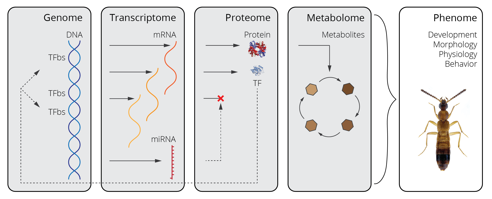
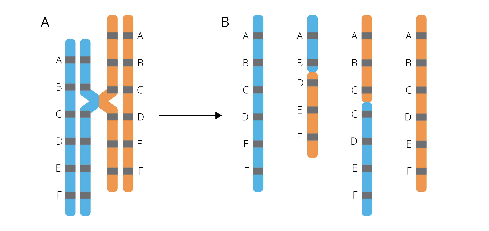

# (PART) A Genetic Perspective on Evolution {.unnumbered}

# The Raw Materials for Evolution

So far, we have primarily explored the process of evolution from a phenotypic perspective. We considered how ecological sources of selection impact the survival and reproduction of individuals expressing different heritable traits, and how fitness differences of variants in turn impact the phenotypic composition of subsequent generations. While there is nothing inherently wrong with this approach, it ignores the mechanisms that underlie the expression of phenotypic traits and inheritance. Darwin was also agnostic about these aspects, largely treating what we call "genetics" as a black box. He was unaware of the work of his contemporary, Gregor Mendel, an Augustinian friar that established some of the basic tenets of heredity. It was not until the 1930s and 1940s that genetics and Darwinian evolution were integrated into a unified theory. The fusion of the two fields is known as the Modern Synthesis.

A number of biologists made critical contributions to the Modern Synthesis. Ronald Fisher, Jack Haldane, and Sewall Wright are credited with developing the theoretical basis of population genetics. Theodosius Dobzhansky pioneered evolutionary genetic studies in natural populations, chiefly using *Drosophila* fruit flies to provide empirical evidence that supported the theoretical developments. Ernst Mayr shaped the modern definition of species and framed critical hypotheses about how speciation occurs. And finally, George Gaylord Simpson integrated findings from paleontology with those in genetics and natural selection.

The Modern Synthesis largely strengthened Darwin's notion of evolution by closing critical gaps associated with the mechanisms of heredity. This allowed for a more complete and nuanced understanding of evolutionary processes. Rather than just investigating how selection shapes phenotypic variation, a modern view of evolution takes into account how genes and the environment interact to shape developmental and physiological processes that give rise to phenotypic traits of functioning organisms (Figure \@ref(fig:beyondphenotype)). The environment also tests phenotypic variants, causing fitness differences that ultimately change the genetic composition of subsequent generations (Figure \@ref(fig:beyondphenotype)). In the following chapters, we will explore the genetic basis of evolutionary change and discuss how the many facets of ecology shape trait expression and evolution.

```{r beyondphenotype, echo=FALSE, out.width='100%', fig.cap = "Conceptual framework of a modern perspective on evolution that includes the genetic basis of phenotypic traits."}
knitr::include_graphics('images/g2p2.png')
```

The first task in exploring evolution from a genetic perspective is to establish how genomic variation translates to phenotypic variation. We will then discuss the fundamental sources of genetic variation, how we can quantify such variation in natural populations, and how we can use knowledge of genetic variation to test simple evolutionary hypotheses.

## The Genotype-Phenotype Gap

A common misconception about the origin of novel phenotypic variants is that they are primarily caused by mutations in protein-coding regions of the genome, which change the structure and function of a protein and ultimately create variation in a particular trait. In reality, the ways by which genetic variation can impact phenotypic traits are much more diverse and complex. While technological breakthroughs over the past decades have made it relatively easy to quantify genetic variation across the genome (see below), connecting mutations at particular loci to phenotypic traits has proven much more challenging. We call this the genotype-phenotype gap, and closing this gap is one of the biggest challenges in modern biology.

Part of the complexity arises from the sheer number of genes in a genome. The human genome, for example, consists of over 30,000 genes. More importantly, one-to-one mapping---where one gene causes the expression of a specific phenotypic trait or at least an aspect of it---is relatively rare; rather, genes and their derivative products (different RNAs, proteins, and ultimately metabolites) interact in complex ways, such that the mapping is really many-to-many (many genes affect multiple traits at ones). These complexities become evident when we consider a simple genotype-phenotype framework, such as illustrated in Figure \@ref(fig:g2p).

```{r g2p, echo=FALSE, out.width='100%', fig.cap = "Emergent phenotypic traits are the product of variation in the genome and the environmentally-dependent expression of that genomic variation. Figure adopted from Ritchie et al. (2005). Beetle photo by [Udo Schmidt](https://www.flickr.com/photos/coleoptera-us/), [CC BY-SA 2.0](https://creativecommons.org/licenses/by-sa/2.0/)."}

```

RNA is transcribed from DNA by RNA polymerase, which produces messenger RNAs (mRNAs) that serve as templates for protein synthesis. After transcription, introns are removed by RNA splicing, and alternative splicing can recombine different exons from the same gene, which allows a single gene to code for multiple proteins with different functions. In addition, not all RNAs transcribed from DNA lead to functional proteins. Micro RNAs (miRNA) are short, non-coding RNA molecules that can silence mRNAs, and thus play a role in the post-transcriptional regulation of gene expression. Essentially, miRNAs bind to mRNAs with complementary sequences, which causes those mRNAs to degrade and interrupts the translation of mRNAs into functional proteins. In summary, RNAs play a critical role in multiple processes, not only because they encode templates for protein synthesis, but also because they can regulate the amount of protein produced by other genes.

Similar complexities are also evident at the proteome level. Sometimes, a single type of mRNA gives rise to a functional protein after translation. But many enzymes are actually multi-protein complexes and require information from multiple genes to make one functional unit. A great example are the enzymes associated with the oxidative phosphorylation (OxPhos) pathway in mitochondria, which produce the majority of the ATP needed for maintenance of cellular function. All five OxPhos enzymes are multi-protein complexes, and complex I (NADH dehydrogenase) is composed of 45 subunits, not counting the proteins involved in the assembly of the enzyme. Furthermore, some proteins actually act as transcription factors (TF in Figure \@ref(fig:g2p)). These transcription factors bind to transcription factor binding sites (TFbs) in the genome, either enhancing or suppressing the expression of other genes. So proteins are also involved in complex feedback loops that regulate gene expression in response to various internal and external stimuli.

Finally, different enzymes are organized into interconnected pathways that process the metabolites required for the maintenance of organismal function. Figure \@ref(fig:metabolism) provides a glimpse at some of the metabolic pathways in human cells. As you can imagine, these metabolic networks are full of redundancy, such that similar phenotypic outcomes may actually be caused by different underlying mechanisms.

```{r metabolism, echo=FALSE, out.width='100%', fig.cap = "Pathway map representing the molecular interaction, reaction, and relation networks for human metabolism. Check out the [KEGG Pathway Database](https://www.genome.jp/pathway/hsa01100) for an interactive version."}
knitr::include_graphics('images/metabolic_pathway.png')
```

It is the action and interaction of biological processes across all of these levels of organismal organization that ultimately shape the phenotypic traits frequently studied by evolutionary biologists. As you can imagine, reconciling evolutionary patterns across these levels is not always trivial, simply because we don't always know what genes are connected to what traits. In addition, even superficial examination of genotype-phenotype relationships shows that variation in phenotypes can not only arise from variation in protein structure and function, but also differences in when, where, and at what levels proteins are expressed. Phenotypic variants may arise as a consequence of changes in the amino acid sequences of proteins, or changes in the regulation of protein expression. In that light, let's investigate how different mutations arise in the genome, how they might impact organismal phenotypes, and what their potential evolutionary ramifications are.

::: {.alert .alert-block .alert-info}
<b>Explore More</b>

If you are interested in learning more about what changes in DNA are responsible for the evolution of phenotypic diversity, check out this short essay by Sean Carroll: [*The Evolution of Gene Regulation and Morphological Diversity*](https://www.cell.com/cell/fulltext/S0092-8674(00)80868-5). I also recommend his popular science book [*Endless Forms Most Beautiful: The New Science of Evo-Devo*](https://www.amazon.com/Endless-Forms-Most-Beautiful-Science/dp/0393327795).
:::

## Mutation: The Fundamental Source of Novelty

Mutation is the fundamental source of variation that selection can act upon to create evolutionary change. Any change in the nucleotide sequence of a genome is considered a mutation. Mutations can involve single nucleotide substitutions, insertions and deletions (also called indels), inversions of chromosome segments, duplication of chromosome segments, and partial and complete genome duplications. Different types of mutations have different molecular origins and different consequences for the expression of phenotypic traits. Consequently, they also have different evolutionary implications.

::: {.alert .alert-block .alert-info}
<b>Definition: Mutation</b>

A mutation is a change in DNA sequence, resulting in a variant form (allele) that can be passed on to subsequent generations.
:::

### Point Mutations

Point mutations are changes in a single nucleotide of DNA. They include transitions and transversions that cause single nucleotide substitutions as well as single nucleotide insertions and deletions. Point mutations cause single nucleotide polymorphisms (SNPs; single base-pair differences in the DNA sequence), which are the basis for many population genetic analyses.

#### Origins {.unnumbered}

Point mutations primarily arise from mistakes during DNA replication. The mutations are either caused by random errors made by DNA polymerase (which copies the DNA during replication) or by random errors made by enzymes involved in DNA repair.

#### Phenotypic Impact and Evolutionary Consequences {.unnumbered}

The phenotypic impacts and evolutionary consequences of point mutations depend on the location and nature of the mutation.

In protein-coding regions of the genome, single nucleotide substitutions can either be synonymous (silent) or nonsynonymous. Synonymous mutations arise due to redundancy of the genetic code, where multiple nucleotide triplets encode for the same amino acid (Figure \@ref(fig:geneticcode)). For example, a mutation from AGG to AGA has no effect on the resulting amino acid sequence, because both triplets encode for arginine. Since such synonymous mutations do not translate to changes in the resulting protein, there are no consequences for expressed phenotypes and the mutation is not visible to selection (*i.e.*, it has no fitness consequences).

```{r geneticcode, echo=FALSE, out.width='100%', fig.cap = "Diagram of the genetic code showing which DNA bases code for which amino acids (in different colors)."}
knitr::include_graphics('images/genetic_code.png')
```

In contrast, nonsynonymous substitutions do change the amino acid sequence of the resulting protein (*e.g.*, AGG to AGT changes arginine to serine; \@ref(fig:geneticcode)). Amino acid substitutions can fundamentally change the structure and function of proteins, with corresponding consequences for downstream phenotypes. There are three potential evolutionary consequences of nonsynonymous substitutions: (i) the altered protein and resulting phenotypic changes are deleterious, imposing a fitness disadvantage for the individual; (ii) the altered protein and resulting phenotypic changes are beneficial, providing a fitness advantage for the individual; or (iii) the altered protein does not change its structure and function in a significant way, in which case even a nonsynonymous mutation can be selectively neutral.

Protein-coding regions of the genome can also be impacted by indels. Single nucleotide indels are known as frameshift mutations, because they alter the reading frame at which nucleotide triplets are translated into amino acids. Consequently, an insertion or a deletion of a single nucleotide can completely change the amino acid sequence of the resulting protein or introduce a premature stop codon (Figure \@ref(fig:frameshift)). Many frameshift mutations cause loss of function in a protein and consequently lead to fitness reductions in individuals carrying the mutation.

```{r frameshift, echo=FALSE, out.width='100%', fig.cap = "Frameshift mutations caused by insertions or deletions change the amino acid sequence and potentially insert premature stop codons."}
knitr::include_graphics('images/insertion.png')
```

Protein-coding regions only make up about 1 % of the human genome (and even less in some other organisms). Point mutations can also occur in non-coding genomic regions. Some non-coding regions serve important functions in gene regulation (*e.g.*, transcription factor binding sites, non-coding RNAs) or in mRNA processing and protein translation (*e.g.*, introns). Hence, point mutations in such genomic regions may still impact organismal phenotypes, and---depending on the context---they can come with fitness costs or benefits.

Finally, putatively non-functional genomic regions (pseudogenes and repeat sequences caused by transposons and retrotransposons) can make up large portions of a genome. Point mutations in these genomic regions largely have no fitness consequences; hence, they tend to be selectively neutral.

### Inversions

Inversions are regions of chromosomes that are flipped in direction. These mutations do not change the amount or kind of genetic material in the genome, only its sequential arrangement (Figure \@ref(fig:inversion)).

```{r inversion, echo=FALSE, out.width='100%', fig.cap = "Inversions are caused when double breaks in the DNA (indicated by asterisks) are fixed upon a central element flipping in direction."}
knitr::include_graphics('images/inversion.png')
```

#### Origins {.unnumbered}

Inversions are caused by double DNA breaks, in which the broken central piece is flipped before the DNA strands are joined back together by DNA ligase. While inversions can be only a few base pairs long (in which case they can act like point mutations), some are very large (\>4 megabases) and contain multiple functional genes.

#### Phenotypic Impact and Evolutionary Consequences {.unnumbered}

If the break points are located within a functional gene, inversions can cause the loss of function and corresponding negative impacts on phenotypic expression and fitness. In most cases, however, break points are located in intergenic regions, such that inversions have no visible phenotypic repercussions. Nonetheless, inversions can play an important role in evolution, especially if they contain multiple functional genes. In heterozygous individuals that have one copy of the chromosome with and one without the inversion, the likelihood of recombination within the inversion is reduced because of mechanical pairing issues associated with non-complimentary DNA. As a result, genes within an inversion are often inherited in blocks and have a reduced chance to be reshuffled during sex and recombination.

### Gene Duplication

Gene duplication occurs when entire segments of a chromosome containing functional genes are duplicated, creating novel copies in the genome.

#### Origins {.unnumbered}

Most gene duplications arise from unequal crossing-overs during meiosis, where misalignment of homologous chromosomes leads to daughter chromosomes of different lengths. One daughter chromosome contains a duplicated segment that is missing from the other (Figure \@ref(fig:uneqcross)). Gene duplications can also be associated with replication slippage and retrotransposon activity.

```{r uneqcross, echo=FALSE, out.width='100%', fig.cap = "Crossing-over between misaligned chromosomes during meiosis (A) causes DNA segments to be deleted in one and inserted in the other chromosome (B)."}

```

#### Phenotypic Impact and Evolutionary Consequences {.unnumbered}

Individuals that inherit a chromosome with a deleted essential gene may suffer from negative phenotypic and fitness effects. Those that inherit a chromosome with a duplication, however, are unlikely to suffer from adverse consequences. There are two possible evolutionary consequences for the genes within a duplication. First, a duplicated gene may accumulate a variety of mutations, even deleterious ones. But since a functional copy is still present in the genome, individual carriers will not face any fitness reductions. As deleterious mutations accumulate in the duplicated gene, it will eventually become a non-functional pseudogene. These pseudogenes are passed on across generations, as discussed in [Chapter 2](evidence-for-evolution.html). Alternatively, a duplicated gene may accumulate mutations that change the structure and function of the resulting protein in a beneficial way, enhancing the fitness of the carrier. As such, gene duplication can be a major source of genomic novelty, and many gene families have arisen through duplication.

Hemoglobin genes, for example, have duplicated repeatedly during vertebrate evolution. Different hemoglobin genes in the human genome vary in their functional properties and expression depending on developmental stage or environmental conditions. Hemoglobins expressed during fetal development have a higher oxygen affinity than the mother's hemoglobin, allowing the fetus to extract oxygen from the mother's blood. Similarly, our bodies express different types of hemoglobins during acclimation to low oxygen concentrations at high altitudes. Shifting to the expression of alternative hemoglobins takes time, which explains why you may experience altitude sickness on the first days of your Colorado vacation. Once you are acclimated, the higher oxygen binding capacity of alternative hemoglobins allows you to perform normally even at higher altitudes, which is why some athletes use high-elevation training to gain an advantage for competitions close to sea level. Consequently, gene duplication is an important source of novelty in the genome and allows for the evolution of specialized functions that are constrained by the number of loci.

### Genome Duplication

Genome duplications occur when additional copies of the entire genome are generated, leading to polyploidy. In some instances, genome duplications can be partial, if only a subset of chromosomes are duplicated.

#### Origins {.unnumbered}

Partial and complete genome duplications occur because of segregation errors during meiosis. Non-disjunction during the anaphase of meiosis I or II leads to a failure of correct chromosome separation into daughter cells, resulting in gametes with extra or missing chromosomes.

```{r nondisjunction, echo=FALSE, out.width='100%', fig.cap = "Metaphase: Chromosomes line up in the middle plane, the meiotic spindle forms, and the kinetochores (black) of sister chromatids attach to the microtubules (blue lines). Anaphase: Sister chromatids separate and the microtubules pull them in opposite directions. The chromosome shown in purple fails to separate properly, with its sister chromatids sticking together and getting pulled to the same side. This results in nondisjunction of the chromosome."}
knitr::include_graphics('images/nondisjunction.png')
```

#### Phenotypic Impact and Evolutionary Consequences {.unnumbered}

Whole genome duplications do not typically have immediate negative consequences for the carrier. Like gene duplication, it may actually allow for the evolution of novel genes, because they release constraints associated with pleiotropic effects. However, polyploids are instantaneously reproductively isolated from their ancestors, because proper meiosis is not possible with an uneven number of sister chromosomes. Hence, we see polyploid lineages more commonly in organisms with asexual reproduction or self-fertilization, like plants. In these cases, polyploidization is associated with instantaneous speciation.

In contrast, partial genome duplications often have negative fitness consequences for the carrier. This is thought to be related to gene dosage effects, where the amount of gene product (*e.g.*, protein) is correlated with the number of copies of a particular gene in the genome. Hence, partial genome duplication can lead to biases in the expression of some---but not all---genes, creating imbalances in the developmental and metabolic networks that have been fine-tuned by evolution.

## Mutation Rates

Point mutations are by far the most common mutations in the genome. Estimation of mutation rates is not trivial, and estimates vary depending on how these rates are actually quantified. The earliest estimates came from experimental mutation accumulation lines, where mutation rates were estimated based on visible phenotypic mutations that were likely caused by loss of function mutations (*e.g.*, premature stop-codons, frame-shift mutations, etc.). These experiments estimated mutations rates per genome per generation, and revealed values between 0.0025 in *E. coli* and 1.6 in humans (Table 4.1).

The 640-fold variation in the organisms listed in Table 4.1 is primarily caused by two factors. Per-genome mutation rates roughly scale with genome size; larger genomes tend to have have a higher likelihood of accruing copy errors. More importantly, however, mutation rates are higher in multicellular organisms. In unicellular organisms, every round of DNA replication represents a new generation. In contrast, mutations also occur during mitosis as multicellular bodies develop. Any mutation within the germ line will be passed on to the next generation.

| Taxon                          | Mutation rate (per genome per generation) |
|:-------------------------------|------------------------------------------:|
| *Escherichia coli*             |                                    0.0025 |
| *Saccharomyces acidocaldarius* |                                    0.0018 |
| *Saccharomyces cerevisiae*     |                                    0.0027 |
| *Caenorhabditis elegans*       |                                    0.0360 |
| *Mus musculus*                 |                                    0.9000 |
| *Homo sapiens*                 |                                    1.6000 |

: Table 4.1: Mutation rates for different taxa.

While these mutation rates seem small, it is important to remember that a population typically consists of many genomes (*i.e.*, individuals). For example, an industrial batch of beer is estimated to harbor about 100 billion (10^11^) yeast cells. Given a mutation rate of 0.0027 (Table 4.1), that includes 270 million (2.7\*10^8^) mutations. Considering that yeast has a genome size of about 12 Mb (1.2\*10^7^ base pairs), that means that every nucleotide in the genome might mutate up to 20 times in every generation. You can conduct the same calculation with humans (population size: 7.9 billion; genome size: 3.2\*10^9^ base pairs), and you will find that every nucleotide may mutate about twice in each generation. So while the likelihood for a particular mutation to occur in an individual is very small, the mutational input---especially in large populations---can be considerable.

More importantly, mutation rate estimates based on mutation accumulation experiments vastly underestimate actual mutation rates. As discussed above, many mutations have no or only minute phenotypic effects, and are thus impossible to detect during phenotype screens. Unsurprisingly, mutation rate estimates based on DNA sequencing have revealed much higher mutation rates. For example, the rate of nucleotide substitutions in humans is estimated at about 1 in 10^8^ in every generation. Extrapolated for the size of the human genome, this means that every gamete produced exhibits about 30 mutations.

## Quantifying Genetic Variation

As mutation continuously introduces new genetic variation into a population's gene pool, biologists want to quantify the distribution and changes in genetic variation across generations. With the massive improvements of DNA sequencing technologies over the past two decades, we can now directly sequence partial or whole genomes to detect single nucleotide polymorphisms (SNPs; Figure \@ref(fig:snps)) that are the consequence of point mutations.

```{r snps, echo=FALSE, out.width='100%', fig.cap = "A Single Nucleotide Polymorphism (SNP) is a change of nucleotides at a single base-pair location on DNA."}
knitr::include_graphics('images/SNP.png')
```

::: {.alert .alert-block .alert-info}
<b>Explore More</b>

If you are interested in learning more about modern DNA sequencing technologies, check out the review paper by Sara Goodwin and colleagues: [*Coming of age: ten years of next-generation sequencing technologies*](https://www-nature-com.er.lib.k-state.edu/articles/nrg.2016.49).
:::

For population genetic analyses, researchers typically sample dozens to hundreds of individuals from one or many populations for genotyping by sequencing. Based on the sequencing data, we can then determine the genotype of each individual. Assuming a bi-allelic locus, there are three possible genotypes: *AA*, *Aa*, and *aa*. At a population level, we can then describe genetic variation with two metrics: the relative genotype frequency and the relative allele frequency.

The relative genotype frequency is the proportion of individuals with a particular genotype, showing the distribution of genetic variation in a population. The sum of genotype frequencies (*f*) equals one, as shown here for a bi-allelic locus:

```{=tex}
\begin{equation} 
f_{AA}+f_{Aa}+f_{aa}=1 (\#eq:1) 
\end{equation}
```
The relative allele frequency is the proportion of different alleles at a particular locus and measures the amount of genetic variation in a population. Allele frequencies can be calculated based on the relative genotype frequencies measured by sequencing. For a bi-allelic locus in a diploid organism, the frequencies of *A* (*p*) and *a* (*q*) can be calculated as follows:

```{=tex}
\begin{align}
f_A=p=\frac{2f_{AA}+f_{Aa}}{2(f_{AA}+f_{Aa}+f_{aa})}=f_{AA}+0.5*f_{Aa} (\#eq:2) \\
f_a=q=\frac{2f_{aa}+f_{Aa}}{2(f_{AA}+f_{Aa}+f_{aa})}=f_{aa}+0.5*f_{Aa} (\#eq:3) 
\end{align}
```
Remember, if Equation \@ref(eq:1) is true, then the sum of p and q must also be one

::: {.alert .alert-block .alert-warning}
{width="20"} **Important Note**

Mistakes frequently happen during the calculation of allele frequencies. I recommend that you calculate *p* and *q* independently and then check whether the sum of your calculated values equals one. If not, you made a mistake in your calculation.
:::

## A Null Model for Evolution

Population genetics does not just allow us to quantify and describe genetic variation in populations; it also provides a powerful tool to address evolutionary hypotheses. Before we dive into that, I want to revisit the definition of evolution from [Chapter 1](what-evolution-is.html#predictions), where we described evolution as "change in the inherited traits of a population across successive generations". With genetics in mind, we can reframe that definition of evolution to explicitly address the mechanism that underlies heredity:

::: {.alert .alert-block .alert-info}
<b>Definition: Evolution</b>

Evolution is the change of allele frequencies across successive generations.
:::

The predictable relationship between genotype and allele frequencies lets us use population genetic principles to determine whether evolution is happening. As already shown, we can infer allele frequencies based on measured genotype frequencies (Equations \@ref(eq:2) and \@ref(eq:3)). If there are no evolutionary forces acting on a population, we can also predict the genotype frequencies of the next generation using the following formula (see Figure \@ref(fig:punnett) for a graphical explanation):

```{=tex}
\begin{align} 
f_{AA}=p^2 (\#eq:4) \\
f_{Aa}=2pq (\#eq:5)\\
f_{aa}=q^2 (\#eq:6)
\end{align}
```
Remember that:

```{=tex}
\begin{equation} 
p^2+2pq+q^2=1 (\#eq:7) 
\end{equation}
```
This predictability of genotype and allele frequencies across generations is know as the Hardy-Weinberg principle, which states that genotype and allele frequencies in a population will remain constant across generations as long as there are no evolutionary forces acting on that population. Evolutionary forces, in this case, refer to any of the five mechanisms that might alter genotype frequencies across generations: mutation, selection, genetic drift, migration, and non-random mating (we will take a closer look at how these different forces impact genotype and allele frequencies in the next chapters).

```{r punnett, echo=FALSE, out.width='50%', fig.cap = "A modified Punnett square illustrates the relationship between allele frequencies (p and q) and the resulting genotype frequencies (p2, 2pq, and q2) under the assumptions of the Hardy-Weinberg principle."}
knitr::include_graphics('images/HWE.png')
```

The Hardy-Weinberg principle can be used as a null model to test whether any evolutionary forces are acting on a particular locus. To do so, we just need to genotype a representative sample of individuals in a population and calculate relative allele frequencies based on the observed genotype frequencies [Equations \@ref(eq:2) and \@ref(eq:3)]. Then, we can calculate the idealized genotype frequencies predicted by Hardy-Weinberg [Equations \@ref(eq:4)-\@ref(eq:6)]. If the calculated idealized genotype frequencies match the initially observed genotype frequencies, we say that the population is in *Hardy-Weinberg equilibrium* (Figure \@ref(fig:decisiontree)). In this case, the observable data matches the model prediction, meaning that the assumptions underlying the model are correct: there are no evolutionary forces acting on that locus.

In contrast, if the calculated idealized genotype frequencies do not match the initially observed genotype frequencies, the population is in *Hardy-Weinberg disequilibrium* (Figure \@ref(fig:decisiontree)). Since we cannot correctly calculate genotype frequencies based on the measured allele frequencies, some assumption of the Hardy-Weinberg model must be violated; i.e., at least one evolutionary force must be acting on the locus, causing an overrepresentation of some genotypes relative to the others. This approach will not tell you which of the evolutionary forces caused the observed discrepancy; sorting that out requires additional research. Applying the Hardy-Weinberg principle is nonetheless a powerful approach, because we can genotype individuals in a population at many loci in the genome, apply the Hardy-Weinberg principle at each locus, and identify regions of the genome where evolutionary forces are likely acting to change allele frequencies across generations. It is a simple approach to find a needle in a haystack.

```{r decisiontree, echo=FALSE, out.width='100%', fig.cap = "Decision tree for the application of the Hardy-Weinberg principle. If idealized and observed genotype frequencies match, a population is in Hardy-Weinberg equilibrium at that particular locus. If idealized and observed genotype frequencies do not match, a population is in Hardy-Weinberg disequilibrium at that particular locus."}
knitr::include_graphics('images/HW_principle.jpg')
```

## Case Study: Hardy-Weinberg Equilirbium

The [case study](exercises/BIOL520-ex3.zip) associated with this chapter focuses on bolstering your conceptual understanding of the Hardy-Weinberg principle. In addition, you will apply the principle to test whether evolutionary forces are acting on a particular locus.

## Practical Skills: Number Sequences 2.0 and Complex Graphs

You have already learned the core skills needed for Chapter 4's exercise, including basic calculations with vectors ([Chapter 1](what-evolution-is.html#practical-skills-getting-started-with-r)) and graphing with ggplot ([Chapter 2](evidence-for-evolution.html#practical-skills)). Here, I provide some tips on how to work with more sophisticated number sequences and how to layer multiple data sets in a single graph.

### Number Sequences

In Chapter 2, you learned a simple way to generate a vector with a number sequence:

```{r simpleseq}
x1 <- 1:10
print(x1)
```

This works well if you need a series of integers in single steps. However, sometimes you will need number series of a different range, and you can use the `seq()` function to create pretty much any number series you want by setting range and step size. In the example below, I am generating a number series between 0 and 1 in 0.1 step increments:

```{r newseq}
x2 <- seq(0, 1, by = 0.1)
print(x2)
```

### Layering Data Sets

In the exercises you have worked through so far, you have always plotted a single dependent variable with one or two independent variables. If you want to compare different data sets, however, it is sometimes easier to just combine them into a single graph. `ggplot2` allows for that simply by adding additional geoms to a graph. Rather than defining `aes()` within `ggplot()`, you can instead define them directly within the layered geoms. In the example below, I am using `geom_line()` to plot multiple dependent variables at once (using the same independent variable each time). Note that you can also modify line color with `color` and line type with `linetype` within geom_line (see Figure \@ref(fig:linetype)).

```{r loadggplot, include=FALSE}
library(ggplot2)
```

```{r multilayerplot, fig.cap = "Output of with layered graphical elements."}
#Let's create some dependent variables based on the number sequence above
y1 <- x2^2
y2 <- x2^3
y3 <- x2^4
df <- data.frame(cbind(x2,y1,y2,y3))

#Multiple geom_line() are used to simultaneously plot y1, y2, and y3
ggplot(df) +
    geom_line(aes(x=x2, y=y1), color="black", linetype="solid") +
    geom_line(aes(x=x2, y=y2), color="blue", linetype="dotted") +
    geom_line(aes(x=x2, y=y3), color="red", linetype="dashed") +
    xlab("x") +
    ylab("y") +
    theme_classic()
```

```{r linetype, echo=FALSE, out.width='100%', fig.cap = "Different line types used by `ggplot2`. These can be specified with `linetype='linetype name'`."}
ltyp <- c("dotdash", "solid", "dotted", "dashed", "longdash", "F1", "twodash", 
          "dotdash", "solid", "dotted", "dashed", "longdash", "F1", "twodash")
ltypn <- c(0,0,0,0,0,0,0,
          1,1,1,1,1,1,1)
ltypdf <- as.data.frame(cbind(ltyp, ltypn))
ggplot(ltypdf, aes(x=ltypn, y=ltyp, group=ltyp))+
    geom_line(aes(linetype=ltyp))+
    ylab("Line types")+
    theme_classic()+
    theme(legend.position = "none",
          axis.title.x=element_blank(),
          axis.text.x=element_blank(),
          axis.ticks.x=element_blank())+
    scale_linetype_manual(values=c("dashed", "dotdash", "dotted", "F1", "longdash", "solid", "twodash"))
```

## Reflection Questions

1.  Do you think mutation rates evolve? Explain your answer in the context of Darwin's postulates about natural selection. Under what circumstances do you envision high or low mutation rates to be adaptive?
2.  Can you concisely synthesize the causes and consequences of different types of mutations? You can use [this worksheet](exercises/mutation_worksheet.pdf) to work through all the options.
3.  Compare the definition of evolution in this chapter to the one in Chapter 1? Why is this new definition valid? In what way does it improve the definition we worked with so far?
4.  In all organisms, genes are not just free-floating in the nucleus, but they are organized into chromosomes. Chromosome numbers are highly variable. For example, fruit flies have just four pairs of chromosomes while some polyploid ferns can have well over 1,000. What evolutionary forces do you think determine the number of chromosomes in an organism? What do you think is the potential adaptive benefit of having few or many chromosomes?

## References

-   Ritchie, MD, ER Holzinger, R Li, SA Pendergrass, D Kim (2015). [Methods of integrating data to uncover genotype-phenotype interactions](https://www.nature.com/articles/nrg3868). *Nature Reviews Genetics* 16, 85--97.
