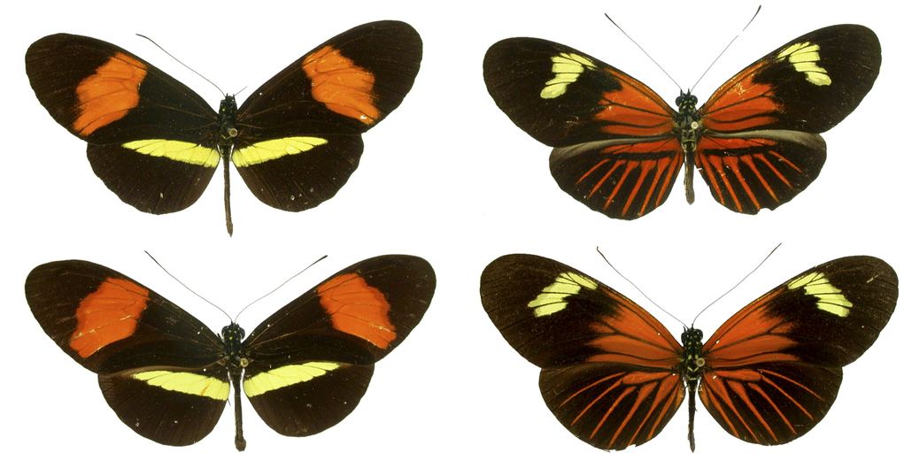
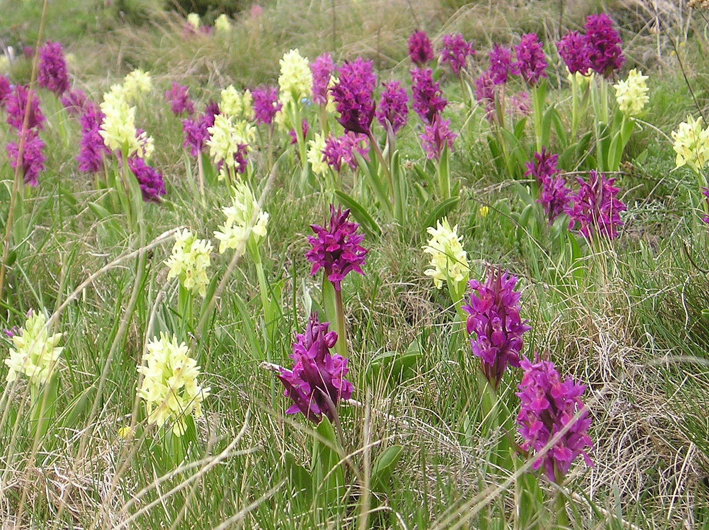

# Evolutionary Mechanisms I: Modeling Selection

The Hardy-Weinberg principle we learned about in the last chapter provides a simple framework to test whether evolutionary forces are acting on a locus within a population. If a population is in Hardy-Weinberg disequilibrium at a particular locus, we know that an evolutionary force is skewing relative genotype frequencies away from what is predicted based on the allele frequencies in a population. Evolutionary forces might include selection, mutation, genetic drift, migration, or non-random mating. In this and the following chapter, we will get to know the different evolutionary forces in more detail, and we will explore how each force---and interactions between them---shapes genetic variation and allele frequencies across generations. To do so, we will use simple mathematical models to simulate allele frequency changes under different scenarios. First, we will learn how the outcome of selection varies depending on the fitness distribution among genotypes and the starting allele frequency in a population. In the next chapter, we will expand this simplified view and also include mutation, genetic drift, migration, and non-random mating in our thinking.

## The Effects of Selection

Rosemary and Peter Grant's work has shown us how natural selection can drive rapid evolution of phenotypic traits. But what are the genetic ramifications of selection? How does selection impact genetic variation and allele frequencies at a particular locus? Per definition, we know that selection favors the success of certain genotypes over others; this is one way Hardy-Weinberg disequilibrium can be generated. It is this biased success of certain genotypes that ultimately causes allele frequency changes across generations. For example, if the fitness of an individual is contingent on the number of *A* alleles at a particular locus, we would expect the *A* allele to become more common than the *a* allele through successive generations.

Such allele frequency changes across generations are well documented from evolution experiments. For example, Dawson (1970) conducted research on flour beetles (*Tribolium castaneum*). In his colonies, he observed a recessive deleterious mutation, where individuals with two copies of the recessive allele (*l*) could not survive, but heterozygotes (*wt*/*l*) and individuals that were homozygous for the the wildtype (*wt*) allele had normal fitness. This represents a classical dominant-recessive inheritance. To test the evolutionary consequences of the deleterious recessive allele, Dawson assembled experimental populations composed solely of heterozygous individuals, which means that the allele frequencies of *wt* and *l* were both 0.5. He then let the populations evolve for several generations and measured the allele frequencies of *wt* and *l* in each generation. As you can see in Figure \@ref(fig:recdel), the allele frequency of *wt* increased in each generation. Since *p*+*q*=1 for any biallelic locus, the frequency of *l* decreased concurrently. Hence, selection against the recessive lethal allele caused it to decline in frequency over time. This makes intuitive sense, considering the offspring of the heterozygous individuals of the initial population were 25 % *wt/wt* (*p*^2^), 50 % heterozygous *wt*/*l* (2*pq*), and 25 % *l*/*l* (*q*^2^). While all the individuals with at least one *wt* allele survived and reproduced, individuals that were homozygous for the recessive allele perished, disproportionately removing *l* alleles from the population.

```{r ld1, include=FALSE}
library(ggplot2)
library(gridExtra)
library(ggpubr)
library(RColorBrewer)
library(tidyr)
```

```{r recdel, echo=FALSE, message=FALSE, fig.cap="Selection against a deleterious recessive mutation causes significant changes in allele frequencies over short periods of time. [Data](data/5_lethal_recessive.csv) from Dawson (1970)."}
rec_del <- read.csv("data/5_lethal_recessive.csv")
ggplot(rec_del, aes(x=generation, y=p, color=replicate)) +
    geom_point() +
    geom_line() +
    xlab("Time (in generations)") +
    ylab("p (frequency of wt)") +
    xlim(0,12)+
    ylim(0.5,1)+
    scale_x_continuous(breaks = seq(0, 12, by = 3)) +
    theme_classic() +
    scale_color_brewer(palette = "Set2")
```

Similar changes in allele frequencies can be observed if populations that are polymorphic at a particular locus are exposed to different environmental conditions. For example, many fruit fly (*Drosophila melanogaster*) populations are polymorphic at the *Adh* locus, which encodes alcohol dehydrogenase, the same enzyme that detoxifies ethanol in your liver after a fine glass of wine. The two alleles in fruit flies differ in the rate at which they process ethanol, including a fast allele (*Adh*^f^) and a slow allele (*Adh*^s^). Cavener and Clegg (1981) used populations with this polymorphism, letting different replicate populations evolve on media that contained alcohol, or in non-alcoholic control populations. While the control populations only exhibited minor fluctuations in allele frequencies across generations, the frequency of the *Adh*^f^ allele significantly increased in populations exposed to ethanol (Figure \@ref(fig:ethanol)). The difference in evolutionary trajectories can be explained by the fitness benefit the *Adh*^f^ allele confers in different environments: when ethanol is present, having faster detoxification is clearly advantageous. But if there is no ethanol in the environment, it does not matter whether you can detoxify it faster or slower, and genetic variation at the *Adh* locus becomes neutral.

```{r ethanol, echo=FALSE, message=FALSE, fig.cap="Allele frequency changes at the Adh locus in ethanol-exposed and control populations. Allele frequencies change drastically in populations that are exposed to the critical source of selection, ethanol. [Data](data/5_ethanol.csv) from Cavener and Clegg (1981)."}
etoh <- read.csv("data/5_ethanol.csv")
etoh2 <- etoh %>% separate(replicate, c("treat", "rep"), sep=" ")
etoh3 <- cbind(etoh, etoh2)
etoh3 <- etoh3[c(1:5)]
ggplot(etoh3, aes(x=generation, y=p, group=replicate, color=treat)) +
    geom_point() +
    geom_line() +
    labs(x="Time (in generations)", y="p (frequency of Adh-f)", color="Treatment") +
    theme_classic() +
    scale_color_brewer(palette = "Set2")
```

Evidence for change in allele frequencies in response to selection does not just come from laboratory experiments, but also from natural populations where time series of the genotypic composition of populations are available. One of the most amazing data sets in recent years comes from over 540 whole or partial genome sequences that were obtained from fossilized human remains---some of which are almost 14,000 years old. This time series spans some major transitions in human evolution, including the advent of agriculture and correlated changes in human diets that occurred about 10,000 years ago. Around that time, humans also started to domesticate livestock for meat and milk production. Many of these changes represented novel sources of selection, especially the availability of milk as a dietary component past weaning and into adulthood. As much as mammals rely on milk for nutrition right after birth, this food source is not really available to any species after weaning. Accordingly, the production of lactase---the enzyme that mediates digestion of milk sugar (lactose)---stops after weaning, leaving adult mammals unable to digest lactose. Some of you may be familiar with that problem. Depending on your heritage, you may feel significant discomfort after eating dairy, because your body cannot handle the lactose (this is known as lactose intolerance). It turns out that lactose intolerance is prevalent in human populations that do not have a cultural history of using domesticated animals for milk production. This raises the question of how lactose tolerance evolved in populations that do have a history of dairy use. Analyses of ancient DNA indicated that alleles conferring lactose tolerance (also known as lactase persistence alleles) were virtually absent in human populations prior to the domestication of dairy animals (Figure \@ref(fig:lactase)). In European populations with a history of dairy farming, lactase persistence alleles did not start to spread until about 5,000 years ago, matching the timeline of domestication. Overall, empirical evidence from experiments and natural systems indicates that selection can have profound impacts on allele frequencies even over relatively short time frames.

```{r lactase, echo=FALSE, message=FALSE, warning=FALSE, fig.cap="Analyses of ancient DNA indicates an increase in the frequency of lactase persistence alleles starting about 5,000 years ago. Different geographic regions are color-coded and the size of markers is proportional to the number of genomes used to infer allele frequences. [Data](data/5_lactase.csv) from Marciniak & Perry (2017)."}
lact <- read.csv("data/5_lactase.csv")

ggplot(lact, aes(x=-Time, y=p, color=Region)) +
    geom_point(aes(size=n), alpha=0.4) +
    geom_point() +
    xlab("Time (years before present)") +
    ylab("p (frequency of lactase persistence allele)") +
    theme_classic() +
    scale_color_brewer(palette = "Set2")
```

### Frequency-Dependent Selection

While evolution experiments usually create conditions where the direction and strength of selection remains constant, selection in natural populations often varies spatially or temporally. For example, fluctuating selection can be associated with environmental change, which was exemplified in Darwin's finches, whose beaks can evolve to be larger or smaller dependent on the available food resources. A special case of fluctuating selection is frequency-dependent selection, where the fitness of a genotype depends on the genotypic composition of the population. We distinguish two types of frequency-dependency: positive and negative.

In positive frequency-dependent selection, the fitness of a genotype increases as it becomes more common in a population, and consequently, selection rapidly drives common alleles to fixation. Positive frequency-dependent selection plays a major role in the evolution of signaling traits, where the efficiency of a signal is dependent on the frequency of its use. Notable examples include the evolution of social signals, flower coloration for pollinator attraction, and warning signals that indicate danger or unpalatability.

A great example of positive frequency-dependent selection includes selection on warning signals in toxic, South American butterflies of the genus *Heliconius*. Some *Heliconius* species exhibit extensive geographic variation in their warning colors, but different species in the same geographic region are often strikingly similar (Figure \@ref(fig:heliconius)). This is because different species in the same region mimic each other, developing shared signals to deter predators. Similar signals mean that predators are more likely to recognize the pattern of unpalatability. This is similar to the independent evolution of yellow and black stripes in wasps, bees, and many other insects that signal danger.

```{r heliconius, echo=FALSE, out.width='100%', fig.cap = "Mimicry in *Heliconius* butterflies. Specimens in the same row belong to the same species (top: *H. melpomene*; bottom: *H. erato*). Specimens in the same column were collected in the same geographic region. Image from Meyer (2006), [CC BY 2.5](https://creativecommons.org/licenses/by/2.5), via Wikimedia Commons"}

```

Chouteau et al. (2016) tested whether positive frequency-dependent selection could explain the evolution of mimicry in *Heliconius* butterflies. They used prey models and placed them in different *Heliconius* populations that varied in the relative frequencies of different warning colorations, predicting that the rate of predation would be low if models matched the common warning phenotype. Indeed, models that resembled rare morphs were much more likely to be attacked by predators than models that resembled the common morph (Figure \@ref(fig:posfreqdep)). In other words, the more common a particular morph is, the less likely it is to succumb to a predator, and consequently, it will have a higher fitness compared to the rarer morphs. Over the course of multiple generations, such positive frequency dependent selection can generate the evolution of coordinated warning signals across species inhabiting the same region.

```{r posfreqdep, echo=FALSE, message=FALSE, fig.cap="Positive frequency dependent selection. [Data](data/5_positivefreqdep.csv) from Chouteau et al. (2016)."}
pfrqdep <- read.csv("data/5_positivefreqdep.csv")
ggplot(pfrqdep, aes(x=signal.freq, y=predation)) +
    geom_point() +
    geom_smooth(method="glm", method.args=list(family=Gamma(link="inverse")), se=FALSE) +
    xlab("Relative frequency of the model phenotype") +
    ylab("Predation rate") +
    theme_classic()
```

In negative frequency-dependent selection, the fitness of a genotype declines as it becomes more common. Negative frequency-dependency is a mechanism by which genetic variation is maintained in a population, and it can be an important evolutionary force acting on a wide variety of traits. Perhaps most well-known is how negative frequency-dependence shapes the evolution of many traits associated with host-pathogen interactions. As certain host defense strategies become more common, pathogens rapidly evolve to adapt to those defenses. As a consequence, individuals with more common defense strategies exhibit lower fitness than rare ones, leading to fluctuations in genotype frequencies over time.

Another great example of negative frequency-dependent selection comes from the orchid *Dactylorhiza sambucina*, which exhibits a striking polymorphism in flower coloration (Figure \@ref(fig:orchid)). While many plant communities are subject to positive frequency-dependent selection to coordinate signals for pollinator attraction, *Dactylorhiza* cheats: unlike most flowers, those of *Dactylorhiza* do not provide any rewards to pollinators in the form of nectar. As a consequence, pollinators learn to avoid *Dactylorhiza* flowers.

```{r orchid, echo=FALSE, message=FALSE, out.width='100%', fig.cap="*Dactylorhiza sambucina* (yellow and purple/red forms growing together) in Andorra. Photo by Strobilomyces, [CC BY-SA 3.0](https://creativecommons.org/licenses/by-sa/3.0), via Wikimedia Commons."}

```

*Dactylorhiza*'s counter-adaptation to this learned avoidance is a flower color polymorphism, which is thought to be maintained by negative frequency-dependent selection. The idea is that if one color morph gets too abundant and pollinators start avoiding it, then they simply switch to the rarer color morph that they do not associate with a lack of reward yet. If this was correct, the fitness of a color morph should decline with its frequency. Gigord et al. (2001) tested this idea by conducting an experiment where they varied the relative frequency of different color morphs and quantified reproductive success. As predicted, male reproductive success was negatively correlated with relative frequency of the morph (Figure \@ref(fig:negfreqdep)), indicating a rare morph advantage that is characteristic for negative frequency-dependent selection.

```{r negfreqdep, echo=FALSE, message=FALSE, warning=FALSE, fig.cap="As predicted by negative frequency-dependent selection, reproductive success in *Dactyorhiza* color morphs is negatively correlated with the frequency of the morph in the population. [Data](data/5_negfreqdep.csv) from Gigord et al. (2001)."}
nfrqdep <- read.csv("data/5_negfreqdep.csv")
ggplot(nfrqdep, aes(x=frequency.yellow, y=reprod.success)) +
    geom_smooth(method="lm", se=FALSE) +
    geom_point() +
    geom_errorbar(aes(ymin=reprod.success-se, ymax=reprod.success+se), width=0.01) +
    xlab("Frequency of the yellow morph") +
    ylab("Male reproductive success") +
    theme_classic()
```

## Modeling the Effects of Selection

While the consequences of selection in terms of changing allele frequencies may seem trivial at first sight, the exact outcome of selection actually depends on a number of parameters, including the starting allele frequency and the fitness distribution across different genotypes. To develop a nuanced understanding of alternative evolutionary outcomes in response to selection, we will use simple mathematical models to explore how different starting conditions shape evolutionary trajectories. Here, I provide some conceptual background on how these mathematical models work. Then you will learn how you can easily run different models in R.

### Relative Fitness

Modeling changes in allele frequencies in response to selection requires a modification of the formulas associated with the Hardy-Weinberg principle. When calculating allele frequencies across generations, we have to take into account fitness differences between the genotypes. While fitness is typically measured through a variety of proxies in natural populations (*e.g.*, survival, reproductive success, growth, etc.), having species- or even study-specific metrics for fitness is not conducive to mathematical modeling. So, rather than considering different fitness components, we can just subsume different metrics into a single, idealized measure of fitness, which is called *relative fitness.* Relative fitness expresses the fitness of different genotypes relative to each other, and it can be any positive number, including zero. In practice, we choose one genotype as a reference and set its relative fitness to 1 (representing 100 % fitness). The fitness of other genotypes can then be expressed in relation to the reference. Fitness values are higher than the reference (\>1) if alternate genotypes have higher fitness and lower than the reference (\<1) if they have lower fitness. The difference in relative fitness between genotypes is called the selection coefficient (*s*), indicating how fitness and selection are directly related to each other. Table 5.1 provides a practical example for the description of relative fitness using a biallelic locus with dominant-recessive or other modes of inheritance. The *aa* genotype is used as reference, such that the fitness for *aa* (*w*~aa~) is 1, and the fitness of other genotypes is expressed in relation to that. Note that the average fitness (w̄) in every generation (n) can be calculated as:

```{=tex}
\begin{align} 
w̄=p_n^2w_{AA}+2p_nq_nw_{Aa}+q_n^2w_{aa} (\#eq:8)
\end{align}
```
+--------------------------------+-------------+-------------+-------------+
|                                | *AA*        | *Aa*        | *aa*        |
+================================+:===========:+:===========:+:===========:+
| Dominant-recessive inheritance | 1.2         | 1.2         | 1           |
|                                |             |             |             |
|                                | *s*=0.2     | *s*=0.2     | .           |
+--------------------------------+-------------+-------------+-------------+
| Other modes of inheritance     | 1.4         | 1.2         | 1           |
|                                |             |             |             |
|                                | *s*~1~=0.4  | *s*~2~=0.2  | .           |
+--------------------------------+-------------+-------------+-------------+

: Table 5.1: Example of relative fitness descriptions for a dominant-recessive inheritance (*w*~AA~=*w*~Aa~) and other modes of inheritance, with the *aa* genotypes used as the reference (*w*~aa~=1). Description of relative fitness in the former case requires a single selection coefficient, because the phenotype of *AA* and *Aa* are by definition the same. For other modes of inheritance (e.g., additive, heterozygote advantage or disadvantage), two selection coefficients are necessary to describe the fitness distribution of genotypes relative to *w*~aa~.

### Calculating Allele Frequency Changes

Based on relative fitness, we can calculate the allele frequency of the next generation as a function of allele frequencies in the current generation. Just take a look at the modified Punnett square from the previous chapter for a graphical representation (Figure \@ref(fig:punnett2)). In the absence of selection or any other evolutionary forces (*i.e.*, under Hardy-Weinberg assumptions), the genotype frequencies of the next generation are defined as:

```{=tex}
\begin{align} 
f_{AA}=p^2 (\#eq:9)\\
f_{Aa}=2pq (\#eq:10)\\
f_{aa}=q^2 (\#eq:11) 
\end{align}
```
If we choose the *aa* genotype as our reference (*w*~aa~=1), we can then adjust the frequency of genotypes after selection by factoring in the fitness differences between *AA* and *Aa* relative to *aa*. Assuming a dominant-recessive inheritance, this means:

```{=tex}
\begin{align} 
f_{AA}=p^2*(1+s) (\#eq:12)\\
f_{Aa}=2pq*(1+s) (\#eq:13)\\
f_{aa}=q^2 (\#eq:14) 
\end{align}
```
Similarly, the allele frequencies of the next generation (p~n+1~ and q~n+1~) can then be calculated directly from the allele frequencies of the current generation (p~n~ and q~n~):

```{=tex}
\begin{align}
p_{n+1}=\frac{p_n^2*(1+s)+p_nq_n*(1+s)}{p_n^2*(1+s)+2p_nq_n*(1+s)+q_n^2}=\frac{p_n^2*(1+s)+p_nq_n*(1+s)}{w̄} (\#eq:15)\\
q_{n+1}=\frac{p_nq_n*(1+s)+q_n^2}{p_n^2*(1+s)+2p_nq_n*(1+s)+q_n^2}=\frac{p_nq_n*(1+s)+q_n^2}{w̄} (\#eq:16) 
\end{align}
```
The mathematical formula for other modes of inheritance is exactly the same, except that we need to use different selection coefficients to describe *w*~AA~ (s~1~) and *w*~Aa~ (s~2~):

```{=tex}
\begin{align}
p_{n+1}=\frac{p_n^2*(1+s_1)+p_nq_n*(1+s_2)}{p_n^2*(1+s_1)+2p_nq_n*(1+s_2)+q_n^2}=\frac{p_n^2*(1+s_1)+p_nq_n*(1+s_2)}{w̄} (\#eq:17)\\
q_{n+1}=\frac{p_nq_n*(1+s_2)+q_n^2}{p_n^2*(1+s_1)+2p_nq_n*(1+s_2)+q_n^2}=\frac{p_nq_n*(1+s_2)+q_n^2}{w̄} (\#eq:18) 
\end{align}
```
These simple equations underlie the majority of models you will run during the R exercise associated with this chapter. If you are thinking "Errrr, what? Simple?", don't worry too much! These formulas are already integrated into R functions that will automatically calculate allele frequency changes across many generations based on a few input parameters (see [below](#practical-skills)). The math provided here is just to help you understand how these algorithms actually work.

```{r punnett2, echo=FALSE, out.width='50%', fig.cap = "A modified Punnett square illustrates the relationship between allele frequencies (*p* and *q*) and the resulting genotype frequencies when genotypes *AA* and *Aa* have a different fitness than *aa*."}
knitr::include_graphics('images/HWE_sel.png')
```

## Case Study: Modeling Selection

The key goal of [this case study](exercises/BIOL520-ex4.zip) is for you to learn how to model the effects of selection in R and apply that knowledge to systematically explore evolutionary outcomes by manipulating key input parameters. All models of selection require you to input a starting allele frequency (*p*~0~) for the initial generation, the number of generations (time) you want the model to run for, and---perhaps most importantly---the distribution of fitness among the different genotypes. For simplicity, all of our models assume a biallelic locus in a diploid organism.

Since selection is blind to the genotype and can only act on phenotypic traits, it is important to consider different modes of inheritance when studying the possible outcomes of selection. While it is often assumed that most traits exhibit a dominant-recessive inheritance, this is not actually true. Hence, we will consider a number of scenarios beyond dominant-recessive inheritance to explore how selection actually impacts evolutionary outcomes:

1.  We will contrast evolutionary outcomes when selection acts for (Figure \@ref(fig:testrrr)-A) or against (Figure \@ref(fig:testrrr)-B) dominant phenotypes, assuming dominant-recessive inheritance (*w*~AA~=*w*~Aa~).

2.  We will explore evolutionary outcomes when alternative alleles have additive effects, such as when the fitness of heterozygotes is intermediate between the fitness of the homozygotes (*w*~AA~ \> *w*~Aa~ \> *w*~aa~ or *w*~AA~ \< *w*~Aa~ \< *w*~aa~; Figure \@ref(fig:testrrr)-C).

3.  Sometimes heterozygotes will have a fitness advantage over both homozygous genotypes. We will consider cases where there are no fitness differences between the two homozygous genotypes (*w*~AA~ = *w*~aa~; Figure \@ref(fig:testrrr)-D) and where the fitness of the homozygous genotypes differ (*w*~AA~ ≠ *w*~aa~; Figure \@ref(fig:testrrr)-E).

4.  Sometimes heterozygotes will have a fitness disadvantage over both homozygous genotypes. We will again consider cases where there are no fitness differences between the two homozygous genotypes (*w*~AA~ = *w*~aa~; Figure \@ref(fig:testrrr)-F) and where the fitness of the homozygous genotypes differ (*w*~AA~ ≠ *w*~aa~; Figure \@ref(fig:testrrr)-G).

5.  Finally, we will also model negative frequency-dependent selection, where the fitness of each genotype is dependent on its frequency in the population. While there are a variety of mathematical models to simulate frequency dependence, we will use fitness functions that are described in the following equations (Rice 2004) (see Figure \@ref(fig:testrrr)-H for a visualization):

```{=tex}
\begin{align}
w_{AA}=1-3*f_{Aa}+3*f_{aa} (\#eq:19)\\
w_{Aa}=1-s*f_{Aa} (\#eq:20)\\
w_{aa}=1-3*f_{Aa}+3*f_{AA} (\#eq:21)
\end{align}
```
```{r testrrrprep, include=FALSE}
fitness <- read.csv("data/5_fitness.csv")
freq.p <- seq(0,1,0.05)
freq.q <- 1-freq.p
freq.AA <- freq.p^2
freq.Aa <- 2*freq.p*freq.q
freq.aa <- freq.q^2
fit.AA <- 1-3*freq.Aa+3*freq.aa
fit.Aa <- 1-2*freq.Aa
fit.aa <- 1-3*freq.Aa+3*freq.AA
fitness2 <- data.frame(cbind(freq.AA, fit.AA, fit.Aa, fit.aa))
fitness$genotype <- factor(fitness$genotype, levels = c("AA", "Aa", "aa"))
p1 <-ggplot(fitness, aes(x=genotype, y=sel.dom)) +
    geom_col() +
    xlab("Genotype") +
    ylab("Relative fitness") +
    ggtitle("A. Selection for dominant phenotype") +
    theme_classic()
p2 <-ggplot(fitness, aes(x=genotype, y=sel.rec)) +
    geom_col() +
    xlab("Genotype") +
    ylab("Relative fitness") +
    ggtitle("B. Selection for recessive phenotype") +
    theme_classic()
p3 <-ggplot(fitness, aes(x=genotype, y=sel.add)) +
    geom_col() +
    xlab("Genotype") +
    ylab("Relative fitness") +
    ggtitle("C. Additive genetic variation") +
    theme_classic()
p4 <-ggplot(fitness, aes(x=genotype, y=sel.het.ad1)) +
    geom_col() +
    xlab("Genotype") +
    ylab("Relative fitness") +
    ggtitle("D. Selection for heterozygotes 1") +
    theme_classic()
p5 <-ggplot(fitness, aes(x=genotype, y=sel.het.ad2)) +
    geom_col() +
    xlab("Genotype") +
    ylab("Relative fitness") +
    ggtitle("E. Selection for heterozygotes 2") +
    theme_classic()
p6 <-ggplot(fitness, aes(x=genotype, y=sel.het.dis1)) +
    geom_col() +
    xlab("Genotype") +
    ylab("Relative fitness") +
    ggtitle("F. Selection against heterozygotes 1") +
    theme_classic()
p7 <-ggplot(fitness, aes(x=genotype, y=sel.het.dis2)) +
    geom_col() +
    xlab("Genotype") +
    ylab("Relative fitness") +
    ggtitle("G. Selection against heterozygotes 2") +
    theme_classic()
p8 <-ggplot(fitness2) +
    geom_line(aes(x=freq.AA, y=fit.AA), color="#66c2a5") +
    geom_line(aes(x=freq.AA, y=fit.Aa), color="#fc8d62") +
    geom_line(aes(x=freq.AA, y=fit.aa), color="#8da0cb") +
    xlab("Frequency of AA") +
    ylab("Relative fitness") +
    ggtitle("H. Negative frequency-dependent selection") +
    theme_classic()
p9 <- ggarrange(p1,p2,p3,p4,p5,p6,p7,p8,ncol=2, nrow=4)
```

```{r testrrr, echo=FALSE, message=FALSE, warning=FALSE, results='hide', fig.height=12, fig.width=8, fig.cap="Hypothetical fitness distributions among genotypes that will be used in different scenarios to model the outcomes of selection. (A) Selection for the dominant phenotype, assuming a dominant-recessive inheritance. (B) Selection for the recessive phenotype, assuming a dominant-recessive inheritance. (C) Fitness distribution assuming a strictly additive inheritance. Note that the fitness of *AA* and *aa* could also be swapped in this scenario. (D) Selection for heterozygotes, with homozygous genotypes having equal fitness. (E) Selection for heterozygotes, with homozygous genotypes having unequal fitness. Note that the fitness of *AA* and *aa* could also be swapped in this scenario. (F) Selection against heterozygotes, with homozygous genotypes having equal fitness. (G) Selection against heterozygotes, with homozygous genotypes having unequal fitness. Note that the fitness of AA and aa could also be swapped in this scenario. (H) Fitness functions of *AA* (green), *Aa* (orange), and *aa* (blue) based on Equations 5.12-5.14. Note that the *s*=2 for this scenario."}
p9
```

## Practical Skills: Modeling Selection {#practical-skills}

All selection models you will run for this chapter's exercise are implemented in the R package `learnPopGen`. Before you start with the exercise, make sure to install the package by executing `install.packages("learnPopGen")` in the Console. Alternatively, you can click *Tools\>Install Packages...* in the RStudio menu, type "learnPopGen", and click *Install*.

After the installation, make sure to load the package using the `library()` function when you restart R:

```{r lpopg}
library(learnPopGen)
```

### Modeling Selection

We can model the change in allele frequencies in response to selection with the `selection()` function. To do so, we need to first define the critical input parameters:

-   ***Fitness (w):*** To set the fitness of the three genotypes (*AA*, *Aa*, *aa*), you simply need to generate a vector with three numbers between 0 and ∞ (although most fitness values you will use are between 0 and 2): `fitness <- c(wAA, wAa, waa)`. For example, if the mode of inheritance is dominant/recessive, you define fitness as: `fitness <- c(1+s, 1+s, 1)`. If the mode of inheritance is not dominant/recessive, fitness is defined as: `fitness <- c(1+s1, 1+s2, 1)`.

-   ***Starting allele frequency (p~0~):*** The starting allele frequency gives the frequency of *A* (*p*) at the beginning of the simulation. It can be a number between zero and one. However, it should not be zero or one, because that would mean that there is not any genetic variation in the population---and as you know, evolution cannot happen when there is no variation. Depending on the scenario, you may want to start with a low number for *p* (for example, if we assume that *A* is generated by a rare mutation that provides a fitness benefit) or a high number of *p* (for example, if we assume that *a* is generated by a rare mutation that provides a fitness benefit). For some scenarios (highlighted in the actual exercise), you will want to run multiple simulations with different starting allele frequencies to test how it alters the outcomes of selection.

-   ***Time (number of generation):*** You will also have to input how many generations you want to run the simulation for. This can be any integer between 1 and ∞, although I would be cautious with large numbers (\>1,000), as some models use significant computation time.

In practical terms, you can set up the parameters using the following code. Note that executing this code chunk will create three new objects in your Global Environment.

```{r prepselmodel}
#Define the fitness of each genotype (AA, Aa, aa); in this case, aa has a 50 % lower fitness than AA and Aa
fitness <- c(1, 1, 0.5)

#Define the starting allele frequency (p0); in this case we assume A is rare
start.freq <- 0.001

#Define how many generations you want to simulate
generations <- 50
```

Once you set the parameters, use the `selection()` function to run a simulation. Within the function, you have to designate the fitness distribution (`w`), the starting allele (`p0`), and the number of generations (`time`), as shown in the following example. Note that we are storing the output of the simulation in an object called `result`. Also, the `selection()` function will automatically plot those results, and you will not have to write additional code for that.

```{r selmodel, fig.cap="Output of `selection()` function."}
#Model the allele changes and store the results in an object called result
result <- selection(w=fitness, time=generations, p0=start.freq)
```

Note that the default output of the `selection()` function is a plot showing the frequency of *A* (*p*). You can also plot the frequency of *a* (*q*) using the `show="q"` argument:

```{r selmodel2, fig.cap="Output of `selection()` function when plotting q instead of p."}
result <- selection(w=fitness, time=generations, p0=start.freq, show="q")
```

Sometimes it may be advantageous to not just see the graphical output, but to take a look at the actual numbers generated by the model. For example, it can be hard to discern whether a line reaches zero or one, or whether it is just close to zero or one. To generate a data table, we first need to extract the allele frequency for *p* for each generation---using `results$p`---and generate a new data frame. Using the `tail()` function, you can then generate a table with just the last few generations in your simulation:

```{r selmodeltab}
#Here we generate a new data frame with three variables: number of generations, p, and q
r.table <- data.frame(1:generations, result$p, 1-result$p)

#We can use the names() function to designate a name for each variable in the data frame
names(r.table) <- c("Generation", "p", "q")

#Show last part of the table
tail(r.table)
```

### Running Multiple Selection Models

The power of modeling selection is that we can effortlessly run a large number of models that vary in input parameters to test how those changed inputs impact the end result of the simulations. To directly contrast different models, you can consolidate the outputs by using `add=TRUE` after the initial model. In addition, you can change the color of different models with the `color` argument to indicate which output line belongs to which input parameters. The example below includes three different models that vary in the strength of selection against the recessive homozygous genotype; the other input parameters are the same for all three models.

```{r multiselmodel, fig.cap="Output of multiple `selection()` models combined into a single graph with `add=TRUE`."}
#Define the fitness of each genotype. Unlike above, you want to vary the strength of selection, so we will define multiple fitness sets (one for each model you want to run)
fitness1 <- c(1, 1, 0.7)
fitness2 <- c(1, 1, 0.5)
fitness3 <- c(1, 1, 0.3)

#Define the starting allele frequency p0. This parameter will will be the same for all models, so you only need to define it once.
start.freq1 <- 0.001

#Define how many generations you want to simulate. This parameter will will be the same for all models, so you only need to define it once.
generations <- 50

#Model the allele changes for the different strengths of selection. You need to run one model for each fitness distribution you defined above. Note that you can plot all results in a single graph by adding "add=TRUE" starting at the second model. 
result1 <- selection(w=fitness1, time=generations, p0=start.freq1, color= 'blue')
result2 <- selection(w=fitness2, time=generations, p0=start.freq1, add=TRUE, color = 'red')
result3 <- selection(w=fitness3, time=generations, p0=start.freq1, add=TRUE, color = 'purple')
```

### Frequency-Dependent Selection

We can use the `freqdep()` function to model frequency-dependent selection, which is also from the `learnPopGen` package. The input parameters are mostly the same as for the `selection()` function, although there a couple of important differences:

-   `freqdep()` does not require you to define the fitness of the different genotypes (of course, because their fitness is frequency-dependent). Instead, you simply input the strength of selection (`s`) against heterozygotes when they are common, as illustrated in Equation \@ref(eq:20).

-   `freqdep()` does not support the `add` argument. So when you run multiple models, you will need to compare the outputs across different graphs.

Below is a simple example of the `freqdep()` function. As before, I first define the input parameters and then run the function:

```{r freqdepmodel, fig.cap="Output of `freqdep()` function."}
sel.coef=1
start.freq=0.01
generations=100

r1 <-freqdep(s=sel.coef, p0=start.freq, time=generations)
```

### Understanding Equilibria

To interpret some of your simulation results, it may be useful to understand the concepts of stable and unstable equilibria. This section is perhaps most useful if you work through the exercise first and then come back for additional context.

An equilibrium is any state of a system which tends to persist unchanged over time. In stable equilibria, a system will return back to the same stable equilibrium after disturbance. In unstable equilibria, a system will move away from the equilibrium after disturbance until it reaches an alternative stable equilibrium. I know... this is abstract. Let's look at it from a practical perspective.

#### Stable Equilibrium {.unnumbered}

As your simulations will hopefully show, heterozygous advantage will lead to polymorphism; *i.e.*, the stable maintenance of both alleles in the population. Why? If you start with a population fixed for *A*, and you add some heterozygotes, the heterozygotes will outperform *AA*, and as a consequence *a* will increase in the population. Similarly, if you start with a population fixed for ***a***, and you add some heterozygotes, the heterozygotes will outperform *aa*, and as a consequence *A* will increase in the population.

This pattern can be best explained by focusing on the equilibria of the model. During heterozygous advantage, the allele frequencies of *p*=0 and *p*=1 are unstable equilibria. If you choose those values as your starting allele frequencies (`p0`), the model indicates no change in allele frequency even when selection is operating. This is simply because there is no evolution when there is no variation (*i.e.*, when there is only one allele in the population). Now somewhere between the unstable equilibria of *p*=0 and *p*=1 lies a stable equilibrium, which depends on the fitness (*w*) of the different genotypes. Specifically the equilibrium frequency *p*' is:

```{=tex}
\begin{align} 
p' = \frac{w_{Aa}-w_{aa}}{2w_{Aa}-w_{AA}-w_{aa}} (\#eq:22)
\end{align}
```
Let's look at this graphically:

```{r stabeq}
#Here we define fitness with a heterozygote advantage
fitness1 <- c(0.7, 1, 0.1)

#Define the starting allele frequency p0
start.freq1=1 #Unstable equilibrium
start.freq2=0 #Unstable equilibrium
start.freq3=0.98
start.freq4=0.02

#Define how many generations you want to simulate
gen.time1 <- 20

#Model the allele changes and store the results in an object r1; note that the parameter t just signifies how many generations will be simulated
r1 <- selection(w=fitness1, time=gen.time1, p0=start.freq1, equil=TRUE)
r2 <- selection(w=fitness1, time=gen.time1, p0=start.freq2, add=TRUE, color="red")
r3 <- selection(w=fitness1, time=gen.time1, p0=start.freq3, add=TRUE, color="blue")
r4 <- selection(w=fitness1, time=gen.time1, p0=start.freq4, add=TRUE, color="green")
```

What you can see is that the simulations with a starting allele frequency at an unstable equilibrium do not change (they can't because one of the alleles is missing). For other starting allele frequencies, *p* approaches the stable equilibrium, as indicated by the dashed line (you can add the equilibrium line to your plots using the `equil=TRUE` argument). We can also calculate the value for the dashed line based on the formula in Equation \@ref(eq:22):

```{r stabeq2}
(1-0.1)/(2*1-0.7-0.1)
```

So, for starting allele frequencies *p*~0~ \> *p*', allele frequencies will decline until the stable equilibrium is reached. For starting allele frequences *p*~0~ \< *p*', allele frequencies will increase until the stable equilibrium is reached. For starting allele frequencies of *p*~0~ = *p*', there will be no change in allele frequencies.

#### Unstable Equilibrium {.unnumbered}

Now that we understand stable and unstable equilibria, we can take a look at what happens when we have heterozygote *dis*advantage. When we introduce a few heterozygotes to a population consisting of purely *AA* genotypes, the homozygotes would do better and the *a* allele would disappear again. The same happens to a population fixed for *a*. In other words, populations fixed for *A* or *a* are at a stable equilibrium, and there must be an unstable equilibrium between them. The equilibrium frequency of *p*' is defined as above.

To look at this graphically:

```{r instabeq}
#Here we define fitness with a heterozygote disadvantage
fitness1 <- c(1, 0.1, 0.6)

#Define the starting allele frequency p0
start.freq1=1 #Stable equilibrium
start.freq2=0 #Stable equilibrium
start.freq3=0.4
start.freq4=0.3

#Define how many generations you want to simulate
gen.time1 <- 20

#Model the allele changes and store the results in an object r1; note that the parameter t just signifies how many generations will be simulated
r1 <- selection(w=fitness1, time=gen.time1, p0=start.freq1, equil=TRUE)
r2 <- selection(w=fitness1, time=gen.time1, p0=start.freq2, add=TRUE, color="red")
r3 <- selection(w=fitness1, time=gen.time1, p0=start.freq3, add=TRUE, color="blue")
r4 <- selection(w=fitness1, time=gen.time1, p0=start.freq4, add=TRUE, color="green")
```

The equilibrium allele frequency for this scenario is:

```{r instabeq2}
(0.1-0.6)/(2*0.1-0.6-1)
```

The position of the unstable equilibrium explains why a maladaptive allele may get fixed in a population when heterozygotes are selected against, and why an adaptive allele might be lost.\

## Reflection Questions

1.  In what ways are the selection simulations you conducted unrealistic? What assumptions do these models make, and do you think these assumptions are valid?

2.  Why do you think mathematical models are useful? Fundamentally, what insights can we gain from "playing with math"?

3.  Many animals have 1:1 ratio of males and females. What kind of selection do you think maintains even sex ratios, and why?

4.  The learnPopGen package does not allow for the simulation of positive frequency-dependent selection. Why do you think that is? What do you think will happen to the allele frequencies at a locus that is subject to positive frequency-dependent selection?

## References

-   Cavener DR, MT Clegg (1981). [Multigenic response to ethanol in *Drosophila melanogaster*](https://onlinelibrary.wiley.com/doi/abs/10.1111/j.1558-5646.1981.tb04853.x). *Evolution* 35, 1--10.

-   Chouteau M, M Arias, M Joron (2016). [Warning signals are under positive frequency-dependent selection in nature](https://www.pnas.org/content/113/8/2164). *Proceedings of the National Academy of Sciences USA* 113, 2164--2169.

-   Dawson PS (1970). [Linkage and the elimination of deleterious mutant genes from experimental populations](https://link.springer.com/article/10.1007/BF00958901). *Genetica* 41, 147--169.

-   Gigord LD, MR Macnair, A Smithson (2001). [Negative frequency-dependent selection maintains a dramatic flower color polymorphism in the rewardless orchid *Dactylorhiza sambucina* (L.) Soo](https://www.pnas.org/content/98/11/6253). *Proceedings of the National Academy of Sciences USA* 98, 6253--6255.

-   Marciniak S, GH Perry (2017). [Harnessing ancient genomes to study the history of human adaptation](https://www.nature.com/articles/nrg.2017.65). *Nature Reviews Genetics* 18, 659--674.

-   Meyer A (2006). [Repeating patterns of mimicry](https://journals.plos.org/plosbiology/article?id=10.1371/journal.pbio.0040341). *PLoS Biology* 4, e341.

-   Rice SH (2004). Evolutionary Theory: Mathematical & Conceptual Foundations. Sinauer Associates.
