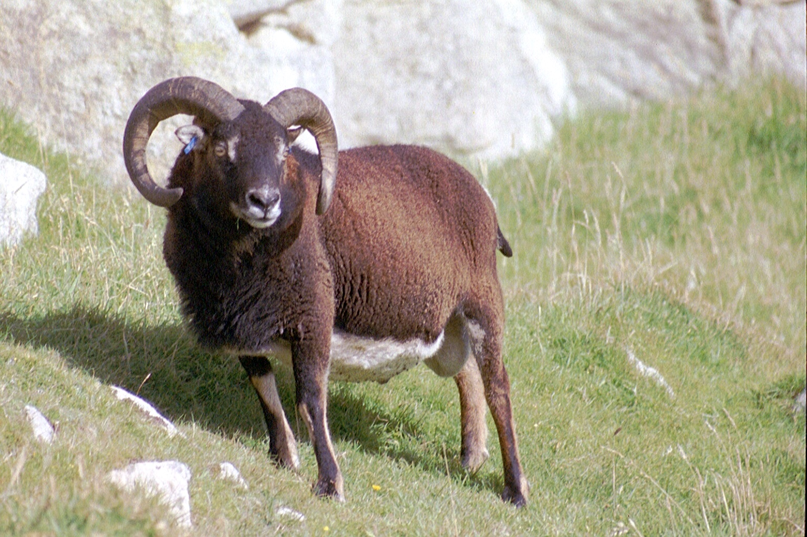

# Evolutionary Mechanisms II: Mutation, Genetic Drift, Migration, and Non-Random Mating

Simulations in the previous chapter revealed complex evolutionary responses to selection. Contrary to common beliefs, selection does not always drive beneficial alleles to fixation; selection can maintain allele frequencies at intermediate equilibria, or even cause fixation of alleles that confer a fitness cost. While the outcomes of simulations align well with empirical studies of selection, the mathematical models employed in [Chapter 5](evolutionary-mechanisms-i-modeling-selection.html) made some critical assumptions that may not hold up in natural populations: we assumed that there was no mutation, an infinite population size, a single population that is not connected to others, and random mating among all genotypes. All of these assumptions relate to other evolutionary forces that can bias the frequency of particular genotypes and skew allele frequencies across generations. In this chapter, we explore how the different evolutionary forces impact allele frequencies in populations, and how they interact with selection in natural settings.

## Mutation: The Force Creating Novelty

Mutations provide the raw material upon which selection can act ([Chapter 4](the-raw-materials-for-evolution.html)). At any given locus, mutation can cause transitions between alleles (*A*~1~ to *A*~2~, or vice versa), or introduce a new allele (*A*~3~). Despite the critical importance of mutation to evolutionary processes, mutation by itself is a weak evolutionary force. Because mutations rates are low, mutation at any locus only causes minute changes in allele frequency across generations.

Nonetheless, there are important interactions between mutation and selection---especially in terms of the persistence of deleterious alleles in a population. In absence of mutation, selection keeps a recessive deleterious gene at a very low frequency (black line in Figure \@ref(fig:mutsel)). But as selection removes deleterious alleles in every generation, mutation continuously reintroduces them. When the rate of elimination of deleterious alleles is equal to the rate of mutation, the frequency of an allele is at an equilibrium, called the mutation-selection balance. Assuming a dominant-recessive mode of inheritance (*w*~AA~ = *w*~Aa~), the frequency of a deleterious allele at equilibrium is given by the mutation rate (𝜇) and the strength of selection (*s*):

```{=tex}
\begin{align} 
q=\sqrt{𝜇/s} (\#eq:23)
\end{align}
```
Consequently, the frequency of a deleterious allele depends on its mutation rate and the strength of selection against it. The equilibrium frequency of a deleterious allele increases with increasing mutation rate or with decreasing strength of selection, as illustrated in Figure \@ref(fig:mutsel).

```{r newl, include=FALSE}
library(ggplot2)
library(gridExtra)
library(learnPopGen)
library(tidyr)
library(RColorBrewer)
```

```{r mutselprep, include=FALSE}
r1 <- mutation.selection(p0=0.5, w=c(1.0,0.5), u=0.000, time=150, show="q")
r2 <- mutation.selection(p0=0.5, w=c(1.0,0.5), u=0.001, time=150, show="q")
r3 <- mutation.selection(p0=0.5, w=c(1.0,0.5), u=0.01, time=150, show="q")
r4 <- mutation.selection(p0=0.5, w=c(1.0,0.5), u=0.1, time=150, show="q")
```

```{r mutsel, echo=FALSE, fig.cap="In absence of mutation, selection maintains a recessive deleterious allele at low frequency (black line). As mutation rate increases, the equilibrium frequency of the deleterious allele increases (blue: mu=0.001; green: mu=0.01; orange: mu=0.1). The strength of selection was 0.5 for all simulations."}
res <- as.data.frame(cbind(r1$p, r2$p, r3$p, r4$p))

names(res) <- c("scenario1", "scenario2", "scenario3", "scenario4")
res$time <- 1:150
ggplot(res) +
    geom_line(aes(x=time, y=1-scenario1))+
    geom_line(aes(x=time, y=1-scenario2), color="blue")+
    geom_line(aes(x=time, y=1-scenario3), color="green")+
    geom_line(aes(x=time, y=1-scenario4), color="orange")+
    xlab("Generation")+
    ylab("q (frequency of the deleterious allele)") +
    theme_classic()
```

Note that Equation \@ref(eq:23) can be used to make inferences about mutation rates, when equilibrium allele frequencies and the strength of selection are known (because 𝜇=*q*^2^\**s*). Accordingly, the principle of mutation-selection balance is an important null model that describes the relationship between selection, mutation, and allele frequencies, and it can be applied to study the prevalence of heritable diseases (see [Reflection Questions](evolutionary-mechanisms-ii-mutation-genetic-drift-migration-and-non-random-mating.html#reflection-questions) for a case study on cystic fibrosis).

## Genetic Drift: The Random Force

Models of selection are completely deterministic because they assume infinite population sizes. No matter how many times you run a simulation with the same parameters, you will always get exactly the same result. In reality, however, population sizes are finite. While many species on the planet do indeed have very large populations (in the order of millions and billions and even trillions), others are comparatively rare. Some rare species have naturally low populations sizes with historically restricted distributions (Figure \@ref(fig:devilshole)); others have declined in recent decades due to anthropogenic environmental change. Species with small or declining population sizes are the focus of conservation biology, which applies evolutionary principles to develop strategies for population management.

```{r devilshole, echo=FALSE, message=FALSE, out.width='100%', fig.cap="The Devils Hole pupfish (*Cyprinodon diabolis*) is one of the rarest vertebrates on the planet. The species is endemic to the tiny Devil's Hole well, which is located within the Ash Meadows National Wildlife Refuge, Nevada. Since the start of population surveys, the maximum population size recorded was 553, and the lowest population size was just 38 individuals in 2006. Photo by Olin Feuerbacher, [CC BY 2.0](https://creativecommons.org/licenses/by/2.0/)."}
knitr::include_graphics('images/devilshole.jpg')
```

When population sizes are finite---and especially when they are small---random chance affects evolutionary dynamics. These changes in allele frequencies across generations caused by random events are called genetic drift. While selection is differential reproductive success caused by differential performance of variants, genetic drift is differential reproductive success that just happens. In contrast to selection, which tends to increase average fitness across generations, genetic drift does not lead to adaptation. Due to the random nature of genetic drift, populations subject to it evolve on distinct trajectories. So, if you re-run simulations allowing for drift with the same parameters, you will get a unique evolutionary path every single time. The random nature of drift assures that no evolutionary trajectory is like another.

At the most basic level, evolution by genetic drift happens as a consequence of sampling error across generations. If you imagine a locus with two alleles (*A* and *a*) of equal frequency, the theoretically predicted allele frequencies under Hardy-Weinberg conditions in the next generation are of course *p*=*q*=0.5. However, chance might cause significant deviations from theoretical expectations in reality. Every individual in the population essentially has a 50 % chance to inherit the *A*-allele on its first chromosome, and a 50% chance to inherit the *A*-allele on its second chromosome. In other words, the genotype an individual inherits in absence of selection is equivalent to two coin tosses (one for each allele inherited), where the probability for receiving a particular genotype is dependent on the allele frequencies in the population. We can simulate this in R using the `rbinom()` function, with the allele frequency (*p*) and the population size (*N*) as input variables. So for the Devil's Hole pupfish (Figure \@ref(fig:devilshole)), with its low-bound population size of 38, the simulated allele frequency in the next generation is:

```{r dhsim}
N=38
p=0.5
rbinom(1, size=2*N, prob=p)/(2*N)
```

If we repeat this simulation 1,000 times, you can see that there can be substantial deviations from the predicted allele frequency of *p*=0.5 (Figure \@ref(fig:random)). Only about 10 % of observations fall within the predicted 0.5-bin, and the frequency of *A* can be as low as 0.3 and as high as 0.7 just because of random chance. That is a massive shift in allele frequency across a single generation.

As you know from experience, the number of coin tosses impacts how close a result matches the theoretical predictions. If you toss your coin ten times, you may get tails eight times, which represents a 60 % deviation from the theoretical prediction. However, the more often you toss your coin, the closer your overall frequency of tails will get to the predicted 50 %. The same principle applies to the effects of genetic drift as a function of population size. When population sizes are small, genetic drift can induce substantial deviations from theoretical predictions, but the effects of drift get smaller as populations size increases. Using the same simulation as above---but with a population size of 1,000---reveals that observed allele frequencies align much better with theoretical predictions, with a spread of observed allele frequencies of *A* between 0.46 and 0.54 (Figure \@ref(fig:random)).

So how exactly does population size impact the strength of genetic drift? If a new mutation arises in a population of diploid organisms with a population size of *N*, the frequency of the new allele is 1/2*N*. Each neutral allele has the same chance of drifting to fixation, which is equal to the allele frequency. Hence, the likelihood that the a new allele gets fixed in a population is 1/2*N*. Correspondingly, novel alleles are more likely to get fixed by chance in small populations.

```{r randomprep, message=FALSE, warning=FALSE, echo=FALSE}
N1 = 38
N2 = 1000
p = 0.5
p1 <- as.data.frame(replicate(1000,rbinom(1, size=2*N1, prob=p)/(2*N1)))
p2 <- as.data.frame(replicate(1000,rbinom(1, size=2*N2, prob=p)/(2*N2)))
```

```{r random, echo=FALSE, message=FALSE, warning=FALSE, fig.cap="Observed distributions of allele frequencies by randomly selecting alleles (*A* or *a*) from a pool with equal allele  frequencies (*p*=0.5). The deviation from theoretical expectations are much larger for the small population (*N*=38) than for the larger population (*N*=1,000). This illustrates how the strenth of genetic drift declines as a function of population size."}

pres <- cbind(p1,p2)
names(pres) <- c("p1", "p2")

plot1 <- ggplot(pres, aes(x=p1)) +
    geom_histogram(aes())+
    ggtitle("N = 38")+
    xlim(0.3,0.7)+
    xlab("p' (allele frequency)") +
    ylab("Number of cases")+
    theme_classic()

plot2 <- ggplot(pres, aes(x=p2)) +
    geom_histogram(aes())+
    ggtitle("N = 1000")+
    xlim(0.3,0.7)+
    xlab("p' (allele frequency)") +
    ylab("Number of cases")+
    theme_classic()
grid.arrange(plot1, plot2, ncol = 2)
```

::: {.alert .alert-block .alert-info}
<b>Effective Population Size</b>

The total population size (census population size) in natural populations is not the same as the effective population size (*N*~e~), which is the size of the breeding population. Effective population size takes into consideration that many individuals that reach adulthood never breed in natural populations. Consequently, effective population size is almost always smaller than the census population size. Effective population size is particularly impacted by deviations from 1:1 sex ratios. In such cases, effective population size can be estimated as

```{=tex}
\begin{align} 
N_e = \frac{4N_mN_f}{N_m+N_f} (\#eq:24)
\end{align}
```
where *N*~m~ is the number of males and *N*~f~ the number of females. If you assume census population of 100 with equal sex ratio, *N*~e~ is 100. If you assume a sex ratio of 1:9, *N*~e~ drops to just 36. Distinguishing between *N* and *N*~e~ is important for conservation biology and many population genetic analyses related to genetic drift and inbreeding. For example, when *N*~e~ is significantly smaller than *N,* the probability of fixation of an allele in response to drift can be much higher than estimated by census population sizes.
:::

Besides sampling error, genetic drift can also have profound impacts on allele frequencies when there are rapid reductions in population size. In general, we distinguish between two scenarios: (1) *Population bottlenecks* occur when catastrophic events (large-scale wild fires, floods, *etc*.) drastically reduce the size of a population. In such instances, survival is less dependent on individuals' traits (that would be selection) than individuals being in the right place at the right time. Hence, the allelic composition of the generation after a bottleneck largely reflects a random subsample of the original population. (2) *Founder effects* occur when a small subset of a population disperses into a new area and founds a new population. In that case, only a random subset of alleles travels along with the founding individuals. Founder effects are particularly important in island populations, where species expand their range in a step-wise fashion along island chains. This can lead to serial founder effects with continuous loss of genetic diversity (Figure \@ref(fig:founder)).

```{r founder, echo=FALSE, message=FALSE, warning=FALSE, fig.cap="Allelic richness in populations of monarch butterflies (*Danaus plexippus*). The original population from the United States exhibits the highest levels of allelic richness. Allelic richness declined in a step-wise fashion as butterflies first colonized Hawaii and then other islands throughout the Pacific. [Data](data/6_serial_founder.csv) from Pierce et al. (2014)."}
founder <- read.csv("data/6_serial_founder.csv")

ggplot(founder, (aes(x=reorder(population, -richness), y=richness)))+
    geom_errorbar(aes(ymin=richness-se, ymax=richness+se), width=.2)+
    geom_point()+
    xlab("Population")+
    ylab("Allelic richness")+
    theme_classic()
```

### Interactions Between Drift and Selection

In small populations, genetic drift affects the fate of alleles under selection. Drift can cause deleterious mutations to be more common than expected by selection alone, and it can cause beneficial alleles to disappear from the population. The fate of alleles subject to selection and drift is dependent on the product of 2*N*~e~*s*, as depicted in Figure \@ref(fig:driftsel). If a new mutation is neutral (*s*=0), the probability of fixation is 1/2*N*~e~ (𝛌=1; dotted line), as described above. If the new mutation is deleterious (*s*\<0), then the likelihood of fixation becomes smaller than what is expected by chance, approaching zero for higher values of \|2*N*~e~*s*\| (Figure \@ref(fig:driftsel)). In contrast, if the new mutation provides a fitness advantage (*s*\>1), then the likelihood of fixation become greater than what is expected by chance. For example, for 2*N*~e~*s*=5, the likelihood of fixation for the new mutation is 5 times higher than what would be expected by chance.

The important point here is that the likelihood of fixation is dependent on both the strength of selection and the effective population size. 2*N*~e~*s* can be large when selection is strong or when populations are large. When populations are small, selection on novel alleles needs to be comparatively strong for them to have a high likelihood of fixation. If a mutation only provides a minor fitness benefit, drift might cause its loss from the population before it ever has a chance to become common. Conversely, when population sizes are very large, novel alleles with minute fitness benefits can have a high likelihood of fixation. As a rule of thumb, evolution of novel alleles is primarily governed by genetic drift for 2*N*~e~*s*-values between -1 and 1 (gray shaded area in \@ref(fig:driftsel)). Beyond that range, selection has the upper hand.

```{r driftsel, echo=FALSE, message=FALSE, warning=FALSE, fig.cap="The likelihood for fixation of a novel allele increases with increasing values for *N*~e~ * *s* (Charlesworth 2009). The dotted line indicates perfect neutrality; the gray-shaded area corresponds to *N*~e~ * *s* values for which novel mutations evolve largely by genetic drift. Note that the relationship depicted assumes *N* = *N*~e~."}
Ne=seq(-5,5, by=0.2)
s=0.5
Nes=2*Ne*s
Q=((Ne*s/Ne)*(1/(1-exp(-2*Ne*s))))/(1/(2*Ne))
res=as.data.frame(cbind(Nes, Q))
names(res)=c("Nes", "Q")
ggplot(res, aes(x=Nes, y=Q))+
    geom_point()+
    annotate("rect", xmin = -5, xmax = 1, ymin = 5.819767e-01, ymax = 1.581977e+00, alpha = .3) +
    annotate("rect", xmin = -1, xmax = 1, ymin = 0, ymax = 5.819767e-01, alpha = .3) +
    geom_segment(aes(x = -5, y = 1, xend = 0, yend = 1), linetype="dotted")+
    geom_segment(aes(x = 0, y = 0, xend = 0, yend = 1), linetype="dotted")+
    scale_x_continuous(breaks=c(-5,-2.5,-1,0,1,2.5,5))+
    scale_y_continuous(breaks=c(0,0.5,1,1.5,2.5,5))+ 
    xlab("2*Ne*s")+
    ylab("Probability of fixation, lamda (*1/2Ne)")+
    theme_classic()
```

In case you are interested in the math underlying Figure \@ref(fig:driftsel): The probability (*Q*) that a new mutation spreads in a population and eventually becomes fixed is dependent on the effective population size (*N*~e~), the census population size (*N*), and the selection coefficient (*s*). 𝛌 is the fixation probability relative to neutral evolution (1/2*N*~e~).

```{=tex}
\begin{align} 
Q = \frac{N_es}{N} \frac{1}{1-exp(-2N_es)} (\#eq:25) \\
𝛌 = \frac{Q}{1/(2N_e)} (\#eq:26)
\end{align}
```
Note that this relationship assumes that the fitness of the heterozygotes is intermediate between the two homozygotes:

```{=tex}
\begin{align} 
w_{Aa} = \frac{w_{AA}+w_{aa}}{2} (\#eq:27)
\end{align}
```
## Migration: The Homogenizing Force

Our view of evolutionary processes so far has assumed that populations are relatively homogenous, with random mating among all individuals contained within (*i.e.*, panmixia). More often than not, however, species consist of many populations that inhabit suitable habitat patches and are separated by less favorable environmental conditions (Figure \@ref(fig:popstructure)A-B). Such partial isolation can cause differentiation among populations, either because genetic drift impacts allele frequencies differently across populations, or because variation in environmental conditions among populations favors different genotypes. But despite some degree of isolation, populations within a species are typically connected through migration. Migration can be unidirectional or bidirectional, and can vary in strength (*i.e.*, the number of migrating individuals relative to the population size). Migration rates are typically higher between proximate populations than between populations that are far apart---a phenomenon known as isolation by distance.

::: {.alert .alert-block .alert-info}
<b>Definition: Gene Flow</b>

Population geneticists usually refer to migration as "gene flow". Gene flow is simply the transfer of genetic material among populations.
:::

```{r popstructure, echo=FALSE, message=FALSE, out.width='100%', fig.cap="A. Species are often assumed to be relatively homogenous units with panmixia. B. However, species  can also consist of structured populations that are somewhat differentiated but still connected by migration. Variation in color indicates population differentiation; arrows represent patterns of migration among populations. C. Schematic of the one-island migration model."}
knitr::include_graphics('images/popstructure.png')

```

Migration is an evolutionary force because it can impact the genetic composition of populations. Migrants may carry novel alleles from one population to another, acting similar to mutation in terms of introducing new genetic variation. Even in absence of novel alleles, migration between differentiated population causes changes in allele frequencies. In the absence of other evolutionary forces, it homogenizes the genetic composition of different populations. To illustrate this, let's consider a simple scenario known as the one-island migration model (Figure \@ref(fig:popstructure)C). The model assumes two populations: a large mainland population and a small island population. Even if the number of individuals migrating in either direction is the same, the input of island individuals arriving in the mainland population is negligible because of its large size. In contrast, because of the small island population, individuals from the mainland arriving on the island can significantly impact allele frequencies, if allele frequencies differ between populations. In this case, island allele frequencies after a migration event (*p*~i~') can be described as a function of island allele frequencies before a migration event (*p*~i~), mainland allele frequencies (*p*~m~), and the migration rate (*m*):

```{=tex}
\begin{align} 
p_i' = (1-m)p_i+mp_m (\#eq:28) \\
𝚫p_i=p_i'-p_i=m(p_m-p_i) (\#eq:29)
\end{align}
```
Applying Equation \@ref(eq:28) and calculating island allele frequencies across multiple generations reveals the genetic effect of migration (Figure \@ref(fig:migfig)): migration from the mainland to the island changes *p*~i~ until it is equal to *p*~m~, and the rate of migration dictates the speed at which this conversion happens. In other words, migration homogenizes the allele frequencies across populations.

::: {.alert .alert-block .alert-info}
<b>One-Island Migration Model</b>

If you want to conduct your own simulations of migration using the one-island model, you can use the code adopted from Dyer (2017) displayed below. You can vary migration rates (`migration_rates`; numbers between 0 and 1) as well as the starting allele frequencies on the mainland (`pm0`) and the island (`pi0`).

    migration_rates <- c(0.010,0.025,0.100,0.500)
    pm0 = 0.05
    pi0 = 0.95

    results <- data.frame(m=rep(migration_rates,each=100), generation=rep(1:100,times=length(migration_rates)), p=NA)
    for(m in migration_rates) {
      pm <- pm0
      pi <- pi0
      results$p[results$m==m] <- pi
      for( t in 2:100){
        p.0 <- results$p[results$m==m & results$generation == (t-1)]
        p.1 <- (1-m)*p.0 + pm*m
        results$p[results$m==m & results$generation== t] <- p.1
      }
    }
    results$m <- factor(results$m)
:::

```{r migfigprep, include=FALSE}
migration_rates <- c(0.010,0.025,0.100,0.500)
pm0 = 0.05
pi0 = 0.95

results <- data.frame(m=rep(migration_rates,each=100), generation=rep(1:100,times=length(migration_rates)), p=NA)
for(m in migration_rates) {
  pm <- pm0
  pi <- pi0
  results$p[results$m==m] <- pi
  for( t in 2:100){
    p.0 <- results$p[results$m==m & results$generation == (t-1)]
    p.1 <- (1-m)*p.0 + pm*m
    results$p[results$m==m & results$generation== t] <- p.1
  }
}
results$m <- factor(results$m)
```

```{r migfig, echo=FALSE, fig.cap="Migration between a mainland and an island population homogenizes allele frequencies over time. The higher the migration rate, the faster the rate of homogenization. The simulations above were based on the starting allele frequencies of `pm0=0.05` and `pi0=0.95`, and a range of migration rates (m). Simulation adopted from Dyer (2017)."}
ggplot(results, aes(x=generation,y=p))+
    geom_line(aes(color=m))+
    xlab("Time (in generations)")+
    ylab("Allele frequency on the island (pi)")+
    ylim(0,1)+
    geom_hline(yintercept=pm, linetype="dotted")+
    geom_text(aes(0,pm,label = "p (mainland)"), vjust=1.5, hjust=0)+
    theme_classic() +
    scale_color_brewer(palette = "Set2")
```

### Interactions Between Migration and Selection

Similar to mutation, migration can introduce new genetic variants into a population upon which selection can act. Hence, human-facilitated migration is sometimes used as a tool in conservation biology, where new individuals are introduced into populations of endangered species suffering from low genetic diversity and inbreeding. This practice is also known as genetic rescue. In many instances, however, migration actually counteracts the effects of selection. Imagine two adjacent populations that are exposed to different environmental conditions. In every generation, selection favors alleles that mediate adaptation to the local conditions. But if there is migration between the two populations, new maladaptive alleles are continuously introduced from the other population. Hence, migration can prevent local adaptation of populations. Adaptive divergence between populations is only possible if the effect of divergent selection is stronger than the homogenizing force of migration (Figure \@ref(fig:migsel)).

```{r migselprep, include=FALSE}

low.mig <- msd(p0=c(0.5,0.5),w=list(c(1,0.9,0.8),c(0.8,0.9,1)),m=c(0.01,0.01),Ne=1000,ngen=100)
high.mig <- msd(p0=c(0.5,0.5),w=list(c(1,0.9,0.8),c(0.8,0.9,1)),m=c(0.3,0.3),Ne=1000,ngen=100)

p.low1 <- low.mig[[1]]
p.low2 <- low.mig[[2]]
p.high1 <- high.mig[[1]]
p.high2 <- high.mig[[2]]
time <- 1:length(p.low1)
p.comb <-data.frame(time,p.low1,p.low2,p.high1,p.low2)

m.plot1<- ggplot(p.comb)+
    geom_line(aes(x=time,y=p.low1), color="#66c2a5")+
    geom_line(aes(x=time,y=p.low2), color="#fc8d62")+
    xlab("p")+
    ylab("Time (in generations)")+
    ggtitle("Low migration rate (m=0.01)")+
    ylim(0,1)+
    theme_classic()
m.plot2<- ggplot(p.comb)+
    geom_line(aes(x=time,y=p.high1), color="#66c2a5")+
    geom_line(aes(x=time,y=p.high2), color="#fc8d62")+
    xlab("p")+
    ylab("Time (in generations)")+
    ggtitle("High migration rate (m=0.2)")+
    ylim(0,1)+
    theme_classic()
```

```{r migsel, echo=FALSE, fig.cap="Results of a combined simulation of drift, selection, and migration. The optimal allele frequency for population 1 (red) is *p*=1, and the optimal frequency for population 2 (blue) is *p*=0. The two models ran were identical except for the migration rate between the two populations. As you can see, populations approach their respective optimal allele frequencies when migration rates are low (left graph). In contrast, higher migration rates continuously homogenize allele frequencies across the populations, and accordingly allele frequencies hover around *p*=0.5 (right graph)."}
grid.arrange(m.plot1, m.plot2, ncol = 2)
```

Evidence for the tension between selection and migration is also observed in natural populations. Remember the stick insects of the genus *Timema* that we got to know in [Chapter 2](evidence-for-evolution.html#catching-speciation-in-action)? As you might recall, different populations of *T. cristinae* are adapting to different host plants---either broad-leafed species of the genus *Ceanothus* or needle-leafed species of the genus *Adenostoma*. Populations adapted to *Ceanothus* are uniformly colored for optimal camouflage; those adapted to *Adenostoma* exhibit a dorsal stripe to mimic the needle-like leaves (see [Figure 2.4](evidence-for-evolution.html#catching-speciation-in-action)). If selection was the only evolutionary force, we would expect the optimal phenotype to eventually become fixed in each population. However, both color forms tend to be present in many *T. cristinae* populations, and the maladaptive morph can even be more common than the adaptive one. Bolnick and Nosil (2007) were able to show that the high frequency of maladaptive morphs is likely a consequence of migration. If neighboring populations adapted to the opposite host are relatively small, with few migrants arriving in a population, selection is able to keep maladaptive morphs at a low frequency (Figure \@ref(fig:timema2)). However, when neighboring populations are large and provide a source of many migrating individuals, the frequency of maladaptive morphs can be very high due to continuous reintroduction (Figure \@ref(fig:timema2)).

```{r timema2, echo=FALSE, message=FALSE, warning=FALSE, fig.cap="The frequency of maladaptive morphs in *Timema* stick insects adapted to different plant hosts (*Ceanothus* and *Adenostoma*) is directly related to the size of neighboring populations that are a source of migrating individuals. [Data](data/6_timema_migration.csv) from Bolnick & Nosil (2007)."}
timema <- read.csv("data/6_timema_migration.csv")

ggplot(timema, (aes(x=pop.size, y=morph.freq, color=host)))+
    geom_smooth(method="lm", formula = y ~ x + I(x^2), se=FALSE)+
    geom_point()+
    xlab("Relative size of neighboring population")+
    ylab("Frequency of maladaptive morph")+
    ylim(0,1)+
    theme_classic()+
    scale_color_brewer(palette = "Set2")
```

## Non-Random Mating: Not Much of a Force

The last evolutionary force that we need to discuss is non-random mating. Non-random mating occurs when the probability that two individuals in a population will mate is not the same for all possible combinations of genotypes. Non-random mating can be assortative, when individuals are more likely to mate with similar individuals (*e.g.*, individuals having the same genotype or phenotype), or it can be disassortative, when individuals prefer to mate with dissimilar individuals. Technically speaking, non-random mating is not an evolutionary force, because---unlike mutation, selection, drift, and migration---it does not actually cause any change in allele frequencies across generations. It does, however, cause deviations from Hardy-Weinberg assumptions, because the frequency of genotypes do not match Hardy-Weinberg predictions when non-random mating is present. Therefore, non-random mating can have some indirect consequences for evolution.

One of the most common forms of non-random mating is inbreeding, where offspring are produced by individuals that are closely related. The epitome of inbreeding is selfing (self-fertilization), which essentially represents strict genotype-specific assortative mating and is particularly common in plants. If we assume a single, biallelic locus *A*, possible matings during selfing include *AA* x *AA*, *Aa* x *Aa*, and *aa* x *aa*. The consequences of selfing on the genotype frequencies across generations are depicted in Figure \@ref(fig:selfing). As you can see, the frequency of heterozygotes declines rapidly until they are virtually gone after just 10 generations. This is because neither the self-crosses of *AA* and *aa* yield any heterozygotes, and self-crosses of Aa yield 50 % homozygotes. Accordingly, the frequency of heterozygotes is halved in every generation.

```{r selfing, echo=FALSE, fig.cap="Changes in genotype frequencies across generations when all individuals in a population self-fertilize."}
p=0.5
q=1-p

inbred <- data.frame(generation=rep(0:10), AA=NA, Aa=NA, aa=NA)
inbred$AA <- p^2+((p*q*(2^inbred$generation-1))/(2^inbred$generation))
inbred$Aa <- 2*((p*q)/(2^(inbred$generation-1)))
inbred$aa <- q^2+((p*q*(2^inbred$generation-1))/(2^inbred$generation))
inbred$sum <- inbred$AA+inbred$Aa+inbred$aa
inbred2 <- tidyr::gather(inbred, key="genotype", value="frequency", 2:4)

ggplot(inbred2, aes(x=generation, y=frequency, fill=genotype))+
    geom_bar(position="fill", stat="identity")+
    xlab("Time (in generations)")+
    ylab("Genotype frequency")+
    scale_x_continuous(labels = function(x) round(as.numeric(x), digits=0))+
    theme_classic()+
    scale_fill_brewer(palette = "Set2")
```

The degree of inbreeding can be described by the coefficient of inbreeding (*F*), which calculates the probability that two copies of an allele have been inherited from an ancestor common to both the mother and the father. You can find some examples for inbreeding coefficients in Table 6.1. Once we know *F* for a population, we can account for the effects of inbreeding on genotype frequencies by modifying the original Hardy-Weinberg formulas:

```{=tex}
\begin{align} 
f_{AA} = p^2(1-F)+pF (\#eq:30) \\
f_{Aa} = 2pq(1-F) (\#eq:31) \\
f_{aa} = q^2(1-F)+qF (\#eq:32)
\end{align}
```
Similarly, we can calculate the heterozygosity after inbreeding (*H*') based on *F* and the heterozygosity under Hardy-Weinberg assumptions (*H*~0~):

```{=tex}
\begin{align}
H' = H_0(1-F) (\#eq:33)
\end{align}
```
::: {.alert .alert-block .alert-info}
<b>Expected and Observed Heterozygosity</b>

Heterozygosity is a measure of genetic variability in a population. While there are multiple metrics of heterozygosity, the most commonly used one is expected heterozygosity *H*~E~ (also known as gene diversity, *D*). For a single locus with *k* alleles, expected heterozygosity is defined as:

```{=tex}
\begin{align} 
H_E = 1-\sum_{i=1}^k p_i^2 (\#eq:34)
\end{align}
```
Hence, for a bi-allelic locus with allele frequencies p and q, expected heterozygosity is:

```{=tex}
\begin{align} 
H_E = 1-(p^2 + q^2) (\#eq:35)
\end{align}
```
*H*~E~ can range from zero (when a population is fixed for a single allele) to almost 1 (when a locus has a large number of alleles with the same frequency). In practice, we can apply expected heterozygosity as a null model for inbreeding. Based on population level genotype data, we can calculate observed heterozygosity (*H*~O~) and allele frequencies, which allow us to also calculate expected heterozygosity (*H*~E~). If *H*~E~=*H*~O~, the observed heterozygosity matches the theoretical predictions, meaning that all Hardy-Weinberg assumptions are met. If *H*~E~≠*H*~O~, some evolutionary force must be acting on the particular locus. Most commonly, *H*~E~\>\>*H*~O~ can be an indicator of inbreeding in a population.

The degree of inbreeding is often quantified based on many loci in the genome, not just one. For *m* loci, genome-wide heterozygosity (*F*) is:

```{=tex}
\begin{align} 
F = 1-\frac{1}{m} \sum_{l=1}^m \sum_{i=1}^k p_i^2 (\#eq:36)
\end{align}
```
:::

Equation \@ref(eq:33) allows us to simulate the effects of different levels of inbreeding on the observed heterozygosity across successive generations. As you can see in Figure \@ref(fig:hetsim), the rate of decline in heterozygosity across generations is dependent on *F*, and declines can be rapid when inbreeding is common. Declines in heterozygosity are particularly common in small populations where the pool of potential partners is limited, inadvertently leading to mating between related individuals. This is also the case for many managed populations, including those associated with captive breeding programs for endangered species. Hence, many species maintenance programs strategically share individuals for breeding across institutions to avoid inbreeding.

```{r hetsim, echo=FALSE, fig.cap="Rates of decline in heterozygosity for different levels of inbreeding described by *F* (also see Table 6.1)."}
coef.inbreed <- c(0.016,0.063, 0.125, 0.25, 0.5)
H0 = 1

results2 <- data.frame(F=rep(coef.inbreed,each=50), generation=rep(1:50,times=length(coef.inbreed)), H=NA)
for(F in coef.inbreed) {
  H0=H0
  results2$H[results2$F==F] <- H0
  for(t in 2:50){
    H.0 <- results2$H[results2$F==F & results2$generation == (t-1)]
    H.1 <- (1-F)*H.0
    results2$H[results2$F==F & results2$generation== t] <- H.1
  }
}
results2$F <- factor(results2$F)
ggplot(results2, aes(x=generation,y=H))+
    geom_line(aes(color=F))+
    xlab("Time (in generations)")+
    ylab("Heterozygosity")+
    ylim(0,1)+
    theme_classic()+
    scale_color_brewer(palette = "Set2")
```

### Interactions between Inbreeding and Selection

If inbreeding is not really an evolutionary force, why is it important? Why is problematic for conservation and animal breeding? The excess of homozygotes generated by inbreeding increases the probability that individuals are homozygous for recessive deleterious alleles. As you know from simulations of selection, recessive deleterious alleles are usually rare; hence, matings that lead to individuals with two copies of recessive deleterious alleles are very unlikely *(q*^2^). That changes when inbreeding becomes common in a population. Along with negative fitness consequences for the individual, the increased probability of combining deleterious recessive alleles also reduces the average fitness in a population, which can be problematic for endangered species. Due to the costs associated with inbreeding, many species have evolved mechanisms for inbreeding avoidance, including disassortative mate choice or matrilineal group-living where male offspring are ostracized before they reach sexual maturity.

Evidence for the negative consequences of inbreeding comes from humans as well as natural populations of plants and animals. In humans, the centuries-long practice of royal intermarriage in Europe---with frequent marriages even between first cousins---led to a high prevalence of hemophilia in royal families. In addition, the health issues of Spain's King Charles II are widely thought to be the consequence of inbreeding.

::: {.alert .alert-block .alert-info}
<b>Explore More</b>

If you are interested in learning more about inbreeding in the royal families of Europe, check out the article "[*The Dangers of Royal Inbreeding*](https://www.historyanswers.co.uk/kings-queens/the-dangers-of-royal-inbreeding/)" by Charlie Evans.
:::

In natural populations, evidence for inbreeding comes from feral sheep on the island of Soay, off the coast of Scotland (Figure \@ref(fig:soay)). The island is about 250 acres, and over the years the sheep population has fluctuated between 290 and 680 individuals. Extensive ecological and genetic studies of the Soay sheep population have shown interactions between inbreeding and selection. Survival of sheep on the island is density-dependent, with reduced survivorship at higher densities (Figure \@ref(fig:inreedingsheep)). In addition, there is evidence for low to moderate rates of inbreeding the sheep population (Figure \@ref(fig:inreedingsheep)). Putting together the data on density-dependent survivorship and inbreeding reveals an interesting pattern: at low densities (when competition is comparatively low), the impact of inbreeding on survival is relatively low. However, at medium and high densities, inbred individuals have reduced survivorship (Figure \@ref(fig:inreedingsheep)). This data shows how even relatively low rates of inbreeding can impact individual fitness, although the consequences are dependent on environmental context.

```{r soay, echo=FALSE, message=FALSE, out.width='100%', fig.cap="A male Soay sheep (*Ovis aries*). Photo by [Owen Jones](https://www.flickr.com/photos/jonesor/), [CC BY-NC-SA 2.0](https://creativecommons.org/licenses/by-nc-sa/2.0/)."}

```

```{r inreedingsheep, echo=FALSE, message=FALSE, warning=FALSE, fig.cap="Relationship between inbreeding and survival in a feral population of Soay sheep. Survival of sheep is strongly density dependent, as indicated by the lower average survival of individuals at medium and high densities (right graph). Genetic analyses also revealed low to moderate levels of inbreeding, as estimated by a multi-locus coefficient of inbreeding [see Equation (6.14)] (top graph). Finally, survival at medium and high densities depends on the degree of inbreeding (left graph).  [Data](data/6_inbreeding.csv) from Pemberton et al. (2017)."}
inbred.wild <- read.csv("data/6_inbreeding.csv")
inbred.wild <- inbred.wild[complete.cases(inbred.wild), ]


inbred.wild$Density <- factor(inbred.wild$Density, levels = c("Low", "Medium", "High"))

std <- function(x) sd(x)/sqrt(length(x))

inbred.av <- as.vector(by(inbred.wild$Survival,inbred.wild$Density,mean))
inbred.sd <- as.vector(by(inbred.wild$Survival,inbred.wild$Density,std))
inbred.ag <- data.frame(inbred.av, inbred.sd)
inbred.ag$Density <- c("Low", "Medium", "High")
inbred.ag$Density <- factor(inbred.ag$Density, levels = c("Low", "Medium", "High"))

ib1 <- ggplot(inbred.wild, aes(x=Fhat3, y=Survival, color=Density))+
    geom_smooth(se=FALSE)+
    geom_point(alpha=0.1)+
    xlab("Inbreeding (F)")+
    ylab("Survivial")+
    theme_classic()+theme(legend.position=c(0,0.5), legend.justification=c(-0.1,1))+
    scale_color_brewer(palette = "Set2")
ib2 <- ggplot(inbred.wild, aes(x=Fhat3, color=Density))+
    geom_density(alpha=.5)+
    xlab("Inbreeding (F)")+
    ylab("Frequency")+
    theme_classic()+ theme(legend.position = "none")+
    scale_color_brewer(palette = "Set2")
ib3 <- ggplot(inbred.ag, aes(x=Density, y=inbred.av, color=Density, fill=Density))+ 
    geom_errorbar(aes(x=Density, ymin=inbred.av-3*inbred.sd, ymax=inbred.av+3*inbred.sd), width=0.2, size=1)+ 
    geom_point()+ 
    xlab("Density")+ 
    ylab("Survivial")+ 
    ylim(0,1)+
    theme_classic() + theme(legend.position = "none")+
    scale_color_brewer(palette = "Set2")
blankPlot <- ggplot()+geom_blank(aes(1,1))+
  theme(plot.background = element_blank(), 
   panel.grid.major = element_blank(),
   panel.grid.minor = element_blank(), 
   panel.border = element_blank(),
   panel.background = element_blank(),
   axis.title.x = element_blank(),
   axis.title.y = element_blank(),
   axis.text.x = element_blank(), 
   axis.text.y = element_blank(),
   axis.ticks = element_blank()
     )
grid.arrange(ib2, blankPlot, ib1, ib3, 
        ncol=2, nrow=2, widths=c(4, 1.4), heights=c(1.4, 4))
```

| Relationship between mates | Coefficient of inbreeding |
|:---------------------------|--------------------------:|
| Self                       |                     0.500 |
| Parent-offspring           |                     0.250 |
| Full sibs                  |                     0.250 |
| Half sibs                  |                     0.125 |
| First cousins              |                     0.063 |
| Second cousins             |                     0.016 |

: Table 6.1: Examples for coefficients of inbreeding for different matings.

## Case Study Background: Beyond Selection

The [case study](exercises/BIOL520-ex5.zip) in this chapter will teach you how to model evolutionary forces beyond selection, with particular emphasis on mutation and genetic drift. You will build on your knowledge of the `learnPopGen` package to work through a number of scenarios that look at the effects of evolutionary forces, both in isolation and in conjunction with selection:

1.  We will explore how variation in mutation rates and the strength of selection impact equilibrium allele frequencies at the mutation-selection balance.

2.  We will explore the effects of genetic drift across differently sized populations.

3.  We will explore how selection and genetic drift interact in small populations when beneficial or deleterious mutations arise.

## Practical Skills: Modeling Mutation, Drift, and Selection

We will continue using the `learnPopGen` R package to simulate the effects of different evolutionary forces. You do not have to re-install this package, but make sure you load it before you start working through the exercise by using `library(learnPopGen)`.

### Modeling Mutation and Selection

We can simulate the joint effects of mutation and selection using the `mutation.selection()` function, which requires three input variables:

-   You need to designate a starting allele frequency (`p0`), like in other evolutionary simulations you are already familiar with. Note that you can actually choose zero and one in this model; since the model allows for mutation, you are not bound to values in between.

-   You need to designate how many generations you want a simulation to run (`time` argument).

-   You need to define the fitness (`w`) of the different genotypes. Note that this is done differently than in the selection models of the past chapter, since the `mutation.selection()` function automatically uses the *AA* genotype as the reference (*w*~AA~=1). Hence, you only need to generate a vector with two numbers, designating the fitness of *w*~Aa~ and *w*~aa~: `fitness <- c(1+s1, 1+s2)`.

-   You also need to designate a mutation rate (`u`) for each model. This can be any positive number (including zero), but you should choose values \<1 in order to get realistic outcomes.

In practice, you can first define input parameters:

```{r mutselmodin}
#Define a starting allele frequency p0
start.freq = 1

#Define the fitness of the genotypes relative to AA
fitness = c(1.0,0.5)

#Define the mutation rate
mutation.rate = 0.01

#Define how many generations you want to simulate
generations = 50
```

You can then run the `mutation.selection()` function by calling on the input variables:

```{r mutselmod, fig.cap="Output of the `mutation.selection()` function."}
r1 <- mutation.selection(p0=start.freq, w=fitness, u=mutation.rate, time=generations, show="q")
```

When modeling mutation-selection balance, we are typically interested in the frequency of the deleterious allele (*a*), and you can plot *q* directly by using `show="q"`. Note that the `mutation.selection()` function does not support the `add` argument, and you will need to generate multiple plots to compare the outcomes of different models.

### Modeling Genetic Drift

You can use the `genetic.drift()` function to model the effects of drift as a function of population size. As in other models, you will need to designate a starting allele frequency (`p0`; between 0 and 1) and the number of generations you want to run the model for (`time`). In addition, models of genetic drift require two additional inputs:

-   ***Effective population size (N~e~):*** The effective population size is designated with the `Ne` argument. This can be any positive integer.

-   ***Number of replicates (nrep):*** Since genetic drift causes random changes in allele frequencies, the outcome of every simulation will be different (even for the same parameter set). So if you want to detect general patters, you will need to run multiple simulations for each set of input variables. The number of replicates is designated with the `nrep` argument. Again, this can be any positive integer. Note that the output of all replicates will be automatically combined into a single graph.

Running the simulations works the same way as the previous functions you used. First you designate the input variables:

```{r gdin}
#Define a starting allele frequency p0
start.freq = 0.5

#Define how many generations you want to simulate
generations = 50

#Define the effective population size
popsize = 20

#Define the number of replicates
n = 5
```

You can then run the `genetic.drift()` function by calling the input variables:

```{r gd, fig.cap="Output of the `genetic.drift()` function."}

r2 <- genetic.drift(p0=start.freq, time=generations, Ne=popsize, nrep = n)
```

::: {.alert .alert-block .alert-warning}
{width="20"} **Important Note**

Unless you have a decent computer and some patience, I caution you from using large numbers for `Ne`, `time` and `nrep` in this simulation. Simulations of genetic drift are computationally intensive, and running this function has the reputation of crashing R on occasion, especially if you have an older computer. I would stay away from values above 1,000 for `Ne` and `time`, and values above 50 for `nrep`. If you are not getting any output within a few minutes, I suggest you stop R and try reducing the values of your input parameters.
:::

### Modeling Genetic Drift and Selection

Finally, we want to simulate the combined effects of genetic drift and selection using the `drift.selection()` function, which combines a number of input parameters that you are now already familiar with:

-   Starting allele frequency (`p0`)

-   Effective population size (`Ne`)

-   The fitness of the different genotypes (`w`). Note that this requires a vector with three numbers, as in the `selection()` function.

-   The number of generations that you want to run the simulation for. Note that in the drift.selection() function, this parameter is called `ngen` and not `time`.

-   The number of replicates (`nrep`)

In practice, simulating the combined effects of genetic drift and fitness looks like this:

```{r gdsel, fig.cap="Output of the `drift.selection()` function."}
start.freq = 0.001
fitness=c(1.8,1.5,1)
generations = 50
popsize = 200
n = 5

r3 <- drift.selection(p0=start.freq,Ne=popsize,w=fitness,ngen=generations,nrep=n)
```

## Reflection Questions

1.  Now that you have learned about and modeled the effects of the different evolutionary forces, how would you rank the different forces in terms of their importance for the evolution of biodiversity? Justify your responses.

2.  [Cystic fibrosis](https://en.wikipedia.org/wiki/Cystic_fibrosis) is a heritable disease caused by a recessive deleterious mutation. Especially prior to the advent of modern medicine, homozygous carriers of the deleterious mutation had a poor prognosis, with few patients reaching adulthood. Hence, we can assume a selection coefficient of s=1. Based on the frequency of the deleterious mutation in Caucasian population (*q*=0.02), what do you think is the mutation rate in the human genome? How does this compare to the mutation rate measured by DNA sequencing (𝜇=6.7E-7)? What could explain the discrepancy?

3.  What are some benefits of inbreeding that may lead to the evolution of assortative mating? What are some of the costs of inbreeding that may have prompted the evolution of inbreeding avoidance (disassortative mating)?

4.  Water snakes in and around Lake Erie exhibit a striking polymorphism. Mainland snakes primarily exhibit a striped phenotype (morph A) that camouflages them in the leaf litter of forest streams. In contrast, water snakes living on the islands in Lake Erie exhibit reduced striping (morphs B & C), with some individuals exhibiting a stripeless gray color (morphs D). The stripeless phenotype is considered adaptive on the islands, where snakes are primarily associated with large, monotonously colored slaps of rock. The data below shows the frequency of different phenotypes of two different mainland populations (Ontario and Peninsular mainland, Ohio) as well as three different island populations (Kelleys Island, Bass complex islands, and Middle and Pelee Islands). How do you interpret the observed phenotype distributions? If morph A is adaptive on the mainland, and morph D is adaptive on islands, why are most populations polymorphic?

    ```{r watersnakes, echo=FALSE}
    water.snakes <- read.csv("data/6_watersnakes.csv")
    water.snakes$location <- factor(water.snakes$location, levels = c("Ontario", "Peninsular mainland", "Kelleys Is.", "Bass complex Is.", "Middle & Pelee Is."))
    ggplot(water.snakes, aes(x=morph,y=frequency))+
    geom_col()+
    theme_classic()+
    xlab("Morph")+
    ylab("Relative frequency")+
    facet_wrap(~ location, ncol=5)
    ```

## References

-   Bolnick DI, P Nosil (2007). [Natural selection in populations subject to a migration load](https://onlinelibrary.wiley.com/doi/full/10.1111/j.1558-5646.2007.00179.x). *Evolution* 61, 2229--2243.

-   Charlesworth B (2009). [Fundamental concepts in genetics: effective population size and patterns of molecular evolution and variation](https://www.nature.com/articles/nrg2526). *Nature Reviews Genetics* 10, 195--205.

-   Dyer RJ (2017). [Applied Population Genetics](https://dyerlab.github.io/applied_population_genetics/).

-   Pemberton JM, PE Ellis, JG Pilkington, C Bérénos (2017). [Inbreeding depression by environment interactions in a free-living mammal population](https://www.nature.com/articles/hdy2016100). *Heredity* 118, 64--77.

-   Pierce AA, MP Zalucki,M Bangura, M Udawatta, MR Kronforst, S Altizer ... JC de Roode (2014). [Serial founder effects and genetic differentiation during worldwide range expansion of monarch butterflies](https://royalsocietypublishing.org/doi/10.1098/rspb.2014.2230). *Proceedings of the Royal Society B* 281, 20142230.
