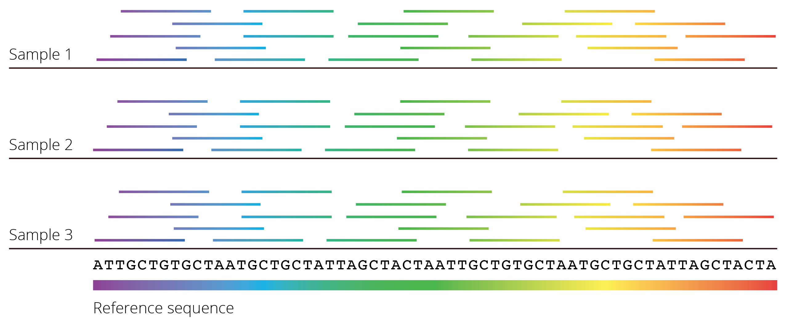

```{r message=FALSE, warning=FALSE, include=FALSE}
library(adephylo)
library(ape)
library(Biostrings)
library(msa)
library(ggplot2)
library(ggmsa)
library(ggrepel)
library(ggtree)
library(kableExtra)
library(seqmagick)
library(seqinr)
library(RColorBrewer)
```

# Evolution of DNA Sequences

So far, we have explored evolutionary principles primarily through classical genetics. We have abstracted DNA sequence variation as alleles at loci, which is a powerful approach for studying evolution. DNA, however, is famously composed of four letter-coded nucleotides---A (adenine), T (thymine), G (guanine), and C (cytosine)---and we can learn a great deal by studying DNA sequences directly.

At the advent of molecular genetics, DNA sequence variation had to be inferred indirectly by studying variation in proteins. Evolutionary biologists relied on allozymes---variant forms of an enzyme derived from different alleles---which exhibit differences in their structure. Allozymes for a particular locus can be detected using gel electrophoresis, because different structural variants move through an electric field at different speeds and thus separate on a gel (Figure \@ref(fig:allozyme)). Because not all mutations necessarily lead to detectable structural changes at the protein level, much genetic variation was lost in translation by focusing on proteins. Even so, the analyses of allozymes revealed an extraordinary amount of genetic variation; much more, in fact, than anticipated by theoreticians.

```{r allozyme, echo=FALSE, out.width='100%', fig.cap = "Example of a gel used to separate different allozymes encoded by the same locus. Each column represents an indidivudal sample. Bands that align horizontally correspond to the same allozyme (allele), and this particular locus exhibits four distinct allozymes. Note that heterozygous individuals exhibit two bands (samples 1-3, 7, 9, and 14)."}
knitr::include_graphics('images/allozyme.jpg')
```

We have been able to quantify genetic variation directly for several decades, first through [restriction fragment length polymorphism (RFLP)](https://en.wikipedia.org/wiki/Restriction_fragment_length_polymorphism) and [Sanger sequencing](https://en.wikipedia.org/wiki/Sanger_sequencing)---which were relatively slow---and now through a variety of next-generation, high-throughput sequencing methods that allow the sequencing of whole genomes in a matter of hours. In this chapter, we will focus on what we can uncover about historical processes through analyzing organisms' DNA. We will also explore the molecular signatures of evolution, what they reveal about the different forces shaping DNA sequence changes across generations, and the culprits behind the large amount of genetic variation present in natural populations.

## DNA Alignment and Genome Assembly

The output of any DNA-sequencing method is the actual order of As, Ts, Gs, and Cs of the DNA in a particular sample. Some sequencing methods, like Sanger sequencing, target very specific regions of the genome (typically a gene of interest). Resulting sequences can then be directly aligned for analysis. Sequence alignment arranges DNA fragments by similarity, matching up homologous nucleotides across samples. Aligned sequences are arranged in a matrix, where sequences from different samples are organized in rows and homologous nucleotides in columns (Figure \@ref(fig:alignment)). Once aligned, DNA sequences can be used to quantify similarities among different samples, or to identify single nucleotide polymorphisms (SNPs) that underlie many population genetic analyses.

```{r alignment, echo=FALSE, fig.height=3.5, fig.width=8, message=FALSE, warning=FALSE, fig.cap="An example of a nucleotide alignment, where sequences from different samples are organized in rows and homologous nucleotides are organized in columns. Visual inspection of the alignment reveals regions that are relatively conserved across samples (*e.g.*, positions 18-25) as well as highly variable regions (*e.g.*, poistions 42-50)."}
nt_sequences <- system.file("extdata", "LeaderRepeat_All.fa", package = "ggmsa")
ggmsa::ggmsa(nt_sequences, 1, 56, color = "Chemistry_NT", font = "DroidSansMono", char_width = 0.5, seq_name = T )
```

Many next-generation sequencing methods operate differently from Sanger sequencing in that they yield relatively short reads (a few hundred base pairs) from random segments of the genome. Millions---even billions---of reads are generated in every sequencing run. But before any meaningful comparisons can be made across samples, individual reads need to be aligned and merged to reconstruct the original DNA sequence. To do so, reads can be aligned to a known reference sequence (*e.g.*, an assembled reference genome) that facilitates the identification of homologous sequences (Figure \@ref(fig:assembly)). In absence of a reference and provided enough reads are available, overlap between individual reads can also be used to infer the original sequence, just like the contour of puzzle pieces provide clues for what pieces fit together. Once individual fragments are aligned, the consensus sequence across all reads can be inferred for a given sample, and sequences of different samples can then be aligned as described above.

```{r assembly, echo=FALSE, out.width='100%', fig.cap = "Most next-generation sequencing methods yield many short fragments of DNA sequences that were randomly amplified throughout the genome. To reconstruct the full DNA sequence, fragments can be mapped to a known reference sequence. If a reference is not available, overlap between individual fragments can be used to infer the DNA sequence of larger segments of the genome."}

```

Aligned DNA sequences form the base of many analyses used to infer evolutionary patterns and processes. Within species, we can use this information to quantify the degree of population differentiation, migration rates among populations, and even the demographic history of populations. Between species, we can reconstruct historical patterns of speciation and diversification as visualized by phylogenetic trees. DNA sequences also hold clues as to the role of selection and genetic drift in evolutionary change.

## Reconstructing History: Phylogenetic Trees

Phylogenetics is a branch of evolution concerned with uncovering the evolutionary relationships among organisms. Phylogenetic analyses evaluate organismal characteristics to generate hypotheses about the historical branching patterns of populations, species, and higher taxonomic groups, which are then depicted as phylogenetic trees. The tips of a phylogeny represent observable taxa (extant or extinct), and the internal nodes represent inferred common ancestors. Phylogenetic trees are the basis of modern systematics, which organizes and classifies biodiversity according to evolutionary history, and they are also critical for evolutionary analyses that involve multiple taxa (phylogenetic comparative analyses).

### Molecular Phylogenies

Phylogenies have historically been inferred by analyzing morphological character matrices using [maximum parsimony](https://en.wikipedia.org/wiki/Maximum_parsimony_(phylogenetics)) (the principle of parsimony states that the best phylogeny explains an observed character set with the fewest evolutionary changes). Today, however, the majority of phylogenetic analyses are based on DNA sequence data, because they provide a large number of informative characters. When an alignment varies among taxa, every altered base pair potentially holds useful information about relatedness, and it is much easier to assemble the large data sets needed for phylogenetic inference with DNA sequencing as opposed to the analysis of morphological or other phenotypic traits.

Generally speaking, molecular phylogenies group species based on genetic similarity, with similar species clustering closely together on a phylogenetic tree and dissimilar species being separated by longer branches. In phylogenetics, the degree of genetic similarity is often called phylogenetic distance, which is the number of nucleotide (or amino acid) differences between two species. To infer phylogenetic trees, pair-wise phylogenetic distances are first calculated among all species in a data set, yielding a phylogenetic distance matrix. The distance matrix can then be converted into a bifurcating tree with various algorithms. Note that the actual math behind these algorithms goes beyond the scope of this text, but if you are interested, you can check out the Wikipedia entries for different approaches ([neighbor-joining methods](https://en.wikipedia.org/wiki/Neighbor_joining), [UPGMA](https://en.wikipedia.org/wiki/UPGMA), and [WPGMA](https://en.wikipedia.org/wiki/WPGMA)). There are variety of software packages available to infer both the topology of phylogenetic trees and branch lengths, with [PHYLIP](https://evolution.genetics.washington.edu/phylip.html) being most commonly used.

::: {.alert .alert-block .alert-info}
<b>A Practical Example in R</b>

Simple phylogenetic trees can be inferred in R, and I want to provide a practical example of the different steps involved to illustrate the general process. This pipeline uses the R packages `Biostrings` (for importing data), `msa` (for aligning sequences), `ggmsa` (for plotting the alignment), `seqinr` (for calculating the distance matrix), and `ape` (for the generation of the tree).

First, we read in a set of nucleotide or amino acid sequences and align them for further analysis. The example here includes amino acid sequences of the hemoglobin ⍺1 gene for 17 species of vertebrates, including humans:

```{r message=FALSE, warning=FALSE}
#Read in sequences
hemoSeq <- Biostrings::readAAStringSet(system.file("examples/HemoglobinAA.fasta", package="msa"))
```

```{r results='hide', message=FALSE, warning=FALSE}
#Align sequences
hemoAln <- msa::msa(hemoSeq)
hemoAln2 <- msa::msaConvert(hemoAln, type="seqinr::alignment")
```

```{r hemealig, fig.height=3.5, fig.width=8, message=FALSE, warning=FALSE, fig.cap="Alignment of hemoglobin alpha-1 amino acid sequences from different species. Note that only positions 50-100 are shown in the example."}
#Visualize the alignment for codons positions 50-100
ggmsa::ggmsa(hemoSeq, 50, 100, color = "Clustal", font = "DroidSansMono", char_width = 0.5, seq_name = T )
```

Second, we calculate the phylogenetic distance matrix, which contains pair-wise distances between all taxa in the data set. Note that the diagonal cells of the matrix are all zero (distance to self), and the matrix is symmetrical (*i.e.*, the distance between taxon 1 and taxon 2 is the same as the distance between taxon 2 and taxon 1). As you can deduce from the table, closely related species have a low phylogenetic distance [*e.g.*, the distance between humans (*Homo sapiens*) and chimps (*Pan troglodytes*) is zero, because the amino acid sequences of their hemoglobin ⍺1 are exactly the same]. In contrast, distantly related species have larger phylogenetic distances [e.g., humans and zebrafish (*Danio rerio*)].

```{r}
#Calculate phylogenetic distance matrix
d <- seqinr::dist.alignment(hemoAln2, "identity")
```

```{r echo=FALSE}
#Subset of matrix as example
d2 <- as.dist(d, diag = TRUE, upper=TRUE)
d3 <- as.data.frame(as.matrix(round(d2,3)))
knitr::kable(d3, caption = "Phylogenetic distance matrix showing pair-wise differences in hemoglobin hemoglobin ⍺1 sequences between all samples in the data set.") %>% kable_styling(font_size = 9) %>% kable_styling("striped") %>% scroll_box(width = "100%")
options(ignore.negative.edge=TRUE)
```

Finally, we can infer a phylogenetic tree based on the phylogenetic distance matrix using a [neighbor-joining algorithm](https://en.wikipedia.org/wiki/Neighbor_joining):

```{r out.width='100%', fig.cap="Neighbor-joining tree of different vertebrates based on hemoglobin ⍺1 sequences."}
#Calculate neighbor-joining tree
hemoTree <- ape::nj(d)
#Designate an outgroup to root the tree
hemoTree<-root(hemoTree, "HBA1_Danio_rerio")
#Plot the tree
ggtree(hemoTree) + geom_tiplab() +xlim(0,0.6)
```
:::

While phylogenetic trees inferred from distance matrices are relatively simple to calculate, this approach is not without flaws. First and foremost, distance-based approaches completely ignore evolutionary processes. The key assumption underlying these analyses is that sequence similarities among taxa are caused by homology, even though such similarities can also arise through convergent evolution. In addition, distance-based approaches do not account for the fact that different evolutionary lineages may evolve at different rates, which can cause species to cluster by evolutionary speed rather then relatedness. Alternative methods---such as maximum likelihood and Bayesian inference methods---address some of these shortcomings and use explicit models of character evolution to infer phylogenetic relationships. These approaches are mathematically much more involved and beyond the scope of this text.

::: {.alert .alert-block .alert-info}
<b>Learn More: Reconstructing Phylogenies</b>

If you are interested in learning more about reconstructing phylogenies, I recommend "*Phylogenetic Inference*" by Mark Holder, Chapter 12 in the [*Princeton Guide to Evolution*](https://www.jstor.org/stable/j.ctt4cgc5m.11) that you can access for free through most university libraries. The chapter briefly introduces parsimony, likelihood-based approaches, and Bayesian inference in more detail. 
:::

### Molecular Phylogenies in Real Life

While basic approaches for inferring phylogenies are conceptually and computationally straightforward, modern phylogenetic analyses based on explicit statistical models (maximum likelihood or Bayesian) are complex and computationally intensive. This is in part because the statistical evaluation of phylogenetic trees has to consider a large number of alternative hypotheses (*i.e.*, alternative tree configurations). The number of possible phylogenetic trees grows unimaginably large for even moderately sized data sets. For a data set with *n* taxa, the total number of possible (unrooted) trees is:

```{=tex}
\begin{align} 
\prod_{i=1}^{n}(2i-5) (\#eq:37)
\end{align}
```
Thus, for just 20 taxa, there are more possible tree configurations than human cells (that is, all cells from all humans). The number of possible trees eclipses the number of atoms in the universe at just over 50 taxa (Figure \@ref(fig:numtree)).Today phylogenetic analyses routinely include hundreds and sometimes thousands of taxa in our effort to build a comprehensive tree of life; this requires extensive computational infrastructure and ever more refined algorithms.

```{r numtree, echo=FALSE, fig.cap="Number of possible tree configurations as a function of the number of taxa in a data set, as clacylated by Equation (7.1)."}
n <- 3:60
trees <- sapply(n, howmanytrees)
nt <- data.frame(n,trees)
nt$trees <- signif(nt$trees, digits=2)

library(scales)
ggplot(nt, aes(x=n, y=trees)) + geom_line()+
  geom_hline(yintercept=10e80, color="gray", linetype="dashed")+
  geom_hline(yintercept=8.3e21, color="gray", linetype="dashed")+
  scale_y_log10()+
  theme_classic()+
  annotate(geom="text", x=3, y=10e84, label="Number of atoms in the universe", color="gray", hjust = 0) +
  annotate(geom="text", x=3, y=10e25, label="Number of human cells", color="gray", hjust = 0) +
  xlab("Number of taxa")+
  ylab("Number of possible trees")

```

It is also important to note that inferred phylogenies for a set of taxa can vary depending on the data used for phylogenetic reconstruction. This is because gene trees---phylogenies that are inferred from a single locus---do not necessarily reflect the historical patterns of lineage-splitting and speciation (represented by species trees). Discrepancies between gene and species trees arise from gene duplication, horizontal gene transfer, and incomplete lineage sorting (the retention of ancestral polymorphisms across species). Hence, species trees are inferred by finding the consensus among many gene trees in an attempt to minimize the effects of outlier genes.

In summary, reconstructing phylogenetic trees is not trivial, and it is important to remember that phylogenies represent hypotheses. For many taxonomic groups, we have many alternative hypotheses about their evolutionary history; none of those hypotheses are necessarily wrong, and more data is typically needed to weigh the support for or against a particular phylogenetic tree. Conflicting phylogenetic trees can cause major controversies among systematists and evolutionary biologists. Most of these debates are held among taxonomic specialists, but others have significant implications for our broader understanding of the evolution of life on our planet. For example, sponges (Porifera) have long been considered the sister group to all other metazoans, but recent molecular phylogenetic analyses have suggested that comb jellies (Ctenophora) are in fact sister to the rest of Metazoa. The relative positioning of the two groups has major implications for our understanding of the evolution of animal body plans. The debate has been ongoing, and some Zoology textbooks---depending on the edition---have flip-flopped back and forth, presenting one or the other hypothesis depending on the most recent findings. It would probably be more accurate to present the two phylogenies as alternative hypotheses---at least until further evidence is available to settle the issue.

## The Neutral Theory

DNA sequences not only allow us to reconstruct the phylogenetic history of life, but they also allow us to make inferences about how selection and genetic drift have shaped the evolution of genomes. Selection has clearly shaped the evolution of phenotypic traits, mediating organismal adaptation to diverse environmental conditions. But as we learned in [Chapter 4](the-raw-materials-for-evolution.html), many mutations have no or a negligible impact on the expression of phenotypes, and accordingly, on individual fitness. It was Motoo Kimura, a Japanese population geneticist famous for his innovative use of mathematics to advance evolutionary theory, who first proposed that evolution at a molecular level is primarily governed by genetic drift---not by natural selection. While selection eliminates deleterious alleles, Kimura established that neutral mutations are fixed at a constant rate (1/2*N*~e~) due to chance ([Chapter 6](evolutionary-mechanisms-ii-mutation-genetic-drift-migration-and-non-random-mating.html#genetic-drift-the-random-force)). Accordingly, different species are predicted to accumulate their own sets of neutral mutations over time, and the number of mutations between two species should be proportional to the time of divergence between them.

Comparing two methods for estimating divergence time, Charles Langley and Walter Fitch put this idea to the test in 1974 by quantifying the number of nucleotide substitutions in the cytochrome c gene between different species of mammals and estimating their divergence time based on the fossil record. As predicted by Kimura's neutral theory, there is a clear correlation between the divergence time of two species and the number of substitutions in their cytochrome c gene (Figure \@ref(fig:molc)). Theory and empirical evidence consequently suggest that neutral mutations accumulate in genomes in a clock-like fashion, although the rate at which mutations accumulate varies among genomic regions. The molecular rate of evolution is highest in pseudogenes and other non-functional genomic regions, because every possible mutation is selectively neutral. The rate of molecular evolution is slowest at non-synonymous sites, because many mutations have fitness consequences and thus behave non-neutrally.

```{r molc, echo=FALSE, message=FALSE, warning=FALSE, fig.cap="The number of substitutions in the cytochrome c gene for different species pairs as a function of their divergence time. [Data](data/7_molclock.csv) from Langley and Fitch (1974)."}
mol.clock <- read.csv("data/7_molclock.csv")

ggplot(mol.clock, aes(x=time, y=substitutions, label=pair)) +
    geom_smooth(method="lm", color="gray", se=FALSE)+
    geom_point()+
    xlab("Time (in millions of years)") +
    ylab("Number of substitutions")+
    theme_classic()+
    geom_text_repel(min.segment.length = 0, point.padding=5, segment.curvature = -1e-20) 
```

### Molecular Clocks

Because mutations accumulate at roughly constant rates, we can infer the timing of evolutionary events by quantifying the number of nucleotide substitutions. This approach to dating evolutionary events is also know as the "molecular clock". Before applying a molecular clock in practice, fixation rates must be aligned to actual time (in generations or years) and account for potential effects of population size, which determines the likelihood of fixation for a neutral allele (1/2*N*). Regions of the genome with slow substitution rates are typically used to date events in deep time and calibrated by linking patterns of nucleotide substitutions to evolutionary events observed in the fossil record. This is particularly useful to time branching points in phylogenetic hypotheses, leading to time-calibrated phylogenetic trees. In contrast, regions of the genome with rapid substitution rates are used to estimate the timing of more recent evolutionary events. In some instances, fast molecular clocks can be calibrated based on repeated sampling of genotypes within a population.

An example of molecular clock application is the investigation into the evolutionary origins of HIV (human immunodeficiency virus). AIDS---the disease associated with an HIV infection---was first described in a clinical setting in the early 1980s and then spread rapidly through the human populations, at first regionally (e.g., portions of Africa, Haiti, and New York) and soon worldwide. Early evolutionary studies showed that HIV arose as a zoonotic disease, when SIV (simian immunodeficiency virus) was transmitted from chimpanzees to humans in western Africa, likely as a consequence of bushmeat consumption. However, the timing of the zoonotic transmission was unclear. Was this a disease that had been circulating in human populations unrecognized for some time, or was it a recent transmission across species boundaries? To get at this question, Korber et al. (2000) sequenced a large number of HIV samples that were collected between 1983 and 1997. They estimated the rate of HIV evolution based on sequence variation in their samples and the age of the virus isolates. Extrapolating that evolutionary rate indicated that the common ancestor of HIV strains present in their sample likely dated back to the 1930s (Figure \@ref(fig:hiv)) and had been transmitted within the human population for several decades. The subsequent discovery of HIV in a tissue sample collected from the Democratic Republic of Congo in 1959 allowed for an independent test of that molecular clock. Analyzing the DNA sequence of the new isolate and plotting it along the other data indicated a genetic similarity consistent with the inferred molecular clock (Rambaut et al. 2004); in fact, the historical sample landed almost perfectly on the extrapolation line (red sample in Figure \@ref(fig:hiv)).

```{r hiv, echo=FALSE, message=FALSE, warning=FALSE, fig.cap="The application of a molecular clock used to date the orgin of HIV-1 group M (the principal pandemic group). Based on DNA sequence variation in isolates collected between 1983 and 1997, the shared common ancestor of HIV likely existed in the 1930s. The red dot represents the earliest known HIV sample, which corroborates the molecular clock estimate. [Data](data/7_hiv.csv) from Korber et al. (2000)."}
hiv <- read.csv("data/7_hiv.csv")

hiv1 <- hiv[which(hiv$year > 1970),]
hiv2 <- hiv[which(hiv$year < 1970),]

ggplot(hiv1, aes(x=year, y=base.change.index)) +
    geom_smooth(method="lm", color="gray", se=FALSE, fullrange=TRUE)+
    geom_point()+
    xlab("Year") +
    ylab("Genetic distance from root (proportion")+
    xlim(1925,2000)+
    ylim(0,0.2)+
    theme_classic()+
    geom_point(data=hiv2, aes(x=year, y=base.change.index), color="red")
```

### Detecting Signatures of Selection

The neutral theory also provides a powerful null model to test for historical signatures of selection in the genome. If neutral alleles become fixed in a population at regular rates, deviations from that rate must indicate non-neutrality (*i.e.*, selection). One way to detect selection is to analyze the rate of non-synonymous (*d*~N~) to synonymous (*d*~S~) substitutions in the genome. This ratio is also known as ⍵=*d*~N~/*d*~S~. If you imagine a pseudogene, the likelihood that a non-synonymous mutation is fixed is equal to the likelihood that a synonymous substitution gets fixed, because---in a pseudogene---both types of mutations are selectively neutral. Hence, under strict neutrality, the ratio between *d*~N~ and *d*~S~ is 1. In most protein-coding genes, non-synonymous mutations can impact the structure and function of the translated protein, and these functional changes can come with fitness benefits or costs. If the non-synonymous substitution provides a fitness benefit, selection causes the mutation to spread and become fixed in a population at a higher rate than expected by chance alone (also see Figure [6.5](evolutionary-mechanisms-ii-mutation-genetic-drift-migration-and-non-random-mating.html#fig:driftsel)). Thus, *d*~N~ will be higher than *d*~S~, such that the ratio between the two rates is greater than 1. In contrast, if a non-synonymous substitution imposes a fitness cost, selection eliminates the mutation from a population, drastically reducing the likelihood of fixation (Figure [6.5](evolutionary-mechanisms-ii-mutation-genetic-drift-migration-and-non-random-mating.html#fig:driftsel)). In this case, the ratio between *d*~N~ and *d*~S~ is smaller than 1.

In practice, we can analyze rates of nucleotide substitution in individual protein-coding genes across the branches of a phylogeny. If the rate of *d*~N~/*d*~S~ is around 1, the analyzed gene evolved neutrally (Figure \@ref(fig:dnds)A). If *d*~N~/*d*~S~ is \>1, the gene was under positive (or divergent) selection, which means new variants were brought to high frequency by natural selection (Figure \@ref(fig:dnds)B). Genes under positive selection likely play an important role in adaptation. In contrast, if *d*~N~/*d*~S~ is \<1, the gene was under negative (or purifying) selection (Figure \@ref(fig:dnds)C). This represents the selective removal of deleterious alleles and can lead to conserved regions of the genome.

```{r dnds, echo=FALSE, out.width='100%', fig.cap="Neutral (gray) and non-neutral (different shades of color) mutations plotted on hypothetical phylogenies. A. Under the assumptions of the neutral theory, the rate of non-synonymous to synonynous substitutions should be equal (d<sub>N</sub>/d<sub>S</sub>=1). B. If a locus is under positive (or divergent) selection, non-synonymous mutations are expected to be driven to fixation rapidly, leading to an underrepresentation of synonymous mutations  (d<sub>N</sub>/d<sub>S</sub>>1). C. If a locus is under negative (or purifying) selection, non-synonymous mutations are expected to be eliminated rapidly, leading to an overrepresentation of synonymous mutations (d<sub>N</sub>/d<sub>S</sub><1)."}
knitr::include_graphics('images/dnds.png')
```

## Case Study: SARS-CoV-2

[This chapter's case study](exercises/BIOL520-ex6.zip) explores the application of phylogenetics and molecular evolution through the lens of SARS-CoV-2, the coronavirus behind the current COVID-19 pandemic. First, you will plot a phylogeny of coronaviruses to address questions about the evolutionary history of the virus, then you will establish a molecular clock for the virus, and finally, you will explore the distribution of genetic variation throughout the coronavirus genome to make inferences about the potential forces shaping molecular evolution. Before diving into the problems, I want to provide you with some background on host-pathogen evolution using the flu (influenza A) as an example.

### Host-Pathogen Coevolution

In 1858, French chemist Louis Pasteur was the first to recognize that contagious diseases are caused by pathogens---just a year prior to Darwin's publication of *The Origin of Species*. Pathogens, of course, represent evolvable populations that are shaped by evolutionary forces, just like all other living things. Central to understanding pathogen evolution is recognizing the conflict between pathogens and their hosts, which have diametrically opposed interests. Pathogens want to overcome a host's defense mechanisms and use its body to self-replicate and then jump to other hosts. In contrast, hosts want to avoid incurring fitness costs associated with the energetic demands of pathogens and other damage they can inflict. Hence, hosts are selected to evolve strategies that exclude and combat pathogens, while pathogens are selected to evade the hosts' defense mechanisms.

This evolutionary tit-for-tat is known as coevolution, where the adaptation of each actor (*e.g.*, a new defense strategy in a host) exerts selection on the other actor (the pathogen that now needs to overcome the new line of defense). Coevolution leads to continuous cycles of adaptation and counteradaptation, and the coevolutionary relationship between hosts and pathogens has been likened to a coevolutionary arms race. Since pathogens typically have large populations, short generation times, and high mutation rates compared to their hosts, they generally have the upper hand and lead the arms race.

::: {.alert .alert-block .alert-info}
<b>Definition: Coevolution</b>

Coevolution is the process of reciprocal evolutionary change that occurs between interacting species.
:::

The acquired immune system of vertebrates is one of the most exquisite adaptations to pathogens. It allows hosts to recognize foreign intruders to the body and generate antibodies that act specifically to combat the intruder, using both humoral and cell-mediated responses. These specific responses also create immunological memory, which leads to an enhanced response and even immunity during secondary infections of the same pathogen or pathogen strain. Hence, immune hosts are not suitable for pathogens, unless pathogens have evolved sufficiently that the host immune system does not recognize them anymore.

### The Evolution of the Seasonal Flu

Influenza A and B cause the seasonal flu in humans. The influenza A genome consists of 8 RNA strands that encode for 11 proteins. One protein of particular evolutionary interest is hemagglutinin. Hemagglutinin is expressed at the surface of the virus and involved in the initiation of an infection of a new host cell. Some parts of the protein---the antigenic sites---also represent the primary target sites that the host immune system responds to. Thus, hemagglutinin is critical for the interaction between host and pathogen. To persist in a population, influenza A needs to find a naive host whose immune system has never been exposed to the virus and therefore cannot recognize its antigenic sites. Alternatively, the virus needs to exhibit mutations at antigenic sites that are sufficiently different from the antigenic sites of previous infections to overcome the host's immunity. This raises interesting questions about the evolution of the hemagglutinin gene through time.

The sequencing of influenza A strains over almost 20 years revealed a steady accumulation of nucleotide substitutions in the hemagglutinin gene (Figure \@ref(fig:flu)). Older strains of the flu consistently disappear, while new strains emerge through mutation and spread. Over time, this leads to flu variants that are substantially different from the original sample. This finding is consistent with the neutral theory; mutations are accumulating through time in a clock-wise fashion. The question is, however, what allowed the persisting strains to endure when others went extinct? It turns out that persisting lineages exhibit a disproportionate amount of mutations at antigenic sites compared to the most prevalent strains present at any given time. In other words, rare strains that are most dissimilar at sites recognized by the host immune system are the most successful at infecting new hosts and spreading in a population. Until, of course, they become common, and another dissimilar variant starts to have the same selective advantage (this is negative frequency-dependent selection in action). The consequence is that the accumulation of mutations is not equal throughout the gene, and there is clear evidence for positive selection on 18 codons that all lie within the antigenic sites of hemagglutinin. So while nucleotide substitutions accumulate steadily through time, non-synonymous substitution accumulate disproportionately (*i.e.*, ⍵\>1) where is really matters: the attack sites of the host immune system. These results show how the host immune system can drive pathogen evolution, and these general evolutionary principles are used to predict the dominant variants of the seasonal flu every year, which is used to produce flu vaccines well before flu season actually starts.

```{r flu, echo=FALSE, message=FALSE, warning=FALSE, fig.cap="Accumulation of nucleotide substitutions in the hemagglutinin gene of the influenza A virus from 1968-1987. This time period is equivalent to about 20 million years of mammalian evolution. [Data](data/7_influenza.csv) from Fitch et al. (1991)."}
flu <- read.csv("data/7_influenza.csv")

ggplot(flu, aes(x=year, y=divergence)) +
  geom_smooth(method="lm", se=FALSE, color="gray")+
  geom_point()+
  xlab("Year")+
  ylab("Nucleotide substitutions in hemagglutinin gene")+
  theme_classic()
```

### High-Virulence Flu Strains

Besides the seasonal flu, which ravages across the planet in annual cycles, there are also high-virulence flu strains that emerge periodically. High-virulence flu strains induce high mortality and---in some instances--- have spread rapidly in human populations, causing pandemics. Among the most well-known high-virulence flu strains were the Spanish flu (1918 influenza pandemic) and the 2009 swine flu, which were both caused by the H1N1 influenza A virus. In addition, smaller high-virulence flu outbreaks associated with bird and swine flus have been documented repeatedly over the past decades. High-virulence flu strains can induce high mortality because they have vastly different antigenic sites compared to the seasonal flu, making it much harder for our immune system to recognize and combat the virus.

Where do these radically different antigenic sites come from? Humans are not the only organisms that can contract the influenza A viruses; they also infect other vertebrates (especially other mammals and birds). Due to long coevolutionary histories, different host groups exhibit different flu strains, with reciprocal adaptations in the hosts and pathogens. However, cross-infections can occur, especially when humans work in close contact with animals (*e.g.*, on pig or poultry farms). In most instances, cases of cross-infection are evolutionary dead ends because the viruses---poorly adapted to the novel host---cannot be transmitted from human to human. However, if a cross-infection occurs in a host that is already infected with a human influenza A strain, genetic segments from the different strains can mix to produce a novel third strain. This process is called viral reassortment, and the resulting strain can inherit the capability to transmit from human to human, while simultaneously exhibiting drastically different surface proteins that cause severe courses of disease.

## Practical Skills: Working with Phylogenetic Trees

The exercise associated with this chapter will primarily focus on visualizing phylogenetic trees and associated metadata and interpreting data from molecular evolution analyses. To do so, you will use some new R functions from packages you have not previously used. Note that you will not have to write the more complex code associated with this exercise from scratch; some information in this section just provides additional context if you want to dig deeper.

### Installing Dependencies

To work through this week's exercise, you will need to install four new R packages. Three of these packages (`ape`, `dplyr`, `phytools`, and `tidyr`) are available through [CRAN](https://cran.r-project.org/) (the network providing R) and can be installed the same way as previous packages (*i.e.*, use the `install.packages()` function or click Tools\>Install Packages...).

``` ruby
install.packages("ape")
install.packages("dplyr")
install.packages("phytools")
install.packages("tidyr")
```

The fourth package (`ggtree`) is not available from CRAN and needs to be retrieved from a different repository, called [Bioconductor](https://bioconductor.org/). Bioconductor is specialized in providing tools for the analysis of a wide variety of high-throughput biological data (including phylogenetics, genomics, and transcriptomics). To install packages from Bioconductor, you first need to install an auxiliary package (`BiocManager`). Once installed, Bioconductor packages can be installed using the `BiocManager::install()` function. So, to install `ggtree`, you will have to execute the following code.

``` ruby
install.packages("BiocManager")
BiocManager::install("ggtree")
```

After installation, make sure to either delete the installation code or silence the code with hashtags to avoid problems with knitting the document to an \*.html file.

::: {.alert .alert-block .alert-warning}
{width="20"} **Important Note**

If you are having trouble installing `ggtree`, please make sure that your computer fulfills the system requirements. Some Bioconductor packages are notorious for not playing well with Google Chromebooks, outdated versions of Mac OS, and some antivirus programs on PCs.
:::

### The Pipe Operator

In this exercise, you will see the use of the so-called pipe operator, `%>%`, which is part of the `dplyr` package. The pipe operator is used to pass the results of the function on the left hand side as an argument to the function on the right hand side. It allows us to skip the definition of intermediate variables and chain together multiple functions in a series. The pipe operator is widely used to simplify code, both in terms of readability and execution.

To give you a practical example: the way we have used R before, it takes four lines of code to define a vector (`a`), take its square-root (`b`), calculate the mean of the square-root transformed vector (`c`), and then display the result:

```{r}
a <- seq(0,10, by=1)
b <- sqrt(a)
c <- mean(b)
print(c)
```

Using the pipe operator, we can link together the four functions directly into a pipeline to obtain the same result:

```{r}
seq(0,10, by=1) %>% sqrt() %>% mean() %>% print()
```

You are not required to use the pipe operator in your coding. However, some of the pre-written code in this week's exercise makes use of this function.

### Importing a Tree

Phylogenetic trees are encoded in a variety of file formats that can all be imported into R. We will be working with trees in the [Newick format](https://en.wikipedia.org/wiki/Newick_format) (\*.nwk), which is commonly used in many phylogenetics applications. To import a \*.nwk-file, you can use the `read.tree()` function from the `ape` package. The example used here is based on a sample tree you can download [here](data/7_test_tree.nwk) (and yes... this is a phylogeny of all the fish species in my fish room🤓).

```{r}
#Import a phylogenetic tree in the Newick format
test.tree <- phytools::read.newick("data/7_test_tree.nwk")
```

As always when you import data into R, successfully executing this code should generate an object called "test.tree" in your work space (top right panel in RStudio).

### Plotting a Tree

To plot phylogenetic trees, we will use the `ggtree()` function of the `ggtree` package, because it is based on the `ggplot2` functionalities that you are already familiar with. Note that other R packages (`ape`, `phytools`) also allow for the visualization of phylogenetic trees, although we will not be using those.

To plot a tree, you can simply execute the `ggtree()` function using the imported tree object as an argument. Note that a number of additional arguments allow for the modification of the base plot, which you can explore [here](https://yulab-smu.top/treedata-book/chapter4.html) if you are interested.

```{r fig.height=6, fig.width=6}
tree <- ggtree(test.tree)
tree
```

### Annotating a Tree

The structure of a tree alone is rarely sufficient to address evolutionary hypotheses; it is the annotation of trees with additional information that makes them useful.

#### Tip Labels {.unnumbered}

Tip labels can be added to a tree using the `geom_tiplab()` function. Note that depending on the length of labels, the canvas of the plot has to be adjusted with `xlim()`.

```{r fig.height=6, fig.width=8}
tree + 
  geom_tiplab() + #Add tip labels
  xlim(NA,500) #Make some extra space so tip labels are not cut off
```

#### Working with Metadata {.unnumbered}

Metadata is a set of data that gives additional information about other data. For phylogenies, metadata typically provides additional information about the taxa in a tree. Note that each metadataset needs to have a column called `label`, in which individual entries match the tip labels in the phylogenetic tree.

The [metadata for the example](data/7_metadata.csv) tree used here can be imported using the `read.csv()` function that you are already familiar with. As you can see below, it provides information about the geographic distribution and dietary habits of each species in the phylogeny.

```{r}
meta.data <- read.csv("data/7_metadata.csv")
head(meta.data)
```

We can now use a version of the pipe operator called left-join (`%<+%`) to annotate the base tree generated above with information from the metadata. To do so, we add the base tree on the left side of the operator and the metadata with the additional geoms on the right side of the operator. For example, we can replace the original tip labels to display the dietary habit of each species instead:

```{r fig.height=6, fig.width=8}
tree  %<+% meta.data + geom_tiplab(aes(label=diet), offset=0) + ggtree::xlim(NA,500)
```

Alternatively, we can plot the original tip labels in addition to the dietary habits. In this case, the `offset` argument is required to make sure labels are not printed on to of each other:

```{r fig.height=6, fig.width=8}
tree  %<+% meta.data + geom_tiplab() + geom_tiplab(aes(label=diet), offset=240) + ggtree::xlim(NA,750)
```

Finally, we can also color code the tips of the phylogeny based on an input variable using `geom_tippoint()`:

```{r fig.height=6, fig.width=8}
tree  %<+% meta.data + geom_tiplab(offset=20) + geom_tiplab(aes(label=diet), offset=370) + ggtree::xlim(NA,900) + geom_tippoint(aes(color=origin), na.rm = TRUE)
```

If you are interested in learning more about phylogenetic tree annotation using `ggtree`, I recommend Part II in Guangchuang Yu's book "[Data Integration, Manipulation and Visualization of Phylogenetic Trees](https://yulab-smu.top/treedata-book/index.html)".

### Calculating the Distance to Root

To establish a molecular clock for samples collected across a range of time, we need to enumerate the number of nucleotide substitutions for a given sample, relative to the common ancestor of all samples in the data set. Naturally, that common ancestor itself may not actually be in the data set; in fact, there is no expectation that it would be. However, phylogenetics allows us to side-step that problem, because phylogenies infer the pattern of shared ancestry across all samples in the data set, with the common ancestor of all samples representing the root of the tree. In a tree where branch lengths are proportional to the genetic similarity between nodes, we can consequently calculate the distance between the root and any given tip as a metric of genetic divergence. This can be accomplished by the `distRoot()` function from the `adephylo` package. Note that this function requires some significant computational time, especially for larger phylogenies. Rather than having you to run this in the exercise, we are simply providing you with the output of the `distRoot()` function that you can import as a \*.csv file.

## Reflection Questions

1.  Can you describe how Kimura's theory of neutral evolution is different from the theory of evolution by natural selection? How are they the same? Are the two perspectives compatible or do they represent alternative hypotheses to describe the evolutionary process?
2.  What are the differences and similarities between a gene tree and a species tree?
3.  What confounding variables need to be accounted for when applying a molecular clock to date a phylogeny?

## References

-   Fitch WM, JM Leiter, XQ Li, P Palese (1991). [Positive Darwinian evolution in human influenza A viruses](https://www.pnas.org/content/88/10/4270). *Proceedings of the National Academy of Sciences USA* 88, 4270--4274.
-   Korber B, M Muldoon,J Theiler, F Gao, R Gupta, A Lapedes ... T Bhattacharya (2000). [Timing the ancestor of the HIV-1 pandemic strains](https://science.sciencemag.org/content/288/5472/1789). *Science* 288, 1789--1796.
-   Langley CH, WM Fitch (1974). [An examination of the constancy of the rate of molecular evolution](https://link.springer.com/article/10.1007/BF01797451). *Journal of Molecular Evolution* 3, 161--177.
-   Rambaut A, D Posada, KA Crandall, EC Holmes (2004). [The causes and consequences of HIV evolution](https://www.nature.com/articles/nrg1246). *Nature Reviews Genetics* 5, 52--61.
