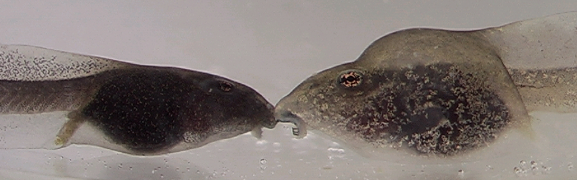
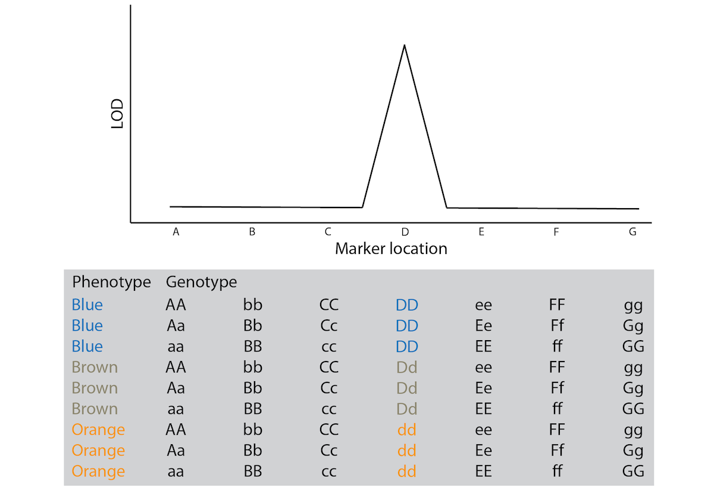
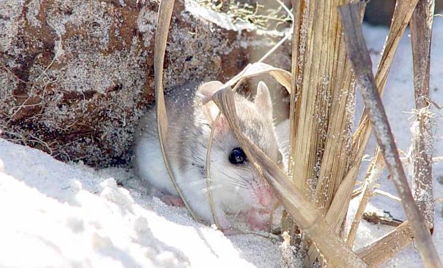

---
output:
  html_document: default
  pdf_document: default
---

# The Evolution of Quantitative Traits

So far, our evolutionary analyses have assumed that variation at one locus translates to variation in one trait. This, in turn, causes environmentally-dependent variation in fitness. As discussed in [Chapter 4](the-raw-materials-for-evolution.html#the-genotype-phenotype-gap), however, the relationships between genotype, phenotype, and fitness are much more complex. Single genes can affect the expression of multiple, apparently unrelated phenotypic traits (pleiotropy), which can impose evolutionary trade-offs, because different traits cannot be optimized independently. Similarly, the expression of a single trait can be controlled by multiple loci. This chapter explores basic quantitative genetic approaches used to study the evolution of complex traits controlled by multiple genes.

## Qualitative Traits and Epistasis

Qualitative traits have alternative phenotypes that fit into discrete categories. The spotted vs. melanistic forms of leopards, the round vs. wrinkled skin in peas, and the ABO blood groups in humans are all examples of qualitative traits. Many qualitative traits are controlled by variation at a single locus, but multiple loci can be involved when there are epistatic interactions. Epistasis describes the phenomenon where the effect of a gene is dependent on the effect of one or more modifier genes. For example, coat color variation in many mammals (including yellow, chocolate, and black Labrador retrievers) is dependent on both the ability of an individual to produce a particular color pigment (controlled by the *B* locus in Figure \@ref(fig:epistasis)) and the ability of an individual to deposit pigments in relevant tissues (controlled by the *A* locus). Variation at the *B* locus that determines brown vs. black phenotype has no effect on coat color unless an individual also inherits the ability to deposit pigment; otherwise the coat color is just white. Epistatic interactions can profoundly impact evolutionary dynamics at single loci and cause deviations from the predictions of the simple inhertance models that we have used so far.

```{r epistasis, echo=FALSE, out.width='100%', fig.cap = "Example of epistasis in coat color genetics: If no pigments can be deposited, the other coat color genes have no effect on color expression, no matter if they would be dominant or recessive, and no matter if the individual is homozygous."}
knitr::include_graphics('images/epistasis.png')
```

## Quantitative Traits: a Product of Genes and Environment

Quantitative traits vary continuously among individuals---for example, body size, thermal tolerance, and skin coloration in humans. The expression of quantitative traits depends on the cumulative action of many genes, which is why they are also referred to as polygenic traits. Quantitative traits are normally distributed within a population; most individuals exhibit an intermediate phenotype, and individuals with extreme trait values are more rare.

The normal distribution of quantitative traits is caused by the joint action of many genes with additive genetic effects. The continuous variation can be revealed using a simple F2-crossing experiment that is frequently used in quantitative genetics analyses (see QTL mapping below). If we cross two individuals from either extreme of a distribution (*i.e.*, the shortest and the tallest, the lightest and the darkest, or the slowest and the fastest), the resulting F1 offspring should be phenotypically homogenous and intermediate to their parents, because the F1 individuals will be heterozygous at all loci involved in the expression of the quantitative trait. If we then cross two F1 individuals to produce an F2 generation, we not only recover the extremes of the distribution (*i.e.*, the parental phenotypes), but the entire spectrum of phenotypic variants in between. The gradation of intermediate phenotypes is dependent on the number of loci controlling a quantitative trait. If a trait is controlled by a single locus with additive alleles, there are three phenotypic categories (*e.g.*, short, medium, and tall; Figure @ref(fig:qualquan), left panel). If two loci are involved, trait expression is the sum of the effects of all individual alleles across both loci. In other words, how tall an individual grows is simply a function of the number of "tall" alleles it inherits across all loci. An intermediate size can be achieved by having two "tall" alleles at one locus (*AAbb* or *aaBB*) or one "tall" allele at each of the loci (*AaBb*). As a consequence, there are more offspring of intermediate size than small or large ones (Figure @ref(fig:qualquan), central panel). The more genes are involved in the expression of a particular phenotype, the narrower phenotypic categories become, and the more continuously distributed a trait is (Figure @ref(fig:qualquan), right panel).

```{r include=FALSE}
library(ggplot2)
library(dplyr)
library(tidyr)
library(ggpubr)
library(OneR)
library(qtl)
library(kableExtra)
library(RColorBrewer)
```

```{r qualquan, echo=FALSE, message=FALSE, warning=FALSE, fig.height=8/2.7, fig.width=8, fig.cap="Phenotypes in F2 crosses are normally distributed if all alleles have additive effects. These three graphs show how the number of phenotypic categories increases as a function of the number genes involved in the expression of a particular trait."}
qualquan <- read.csv("data/8_qual_quant.csv")

qualquan$model <- factor(qualquan$model, levels = c("One locus", "Two loci", "Six loci"))

ggplot(qualquan, aes(x=genotype, y=freq))+
    geom_col()+
    theme_classic()+
    facet_wrap(~ model, scales = "free")+
    xlab("Number of 'tall' alleles") +
    ylab("Frequency")
```

The expression of quantitative traits can also be affected by the environment an individual finds itself in. The ability of a genotype tp produce multiple phenotypes depending on the environment is called phenotypic plasticity. In some species, phenotypic traits show phenomenal malleability in response to specific environmental cues that shape organismal development. For example, some anuran tadpoles develop alternative morphological traits depending on their exposure to predator cues early in development (Figure \@ref(fig:rana)). Therefore, population differences in phenotypic traits are not always a consequence of evolutionary divergence and adaptation. Rather, individuals in different populations may express different traits simply due to different environmental exposure. For example, the Alpine plant *Arabis alpina* is distributed across a broad elevational gradient, ranging from 800 to 3,000+ meters above sea level. Individuals from high elevation populations tend to be smaller and produce less fruit. However, common garden experiments---where families were split and raised at different elevations---revealed that population differences in most traits were largely due to phenotypic plasticity (Figure \@ref(fig:plastarabis); de Villemereuil et al. 2018). Hence, the expression of quantitative traits can be more dependent on the environmental context than the genetic information inherited from the parents.

::: {.alert .alert-block .alert-info}
<b>Definition: Phenotypic Plasticity</b>

Phenotypic plasticity is the ability of a genotype to express different phenotypes. It can result in organisms changing their traits in response to stimuli or input from the environment.
:::

```{r rana, echo=FALSE, out.width='100%', fig.cap = "Phenotypic plasticity in *Rana pirica* tadpoles when under predation from salamander larvae: normal (left) and defended (right) morphs. Mori et al. (2009), [CC BY 3.0](https://creativecommons.org/licenses/by/3.0), via Wikimedia Commons."}

```

```{r plastarabis, echo=FALSE, message=FALSE, warning=FALSE, fig.height=8/2.7, fig.width=8, fig.cap="Phenotypic plasticity in *Arabis alpina*. The graph shows mean trait values for different populations (in different colors) that were either grown at low or high elevation. Each population was composed of multiple families that were represented at both locations. Differences between locations are more pronounced than differences among populations, indicating the influence of environmentally-dependent phenotypic plasticity. [Data](data/8_plasticity.csv) from de Villemereuil et al. (2018)."}
plast <- read.csv("data/8_plasticity.csv", na.strings=c("","NA"))
plast$tfl <- as.numeric(as.character(plast$tfl, na.rm = TRUE))
plast.mean <- aggregate(cbind(tfl, area, h.base) ~ Plot + Population, data = plast, mean, na.rm = TRUE)
plast.mean <- gather(plast.mean, "Trait", "Value", 3:5)
plast.mean$Plot <- factor(plast.mean$Plot, levels=c("Low elevation", "High elevation"))

plast.mean$Trait[plast.mean$Trait == "area"] = "Surface area [mm2]"
plast.mean$Trait[plast.mean$Trait == "h.base"] = "Basal height [mm]"
plast.mean$Trait[plast.mean$Trait == "tfl"] = "Total fruit length [mm]"

ggplot(plast.mean, aes(x=Plot, y=Value, color=Population, group=Population)) +
    geom_point()+
    geom_line()+
    theme_classic()+
    xlab("Common garden location")+
    ylab("Trait value")+
    facet_wrap(~ Trait, scales = "free") +
    theme(legend.position = "none")+
    scale_color_brewer(palette = "Set2")
```

The evolutionary analysis of quantitative traits has two complications: (1) Since many genes are involved in the expression of quantitative traits, it is not usually practical to follow changes in allele frequencies at relevant loci. Even worse, due to the large number of loci that often have small individual effects, even the identification of genes contributing to the expression of quantitative traits can be challenging. (2) We must be able to account for the potential effects of environmental variation on individual trait expression. Trait heritability is a key requirement for evolution by natural selection, but expressed traits may not be heritable if they were shaped by environmental effects. In the following section, we will explore two general approaches used to study the evolution of quantitative traits. One approach is agnostic about the genetic basis of quantitative traits but focuses on predicting the effects of selection on them. The other approach allows for the identification of the genetic basis of quantitative traits involved in adaptation.

## Quantitative Trait Evolution

A key complication in the analysis of quantitative traits is the difficulty of identifying the genes involved in phenotypic expression. However, we can conduct meaningful analyses of quantitative trait evolution without diving into the details of the underlying genetics. We can predict the evolutionary response of a quantitative trait as a function of its heritability and the strength of selection. In this section, we will discuss how to quantify trait heritability and the strength of selection, and then how to apply the breeder's equation to predict evolutionary change.

### Quantifying Trait Heritability

Generally, heritability measures the degree to which variation in a phenotypic trait in a population is due to genetic variation among individuals, rather than non-heritable factors like phenotypic plasticity. Specifically, broad sense heritability is defined as:

```{=tex}
\begin{align} 
\frac{V_G}{V_P} (\#eq:38)
\end{align}
```
where *V*~G~ is genetic variation and *V*~P~ is phenotypic variation. Since phenotypic variation among individuals is a consequence of genetic and environmental variation (*V*~E~), broad sense heritability can also be defined as:

```{=tex}
\begin{align} 
\frac{V_G}{V_G+V_E} (\#eq:39)
\end{align}
```
Broad-sense heritability describes the degree of genetic determination in the variation of a trait, and it can range from 0 (no genetic effects) to 1 (no environmental effects). It is important to note that measures of heritability are a population-level metric. We cannot disentangle the degree to which genes and environmental influences have shaped trait expression in a particular individual. Rather, we have to consider populations of individuals to determine what proportion of variation is shaped by genetic variation and what proportion is shaped by environmental variation.

As you learned in [Chapter 3](a-mechanism-for-change.html#heritability), heritability can be estimated by the slope of a regression between parental and offspring traits. If the slope of that regression is close to zero, parental trait expression is a poor predictor of offspring trait expression; hence, variation in the trait is primarily due to environmental and not genetic variation (Figure \@ref(fig:herito)A). If, on the other hand, the slope of the parent-offspring regression is close to 1, the parental trait strongly predicts offspring trait expression, and variation in the traits is primarily driven by genetic variation (Figure \@ref(fig:herito)C). Slopes between 0 and 1 describe the relative contribution of genetic and environmental variation to phenotypic variation in a population (Figure \@ref(fig:herito)B).

```{r herito, echo=FALSE, fig.height=8/2.7, fig.width=8, message=FALSE, warning=FALSE, fig.cap="Parent-offspring regressions reveal the degree of heritability in quantitative traits. A slope of zero indicates no heritability; a slope of 1 indicates perfect heritability. Slopes in between those values describe the relative contributions of genetic and environmental variation on phenotypic variation."}
x <- runif(100, 18, 40)
y1 <- x*rnorm(100, mean = 0, sd = 0.1)+26
y2 <- x*rnorm(100, mean = 0.5, sd = 0.1)+13
y3 <- x*rnorm(100, mean = 1, sd = 0.1)

trait.cor <- as.data.frame(cbind(x, y1, y2, y3))
trait.cor2 <- gather(trait.cor, "slope", "y", 2:4)

trait.cor2$slope[trait.cor2$slope == "y1"] = "h\u00b2 \u2248 0"
trait.cor2$slope[trait.cor2$slope == "y2"] = "h\u00b2 \u2248 0.5"
trait.cor2$slope[trait.cor2$slope == "y3"] = "h\u00b2 \u2248 1"

ggplot(trait.cor2, aes(x=x, y=y)) +
    geom_smooth(method="lm", se=FALSE) +
    geom_point()+
    theme_classic()+
    facet_wrap(~ slope) +
    xlab("Mean parent trait") +
    ylab("Mean offspring trait")
```

It is important to note that estimating heritability through parent-offspring regression represents narrow-sense heritability (*h*^2^), not broad-sense heritability . Broad- and narrow-sense heritability consider different aspects of genetic variation. Genetic variation (*V*~G~) is a composite of additive genetic variation (*V*~A~) and genetic variation caused by gene interactions, such as dominance (*V*~D~) and epistasis (*V*~I~). The slope of a parent-offspring correlation specifically quantifies the contribution of additive genetic variation to the observed phenotypic variation, such that narrow sense heritability is defined as:

```{=tex}
\begin{align} 
h^2 = \frac{V_A}{V_P}=\frac{V_A}{V_A+V_D+V_I+V_E} (\#eq:40)
\end{align}
```
Hence, narrow-sense heritability only considers the additive portion of adaptive variation; genetic variation associated with dominance and epistasis are ignored. This is useful because the phenotypic response to selection on a quantitative trait depends on *V*~A~ and not *V*~D~. In addition, non-additive genetic effects are comparatively rare, and *V*~A~ is much larger than *V*~D~ and *V*~I~ for most quantitative traits (Hill et al. 2008).

### Quantifying the Strength of Selection

The second step in quantitative genetic analyses is to infer the strength of selection on a focal trait, which can be measured as either the selection differential (*S*) or the selection gradient (*m*). The selection differential is the difference between the mean trait value of the selected (successful) individuals (*T*\*) and the mean trait value of all individuals in a population (*T*'). Imagine a population of individuals that vary in a particular trait, as described in Figure \@ref(fig:seldiffgrad)A. Some individuals survive to adulthood and reproduce (depicted in green), some perish early and have no reproductive success (depicted in red). The difference between the average trait value of the successful individuals and the average of all individuals is the selection differential. Note that if more individuals with smaller trait values were successful, the selection differential would shrink. If only individuals with smaller trait values were successful, the selection differential would become negative. Also note that the unit of the selection differential for a particular trait is the same as the unit used to quantify variation in that trait.

The second measure of the strength of selection on quantitative traits---the selection gradient---is more complicated, but has broader applicability, especially when fitness is measured quantitatively rather than qualitatively. The first step is to convert measurements of absolute fitness to measures of relative fitness. This can be accomplished by dividing every individual's absolute fitness by the average fitness of the population. Using the same example as in Figure \@ref(fig:seldiffgrad), we had 27 successful individuals (fitness of 1) and 73 unsuccessful individuals (fitness of zero). Hence, the average fitness in the population is 0.27 [27/(27+73)], which means that the relative fitness of successful individuals is \~3.7 (1/0.27). The relative fitness of unsuccessful individuals is of course still 0 (0/0.27). We can now plot relative fitness as a function of individual trait values. The selection gradient is the slope of the regression line between trait value and relative fitness (Figure \@ref(fig:seldiffgrad)B).

While the selection differential and the selection gradient may seem unrelated to each other, the two measures can actually be converted:

```{=tex}
\begin{align} 
m=\frac{S}{var(T)} \iff S=m*var(T) (\#eq:41)
\end{align}
```
whereas *var(T)* is the variance in the trait under consideration. In practice, if the strength of selection in quantitative genetic analyses is quantified using the selection gradient, it has to be converted to the selection differential, because the response to selection is proportional to *S*.

```{r seldiffgrad, echo=FALSE, message=FALSE, warning=FALSE, fig.height=4, fig.width=8,, fig.cap="A. Graphical representation of the selection differential (*S*), which is the difference between the selected individuals (*T**) and all individuals in the population (*T'*). The gray triangle represents the average trait value of all individuals, and the green triangle the average of all the successful individuals. The distance between the two is the selection differential. B. Graphical representation of the selection gradient (*m*). The selection gradient is the slope of the best-fit line between individual trait values and relative fitness."}
set.seed(85)

selection <- as.data.frame(rnorm(100, 30, 5))
names(selection)[1] <- "trait"
selection$fitness <- ifelse(selection$trait < 31, 0,1)
selection$fitness2 <- ifelse(selection$fitness ==1, "Successful", "Not successful")

selection.mean <- aggregate(trait ~ fitness, data = selection, mean, na.rm = TRUE)
mean.overall <- mean(selection$trait)
mean.successful <- selection.mean$trait[2]

fitnessplot1 <- ggplot(selection, aes(x=trait, fill=fitness2)) +
    geom_histogram() +
    geom_segment(aes(x=mean.overall, y=10, xend=mean.successful, yend=10))+
    geom_point(aes(x=mean.overall, y=10), fill="gray", shape=25, size=3)+
    geom_point(aes(x=mean.successful, y=10), fill="#fc8d62", shape=25, size=3)+
    annotate(geom="text", x=(mean.overall+mean.successful)/2, y=10.5, label="Selection differential (S)")+
    xlab("Trait value") +
    ylab("Frequency")+
    theme_classic() +
    theme(legend.position = "none")+
    annotate(geom="text", x=mean.overall, y=10-0.7, label="T'")+
    annotate(geom="text", x=mean.successful, y=10-0.7, label="T*")+
    scale_fill_brewer(palette = "Set2")

mean.fitness <- mean(selection$fitness)
selection$rel.fitness <- selection$fitness/mean.fitness
max <- max(selection$rel.fitness)
slope <- coef(lm(rel.fitness ~ trait, data=selection))[2]
slope2 <- atan(slope)*180/pi

fitnessplot2 <- ggplot(selection, aes(x=trait, y=rel.fitness)) +
    geom_smooth(method="lm", se=FALSE)+
    geom_point(aes(color=fitness2))+
    ylim(0,max)+
    xlab("Trait value")+
    ylab("Relative fitness")+
    theme_classic()+
    theme(legend.title = element_blank(), legend.position=c(0.2,0.9))+
    scale_color_brewer(palette = "Set2")

ggarrange(fitnessplot1, fitnessplot2,  labels = c("A", "B"), ncol = 2)
```

### Calculating the Response to Selection

The final step in quantitative genetic analyses is to calculate the response to selection (*R*) as a function of narrow-sense heritability (*h*^2^) and the selection differential (*S*) using the breeder's equation:

```{=tex}
\begin{align} 
R=h^2*S (\#eq:42)
\end{align}
```
As you can see, the response to selection is dependent equally on the strength of selection and the degree to which a particular trait is heritable. If selection is weak, the evolutionary response will be small even when trait heritability is very high. Similarly, when heritability is low, the evolutionary response will be small even when selection is very strong. The principle of the breeder's equation is also depicted in Figure \@ref(fig:breeder), a modified version of a parent-offspring regression. In this graph, successful parents are represented in green, and unsuccessful ones in red. As in Figure \@ref(fig:seldiffgrad)A, the selection differential (*S*) is the difference between the average trait of the successful parents and the average trait of all parents in the population. The response to selection (*R*) is the difference between the average trait of the successful offspring and the average trait of all offspring in the population. Or, expressed mathematically:

```{=tex}
\begin{align} 
h^2=\frac{R}{S}=\frac{O^*-\overline{O}}{P^*-\overline{P}} (\#eq:43)
\end{align}
```
You can imagine how *R* will increase in this example as the slope of the best-fit line increases, reaching *S* when *h*^2^ equals 1. Similarly, *R* will decrease as you imagine the slope of the regression line decreasing, eventually reaching 0 when *h*^2^ equals 0.

Ultimately, the response to selection represents the per generation change in the average value of a population's quantitative trait. Like the selection differential, it is measured in the same unit used to quantify trait variation. Together, the quantification of narrow-sense heritability, the selection differential, and the application of the breeder's equation provide a critical tool for studying the evolution of polygenic traits, without the need to identify genes underlying phenotypic trait expression.

```{r breeder, echo=FALSE, out.width='100%', message=FALSE, warning=FALSE, fig.cap="The response to selection (*R*) is proportional to the product of th selection differential (*S*) and narrow-sense heritability (as indicated by the slope of the best-fit line)."}
response <- data.frame(cbind(x,y2))
response$fitness <- ifelse(response$x<33, 0, 1)
response$fitness2 <- ifelse(response$fitness == 0, "Not successful", "Successful")
mean.par.sep <- aggregate(x ~ fitness2, data = response, mean, na.rm = TRUE)
mean.par <- mean(response$x)
mean.par.suc <- mean.par.sep$x[2]
mean.off.sep <- aggregate(y2 ~ fitness2, data = response, mean, na.rm = TRUE)
mean.off <- mean(response$y2)
mean.off.suc <- mean.off.sep$y2[2]

ggplot(response, aes(x=x, y=y2))+
    geom_rect(aes(xmin=mean.par, xmax=mean.par.suc, ymin=20, ymax=mean.off.suc), fill="gray80")+
    geom_rect(aes(xmin=18, xmax=mean.par.suc, ymin=mean.off, ymax=mean.off.suc), fill="gray80")+
    geom_smooth(method = "lm", se=FALSE)+
    geom_point(aes(color=fitness2))+
    theme_classic()+
    ylim(20,40)+
    theme(legend.title = element_blank(), legend.position=c(0.1,.95)) +
    geom_segment(x=mean.par, y=20, xend=mean.par.suc, yend=20, arrow = arrow(type = "closed"))+
    geom_segment(x=18, y=mean.off, xend=18, yend=mean.off.suc, arrow = arrow(type = "closed"))+
    annotate(geom="text", x=mean.par-0.5, y=20, label="P'")+
    annotate(geom="text", x=mean.par.suc+0.7, y=20, label="P*")+
    annotate(geom="text", x=18, y=mean.off-0.7, label="O'")+
    annotate(geom="text", x=18, y=mean.off.suc+0.7, label="O*")+
    annotate(geom="text", x=17.5, y=(mean.off.suc+mean.off)/2-0.5, label="R", size=5)+
    annotate(geom="text", x=(mean.par.suc+mean.par)/2, y=20.8, label="S", size=5)+
    xlab("Midparent phenotype")+
    ylab("Midoffspring phenotype")+
    scale_color_brewer(palette = "Set2")
```

## Modes of Selection on Quantitative Traits

In our consideration of quantitative trait evolution, we have assumed that individuals at one end of the phenotypic spectrum exhibit a fitness advantage over individuals at the other end of the phenotypic spectrum. However, fitness functions can have any shape. In this section, we discuss three modes of selection on quantitative traits and contrast their impact on phenotypic variation across generations.

### Directional Selection

Under directional selection, fitness continuously increases (or decreases) with the value of a trait; hence, extreme phenotypes at one end of the spectrum have a fitness advantage over individuals at the other end of the spectrum. Fitness functions describing directional selection are often assumed to be linear (Figure \@ref(fig:dirsel)), but in practice, nonlinear relationships (*i.e.*, accelerating or decelerating curves) can also describe fitness variation under directional selection. The consequence of directional selection is an increase (or decrease) in the average trait value of the population (Figure \@ref(fig:dirsel)). In addition, directional selection leads to a slight decrease in trait variation across generations. We have already learned about many examples of directional selection throughout the semester. The change in beak size of Darwin's finches during the drought was a consequence of directional selection, just as decrease in eye size in some cave fish populations.

```{r dirsel, echo=FALSE, message=FALSE, warning=FALSE, fig.height=8/2.7, fig.width=8, fig.cap="Under directional selection, individuals at one end of the phenotypic spectrum have a fitness advantage over individuals at the other end of the phenotypic spectrum. As a consequence, trait distributions after selection exhibit a higher mean (red triange) and slightly reduced variation (red bar)."}
set.seed(11)
modes <- as.data.frame(rnorm(500, 30, 2))
names(modes)[1] <- "pre"
label <- 1:30
modes$bin <- cut(modes$pre, 30, labels=label)
modes2 <- as.data.frame(table(modes$bin))
names(modes2) <- c("bin", "freq")
modes2$bin <- as.numeric(modes2$bin)
modes2$dir <- modes2$bin/30
modes2$dirpost <- round(modes2$freq*modes2$dir, digits=0)
average.pre <- sum(modes2$bin*modes2$freq)/sum(modes2$freq)
average.dir <- sum(modes2$bin*modes2$dirpost)/sum(modes2$dirpost)
sigma2.pre <- sqrt((sum(modes2$bin^2*modes2$freq)-sum(modes2$freq)*average.pre^2)/(sum(modes2$freq)-1))
sigma2.dir <- sqrt((sum(modes2$bin^2*modes2$dirpost)-sum(modes2$dirpost)*average.dir^2)/(sum(modes2$dirpost)-1))

pre <- ggplot(modes2, aes(x=bin, y=freq))+
    geom_col()+
    theme_classic()+
    xlab("Phenotype")+
    ylab("Frequency")+
    ylim(0,55) +
    geom_point(aes(x=average.pre, y=0), color="red", shape=17, size=3)+
    geom_segment(aes(x=average.pre-sigma2.pre, y=0, xend=average.pre+sigma2.pre, yend=0), color="red")

p.dir <- ggplot(modes2, aes(x=bin, y=dir))+
    geom_line()+
    theme_classic()+
    xlab("Phenotype")+
    ylab("Fitness")

p.dir.post <- ggplot(modes2, aes(x=bin, y=dirpost))+
    geom_col()+
    theme_classic()+
    xlab("Phenotype")+
    ylab("Frequency")+
    ylim(0,55)+
    geom_point(aes(x=average.dir, y=0), color="red", shape=17, size=3)+
    geom_segment(aes(x=average.dir-sigma2.dir, y=0, xend=average.dir+sigma2.dir, yend=0), color="red")

ggarrange(p.dir, pre, p.dir.post,  labels = c("Fitness function", "Before selection", "After selection"), ncol = 3)
```

### Stabilizing Selection

Under stabilizing selection, individuals with intermediate traits have the highest fitness, while individuals with extreme trait values have a selective disadvantage. Consequently, fitness functions under stabilizing selection have some sort of a hump-shaped curve (Figure \@ref(fig:stabsel)). Unlike directional selection, stabilizing selection does not lead to changes in the average trait value in a population. However, it reduces trait variation across generations, because extreme phenotypes counter-selected. In natural populations, most traits are probably under stabilizing selection. Once a trait has reached an optimum in a population, selection will keep that trait at said optimum, removing variants that deviate from it.

```{r stabsel, echo=FALSE, message=FALSE, warning=FALSE, fig.height=8/2.7, fig.width=8, fig.cap="Under stabilizing selection, intermediate individuals exhibit a fitness advantage, which does not change the population trait average (red triangle), but it causes a decrease in trait variation across generations (represented by the red bar)."}
modes2$stab <- 10*dnorm(modes2$bin, mean = 15.5, sd = 4)
modes2$stabpost <- round(modes2$freq*modes2$stab, digits=0)
average.stab <- sum(modes2$bin*modes2$stabpost)/sum(modes2$stabpost)
sigma2.stab <- sqrt((sum(modes2$bin^2*modes2$stabpost)-sum(modes2$stabpost)*average.stab^2)/(sum(modes2$stabpost)-1))

p.stab <- ggplot(modes2, aes(x=bin, y=stab))+
    geom_line()+
    theme_classic()+
    xlab("Phenotype")+
    ylab("Fitness")

p.stab.post <- ggplot(modes2, aes(x=bin, y=stabpost))+
    geom_col()+
    theme_classic()+
    xlab("Phenotype")+
    ylab("Frequency")+
    ylim(0,55)+
    geom_point(aes(x=average.stab, y=0), color="red", shape=17, size=3)+
    geom_segment(aes(x=average.stab-sigma2.stab, y=0, xend=average.stab+sigma2.stab, yend=0), color="red")

ggarrange(p.stab, pre, p.stab.post,  labels = c("Fitness function", "Before selection", "After selection"), ncol = 3)
```

### Disruptive Selection

Under disruptive selection, intermediate individuals have a fitness disadvantage over extreme phenotypes at either end of the spectrum. Hence, fitness functions under disruptive selection have a u-shaped curve (Figure \@ref(fig:dissel)). Disruptive selection does not change the average trait value in a population, but it increases trait variation across generations and is an important mechanism for the maintenance of genetic variation. If disruptive selection persists for multiple generations, populations can exhibit bimodal trait distributions.

Disruptive selection underlies many intraspecific polymorphisms where individuals of the same species are adapted to different habitats or resources. For example, the light and dark forms of the peppered moth that are well-camouflaged on either light or dark backgrounds, or the different beak morphs in seedcrackers that exploit different food resources, are a consequence of disruptive selection. In addition, disruptive selection can cause speciation; the stark beak size differences among species of Darwin's finches are caused by disruptive selection.

```{r dissel, echo=FALSE, message=FALSE, warning=FALSE, fig.height=8/2.7, fig.width=8, fig.cap="Under disruptive selection, intermediate individuals have a fitness disadvantage. As a consequence, trait variation is increased across generations (red bars) but the mean trait value (red triangle) does not change."}
modes2$dis <- 5*(modes2$bin/30-15.5/30)^2+0.1
modes2$dispost <- round(modes2$freq*modes2$dis, digits=0)
average.dis <- sum(modes2$bin*modes2$dispost)/sum(modes2$dispost)
sigma2.dis <- sqrt((sum(modes2$bin^2*modes2$dispost)-sum(modes2$dispost)*average.dis^2)/(sum(modes2$dispost)-1))

p.dis <- ggplot(modes2, aes(x=bin, y=dis))+
    geom_line()+
    theme_classic()+
    xlab("Phenotype")+
    ylab("Fitness")+
    ylim(0,1)

p.dis.post <- ggplot(modes2, aes(x=bin, y=dispost))+
    geom_col()+
    theme_classic()+
    xlab("Phenotype")+
    ylab("Frequency")+
    ylim(0,55)+
    geom_point(aes(x=average.dis, y=0), color="red", shape=17, size=3)+
    geom_segment(aes(x=average.dis-sigma2.dis, y=0, xend=average.dis+sigma2.dis, yend=0), color="red")

ggarrange(p.dis, pre, p.dis.post,  labels = c("Fitness function", "Before selection", "After selection"), ncol = 3)
```

## Identifying Genes Underlying Quantitative Traits

While basic quantitative genetic analyses can ignore the genes underlying adaptation, a key goal in evolutionary biology is to bridge the genotype-phenotype gap. We aim to identify adaptive genetic variation and link it to the expression of phenotypic traits. Hence, identifying the genetic basis of quantitative traits involved in adaptation is a key objective of many evolutionary studies. Detecting genes that contribute to the expression of quantitative traits can be challenging---especially when there are many genes that impact a particular trait, when the average effect of individual loci is small, and when sample sizes for quantitative analyses are low. Here, I will briefly introduce two general approaches that can be used to identify the genes associated with quantitative traits: quantitative trait locus (QTL) mapping and genome-wide association studies (GWAS).

### QTL Mapping

Quantitative trait loci (QTLs) are stretches of DNA that are correlated with variation in a phenotypic trait. QTLs are linked to specific genes that contribute to variation in a particular phenotypic trait. They can be identified through QTL mapping, which hinges on genotyping and phenotyping large numbers of individuals derived from experimental crosses (also called a mapping population). To generate a mapping population for a trait of interest, two individuals from the opposite extremes of a phenotypic spectrum are chosen. Let's assume we are studying a species of fish with populations living under different environmental conditions. The fish are blue in some habitats and orange in others, and we want to identify the genetic basis of this color variation. In this case, we would cross a blue and an orange individual to produce an F1 generation. Individuals in the F1 generation are phenotypically intermediate between the two parents, because they are heterozygous at loci relevant for the expression of the quantitative trait (Figure \@ref(fig:qtl1)). To create a mapping population for QTL analysis, we need to produce at least an F2 cross by mating two F1 individuals with each other. Thanks to recombination, F2 individuals inherit a varying mixture of genetic material from either parental individual of the initial cross, and accordingly, some individuals will be entirely blue, some entirely orange, and others may exhibit any color mixture in between. With each generation of crossing (F3, F4, F5, etc.), genomic segments are reshuffled and the size of linkage blocks (contiguous stretches of DNA that come from one parental individual) gets smaller and smaller (Figure \@ref(fig:qtl1)). We can then use this mapping population to ask which genomic regions are correlated with the phenotype of interest: at what loci do the genotypes match the observed phenotypic expression? To address this question, we need to quantify the phenotype of individuals in our mapping population, and we need to identify the genotypes of the same individuals at as many loci in the genome as feasible.

```{r qtl1, echo=FALSE, out.width='100%', fig.cap = "General approach for the creation of a mapping population for QTL analysis. Individuals from opposite ends of the phenotypic spectrum are crossed to obtain an F1 generation, which is then crossed with itself to produce F2 and later (Fx) crosses. Repeated crossing reshuffles genomic segments, which allows for the identification of correlations between genotype and phenotype. For example, the genomic region highlighted with the arrow shows a clear match between genotype and phenotype for each individual; i.e., this locus would be a QTL."}
knitr::include_graphics('images/qtl.png')
```

Genotypic and phenotypic analyses create a data matrix where information for different individuals is organized in rows, and information about phenotypic traits and the genotype at particular loci is organized in columns (Figure \@ref(fig:qtl2)). This allows us to directly compare the phenotypic traits of individuals with their genotypes across loci. As you can see in the example in Figure \@ref(fig:qtl2), there is no congruence between phenotype and genotype at loci *A*, *B*, and *C*. However, there is a clear correlation between phenotype and the genotype at locus *D*: all blue individuals have the *DD* genotype, all orange individuals have the *dd* genotype, and all brown individuals are heterozygous. Hence, locus D would be a QTL for the color variation observed in our mapping population.

In practice, correlations between phenotypes and genotypes are evaluated for all loci in the dataset, and the degree of association between a phenotype and the genotype at a particular locus is quantified with an LOD score (LOD stands for logarithm of odds). The statistical details are not that important at this stage, but a higher LOD score indicates a stronger association between a particular locus and the phenotype of interest. An LOD score of 3 is equivalent to a *p*-value of 0.05; so we consider LOD scores greater than 3 as significant associations between a locus and a phenotype. Graphically, LOD scores are plotted as function of the location of the loci on a chromosome. You can imagine the chromosomes with their loci lined up along the x-axis, and LOD-score peaks above 3 are indicative of genomic regions containing a QTL (Figure \@ref(fig:qtl2)).

```{r qtl2, echo=FALSE, out.width='100%', fig.cap = "Conceptual illustration of the results from a QTL experiment. The gray box shows the data structure, with information from different individuals organized in rows and phenotypic measurements and genotypes at different loci in columns. The graph above shows a qualitative representation of the correlations between genotype and phenotype in the matrix below."}

```

### GWAS

QTL mapping is a powerful approach for identifying genomic regions that are associated with quantitative traits. However, the approach also comes with obvious limitations: large-scale crossing experiments are not possible in many species for which we may want to investigate the genetic basis of adaptive trait variation. This is especially true if we want to better understand genotype-phenotype relationships in humans. Understanding the association between genetic variation and phenotypic traits in humans not only teaches us about our nature, but has profound implication for the prediction and treatment of infectious and noncommunicable diseases.

GWAS (genome-wide association study) is an approach to identify loci underlying complex traits that does not hinge on the availability of crosses between contrasting phenotypes. Rather than looking for correlations between trait expression and the genotypes at specific loci, GWAS contrasts allele frequencies between different groups of individuals. Imagine, for example, that we want to identify genes associated with the susceptibility to a particular disease. In this case, we would compare allele frequencies in individuals that have contracted that disease (cases) with allele frequencies of a random sample of individuals from the general population (controls). For loci that do not impact disease susceptibility, we do not expect significant differences in allele frequencies between cases and controls; the likelihood that a case or a control has a particular allele is equal to the allele frequency in the population. However, if there is a significant difference in the allele frequencies at a particular locus, it indicates that genetic variation at that locus is potentially associated with becoming a case (*i.e.*, contracting the disease). Like QTL mapping, GWAS requires extensive genotyping, both in terms of the number of loci in the genome and the number of individuals in the case and control groups. GWAS results are plotted similarly to QTL results, with the location of the genetic marker on the x-axis. Instead of LOD scores, GWAS plot the -log~10~ of the *p*-value associated with allele frequency differences at each locus, leading to peaks at loci showing significant associations with the trait of interest.

## Case Study: Quantitative Genetics

The [case study associated with this chapter](exercises/BIOL520-ex7.zip) has three components that explore different approaches in quantitative genetics:

1.  You will apply the breeder's equation to predict the evolutionary response in a quantitative trait based on phenotypic and fitness data from beetles adapting to dark environments.

2.  You will explore coat color variation in beach mice and their relatives, a classic study system in evolutionary genetics. Beach mice exhibit much lighter coat colors than their relatives in inland habitats (Figure \@ref(fig:beachmouse)), and the light coloration increases crypsis against the background of white sand. But what genes are involved in the adaptive modification of coat color? To identify genes associated with coat color, you will learn how to conduct QTL mapping in R, working with a dataset provided by [Hopi Hoekstra](https://hoekstra.oeb.harvard.edu/) and her students, who conducted crosses between beach mice and their dark-colored relatives.

3.  You will explore the genetic underpinnings associated with susceptibility to severe COVID-19. To do so, you will plot the results from a GWAS that includes whole-genome sequences of 2,972 patients with very severe, confirmed SARS-CoV-2 infections and sequences from a random sample of the population (284,472 individuals total).

For objectives 1 and 3, you will be able to rely on basic R skills that you have already learned in previous exercises. For objective 2, you can find a detailed tutorial on how to conduct QTL mapping in R below.

```{r beachmouse, echo=FALSE, out.width='100%', fig.cap = "Beach mice exhibit much lighter coat colors than relatives in grassland and forest habitats. Photo by USFWS, [CC BY 2.0](https://creativecommons.org/licenses/by/2.0/)"}


```

## Practical Skills: QTL Mapping

### Installing Dependencies

For this week's exercise, you will need to install the `qtl` package, which is available through CRAN. You can install this package by using the `install.packages()` function or by clicking Tools\>Install Packages...

``` ruby
install.packages("qtl")
```

As always, make sure to either delete the installation code or silence the code with hashtags to avoid problems when knitting the document to an \*.html file.

### Read QTL Data

QTL mapping data includes information on the phenotype and genotype of individuals in the mapping population. Both types of information are typically stored in the same file, which requires a special function to parse out different subsets of the data correctly. The `read.cross()` function of the `qtl` package does this automatically. The different arguments within the function specify the file format (`format="csv"`), the file path (`file="path"`), and the genotype codes (in our case there are two alleles---A and B---at each locus: `genotypes = c("AA","AB","BB")`).

The tutorial here is based on a QTL mapping study of bed bugs (*Cimex lectularius*) conducted by Fountain et al. (2016), who measured the insect's tolerance to a pesticide (pyrethroid). If you want to work along with the tutorial, you can download the data [here](data/8_bedbugs_cross_data.csv).

```{r}
bedbugs <- read.cross(format = "csv", file = "data/8_bedbugs_cross_data.csv", genotypes = c("AA", "AB", "BB"))

```

As you can see, successfully importing the data does not only create a new object in your global environment, but it also outputs summary statistics about the number of individuals in the dataset, the number of loci (markers) for which genotype data is available, and the number of phenotypic traits that were measured.

### Explore the Data: Genotypes, Loci & Linkage Map

Before we actually take a stab at QTL mapping, let's explore the raw data. The `plotMap()` function graphs a genetic (or linkage) map, which shows the position of loci (markers) relative to each other. In well-assembled genomes, linkage blocks correspond to the actual chromosomes, and the linkage map shows the chromosomal location of each marker with a horizontal dash. The dataset we are looking at contains genotype information for each marker present in our genetic map. As you can see in the case of the bed bugs, some chromosomes are larger than others, and some chromosomal regions vary in marker density.

```{r out.width='100%', fig.cap="Genetic map of markers included in the `bedbug` data frame. Different chomosomes are aligned along the x-axis, and the relative positions of markers on each chromosome are indicated with horizontal dashes along the y-axis."}
plotMap(bedbugs, show.marker.names = FALSE)
```

Note that changing the `show.marker.names` argument to `TRUE` will plot the name of each gene onto the genetic map. Since there is a large number of loci that make for one confusing graph, I set it to `FALSE`.

### Explore the Data: Phenotypes

We can also look at the phenotypes associated with our QTL experiment. To see the data table with the phenotype information, you can simply call the data frame of your QTL object (`bedbugs`, in our case) and add `$pheno` to it:

``` ruby
bedbugs$pheno
```

```{r echo=FALSE, out.width='100%'}
knitr::kable(bedbugs$pheno, caption = "Phenotypes scores included in the `bedbug` data frame.") %>% kable_styling(font_size = 9) %>% kable_styling("striped") %>% scroll_box(width = "100%", height = "400px")
```

In this case, the "res" phenotype (resistance) is of particular interest, as it describes the tolerance of the bed bugs to the pesticide pyrethroid. Individuals are either susceptible (S), partially resistant (PR), or resistant (R).

Rather than looking at a long table, it is more straightforward to just plot the phenotypic data using a histogram. To do so, we first make a new data frame (`phenotype`) using the `as_tibble()` function, specifically extracting the `res` variable in the `pheno` table of the `bedbugs` data frame (`bedbugs$pheno$res`). We can also add a new variable name (`tolerance`) and order the tolerance categories sequentially (low, medium, high) rather than alphabetically (high, low, medium). Once the data frame is ready, we can use the `ggplot()` function to make a histogram as in previous exercises.

```{r message=FALSE, warning=FALSE, out.width='100%', fig.cap="Frequency of different pesticide tolerance phenotypes included in the `bedbug` data frame."}
#Create a new data frame containing a single trait
phenotype <- as_tibble(data.frame(bedbugs$pheno$res))
#Add a column name
colnames(phenotype) <- c("tolerance")
#Order factor levels
phenotype$tolerance <- factor(phenotype$tolerance, levels = c("S", "PR", "R"))
#Plot data from the new data frame
ggplot(phenotype, aes(x=tolerance)) + 
    geom_histogram(stat="count") + #stat="count" is needed because we are plotting a categorial rather than a continuous variable
    theme_classic() +
    xlab("Tolerance") +
    ylab("Frequency")

```

As you can see, the majority of bedbugs are susceptible to the pesticide, although there are some individuals with intermediate and high resistance. The important question is whether there any loci at which genotypes are correlated with variation in tolerance.

### QTL Scan

To test for associations between pesticide tolerance (or any other phenotypic trait) and genotypes at specific loci in our marker set, we can use the `scanone()` function from the `qtl` package. Note that this function requires that phenotype information is encoded numerically, and we can convert non-numeric strings to numbers with the `as.numeric()` function. Make sure to specify the data frame (`bedbugs` in our case), the phenotype of interest (`pheno.col = c("res")`), and store the results in a new object (I used `scan`).

```{r message=FALSE, warning=FALSE}
#Convert phenotype to a numeric variable
bedbugs$pheno$res <- as.numeric(bedbugs$pheno$res)

#Conduct the QTL analysis
scan <- scanone(bedbugs, pheno.col = c("res"))
```

Once the scan is complete, you can display the results using the `summary()` function, calling the object containing the results (`scan`) and specifying the LOD threshold above which you consider an association between trait and a particular locus to be significant (`threshold = 3`).

```{r}
summary(scan, threshold = 3)
```

As you can see, our QTL scan found one locus (r428_NW_014465016) with a significant association to pesticide tolerance. That locus is located on chromosome (chr) 12 at position (pos) 21.9. The LOD score (lod) is 6.84.

Finally, we can also ploy the results in a manner typical for QTL mapping. Using the `plot()` function and calling on the object containing the results of the scan produces a graph with the chromosomes (and their markers) along the x-axis and the corresponding LOD scores on the y-axis. Note the peak on chromosome 12 that corresponds to locus r428_NW_014465016.

```{r out.width='100%', fig.cap="Visualization of the QTL scan results. The marker location is plotted along the x-axis, while the corresponding LOD score is plotted on y."}
plot(scan)
```

## Reflection Questions

1.  Quantification of narrow-sense heritability using parent-offspring correlations in natural systems is not without complications, because in many species, parents do not only provide genetic material to their offspring, but they also manipulate the environmental conditions that the offspring experience. For example, a finch with a big beak might provide its offspring bigger food items, which could stimulate beak growth in the developing nestlings. In that case, a correlation between parental and offspring traits may not actually have a genetic basis. What experiment could you conduct to exclude the possibility that parent-offspring correlations arise from parents manipulating their offspring's environment?

2.  Selection is often assumed to eliminate genetic variation; however, population genetic studies invariably uncover an inordinate amount of genetic variation in natural populations. Why is genetic variation not eroded over time? Based on what you have learned in the past modules---from the basic mechanisms of evolution to quantitative genetics---reflect on the diversity of mechanisms that can explain why genetic variation is maintained in populations.

3.  What are the key parameters that limit your ability to identify genes underlying variation in adaptive traits using QTL mapping?

## References

-   de Villemereuil P, M Mouterde, OE Gaggiotti, I Till-Bottraud (2018). [Patterns of phenotypic plasticity and local adaptation in the wide elevation range of the alpine plant *Arabis alpina*](https://besjournals.onlinelibrary.wiley.com/doi/10.1111/1365-2745.12955). *The Journal of Ecology* 106, 1952--1971.
-   Fountain T, M Ravinet, R Naylor, K Reinhardt, RK Butlin (2016). [A linkage map and QTL analysis for pyrethroid resistance in the bed bug *Cimex lectularius*](https://www.g3journal.org/content/6/12/4059). *G3* 6, 4059--4066.
-   Hill WG, ME Goddard, PM Visscher (2008). [Data and theory point to mainly additive genetic variance for complex traits](https://journals.plos.org/plosgenetics/article?id=10.1371/journal.pgen.1000008). *PLoS Genetics* 4, e1000008.
-   Mori T, H Kawachi, C Imai, M Sugiyama, Y Kurata, O Kishida, K Nishimura (2009). [Identification of a novel uromodulin-like gene related to predator-induced bulgy morph in anuran tadpoles by functional microarray analysis](https://journals.plos.org/plosone/article?id=10.1371/journal.pone.0005936). *PloS One* 4, e5936.
