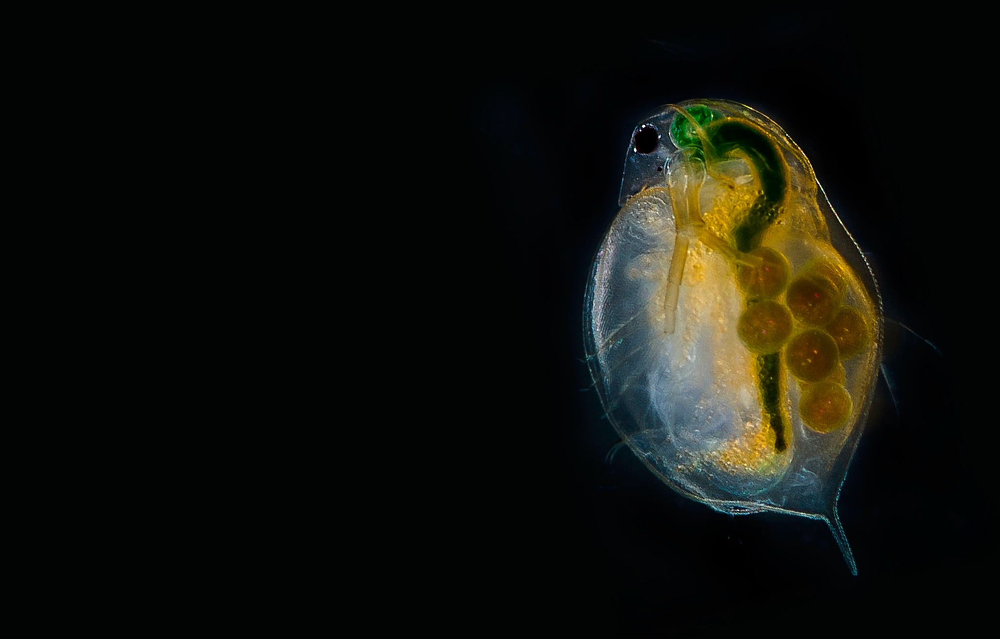
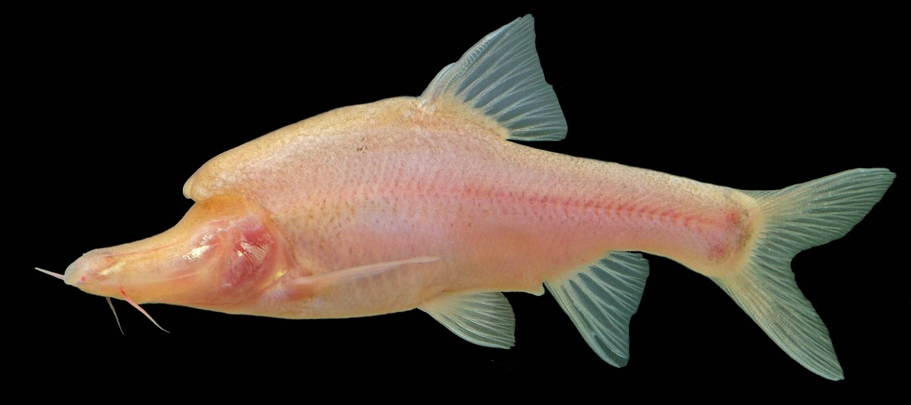

```{r include=FALSE}
library(ape)
library(ggplot2)
library(ggpubr)
library(ggtree)
library(ggstance)
library(reshape2)
library(RColorBrewer)
```

# (PART) Evolution in the Real World {.unnumbered}

# Adaptation and Phenotypic Plasticity

By now, you have developed a basic understanding of how mutation, selection, genetic drift, and migration influence evolutionary change---from the sequence of DNA molecules to complex traits shaped by many genes at once. Natural selection continuously nudges populations toward optimal trait expression by counter-selecting traits and trait combinations that lead to inferior performance in any given environment. Yet, despite this continuous nudging, most populations elude perfect adaptation to their environment. The constant input of maladaptive alleles through mutation and migration, and the inescapable effects of genetic drift, move populations away from phenotypic optima. Furthermore, there are fundamental constraints and trade-offs that limit adaptive evolution. Optimal solutions to an ecological problem may be out of reach because there is simply no genetic variation in traits upon which selection may act. Furthermore, evolutionary outcomes invariably represent a compromise reflecting the diverse needs and functions of organisms. It may be impossible to optimize two traits even if they appear unrelated, either because they are linked through antagonistic pleiotropy, or due to trade-offs in the allocation of energy and nutrients. There might even be functional trade-offs, where the same trait is used for multiple functions and all cannot be optimized at once. For example, think of the trade-offs associated with rapid acceleration and endurance.

Clearly, not every trait of an organism, and every use of a trait, is adaptive. So how do we recognize adaptations in natural systems? How do we determine if organisms are well-adapted to their environment, and what traits are important in mediating adaptation? People---even some of the most rigorous scientists---are quick to come up with plausible narratives about trait evolution and function. But in many cases, these narratives are merely "just-so-stories"; ideas that, while plausible, have little scientific merit because they do not lead to testable hypotheses. Plausibility, it turns out, is not evidence---or as Yvan Audouard said more poetically: "Plausibility is a trap for the truth laid by lies."

Consider, for example, the giraffe (Figure \@ref(fig:giraffe)). Ask anyone why this peculiar species of ungulate has such a long neck, and most will come to the same conclusion as Lamarck did over 200 years ago: it must be to reach leaves high up in the trees, where they can evade competition with other browsers foraging at lower heights. However, observational studies indicate that giraffes most frequently pick leaves at shoulder height, where other species can reach them as well. There is instead evidence that neck size plays a role in sexual selection, both when it comes to territorial disputes between males and female mating preferences. Thus, the notion that long necks currently serve an adaptive function for foraging and competitive exclusion rests on thin evidence. Does that mean that selection on foraging success did not play a role in the elongation of the giraffe's neck? No! We have to be cognizant of the fact that the functions of a trait may change through time; we cannot necessarily make inferences about the origin of a trait based on its current use. Elongated necks may very well have started as an adaptation to reach food high up---but current data holds more evidence for the impact of neck-size variation on giraffe mating success than evidence for its impact on foraging success.

In this chapter, we will take a closer look at the identification and study of adaptation in organisms living in their natural habitats. After discussing some general approaches used to infer adaptation at different phylogenetic scales, we will explore phenotypic plasticity. This phenomenon has the potential to obscure patterns of adaptive evolution and can actually be a product of adaptation itself.

```{r giraffe, echo=FALSE, out.width='100%', fig.cap = "Giraffe in Tsavo. Photo: Anna Langova, [CC0](https://creativecommons.org/publicdomain/zero/1.0/)."}
knitr::include_graphics('images/giraffe.jpg')

```

## Inferring Adaptation

There are many ways to infer adaptation in natural systems, and there is no one-size-fits-all approach. The nature of selection, the natural history of the focal organisms, and the resources available to and logistical constraints imposed on the research team all impact what kind of data is feasible to collect. Here, I want to introduce some general approaches to study adaptation: comparative analyses among species, observational and experimental studies on individual species, and comparative studies among populations of the same species.

### Interspecific Comparisons

Convergent evolution---where evolutionarily-independent lineages evolve similar traits to adapt to similar ecological niches---is frequently invoked as evidence for adaptation. For example, the convergent modification of forelimbs to form wings in bats, birds, and pterosaurs all evolved as an adaptation to flying. The inference of convergence is not always so trivial, though---especially when focal species are more closely related, and the evolutionary independence of species is not necessarily evident.

Consider Figure \@ref(fig:phylpseurepl) as an example. In both scenarios (A and B), three species are associated with a novel habitat (habitat 2, in green) and exhibit divergence in a phenotypic trait. In the first scenario (Figure \@ref(fig:phylpseurepl)A), the species in the novel habitat form a monophyletic group, suggesting that all three of them have inherited the novel habitat affiliation and the phenotypic trait modification from their shared ancestor. In other words, there has been a single evolutionary transition in habitat affiliation, and a single evolutionary transition in the phenotypic trait, which deflates the evidence for correlated evolution between habitat and trait as a consequence of adaptive evolution. After all, that same correlation may be spurious, having arisen by chance. This scenario is known as phylogenetic pseudoreplication; if we treat each species as an independent replicate, we gloss over the fact that there has only been a single evolutionary transition.

In the second scenario, the situation is different; the colonization of the novel environment and the associated change in phenotypic trait have independently occurred three times, as evidenced by the fact that all three species in habitat 2 (green) have a sister species in habitat 1 (blue; Figure \@ref(fig:phylpseurepl)B). The fact that the same correlated changes happened independently multiple times provides more robust evidence for the effects of selection, as we would not expect the same habitat-trait association to evolve repeatedly by chance. As any good experiment designed by researchers, the quality of natural experiments also relies on adequate replication; it is the number of independent evolutionary shifts, and not the number of species, that is the unit of replication.

```{r phylpseurepl, echo=FALSE, fig.height=8, fig.width=8, message=FALSE, warning=FALSE, out.width='100%', fig.cap="Two hypothetical scenarios of how the same pattern of association between habitat type and phenotype might arise. A. In the first scenario, habitat 2 (green) was invaded once by the shared ancestor of species 6, 7, and 8, representing a single evolutionary transition. This is an example of phylogenetic pseudoreplication. B. In the second scenario, species 1, 4, and 6 have independently colonized habitat 2 (green). Each of the species is sister to a species occuring in the ancestral habitat 1 (blue)."}
tr <- read.tree("data/9_randtree.tre")
d1 <- as.data.frame(1:15)
names(d1) <- "node"
d1$color <- c("steelblue", "steelblue", "steelblue", "steelblue", "steelblue", "darkgreen", "darkgreen", "darkgreen", "darkgreen", "steelblue", "steelblue", "steelblue", "steelblue", "darkgreen","darkgreen")
d1$color2 <- c("steelblue", "steelblue", "darkgreen", "steelblue", "darkgreen", "steelblue", "steelblue", "darkgreen", "steelblue", "steelblue", "steelblue", "steelblue", "steelblue", "steelblue","steelblue")
sc1 <- ggtree(tr) %<+% d1 + aes(color=I(color)) + geom_tiplab(align=TRUE) + xlim(0,3)
sc2 <- ggtree(tr) %<+% d1 + aes(color=I(color2)) + geom_tiplab(align=TRUE) + xlim(0,3)

d2 <- as.data.frame(c("species_1", "species_2", "species_3", "species_4", "species_5", "species_6", "species_7", "species_8"))
names(d2) <- "species"
d2$sc1 <- c(2.5,1.8,3.1,2,3.3,6.2,6.4,5.9)
d2$ha1 <- c("Habitat 1", "Habitat 1", "Habitat 1", "Habitat 1", "Habitat 1", "Habitat 2", "Habitat 2", "Habitat 2")
d2$sc2 <- c(6.2,1.8,3.1,5.9,3.3,6.4,2.5,2)
d2$ha2 <- c("Habitat 2", "Habitat 1", "Habitat 1", "Habitat 2", "Habitat 1", "Habitat 2", "Habitat 1", "Habitat 1")

sc1.1 <- ggplot(d2, aes(x=ha1, y=sc1, label = species, color=ha1))+
    geom_point()+
    geom_text(nudge_x=-.3)+
    theme_classic()+
    scale_color_manual(values=c("steelblue","darkgreen"))+
    theme(legend.position = "none",
          axis.title.x=element_blank(),
          axis.text.y=element_blank(),
          axis.ticks.y=element_blank()) +
    ylab("Trait")

sc1.2 <- ggplot(d2, aes(x=ha2, y=sc2, label = species, color=ha2))+
    geom_point()+
    geom_text(nudge_x=-.3)+
    theme_classic()+
    scale_color_manual(values=c("steelblue","darkgreen"))+
    theme(legend.position = "none",
          axis.title.x=element_blank(),
          axis.text.y=element_blank(),
          axis.ticks.y=element_blank()) +
    ylab("Trait")

ggarrange(sc1.1,sc1.2,sc1,sc2, labels = c("A", "B"), ncol=2, nrow=2)
```

In reality, the phylogenetic distribution of traits does not neatly follow either scenario outlined in Figure \@ref(fig:phylpseurepl). Consider the evolution of piscivory, and the associated evolutionary change in gape width, in the fish family Centrarchidae---which includes black basses, sunfishes, and crappies (Figure \@ref(fig:sunfishes)). Naively, we could just compare the gape width of piscivorous and non-piscivorous species. But as you can glean from the from the phylogeny, the evolution of piscivory is more complicated. There are two independent transitions towards piscivory in the genus *Lepomis*, but multiple piscivorous species are derived from a single piscivorous ancestor in other clades (*Micropterus* and the clade with *Ambloplites*, *Archolites*, and *Pomoxis*).

Multi-species comparative analyses consequently must account for the fact that species are related to each other to varying degrees. Comparing species of *Lepomis* is not the same as comparing species of *Lepomis* and *Micropterus*. More closely related species tend to be more similar than more distantly related ones, and comparative analyses need to account for that. In practice, we use phylogenetic comparative analyses (PCA) that explicitly include information about evolutionary relationships to test hypotheses about trait evolution. The use of well-resolved phylogenies in PCA allows us to statistically account for potential phylogenetic pseudoreplication in comparative analyses. Among the most commonly used methods in PCA are phylogenetically independent contrasts and phylogenetic generalized least squares, which are used to test associations among response variables while controlling for the non-independence of species.

```{r sunfishes, echo=FALSE, fig.height=4, fig.width=8, message=FALSE, warning=FALSE, fig.cap="Gape width variation of centrarchid fishes as a function of their dietary habits. Species with higher than average gape with have positive scores, species with lower than average gaoe width have negative scores. The phylogenetic tree in the left panel indicates that piscivory has evolved independently multiple times within the family. [Phylogeny](data/9_centrarchidae.tre) from Near et al. (2005); [gape width data](data/9_centrarchidae.csv) from Collar et al. (2009)."}
sunfish.data <- read.csv("data/9_centrarchidae.csv")
sunfish.tree <- read.tree("data/9_centrarchidae.tre")
suntree <- ggtree(sunfish.tree) + geom_tiplab(align=TRUE) + xlim_tree(.5)
suntree + geom_facet(panel="Relative gape width", data = sunfish.data, 
                                 geom = ggstance::geom_barh, 
                                 mapping = aes(x = gape.width, fill=feeding.mode), 
                                 stat = "identity")+  theme(legend.title = element_blank())+
    scale_fill_brewer(palette = "Set2")
```

::: {.alert .alert-block .alert-info}
<b>Explore More</b>

If you are interested in learning more about phylogenetic comparative methods, I recommend Luke Harmon's book "[Phylogenetic Comparative Methods: Learning from Trees](https://lukejharmon.github.io/pcm/)", which is available for free online.
:::

### Intraspecific Studies

Studies of adaptation often focus on single species. Single species studies either use observational approaches, examining organisms in their natural environment, or experimental approaches that manipulate a single, well-defined factor while other variables are held constant. Observational studies promote a better understanding of organisms in their natural environment, but they often cannot control for all confounding variables. Hence, observational studies are typically correlational and do not establish causation between traits, function, and fitness. In contrast, experimental manipulations allow us to establish causal relationship between variables, but sometimes lack the nuanced context of natural situations. There may be a causal link between variation in a trait and fitness under experimental conditions, but the results can be misleading if the experimental conditions are not representative of the natural context. The most powerful studies of adaptation consequently combine observational and experimental data. Here, I provide some illustrative examples of observational and experimental studies that focus on understanding the adaptive nature of animal behavior.

#### Observation {.unnumbered}

Habitat use is one of the most fundamental aspects of animal behavior. In ectotherms, habitat use is governed by a number of potential factors, including resource availability, predation risk, and a need for thermoregulation. But with competing needs, which factors determine where an individual chooses to spend its time? Huey and Kingsolver (1989) used thermal performance data of desert iguanas (*Dipsosaurus dorsalis*) to make predictions about habitat use in nature. Assessment of multiple aspects of temperature-dependent physiological performance (burst speed, digestive efficiency, endurance, and hearing efficiency; Figure \@ref(fig:thermreg)A) indicated that the lizards' optimal body temperature is between 35.4 and 40.6 °C (average: 38.7 °C). Above or below that range, physiological performance starts to decline. Huey and Kingsolver wanted to know if lizards in natural habitats choose their environment so as to optimize their physiological performance. Monitoring body temperature in free-ranging lizards indeed indicated that individuals choose their microhabitats to maintain a relatively narrow temperature range that coincides with the physiological performance optima. This adaptive behavior is called behavioral thermoregulation. The fact that lizard habitat choice is primarily driven by behavioral thermoregulation suggests that other factors---such as resource availability and predation---are not likely to limit the lizards' ability to find microhabitats with suitable temperatures (or perhaps considering resource distribution and the presence of predators could explain why some lizards exhibited slightly higher or lower body temperatures than expected).

```{r thermreg, echo=FALSE, message=FALSE, warning=FALSE, fig.height=4.5, fig.width=9, fig.cap="A. Thermal performance curves for different performance metrics of desert iguanas. B. Frequency distribution of body temperatures of active lizards in nature. In both panels, the zone of optimal performance is indicated by gray shading, the average optimum by the red vertical line. [Physiological performance](data/9_thermoregulation1.csv) and [body temperature](data/9_thermoregulation2.csv) data from Huey & Kingsolver (1989)."}

therm.reg1 <- read.csv("data/9_thermoregulation1.csv")
therm.reg2 <- read.csv("data/9_thermoregulation2.csv")

opt.temp <- 38.7

tr1 <- ggplot(therm.reg1, aes(x=temperature, y=performance, color=metric))+
    geom_rect(aes(xmin=35.4, xmax=40.6, ymin=0, ymax=1), color="gray86", fill="gray86")+
    geom_segment(aes(x=opt.temp, xend=opt.temp, y=0, yend=1), color="red")+
    geom_line()+
    xlab("Temperature")+
    ylab("Relative performance")+
    xlim(15,45)+
    theme_classic()+
    theme(legend.title = element_blank(), legend.position=c(0.2,.88))+
    scale_color_brewer(palette = "Set2")

tr2 <- ggplot(therm.reg2, aes(x=temperature, y=frequency))+
    geom_rect(aes(xmin=35.4, xmax=40.6, ymin=0, ymax=17), color="gray86", fill="gray86")+
    geom_col()+
    geom_segment(aes(x=opt.temp, xend=opt.temp, y=0, yend=17), color="red")+
    xlab("Temperature")+
    ylab("Number of individuals")+
    xlim(15,45)+
    theme_classic()

ggarrange(tr1,tr2, labels = c("A", "B"), ncol=2)
```

In some instances, optimization of one behavior may be prevented by other competing needs. This is illustrated by the interaction between predator avoidance and foraging behaviors in stickleback fish (*Gasterosteus aculeatus*). In the absence of predators, stickleback preferentially feed at higher prey densities to maximize energy acquisition rates (Figure \@ref(fig:stiba)). In contrast, when a predator (a kingfisher) is present, stickleback preferentially feed at lower densities. This shift in behavior reflects the competing sensory and cognitive resources required to navigate feeding while also paying attention to potential threats from predators. The results also highlight how observational studies can lead to conflicting results when the effects of confounding variables are not properly accounted for. Good observational studies quantify a wide variety of auxiliary data that allows researchers to exclude alternative hypotheses post hoc. Despite all the limitations, collecting observational data is often the only way to address evolutionary hypotheses in natural systems, simply because experimentation with elephants, colonies of army ants, or rainforest giants is just not feasible.

```{r stiba, echo=FALSE, message=FALSE, warning=FALSE, fig.cap="Preferences of stickleback fish for diffferent prey densities in presence and absence of a predator (kingfisher). [Data](data/9_stickleback.csv) from Milinski & Heller (1978)."}
stiba <- read.csv("data/9_stickleback.csv")
stiba$density <- as.factor(stiba$density)
ggplot(stiba, aes(x=density, y=attacks, fill=predator))+
    geom_col(position = "dodge")+
    labs(x="Prey density", y="Number of attacks", fill="Predator")+
    theme_classic()+
    scale_fill_brewer(palette = "Set2")
```

#### Experimentation {.unnumbered}

Experimentation is among the most powerful tools in science, because the meticulous manipulation of specific variables---while holding all others constant---allows for the inference of causal relationships. Experimentation is particularly strong when motivated by solid observational data, which grounds experiments in biological realities, or by theoretical considerations. For example, theoretical considerations shaped the development of testable hypotheses and experiments in studies of optimal foraging. Optimal foraging theory investigates whether organisms behave in a manner that maximizes energy acquisition rates or efficiency, and it is grounded in a simple yet powerful mathematical framework.

To explore this in more detail, let's imagine an organism---a bird for example---that forages in discrete habitat patches. An individual needs to travel to a particular patch and then start searching for prey items. As prey items are consumed, the rate at which they are encountered declines; hence, the the cumulative number of prey items found in a particular habitat patch is a decelerating curve, and the slope of the curve eventually approximates zero when all prey items in a patch are consumed (this is known as the law of diminishing returns). The big question is, at what point should the bird stop looking for prey items and instead travel to the next habitat patch where food is still abundant? It turns out that the optimal search time depends on the travel time between habitat patches and the shape of the curve describing the prey acquisition rate. The actual solution of the problem is most easily derived graphically, where the maximum rate of energy gain is defined by the slope of the tangent line of the prey acquisition curve that goes through the point defining the travel time on the x-axis (Figure \@ref(fig:optfor1)A). If the individual spends less than the optimal feeding time in a patch, the slope of the line declines, reducing the energy gain per unit time. If the individual spends more than the optimal feeding time in a patch, the the slope of the line, and consequently the rate of energy gain, declines as well.

This basic model of optimal foraging allows us to make very clear theoretical predictions about how variation in travel time should affect the optimal amount of time spent in any given foraging patch. If the travel time between patches is relatively short, individuals should spend less time in a particular foraging patch (Figure \@ref(fig:optfor1)B). In contrast, if travel times between patches are longer, the energy acquisition rate is maximized when search times are longer as well. But do organisms actually behave optimally? Has natural selection led to organisms making economical decisions?

```{r optfor1, echo=FALSE, fig.height=3, fig.width=9, message=FALSE, warning=FALSE, out.width='100%', fig.cap="The marginal value theorem applied to optimal foraging. A. For any travel time (plotted in blue along the negative portion of the x-axis), the maximum rate of energy acquisition can be determined as the slope of the tangent line of the prey acquisition curve that goes through the point defining the travel time on the x-axis. Accordingly, the optimal search time and the optimal prey number are given by the x and y coordinates of the tangent point. B. Varyint the travel time from shory (brown) to long (pink) changes the optimal food searching time from short to long. "}
x <- seq(0,100, by=0.1)
y <- (40*x^2+x-10)/(x*(x+25))
df <- as.data.frame(cbind(x,y))
tang.x <- c(-25, 74)
tang.y <- c(0,40)
tang <- as.data.frame(cbind(tang.x, tang.y))

optfor.p1 <- ggplot(df, aes(x=x, y=y))+
    geom_segment(aes(x = 25, y = 0, xend = 25, yend = 20), color="gray40", linetype="dashed")+
    geom_segment(aes(x = -50, y = 20, xend = 25, yend = 20), color="gray40", linetype="dashed")+
    geom_line(size=1)+
    xlim(-50,100)+
    ylim(-2,40)+
    geom_line(data=tang, aes(x=tang.x, y=tang.y))+
    geom_segment(aes(x = -25, y = 0, xend = 0.5, yend = 0), color="blue")+
    geom_segment(aes(x = 0.5, y = 0, xend = 25, yend = 0), color="red")+
    theme_classic()+
    xlab("Time")+
    ylab("Amount of prey")+
    annotate("text", x=-17, y=-1.75, label="Travel time", color="blue")+
    annotate("text", x=31, y=-1.75, label="Optimal search time", color="red")+
    annotate("text", x=-21, y=22, label="Optimal prey number", color="gray40")

tang.x1 <- c(-10, 56)
tang.y1 <- c(0,40)
tang1 <- as.data.frame(cbind(tang.x, tang.y))
tang.x2 <- c(-50, 95)
tang.y2 <- c(0,40)
tang2 <- as.data.frame(cbind(tang.x, tang.y))

optfor.p2 <- ggplot(df, aes(x=x, y=y))+
    geom_segment(aes(x = 16, y = 0, xend = 16, yend = 16), color="gold4", linetype="dashed")+
    geom_segment(aes(x = -50, y = 16, xend = 16, yend = 16), color="gold4", linetype="dashed")+
    geom_segment(aes(x = 35, y = 0, xend = 35, yend = 23), color="plum", linetype="dashed")+
    geom_segment(aes(x = -50, y = 23, xend = 35, yend = 23), color="plum", linetype="dashed")+
    geom_line(size=1)+
    xlim(-50,100)+
    ylim(-2,40)+
    geom_line(data=tang1, aes(x=tang.x1, y=tang.y1), color="gold4")+
    geom_line(data=tang2, aes(x=tang.x2, y=tang.y2), color="plum")+
    geom_segment(aes(x = -10, y = 0, xend = 0.5, yend = 0), color="dodgerblue")+
    geom_segment(aes(x = 0.5, y = 0, xend = 16, yend = 0), color="tomato")+
    geom_segment(aes(x = -50, y = -0.4, xend = 0.5, yend = -0.4), color="dodgerblue4")+
    geom_segment(aes(x = 0.5, y = -0.4, xend = 35, yend = -0.4), color="tomato4")+
    theme_classic()+
    xlab("Time")+
    ylab("Amount of prey")+
    annotate("text", x=-15, y=18, label="Optimum short travel time", color="gold4")+
    annotate("text", x=-16, y=25, label="Optimum long travel time", color="plum")

ggarrange(optfor.p1,optfor.p2, labels = c("A", "B"), ncol=2)
```

The optimal foraging model makes clear predictions that can be tested experimentally. To do so, Kacelnik (1984) trained free-living starlings (*Sturnus vulgaris*) to provision their young with mealworms from artificial feeding stations. Manipulating the interval at which mealworms were released, Kacelnic was able to precisely control the shape of the resource acquisition curve; ever-longer intervals between individual prey items mimicked a diminishing return rate assumed in a patch-foraging model. After training, Kacelnik positioned the feeding stations at varying distances (8--600 meters) from the starlings' nests to simulate variation in travel time between food patches, and he then quantified how many mealworms each starling brought back to the nest after each foraging trip. The prediction was clear: the farther away the feeding station was placed, the more prey items the starlings should bring back with every trip. And, this is exactly what Kacelnik found (Figure \@ref(fig:optfor3)). In fact, the observed number of prey items closely followed the theoretical predictions made by the model.

```{r  optfor3, echo=FALSE, message=FALSE, warning=FALSE, out.width='100%', fig.cap="Number of prey items collected by starlings as a function of travel time between food patches. The black like represents the theoretical prediction derived from the marginal value theorem in Figure 9.6. [Data](data/9_opt_foraging.csv) from Kacelnik (1984)."}
optfor <- read.csv("data/9_opt_foraging.csv")
optfor2 <- split(optfor, optfor$data)

ggplot()+
    geom_line(data=optfor2$Prediction, aes(x=travel.time, y=prey))+
    geom_point(data=optfor2$Experiment, aes(x=travel.time, y=prey))+
    xlab("Travel time [s]")+
    ylab("Number of prey items per visit")+
    theme_classic()
```

The few exemplar studies on adaptation discussed here illustrate the complementary insights that can be gained from observational studies grounded in ecological realities, experimental studies that control for confounding variables and help to identify causal relationships, and theoretical models that establish clear predictions based on first principles. While not all approaches are feasible in all study systems, addressing the same problem from different angles and looking for consistencies in the emerging solutions is critical to avoid premature conclusions about adaptation. Conflicting evidence on a given topic does not necessarily invalidate somebody's work and conclusions; rather, it is just an indication that the context and intricacies of a particular trait (or its uses) are not yet fully understood and require additional investigation.

### Local Adaptation within Species

Phenotypic variation is, of course, not only evident between species; there can be an extraordinary amount of phenotypic variation within and among populations of the same species as well. Just consider the staggering color variation among different populations of the stawberry poison-dart frog (*Oophaga pumillio*; Figure \@ref(fig:intraspecvar)). Throughout its range, which spans from Nicaragua south to Panama, isolated populations exhibit completely different colors and patterns, even across very small geographic distances. While among-population variation is common in many species, the core question is why? What phenotypic differences reflect adaptation to local environmental conditions?

```{r intraspecvar, echo=FALSE, out.width='100%', fig.cap = "Intraspecific variation observed in the poison dart frog *Oophaga pumillio* across islands of the Bocas del Toro Archipelago Panama. Note that *Allobates talamancae* is a nontoxic frog species that coexists with the other species. Photo: Mann and Cummings (2012), [CC BY-SA 4.0](https://creativecommons.org/licenses/by-sa/4.0)."}
knitr::include_graphics('images/dartfrog.png')
```

Patterns of local adaptation can be uncovered through trait-environment correlations. Such correlations are often evident across vast geographic scales. For example, consistent with the predictions of Bergmann's rule, many species exhibit a latitudinal gradient in body size. Populations of *Drosophila subobscura*, which is naturally distributed across Europe, exhibit a relatively small body size in southern portions of the species range around the Mediterranean Sea, while they get progressively larger toward the northern edge of the distribution in Germany and Denmark (Figure \@ref(fig:droslat)A). Interestingly, a parallel cline in body shape has evolved in *D. subobscura* populations of North America, where the species was introduced in the early 1980s (Figure \@ref(fig:droslat)A). As for comparative analyses among species, replication of trait-environment correlations can be evidence for the role of natural selection in the evolution of phenotypic gradients.

Trait-environment correlations alone, however, are not sufficient to infer adaptation---even when similar phenotypic clines have repeatedly emerged along replicated environmental gradients. This is because natural selection is just one mechanisms by which such clines can emerge. Alternatively, the clinal expression of phenotypes can be a product of phenotypic plasticity, where individuals differ between populations simply due to exposure to distinct environmental conditions---and not because of differentiation at genetic loci controlling the expression of a trait. Consequently, common-garden experiments are necessary to disentangle the relative contributions of environmental and genetic variation to the phenotypic variation observed among populations. In common garden experiments, populations from different parts of a species' range are exposed to the exact same environmental conditions to test whether traits differences observed in nature are retained under experimental conditions. Such common garden experiments in *Drosophila melanogaster* have shown that among-population variation in body size persists in the laboratory, although the slope of the regression line is reduced, suggesting that genetic differentiation and phenotypic plasticity both contribute to the observed phenotypic differences in nature (Figure \@ref(fig:droslat)B).

It is also important to note that trait-environment correlations must not always occur over vast geographic distances, nor is phenotypic differentiation always gradual. For example, local adaptation of many plant species to different soil conditions can occur at very small spatial scales that are better measured in meters than kilometers, and yet they include discrete ecotypes that correspond to different soil types. Whether local adaptation leads to continuous gradients or discrete ecotypes depends on the strength, nature, and spatial distribution of natural selection, the genetic architecture underlying the focal traits, and the connectedness of populations through gene flow.

```{r droslat, echo=FALSE, fig.height=3, fig.width=8, message=FALSE, warning=FALSE, out.width='100%', fig.cap="A. Body size variation in *Drosophila subobscura* along a latitudinal gradient in its native European range and its introduced North American range. [Data](data/9_drosophila_bs_lat2.csv) from Huey et al. (2000). B. Body size variation of *Drosophila melanogaster* along a latitudinal gradient for wild-caught individuals and common-garden-reared individuals from the same populations. [Data](data/9_drosophila_bs_lat1.csv) from Imasheva et al. (1994)."}
drs.lat1 <- read.csv("data/9_drosophila_bs_lat1.csv")
drs.lat2 <- read.csv("data/9_drosophila_bs_lat2.csv")

drs.lat1p <- ggplot(drs.lat1, aes(x=latitude, y=body.size, color=group))+
    geom_point()+
    geom_smooth(method="lm", se=FALSE)+
    labs(x="Latitude (degrees North)", y="Wing length (mm)", color="Provenance")+
    theme_classic()+
    theme(legend.title = element_blank(), legend.position=c(0.8,.2))+
    scale_color_brewer(palette = "Set2")

drs.lat2p <- ggplot(drs.lat2, aes(x=latitude, y=body.size, color=population))+
    geom_point()+
    geom_errorbar(aes(ymin=body.size-se, ymax=body.size+se))+
    geom_smooth(method="lm", se=FALSE)+
    labs(x="Latitude (degrees North)", y="Wing length (mm)", color="Population")+
    theme_classic()+
    theme(legend.title = element_blank(), legend.position=c(0.8,.2))+
    scale_color_brewer(palette = "Set2")

ggarrange(drs.lat2p,drs.lat1p, labels = c("A", "B"), ncol=2)
```

A complementary approach to detecting local adaptation is the use of translocation or transplant experiments, where the performance of different phenotypes is compared under different environmental conditions. Such experiments allow us to determine how a particular phenotype performs in different habitats relative to its original home habitat, and they allow us to compare the performance of local phenotypes to foreign phenotypes from other habitats. Most clearly, evidence for local adaptation is uncovered when different phenotypes perform best in their home habitat, and if they simultaneously outperform any foreign phenotypes (Figure \@ref(fig:locada)A). However, a particular phenotype does not need to perform best in its home environment as long as it is able to perform better than all other phenotypes (Figure \@ref(fig:locada)B). This frequently happens in populations adapted to extreme environmental conditions. Specific adaptations allow them to tolerate adverse conditions and outcompete nonadapted individuals, but even so they still have a higher fitness in the absence of the stressor that they are uniquely adapted to. Conversely, superior performance of a phenotype in its home habitat does not make it locally adapted if it is outcompeted by other phenotypes (Figure \@ref(fig:locada)C).

```{r locada, echo=FALSE, fig.height=5, fig.width=8, message=FALSE, warning=FALSE, fig.cap="Possible outcomes of translocation experiments. Red indicates the performance of inviduals from habitat A, green the performance of individuals from habitat B. In scenarios (A) and (B), local phenotypes outperform foreign phenotypes in their own habitat. In scenarios (A) and (C), phenotyoes perform better in their home habitat than in an away habitat. Note that only scenarios (A) and (B) are examples of local adaptation. Adopted from Kawecki & Ebert (2004)."}
habitat <- c("A","B","A","B")
pop <- c("A","A","B","B")
case1 <- c(5,3,3,4)
case2 <- c(5,1,3,2)
case3 <- c(5,3,1,2)
case4 <- c(5,2,2,1)
dfla <- as.data.frame(cbind(habitat, pop, case1, case2, case3, case4))
dfla$case1 <- as.numeric(dfla$case1)
dfla$case2 <- as.numeric(dfla$case2)
dfla$case3 <- as.numeric(dfla$case3)
dfla$case4 <- as.numeric(dfla$case4)

dfla.1 <- ggplot(dfla, aes(x=habitat, y=case1, group=pop, color=pop))+
    geom_point()+
    geom_line()+
    ylim(0,5)+
    xlab("Habitat")+
    ylab("Mean fitness")+
    labs(color = "Population")+
    theme_classic()+
    guides(fill=guide_legend(title='MY NEW TITLE'))+
    theme(legend.direction = "horizontal",
          legend.position=c(0.5,.15),
          axis.text.y=element_blank(),
          axis.ticks.y=element_blank())+
    scale_color_brewer(palette = "Set2")
    

dfla.2 <- ggplot(dfla, aes(x=habitat, y=case2, group=pop, color=pop))+
    geom_point()+
    geom_line()+
    ylim(0,5)+
    xlab("Habitat")+
    ylab("Mean fitness")+
    theme_classic()+
    theme(legend.position = "none",
          axis.text.y=element_blank(),
          axis.ticks.y=element_blank())+
    scale_color_brewer(palette = "Set2")

dfla.3 <- ggplot(dfla, aes(x=habitat, y=case3, group=pop, color=pop))+
    geom_point()+
    geom_line()+
    ylim(0,5)+
    xlab("Habitat")+
    ylab("Mean fitness")+
    theme_classic()+
    theme(legend.position = "none",
          axis.text.y=element_blank(),
          axis.ticks.y=element_blank())+
    scale_color_brewer(palette = "Set2")

dfla.4 <- ggplot(dfla, aes(x=habitat, y=case4, group=pop, color=pop))+
    geom_point()+
    geom_line()+
    ylim(0,5)+
    xlab("Habitat")+
    ylab("Mean fitness")+
    theme_classic()+
    theme(legend.position = "none",
          axis.text.y=element_blank(),
          axis.ticks.y=element_blank())+
    scale_color_brewer(palette = "Set2")

ggarrange(dfla.1,dfla.2,dfla.3,dfla.4, labels = c("A", "B", "C", "D"), ncol=2, nrow=2)
```

A classic system for the study of local adaptation to diverse environmental conditions is the mummichog (*Fundulus heteroclitus*), a small coastal fish species that can be found in both fresh and brackish waters. This distribution across a major ecotone naturally raises questions about whether these fish are locally adapted to different salinities, or if they can flexibly modify their physiology and perform equally well in either environment. Reid Brennan and his colleagues (2016) collected fish from fresh and brackish water populations and acclimated half of the individuals from each habitat to either fresh or brackish water in the laboratory. If mummichog are locally adapted, we would expect the brackish water fish to outperform freshwater fish in brackish water---irrespective of acclimation conditions---and vice versa. This exactly what the researchers found when they compared the endurance of fish swimming under different environmental conditions (Figure \@ref(fig:fundperf)A). While the endurance of freshwater individuals was not significantly different across environments, the performance of brackish water fish differed dramatically depending on water type; they outperformed freshwater fish under high salinity conditions, and they were outperformed under low salinity conditions. Interestingly, another aspect of organismal performance---metabolic scope, which is a measure of energy organisms can mobilize after accounting for the minimum energy required to sustain life---showed a very different pattern (Figure \@ref(fig:fundperf)B). Fish from both populations performed better in brackish than freshwater, and the fact that there were no population differences in this trait indicates that variation is induced by plasticity.

Such conflicting evidence is not unusual when we attempt to infer local adaptation by measuring organismal performance across different environmental conditions with different metrics. After all, among-population variation in one trait may be shaped primarily by genetic differentiation, while variation in another trait may be entirely plastic; after all, different traits likely have different genetic and developmental architectures. This complication highlights the importance of thinking critically about how we actually measure organismal performance and, ultimately, fitness. In natural systems, it is nearly impossible to directly measure fitness because of the complexity of phenotyes and selective regimes. Researchers often measure other aspects of organismal performance (growth, survival, endurance, etc.) as fitness proxies, which requires a careful examination of the assumptions we make about the relationships of different fitness proxies and actual fitness.

```{r fundperf, echo=FALSE, fig.height=4, fig.width=8, message=FALSE, warning=FALSE, out.width='100%', fig.cap="A. Swimming endurance and B. metabolic scope of *Fundulus heteroclitus* from fresh and brackish water populations under fresh and brackish water conditions. [Data](data/9_fundulus_performance.csv) from Brennan et al. (2016)."}
fundulus.performance <- read.csv("data/9_fundulus_performance.csv")
fundulus.performance.swim <- fundulus.performance[ which(fundulus.performance$trait=='Swimming performance'), ]
fundulus.performance.scope <- fundulus.performance[ which(fundulus.performance$trait=='Metabolic scope'), ]

fund.p1 <- ggplot(fundulus.performance.swim, aes(x=test.environment, y=response, color=population))+
    geom_point()+
    geom_line(aes(group=population))+
    geom_errorbar(aes(ymin=response-se, ymax=response+se), width=0.1)+
    labs(x="Test environment", y="Time to exhaustion [s]", color="Population")+
    theme_classic()+
    theme(legend.position=c(0.2,.13))+
    scale_color_brewer(palette = "Set2")
    

fund.p2 <- ggplot(fundulus.performance.scope, aes(x=test.environment, y=response, color=population))+
    geom_point()+
    geom_line(aes(group=population))+
    geom_errorbar(aes(ymin=response-se, ymax=response+se), width=0.1)+
    labs(x="Test environment", y="Factorial metabolic scope", color="Population")+
    theme_classic()+
    theme(legend.position = "none")+
    scale_color_brewer(palette = "Set2")

ggarrange(fund.p1,fund.p2, labels = c("A", "B"), ncol=2)
```

## Phenotypic Plasticity

Phenotypic plasticity is the developmental response of a genotype to environmental cues. It introduces environmentally-induced phenotypic variation into populations (*V*~E~/*V*~P~; see [Chapter 8](https://www.k-state.edu/biology/p2e/the-evolution-of-quantitative-traits.html#quantitative-traits-a-product-of-genes-and-environment)). So far, we have primarily thought of plasticity as a complicating factor when we try to infer adaptation; populations in different environments may exhibit different phenotypes not because of genetic differentiation, but simply because of exposure to different environmental conditions. This is not an example of local adaptation, because plastic traits are not heritable, and adaptations are the product of evolution by natural selection, which requires trait heritability. Still, the ability to modify phenotypic expression in response to environmental cues may itself be considered an adaptation.

Consider water fleas (*Daphnia* sp.) as an example. Many *Daphnia* species are able to plastically modify the size of defensive structures (*e.g.*, tail and head spines) depending on whether they are sensing potential predators in their environment. In absence of predators, defensive structures are small to save the energy and nutrients required for their growth. In the presence of predators, however, the same clone of these asexually reproducing crustaceans will produce substantially longer spines, and the spiny appendages provide a fitness benefit despite of the resource costs, because they reduce the likelihood that an individual is preyed upon. In this case, it is not the actual size of the spine that is the adaptation (short in low-predation and long in high-predation environments). Instead, it is the ability to change spine size depending on the presence or absence of predators that is adaptive.

```{r daph, echo=FALSE, out.width='100%', fig.cap = "*Daphnia magna* is a small planktonic crustacean. In this specimen, the tail spine is only weakly developed, and the head spine is missing. Photo: [Per Harald Olsen](https://www.flickr.com/photos/92416586@N05/14004524707), [CC BY 2.0](https://creativecommons.org/licenses/by/2.0/)."}


```

### Types of Phenotypic Plasticity

In general, we distinguish three types of phenotypic plasticity. All of these types of plasticity are the same in that they lead to alternative trait expression by the same genotype when exposed to different environmental conditions.

#### Developmental Plasticity {.unnumbered}

Developmental plasticity occurs when an environmental cue during a critical period---usually early during ontogeny---alters the developmental trajectory of an individual, leading to alternative phenotypic morphs in adults. The modification of phenotypes through developmental plasticity is non-reversible, and the traits of an individual remain fixed after the critical period has passed. Classical examples of developmental plasticity include the predator-dependent expression of defensive structures in *Daphnia*, the diet-dependent expression of omnivorous and carnivorous tadpoles in spadefoot toads, and the development of different casts in ants and other social insects.

#### Acclimation {.unnumbered}

Acclimation is a form of phenotypic plasticity that involves physiological or behavioral changes within the lifetime of an individual, and allows organisms to respond to short-term environmental changes. Unlike developmental plasticity, acclimation is reversible, and traits can be adjusted continuously throughout an individual's life. A wide variety of physiological tolerances are subject to acclimation in plants and animals alike, including tolerance to extremes in temperature, salinity, or oxygen availability. Similarly, gastrointestinal tract morphology and physiology in many animals can change in response to variation in diet. Plants can also modify leaf shape and size depending on the availability of light or the presence of herbivores.

#### Seasonal Plasticity {.unnumbered}

Seasonal plasticity includes predictable phenotypic changes individuals experience over the course of the year, often leading to cyclical phenotypic changes over the course of an individual's lifespan. Examples for seasonal plasticity includes coat color changes in snowshoe hares and Arctic foxes (brown in the summer, white in the winter), wet and dry-season color morphs observed in some African butterflies, and the seasonal growth and shedding of antlers in many ungulates.

### Reaction Norms and the Evolution of Plasticity

If phenotypic plasticity can be an adaptation, it must be the product of natural selection; hence, there must be heritable variation in plasticity within a population for plasticity to evolve. To quantitatively describe a genotype's ability to plastically modify its phenotype in response to a particular environmental cue, we measure so-called reaction norms. A reaction norm describes the pattern of phenotypic expression of a single genotype as a function of an environmental variable. Reaction norms can have any shape (Figure \@ref(fig:reactnorm)), and the exact nature of reaction norms can be determined empirically by rearing the same genotype in different environments and measuring phenotypic expression.

```{r reactnorm, echo=FALSE, message=FALSE, warning=FALSE, fig.cap="A reaction norm describes how the phenotype of a particular genotype changes across different environments. In theory, reaction norms can have any shape; they can be close to linear (blue line) or completely non-linear."}
x <- 1:19
y <- c(1,1.25,1.5,1.75,2,2.5,3,4,5,6,7,7.5,8,8.5,9,9.25,9.5,9.75,10)
z <- c(10,9,7,5,4.5,4,3.5,3.45,3.4,3.5,3.8,3.9,4.4,4.7,4.71,4.73,4.74,4.75,4.75)
rndf <- data.frame(x,y,z)
spline_int <- as.data.frame(spline(rndf$x, rndf$y))
spline_int2 <- as.data.frame(spline(rndf$x, rndf$z))

ggplot(spline_int, aes(x=x, y=y))+
    geom_line(color="#fc8d62")+
    geom_line(data=spline_int2, aes(x=x,y=y), color="#66c2a5")+
    labs(x="Environment", y="Phenotype")+
    theme_classic()+
    theme(axis.text.x=element_blank(), axis.ticks.x=element_blank(), axis.text.y=element_blank(), axis.ticks.y=element_blank())
```

Importantly, reaction norms are quantitative traits. But before we can apply quantitative genetic approaches to understand the evolution of phenotypic plasticity, we need to amend the conceptual framework that we established in [Chapter 9](the-evolution-of-quantitative-traits.html#quantifying-trait-heritability). For simplicity, let's assume that we can describe phenotypic variation in a population with linear graphs, where differences in slopes reflect variation in plasticity and differences in intercepts indicate variation among genotypes . If phenotypic variation in a population is completely determined by genetic variation (*V*~P~=*V*~G~), the reaction norms for all genotypes in a population are flat (slope = 0), but with different y-intercepts (Figure \@ref(fig:reactionnorms)A). In this case, it does not matter what the environment is; the phenotype is solely dependent on the genotype. In contrast, if phenotypic variation in a population is completely determined by environmental variation (*V*~P~=*V*~E~), all genotypes will have the same reaction norm (same slope and same intercept; Figure \@ref(fig:reactionnorms)A). In this case, it does not matter what genotype an individual belongs to; phenotypic expression is solely dependent on the environment. If both genetic and environmental variation shape phenotypic variation in a population (*V*~P~=*V*~G~+*V*~E~), the shape (slope) of the plastic response is identical for all genotypes, but their intercepts vary (Figure \@ref(fig:reactionnorms)C). What all three scenarios have in common is that none of them actually allow for the evolution of phenotypic plasticity. The evolution of the ability to plastically modify the expression of a trait is contingent on there being variation in that ability. *I.e.*, there needs to be variation in plasticity, and all three scenarios we have discussed so far either have no plasticity in the population at all (Figure \@ref(fig:reactionnorms)A), or all genotypes respond to different environments in the exact same way (Figure \@ref(fig:reactionnorms)B--C).

To account for variation in reaction norms that allows for the evolution of phenotypic plasticity, we need to add another term our model: phenotypic variation that is the consequence of genotype-specific responses to environmental variation, also know as gene-by-environment interactions (*V*~G⨉E~). Hence, *V*~P~=*V*~G~+*V*~E~+*V*~G⨉E~. Gene-by-environment interactions are characterized by different genotypes having different slopes in their plastic responses (Figure \@ref(fig:reactionnorms)D). Only when different genotypes have different reaction norms can natural selection act on that variation to optimize plastic responses in a way that maximizes fitness. In some contexts, that means that plasticity may be favored---for example when environmental conditions are fluctuating or unpredictable. When environments are stable, however, plasticity may be selected against.

```{r reactionnorms, echo=FALSE, fig.height=5, fig.width=8, , message=FALSE, warning=FALSE, fig.cap="Components of variation of a phenotypic trait: A. If V<sub>P</sub>=V<sub>G</sub>, there is no phenotypic plasticity in a population. B. If V<sub>P</sub>=V<sub>E</sub>, phenotypic variation is solely shaped by plasticity. C. If V<sub>P</sub>=V<sub>G</sub>+V<sub>E</sub>, genetic variation and phenotypic plasticity contribute to trait variation on a population, but all genotype respond to environmental cues in exactly the same way. D. If V<sub>P</sub>=V<sub>G</sub>+V<sub>E</sub>+V<sub>G⨉E</sub>, there are genotype-specific responses to environmental cues. This is the only scenario in which phenotypic plasticity can actually evolve."}
x <- c(0,1)
y1 <- c(1,0.06)
y2 <- c(0.99,0.05)
y3 <- c(0.98,0.04)
y4 <- c(0.97,0.03)
y5 <- c(0.96,0.02)
y6 <- c(0.95,0.01)


df1 <- as.data.frame(cbind(x,y1,y2,y3,y4,y5,y6))

p1 <- ggplot(df1)+
    geom_line(aes(x=x,y=y1), color="#5DA5DA")+
    geom_line(aes(x=x,y=y2), color="#5DA5DA")+
    geom_line(aes(x=x,y=y3), color="#5DA5DA")+
    geom_line(aes(x=x,y=y4), color="#5DA5DA")+
    geom_line(aes(x=x,y=y5), color="#5DA5DA")+
    geom_line(aes(x=x,y=y6), color="#5DA5DA")+
    theme_classic()+
    theme(axis.text.x=element_blank(), axis.ticks.x=element_blank()) +
    theme(axis.text.y=element_blank(), axis.ticks.y=element_blank()) +
    xlab("Environment")+
    ylab("Phenotype")

y7 <- c(1,0.5)
y8 <- c(0.95,0.45)
y9 <- c(0.9,0.4)
y10 <- c(0.85,0.35)
y11 <- c(0.8,0.3)
y12 <- c(0.75,0.25)


df2 <- as.data.frame(cbind(x,y7,y8,y9,y10,y11,y12))

p2 <- ggplot(df2)+
    geom_line(aes(x=x,y=y7), color="#5DA5DA")+
    geom_line(aes(x=x,y=y8), color="#5DA5DA")+
    geom_line(aes(x=x,y=y9), color="#5DA5DA")+
    geom_line(aes(x=x,y=y10), color="#5DA5DA")+
    geom_line(aes(x=x,y=y11), color="#5DA5DA")+
    geom_line(aes(x=x,y=y12), color="#5DA5DA")+
    theme_classic()+
    theme(axis.text.x=element_blank(), axis.ticks.x=element_blank()) +
    theme(axis.text.y=element_blank(), axis.ticks.y=element_blank()) +
    xlab("Environment")+
    ylab("Phenotype")

y13 <- c(1,0)
y14 <- c(0.1,0.45)
y15 <- c(0.9,0.4)
y16 <- c(0.3,0.35)
y17 <- c(0.2,1)
y18 <- c(0.25,0.8)


df3 <- as.data.frame(cbind(x,y13,y14,y15,y16,y17,y18))

p3 <- ggplot(df3)+
    geom_line(aes(x=x,y=y13), color="#5DA5DA")+
    geom_line(aes(x=x,y=y14), color="#5DA5DA")+
    geom_line(aes(x=x,y=y15), color="#5DA5DA")+
    geom_line(aes(x=x,y=y16), color="#5DA5DA")+
    geom_line(aes(x=x,y=y17), color="#5DA5DA")+
    geom_line(aes(x=x,y=y18), color="#5DA5DA")+
    theme_classic()+
    theme(axis.text.x=element_blank(), axis.ticks.x=element_blank()) +
    theme(axis.text.y=element_blank(), axis.ticks.y=element_blank()) +
    xlab("Environment")+
    ylab("Phenotype")

y19 <- c(0.9,0.9)
y20 <- c(0.8,0.8)
y21 <- c(0.7,0.7)
y22 <- c(0.4,0.4)
y23 <- c(0.3,0.3)
y24 <- c(0.2,0.2)


df4 <- as.data.frame(cbind(x,y13,y14,y15,y16,y17,y18))

p4 <- ggplot(df3)+
    geom_line(aes(x=x,y=y19), color="#5DA5DA")+
    geom_line(aes(x=x,y=y20), color="#5DA5DA")+
    geom_line(aes(x=x,y=y21), color="#5DA5DA")+
    geom_line(aes(x=x,y=y22), color="#5DA5DA")+
    geom_line(aes(x=x,y=y23), color="#5DA5DA")+
    geom_line(aes(x=x,y=y24), color="#5DA5DA")+
    theme_classic()+
    theme(axis.text.x=element_blank(), axis.ticks.x=element_blank()) +
    theme(axis.text.y=element_blank(), axis.ticks.y=element_blank()) +
    xlab("Environment")+
    ylab("Phenotype")

ggarrange(p4, p1,p2,p3, labels = c("A", "B", "C","D"), ncol=2, nrow=2)
```

### Adaptive and Maladaptive Phenotypic Plasticity

Phenotypic plasticity can evolve when there is heritable variation in plasticity within populations. However, it would be premature to assume that all instances of plasticity are actually adaptive. Like all other traits, plasticity is not only shaped by natural selection, but also by other evolutionary forces. And like all other traits, plasticity is subject to pleiotropic interactions, constraints, and trade-offs that cause deviation from optimal phenotypes.

Phenotypic plasticity is adaptive if it allows individuals to adjust their phenotype in a way that increases their fitness under the environmental conditions they encounter. Recognizing adaptive phenotypic plasticity, however, is not trivial in natural systems. Doughty and Reznick (2004) proposed six key questions that must be addressed to determine the adaptive value of plasticity: (1) What are the plastic responses to different environmental conditions? (2) How do environmental conditions that impact phenotypic expression vary in nature? This is important because conditions that can induce plasticity in the laboratory may actually be rare or non-existent in natural habitats. (3) Is there a reversal in relative fitness of the alternative phenotypes in different environments? (4) Do organisms respond to reliable environmental cues that predict future selective environments? (5) Is there genetic variation for plasticity and does it evolve in response to selection? (6) Is there comparative evidence that plasticity is correlated with environmental heterogeneity? Needless to say, rigorously ruling out alternative, non-adaptive explanations for adaptive plasticity is a tall order.

One of the best-studied cases of adaptive phenotypic plasticity comes from egg size variation in seed beetles (*Stator limatus*). These beetles lay their eggs on the seeds of different host plants, including cat-claw acacia (*Acacia greggi*) and blue paloverde (*Cercidium floridum*), which vary in their availability to different beetle populations. Acacia seeds provide a high-quality resource, and seed beetles can maximize their fitness by laying many small eggs. In contrast, the seeds of paloverde are of poor quality for the developing offspring, and fitness is maximized by laying a few large eggs (Fox & Mousseau 1996). As in many other instances where traits (eggs size and number in this case) and environments (host plants) vary among populations, correlations between the two variable can arise through local adaptation (*i.e.*, genetic differentiation) or through phenotypic plasticity. To distinguish between these alternative hypotheses, Fox et al. (1997) first raised seed beetles on the preferred acacia seeds for multiple generations, to minimize potential maternal effects. They then let individual females lay their eggs on either acacia or paloverde seeds and measured the size of deposited eggs. As observed in nature, eggs laid on acacia seed were small, and those laid on paloverde were large (Figure \@ref(fig:seedbeet)A). Even more so, females were actually able to adjust their eggs size within just a few days when the researchers switched them across experimental treatments (Figure \@ref(fig:seedbeet)B). This combination of field and laboratory experiments not only revealed that beetles adjust their phenotypic trait in response to an environmental cue (question 1), but also that the relevant environmental factor varies in nature (differences in host plants among populations; question 2), and that the different phenotypes maximize fitness in their respective environment (question 3). Subsequent quantitative genetic studies also revealed genetic variation for plasticity within the seed beetle population (question 5; Fox et al. 1999).

```{r seedbeet, echo=FALSE, fig.height=4, fig.width=8, message=FALSE, warning=FALSE, out.width='100%', fig.cap="A. Egg size variation of seed beetles on different host plants (*Acacia* and *Cercidium*) B. Individual seed beetles are able to adjust eggs size rapidly when switched between the two hosts. [Egg size](data/9_seed_eggsize.csv) and [experimental](data/9_seed_experiment.csv) data from Fox et al. 1997."}
seed.egg <- read.csv("data/9_seed_eggsize.csv")
seed.exp <- read.csv("data/9_seed_experiment.csv")

seed1 <- ggplot(seed.egg, aes(x=female.mass, y=egg.size, color=host))+
    geom_point()+
    geom_smooth(method="lm", se=FALSE)+
    labs(x="Female mass", y="Egg size", color = " ")+
    theme_classic() +
    theme(legend.position=c(0.25,0.13),
          legend.background = element_rect(fill=alpha("white", 0.01)))+
    scale_color_brewer(palette = "Set2")

seed2 <- ggplot(seed.exp, aes(x=time, y=10*egg.size, color=treatment))+
    geom_errorbar(aes(ymin=10*egg.size-10*sd, ymax=10*egg.size+10*sd), width=0.1)+
    geom_point()+
    geom_line()+
    labs(x="Time [h]", y="Egg size", color = " ")+
    theme_classic() +
    theme(legend.position=c(0.27,0.13),
          legend.background = element_rect(fill=alpha("white", 0.01)))+
    scale_color_brewer(palette = "Set2")

ggarrange(seed1,seed2, labels = c("A", "B"), ncol=2)
```

Another example illustrates how the adaptive value of phenotypic plasticity can be context-dependent. Many freshwater snails exhibit phenotypic plasticity in their shell growth depending on whether predators are present or absent. *Physella virgata*, for example, grows large and elongated shells in absence of predators and smaller and more rotund shells in the presence of fish. Smaller and rotund shells are harder to crush, providing added protection. On the other hand, they also constrain a snail's body size, and along with that the size of the gonads and ultimately lifetime reproductive output. Interestingly, *Physella virgata* changes its shell morphology when it senses an actual threat in the environment (molluscivorous sunfish) and also when it senses fish that do not actually eat snails (Figure \@ref(fig:snails)). While the plastic response may constitute an adaptation in an environment with molluscivorous fish, the lack of specificity in the environmental cue (see question 4 above) renders the same response maladaptive in other environmental contexts.

```{r snails, echo=FALSE, message=FALSE, warning=FALSE, out.width='100%', fig.cap="Shell size of the snail *Physella virgata* under fishless control conditions and in the presence of different fish species that vary in their propensity to consume snails as prey. [Data](data/9_snails.csv) from Langerhans & DeWitt (2002)."}
snails <- read.csv("data/9_snails.csv")
snails$treatment <- factor(snails$treatment, levels = c("Negative control", "Molluscivorous", "Non-molluscivorous"))

ggplot(snails, aes(x=reorder(predator, shell.size), y=shell.size, color=treatment))+
    geom_point()+
    geom_errorbar(aes(ymin=shell.size-sd, ymax=shell.size+sd), width=0.1)+
    coord_flip()+
    labs(x="Treatment", y="Shell size [mm2]", color="")+
    theme_classic()+
    theme(legend.position=c(0.85,0.15))+
    scale_color_brewer(palette = "Set2")
```

## Case Study: Local Adaptation and Phenotypic Plasticity

The [case study associated with this chapter](exercises/BIOL520-ex8.zip) has two components. The first one focuses on variation in flower morphology of a dainty South African plant, *Nerine humilis* (Figure \@ref(fig:nerine)). You will analyze observational and experimental data on the interactions of different flower morphs and pollinators to address questions about the evolution for among-population differences in flower traits. The second component focuses on exploring the mechanisms underlying life-history differences among populations of small live-bearing fish, the guppy (*Poecilia reticulata*), that live in habitats with different predation regimes. Analyzing the results of a common garden experiment, you will try to disentangle the effects of genetic variation and phenotypic plasticity on phenotypic trait variation.

```{r nerine, echo=FALSE, out.width='100%', fig.cap = "*Nerine humilis*, flowers; Kirstenbosch National Botanical Garden, Cape Town, Western Cape, South Africa. Photo: SAplants, [CC BY-SA 4.0](https://creativecommons.org/licenses/by-sa/4.0), via Wikimedia Commons."}
knitr::include_graphics('images/Nerine.jpg')
```

## Practical Skills: More Variables, More Graphs

In data sets you have worked with so far, you explored the relationship between one dependent and one or two independent variables. In many cases, however, data sets may include more than two independent variables and even a whole list of dependent variables. Plotting all the data at once can lead to confusing graphs, and it is often preferable to breakout down such complex data sets into subsets plotted separately. To do that, you could first [subset your data manually](https://www.statmethods.net/management/subset.html) and then create individual plots for each subset. Alternatively, you can use the`facet_grid()` and `facet_wrap()` functions from the `ggplot2` package to create plots for different subsets of data automatically. I am providing two examples on how to use these functions here.

### Example 1: Many Independent Variables

The first example deals with a case where a dependent variable is associated with more than two independent variables that we might want to consider. Imagine for example that we wanted to explore the effects of an environmental toxicant on variation in plant biomass. To do so, we conducted a common garden experiment, where we sampled plants from populations in the polluted and unpolluted habitat, and we planted individuals from each population in both polluted and unpolluted soils. In addition, we did this for two species, and because both species are dioecious and exhibit sexual dimorphism, we need to analyze data for each sex separately. I know... it's lot... but just check out the [data set](data/9_complex1.csv): you have one dependent variable (mass) and four independent variables (population, soil type, species, and sex):

```{r out.width='100%'}
ex1 <- read.csv("data/9_complex1.csv")
head(ex1)
```

The main question we want to address is how different populations (polluted and unpolluted) grow in different soils (polluted and unpolluted). So, the base plot is a boxplot, as you have made them multiple times before:

```{r out.width='100%'}
ggplot(ex1, aes(x=soil.type, y=mass, fill=population))+
    geom_boxplot()+
    labs(x="Soil type", y="Biomass", fill="Population")+
    theme_classic()+
    scale_fill_brewer(palette = "Set2")
```

This graph is misleading because it lumps together data from the different species and the different sexes. However, we can split the data into different panels of the same graph using the `facet_grid()` function, with the additional variables (sex and species) as arguments. Note that the variable before the tilde (`~`) is plotted in different rows; the variable after the tilde is plotted in different columns:

```{r out.width='100%'}
ggplot(ex1, aes(x=soil.type, y=mass, fill=population))+
    geom_boxplot()+
    labs(x="Soil type", y="Mass", fill="Population")+
    theme_classic()+
    facet_grid(sex ~ species)+ #Creating separate panels for additional independent variables
    scale_fill_brewer(palette = "Set2")
```

Plotting the different subsets of data in different panels with the same x- and y-axes scales allows for a direct comparison of responses between the sexes and across the species.

### Example 2: Many Dependent Variables

A similar problem presents itself when a relatively simple experiment measures many variables at the same time. Imagine, for example, that we were interested in understanding how different levels of pollution impact the expression of different genes. In this case we may have only one independent variable (level of pollution) but many independent variables (expression data for different genes):

```{r out.width='100%'}
ex2 <- read.csv("data/9_complex2.csv")
head(ex2)
```

Again, we could plot these data all in a single graph using a scatter plots, with different genes plotted in different colors:

```{r message=FALSE, out.width='100%'}
ggplot(ex2, aes(x=concentration, y=expression.level, color=gene))+
    geom_point()+
    geom_smooth(method="lm", se=FALSE)+
    labs(x="Concentration", y="Gene expression", color="Gene")+
    theme_classic()+
    scale_color_brewer(palette = "Set2")
```

This graph, however, is very messy and confusing. Since different genes are expressed at different base levels, it is difficult to discern how the expression of different genes relates to the level of pollution. Using the facet_wrap() function, we can automatically plot the data for each gene in a separate panel. We simply use gene as an argument (after a tilde). In addition, `scale="free"` allows each panel to have its own y-axis limits, and `ncol=3` arranges the panels into three columns:

```{r message=FALSE, out.width='100%'}
ggplot(ex2, aes(x=concentration, y=expression.level))+
    geom_point()+
    geom_smooth(method="lm", se=FALSE)+
    labs(x="Level of pollution", y="Gene expression level", color="Gene")+
    theme_classic()+
    facet_wrap(~ gene, scale="free", ncol=3) #Creating a separate panel for each gene
```

Plotting the data separately for each gene at an appropriate scale allows us to readily discern different gene expression patterns in response to different levels of pollution.

## Reflection Questions

1.  The world is full of many amazing traits organisms have evolved to adapt to their environment. One of my favorite traits is the weird hump we can observe in some Chinese cavefishes. Its adaptive significance remains a mystery so far, although I do have a bunch of hypotheses I'd like to test one day. Look at this! It's pretty wild, right?

    ```{r sinocyclocheilus, echo=FALSE, out.width='100%', fig.cap = "*Sinocyclocheilus furcodorsalis*. Photo: Jörg Freyhof."}
    
    ```

    What organism has always fascinated you? What adaptations does it have? How have scientists tested adaptive hypotheses? And if you cannot find any information, how might you go about exploring the adaptive function of that trait?

2.  How would you attempt to identify genes underlying phenotypic plasticity in a particular trait?

3.  A big open question in evolutionary biology is how phenotypic plasticity impacts evolutionary change. Some argue that plasticity slows down evolution, while others think plasticity might potentiate evolution. Can you explain under what circumstances phenotypic plasticity might slow down or event prevent evolutionary change? Can you explain under what circumstances phenotypic plasticity might potentiate evolutionary change?

## References

-   Brennan RS, R Hwang, M Tse, NA Fangue, A Whitehead (2016). [Local adaptation to osmotic environment in killifish, *Fundulus heteroclitus*, is supported by divergence in swimming performance but not by differences in excess post-exercise oxygen consumption or aerobic scope](https://www.sciencedirect.com/science/article/pii/S1095643316300356). *Comparative Biochemistry and Physiology A* 196, 11--19.

-   Collar DC, BC O'Meara, PC Wainwright, TJ Near (2009). [Piscivory limits diversification of feeding morphology in centrarchid fishes](https://onlinelibrary.wiley.com/doi/10.1111/j.1558-5646.2009.00626.x). *Evolution* 63, 1557--1573.

-   Doughty P, DN Reznick (2004). Patterns and analysis of adaptive phenotypic plasticity in animals. In: TJ DeWitt, SM Scheiner (eds), *Phenotypic Plasticity: Functional and Conceptual Approaches*. London, England: Oxford University Press. pp 126-150.

-   Fox CW, TA Mousseau (1996). [Larval host plant affects fitness consequences of egg size variation in the seed beetle *Stator limbatus*](https://link.springer.com/article/10.1007%2FBF00333946). *Oecologia* 107, 541--548.

-   Fox CW, MS Thakar, TA Mousseau (1997). [Egg size plasticity in a seed beetle: an adaptive maternal effect](https://www.journals.uchicago.edu/doi/abs/10.1086/285983). *American Naturalist* 149, 149--163.

-   Fox CW, ME Czesak, TA Mousseau, DA Roff (1999). [The evolutionary genetics of an adaptive maternal effects: eggs size plasticity in a seed beetle](https://onlinelibrary.wiley.com/doi/10.1111/j.1558-5646.1999.tb03790.x). *Evolution* 53, 552--560.

-   Huey RB, JG Kingsolver (1989). [Evolution of thermal sensitivity of ectotherm performance](https://www.sciencedirect.com/science/article/abs/pii/0169534789902115). *Trends in Ecology & Evolution* 4, 131--135.

-   Huey RB, GW Gilchrist, ML Carlson, D Berrigan, L Serra (2000). [Rapid evolution of a geographic cline in size in an introduced fly](https://science.sciencemag.org/content/287/5451/308). *Science* 287, 308--309.

-   Imasheva AG, OA Bubli, OE Lazebny (1994). [Variation in wing length in Eurasian natural populations of *Drosophila melanogaster*](https://www.nature.com/articles/hdy199468). *Heredity* 72, 508--514.

-   Kacelnik A (1984). [Central place foraging in starlings (*Sturnus vulgaris*): I. Patch residence time](https://www.jstor.org/stable/4357?origin=crossref&seq=1#metadata_info_tab_contents). *Journal of Animal Ecology* 53, 283--299.

-   Kawecki TJ, D Ebert (2004). [Conceptual issues in local adaptation](https://onlinelibrary.wiley.com/doi/epdf/10.1111/j.1461-0248.2004.00684.x). *Ecology Letters* 7, 1225--1241.

-   Langerhans, R. B., & DeWitt, T. J. (2002). [Plasticity constrained: over-generalized induction cues cause maladaptive phenotypes](https://www.evolutionary-ecology.com/abstracts/v04/1422.html). *Evolutionary Ecology* 4: 857-870.

-   Maan ME, ME Cummings (2012). [Poison frog colors are honest signals of toxicity, particularly for bird predators](https://www.journals.uchicago.edu/doi/10.1086/663197). *American Naturalist* 179, E1--E14.

-   Milinski M, R Heller (1978). [Influence of a predator on the optimal foraging behaviour of sticklebacks (*Gasterosteus aculeatus* L.)](https://www.nature.com/articles/275642a0). *Nature* 275, 642--644.

-   Near TJ, DI Bolnick, PC Wainwright (2005). [Fossil calibrations and molecular divergence time estimates in centrarchid fishes (Teleostei: Centrarchidae)](https://onlinelibrary.wiley.com/doi/abs/10.1111/j.0014-3820.2005.tb01825.x). *Evolution* 59, 1768--1782.
