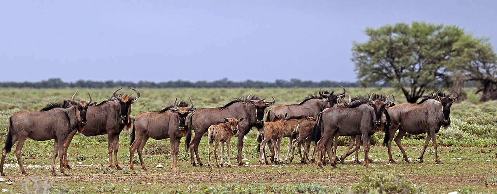
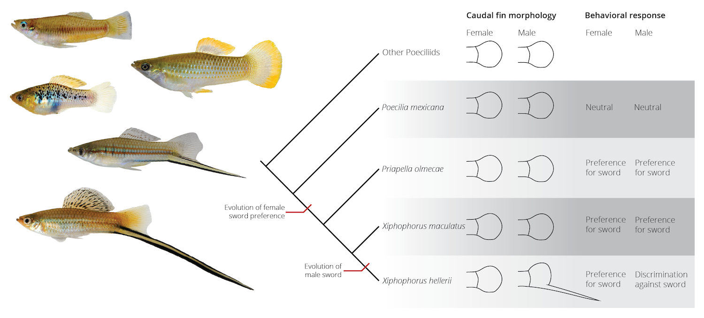

# Social Behavior and Sexual Selection

One of the biggest fascinations people have with animals is the complex behaviors that govern their lives. Blue wildebeest (*Connochaetes taurinus*; Figure \@ref(fig:gnu)) embark on extensive seasonal migrations following the rain and fresh forage across the plains of eastern Africa. Their behaviors and the structure of social groups change frequently during their lifetime and across the seasons. Wildebeest cooperate and aggregate into larger group to avoid predators during migratory periods. During the reproductive season, males stake out territories and fight. And, females tightly associate with and nurse their offspring for almost a year, until the next calf is born. How do such complex behaviors evolve?

In this chapter, we will focus on two aspects of animal behavior: First, we will discuss the evolution of social behaviors. We will take a close look at altruism (behaviors of an animal that benefit another at its own expense), because the emergence of selfless acts is not readily explained by natural selection. Then, we will examine the diverse behaviors and adaptations associated with animal reproduction. Specifically, we will explore how reproductive asymmetries between the sexes lead to different strategies for maximizing reproductive success. It is such reproductive asymmetries that lead to sexual selection, the emergence of exaggerated male courtship displays and ornaments, and the evolution of female mating preferences.

```{r gnu, echo=FALSE, out.width='100%', fig.cap = "Blue wildebeest (*Connochaetes taurinus*) herd, Etosha National Park, Namibia. Photo: [Charles J. Sharp](https://www.sharpphotography.co.uk/), [CC BY-SA 4.0](https://creativecommons.org/licenses/by-sa/4.0)."}

```

## Social Behavior

Social interactions between members of the same species can take many forms, from agonistic interactions (when individuals compete for the same resources) to cooperation (where individuals work together during foraging, predator avoidance, or reproduction). From an evolutionary perspective, different social behaviors can be categorized in terms of the fitness costs and benefits that are associated with the donor and recipient. Natural selection can readily explain the evolution of behaviors that result in a benefit for the donor, both when the recipient also benefits (cooperation) and when the recipient incurs a cost (selfish behaviors). Individuals are selected to maximize their own fitness and not the fitness of the group. For example, cooperative hunting in wolves is adaptive because a pack can tackle larger prey species than a single individual. At the same time, alpha wolves excluding members of the pack from eating the most nutritious portions of a fresh kill is also adaptive, because alpha wolves can maximize their fitness when they retain the best resources for themselves and their offspring. Thus, natural selection prompts these magnificent predators to cooperate when they need to and act selfishly when they can.

In contrast, the evolution of social behaviors that harm the donor is more difficult to explain, because natural selection is predicted to eliminate alleles that make an individual incur fitness costs without any benefits. Behaviors that incur a cost to both the donor and the recipient are called "spiteful"; and as expected by theoretical considerations, spite is rare in nature (at least outside of high schools). However, altruistic behaviors---where the donor incurs a cost to benefit the recipient---are surprisingly common. For example, prairie dogs (*Cynomys ludovicianus*) will vocalize loud warning calls when potential predators approach a colony (see video below). The advance warning allows other members of the colony to seek shelter rapidly, but it also delays the escape response of the caller. The caller exposes itself to an increased risk to help other members of the colony. How do these types of altruistic behaviors evolve? Darwin himself recognized that the prevalence of altruism in the animal kingdom is a problem of "special difficulty, which at first appeared to me insuperable, and actually fatal to my own theory" (Darwin 1859). Here, we will consider two non-mutually exclusive explanations for altruism---kin selection and reciprocity---that were developed in the 1960s and 1970s.

<figure class="video_container">

<iframe width="800" height="450" src="https://www.youtube.com/embed/A5EVowJF2W4" title="YouTube video player" frameborder="0" allow="accelerometer; autoplay; clipboard-write; encrypted-media; gyroscope; picture-in-picture" allowfullscreen>

</iframe>

</figure>

### Kin Selection

The English evolutionary biologist Bill Hamilton proposed that alleles for altruism can spread in a population if two things are true: (1) Altruistic behaviors primarily benefit closely related individuals, and (2) if the costs of an altruistic act to the donor is small compared to the benefit gained by the recipient. Specifically, Hamilton's rule posits that altruism can evolve under the following condition:

```{=tex}
\begin{align} 
Br-C>0 \iff r>\frac{C}{B} (\#eq:44)
\end{align}
```
In this case, *B* is the benefit to the recipient, *C* is the cost to the donor, and *r* is the coefficient of relatedness between the two individuals. Note that *r* is double the coefficient of inbreeding (*F*), which was introduced in [Chapter 6](evolutionary-mechanisms-ii-mutation-genetic-drift-migration-and-non-random-mating.html#non-random-mating-not-much-of-a-force). So altruism, even among more distantly related individuals, can spread in a population as long as the cost to benefit ratio is smaller than *r* (Equation \@ref(eq:43)).

The rationale behind this transformative idea was that if fitness is an individual's contribution to the gene pool of the next generation, and if related individuals share some of the same genes, then the contribution of relatives to the gene pool of the next generation should also count toward an individual's fitness. To formalize this idea, Hamilton broadened how we define fitness. According to his definition, the inclusive fitness of an individual is the sum of an individual's personal reproduction (direct fitness) and the reproduction of relatives (indirect fitness). So an individual can increase its inclusive fitness by investing in its own reproduction *and* by aiding the reproduction of a relative, as long as the costs and benefits follow Hamilton's rule. This form of natural selection, which favors costly traits that increase indirect fitness, is called kin selection.

The idea of kin selection makes a very simple, testable prediction: individuals should behave altruistically toward kin more often than toward unrelated individuals. Observational studies on prairie dogs' propensity to vocalize warning calls during simulated predator attacks support this prediction. Both female and male prairie dogs are more likely to respond to predator attacks when kin are present (Figure \@ref(fig:pdogs)A). In addition, the behavior of individual prairie dogs changes throughout their lives. Hogland (1983) followed several male prairie dogs as they lived in their birth colony (kin present), emigrated to a new colony upon reaching sexual maturity (kin absent), became reproductive in that new colony and sired their own offspring (kin present), and---in one rather sad case---were evicted from their breeding colony at old age (kin absent). As you can see in Figure \@ref(fig:pdogs)B, even intra-individual variation in behavior is consistent with kin selection, as males behave more altruistically when kin is present, and they behave more selfishly when kin is absent.

```{r message=FALSE, warning=FALSE, include=FALSE}
library(ggplot2)
library(imager)
library(grid)
library(gridExtra)
library(magick)
library(ggpubr)
library(RColorBrewer)
```

```{r pdogs, echo=FALSE, message=FALSE, warning=FALSE, fig.height=4, fig.width=8, out.width='100%', fig.cap="A. Percent of individual prairie dogs (*Cynomys ludovicianus*) responding with an alarm call to a  simulated predator attack. Both males and females have a higher propensity to respond when related individuals are present. [Data](data/10_prairie-dogs1.csv) from Hogland (1983). B. Behavioral changes of male prairie dogs as they move from their birth colony (kin present), to a new colony (kin absent), where they eventually sire their own offspring (kin present), and are eventually evicted from (no kin present). Note data from different individuals is coded in different colors. [Data](data/10_prairie-dogs2.csv) from Hogland (1983)."}
pdogs1 <- read.csv("data/10_prairie-dogs1.csv")
pdogs2 <- read.csv("data/10_prairie-dogs2.csv")
pdogs2$stage <- factor(pdogs2$stage, levels = c("Living in birth colony", "Moved to new colony", "Breeding in colony", "Evicted"))

pd.p1 <- ggplot(pdogs1, aes (x=sex, y=response.rate, color=kin))+
    geom_point(position=position_dodge(width = .5))+
    geom_errorbar(aes(ymin = response.rate-se, ymax = response.rate+se), width = 0.2, position=position_dodge(width = .5))+
    labs(x= "Sex", y="Response rate to pradator attack", color="Kin")+
    theme_classic()+
    theme(legend.position = c(0.85,0.13))+
    scale_color_brewer(palette = "Set2")

pd.p2 <- ggplot(pdogs2, aes (x=stage, y=response.rate, group=individual, color=individual))+
    geom_point()+
    geom_line()+
    labs(x= "Life stage", y="Response rate to pradator attack")+
    theme_classic()+
    scale_x_discrete(guide = guide_axis(n.dodge=2))+
    theme(legend.position = "none")+
    scale_color_brewer(palette = "Set2")

ggarrange(pd.p1,pd.p2, labels = c("A", "B"), ncol=2)
```

Kin selection has changed our understanding of evolution beyond altruism. The conceptual framework established by Hamilton has also been applied to understand patterns of cannibalism (*e.g.*, spadefoot toad tadpoles avoid eating siblings but will feast on other conspecifics), conflicts between parents and their offspring (*e.g.*, mothers maximize their fitness by equally investing in all offspring, but offspring maximize their fitness by receiving more resources than their siblings), and the evolution eusociality with non-reproductive casts in hymenopterans, termites, and naked mole-rats.

::: {.alert .alert-block .alert-info}
<b>Explore More: Kin Selection and the Evolution of Eusociality</b>

If you are interested in learning more about kin selection and the debates around social biology, check out the Quanta Magazine article "[The Elusive Calculus of Insect Altruism](https://www.scientificamerican.com/article/the-elusive-calculus-of-insect-altruism/)" by Jordana Cepelewicz.
:::

### Reciprocal Altruism

To explain the evolution of altruism between unrelated individuals, Bob Trivers proposed that individuals can be selected to help others if they can expect an equally valuable payback later on. This idea is known as reciprocal altruism. Two conditions need to be met for reciprocal altruism to spread in a population: (1) Similar to Hamilton's ideas, the cost of an altruistic act to the donor must be smaller then the benefit to the recipient. (2) Individuals that do not reciprocate an altruistic act need to be punished. Accordingly, reciprocal altruism is expected to evolve especially in species with stable social groups that offer many opportunities for symmetrical altruistic acts and with good memory to keep track of both reliable and unreliable group members.

Evidence for reciprocal altruism comes from a variety of mammal species, including lions and primates. For example, vervet monkeys (*Chlorocebus pygerythrus*) are more likely to respond to solicitations of help if they were previously groomed by the solicitor (Figure \@ref(fig:vervet)). Most notably, previous grooming experience only impacts the decision-making between unrelated individuals. Responsiveness to solicitations from kin is equally high irrespective of grooming history, indicating that kin selection and reciprocal altruism both play a role.

```{r vervet, echo=FALSE, message=FALSE, warning=FALSE, fig.height=4, fig.width=8, out.width='100%', fig.cap="A. Juvenile vervet monkey (*Chlorocebus pygerythrus*). Photo: Charles J. Sharp, [CC BY-SA 4.0](https://creativecommons.org/licenses/by-sa/4.0). B. Grooming between unrelated individuals increases the probability that they will subsequently attend to each others' solcitations for aid (as measured by vocalization responses). In contrast, grooming did not impact interactions between kin. [Data](data/10_vervets.csv) from Seyfarth and Cheney (1984)."}
vervets <- read.csv("data/10_vervets.csv")
vervets$grooming <- factor(vervets$grooming, levels= c("No prior grooming", "After grooming"))
vervet.pic <- rasterGrob(load.image("images/vervet.jpg"))

ververt.p <- ggplot(vervets, aes (x=relationship, y=response, color=grooming))+
    geom_point(position=position_dodge(width = .5))+
    geom_errorbar(aes(ymin = response-sd, ymax = response+sd), width = 0.2, position=position_dodge(width = .5))+
    labs(x= "Relationship", y="Response duration", color="Grooming history")+
    theme_classic()+
    theme(legend.position = c(0.25,0.88))+
    ylim(NA,10)+
    scale_color_brewer(palette = "Set2")

ggarrange(vervet.pic,ververt.p, labels = c("A", "B"), ncol=2)
```

The idea of reciprocal altruism ushered in a new area in mathematical biology that sought to explain under what circumstances individuals might choose to cooperate with each other, or not. Game theory provides an analytical framework to quantify the merit of different behavioral strategies based on a payoff matrix that describes the outcomes of different interactions.

To explore this in more detail, let's consider a classical game analyzed in game theory, called the prisoner's dilemma. Imagine two crooks were picked up by the police and held in separate cells for interrogation, so they cannot communicate with each other. The cops don't actually have enough evidence for a conviction for the murder the crooks are accused of, but they have plenty of evidence to convict them of some lesser crimes. So the cops offer each the prisoners a bargain: betray your friend and testify against them, or cooperate with them and stay silent. Of course there are four possible outcomes to the dilemma (Table 10.1): (1) Both prisoners cooperate with each other by staying silent, and as a consequence, both only have to serve the sentence for the minor crime (reward, *R*). (2) Prisoner 1 cooperates but prisoner 2 rats his friends out. In this case, prisoner 1 gets the sentence for murder with an extra hard sentence for lying (they get the sucker's payoff, *S*), and prisoner 2 walks free for helping the police. (3) Prisoner 1 defects and prisoner 2 cooperates. In this case, prisoner 1 walks free for helping the police (they receive the temptation payoff, *T*), and prisoner 2 gets the harsh sentence for murder. (4) Both prisoners defect, and they both get punished for murder (punishment, *P*). In a classical prisoner's dilemma game, the payoffs must fulfill the following conditions:

```{=tex}
\begin{align} 
T>R>P>S (\#eq:45) \\
R>\frac{S+T}{2} (\#eq:46)
\end{align}
```
So what would you do if you were in this situation? From an evolutionary perspective, the optimal solution is clear if the game is only played once: you should defect! If you assume your opponent cooperated, defecting is a better option (you would walk free). If you assume your opponent is defecting, you should still defect because the punishment lower (*P*\>*S*). Simply put: behaving selfishly is the optimal strategy if you only have one chance to play this game.

If the game is played multiple times, however, the strategy with the highest payoff for each individual is called tit for tat (TFT). This strategy requires that an individual initially cooperates with any new opponent it encounters. In any subsequent interactions, individuals then respond in the same way their opponent did in the previous round. So if the opponent cooperated in the last interaction, the best strategy is to keep cooperating; if the opponent defected in the last interaction, the best strategy is to retaliate by defecting this time around, just to return back to cooperation during the next interaction. Note optimal strategies in these types of games change depending on the conditions set up in the the payoff matrix. For example, the optimal strategy under a more relaxed set of condition is tit for two tat, where players forgive two defections before retaliating and returning to cooperation.

The tit-for-tat strategy in the case of the classical prisoner's dilemma (*i.e.*, under the condition set forth by Equations \@ref(eq:45)-\@ref(eq:46)) is called an evolutionary stable strategy (ESS). When adopted by all individuals in the population, an ESS cannot be displaced by any alternative strategy, and any mutation that introduces a novel strategy will be selected against. ESS are essentially equivalent to Nash equilibria---the mathematical solution to non-cooperative games in game theory. This provides a powerful framework to study animal behavior in an evolutionary context, because we can use game theory to make theoretical predictions about the optimality of social behaviors and then test those predictions using experiments (similar to the use of the marginal value theorem in optimal foraging analyses discussed in [Chapter 9](adaptation-and-phenotypic-plasticity.html#fig:optfor1)).

|                             | Opponent 2: Cooperation | Opponent 2: Defection |
|--------------------------|:---------------------:|:---------------------:|
| **Opponent 1: Cooperation** |       R (reward)        |  S (sucker's payoff)  |
| **Opponent 1: Defection**   |  T (temptation payoff)  |    P (punishment)     |

: Table 10.1: Example of a payoff matrix for an interaction between two players. In the prisoner's dilemma, conditions for *R*, *S*, *T*, and *P* are defined by Equations 10.2 and 10.3.

::: {.alert .alert-block .alert-info}
<b>Explore More: Play the Game!</b>

The [Evolution of Trust website](https://ncase.me/trust/) provides an interactive introduction to game theory, where you can actually play games to learn the general evolutionary principles of the evolution of cooperation. If you just want to have a go at a round of the classical prisoner's dilemma, [you can play here](https://www.gametheory.net/Mike/applets/PDilemma/Pdilemma.html).
:::

## Sexual Selection

Social interactions between individuals of the same species frequently occur during reproduction. Among the most conspicuous phenomena evident during reproductive interactions are the disparities in appearance and behavior of males and females from the same species. Think of male elk fighting with their elaborate antlers, while females wander by to evaluate the different contenders. Or check out male birds of paradise with their flashy colors, elongated feathers, and bizarre dance moves... all to impress largely disinterested females.

<figure class="video_container">

<iframe width="800" height="450" src="https://www.youtube.com/embed/nWfyw51DQfU" title="YouTube video player" frameborder="0" allow="accelerometer; autoplay; clipboard-write; encrypted-media; gyroscope; picture-in-picture" allowfullscreen>

</iframe>

</figure>

If such sexual dimorphism in physical appearance and behavior is the consequence of adaptive evolution, selection clearly has to be acting differently on each sex. Darwin (1871) introduced the idea of sexual selection---like kin selection, a special form of natural selection---to describe how members of each sex can maximize their fitness in the context of different constraints imposed on each sex. In this section, we will first examine what sex-specific constraints cause sexual selection, and then explore the evolutionary consequences of sexual selection for interactions between members of the same sex and interactions between the sexes.

### Causes of Sexual Selection

The core cause for sex-specific selection is that males and females differ in their investment into the production of offspring. Angus John Bateman, an English geneticist, was the first to recognize that the production of sperm in males requires substantially less energetic investment than the production of eggs in females (hence, this is now known as Bateman's principle). These asymmetries in energetic investment between the sexes hold true across a broad range of taxa (Figure \@ref(fig:gamete)), and the magnitude of the differential investment is staggering: females invest about 300 % of energy used for basal metabolism into the production of egg biomass, while males only invest about 0.1 % into the production of sperm (Hayward and Gillooly 2011). That is, on average, a 3,000-fold difference in energetic investment just into the production of gametes. In many species, however, investment into offspring does not stop with the production of gametes; females often provide offspring with resources and protection during internal gestation and after birth. In mammals, for example, the energetic costs associated with gamete production is not all that different between the sexes, but female costs associated with maternal provisioning during pregnancy and milk production postpartum by far outweigh energetic investments by males of the same species. By an large, mothers tend to make much larger energy and time investments into the production of offspring than fathers do.

```{r gamete, echo=FALSE, message=FALSE, warning=FALSE, out.width='100%', fig.cap="Relationship between body mass and daily production rates of sperm and egss across different groups of organisms. Based on production rates, the energetic cost of egg production is about 3 orders of magnitude higer than the cost of sperm production. In other words, females invest about 300% of energy used for basal metabolism into the production of egg biomass, while males only invest about 0.1% of energy used for basal metabolism into the production of sperm biomass. [Data](data/10_gamete-production.csv) from Hayward and Gillooly (2011)."}
gamete <- read.csv("data/10_gamete-production.csv")
ggplot(gamete, aes(x=log.mass, y=log.gam.prod, shape=gamete))+
    geom_smooth(method = "lm", se=FALSE)+
    geom_point(aes(color=group))+
    labs(x="Body mass (log-transformed in g)", y="Daily gamete production rate \n (temperature-corrected, log-transformed in W)", 
         shape="Gamete type", color="Taxonomic group")+
    theme_classic()+
    scale_color_brewer(palette = "Set2")
```

The asymmetries in parental investment between the sexes set different constraints on the maximum reproductive output for males and females. The maximum reproductive output of females is primarily constrained by time and energy. There are only so many eggs one female can produce, or only so many times a female can be pregnant during her lifetime. In contrast, the reproductive success of males is primarily constrained by the number of mating partners. As a consequence, males can increase their lifetime reproductive success much more dramatically when they mate with multiple females than females can when they mate with multiple males (Figure \@ref(fig:salamander)). The slope of the regression line between the number of mates and the number of offspring is a direct measure of the strength of sexual selection on that sex (these regression lines are also known as Bateman gradients or sexual-selection gradients). The slope of these sexual-selection gradients and the differences in the slopes between the sexes can vary dramatically among species. For example, in species where a significant investment of both the mother and the father is required (think of the many songbirds with biparental care), the sexual-selection gradients may be relatively flat and not significantly different between the sexes. In such cases, sexual selection is relatively weak. In contrast, sexual selection is particularly strong in lekking-species, where males provide nothing to the production of offspring besides the sperm needed for the fertilization of eggs, and females are left to produce and take care of the offspring.

```{r salamander, echo=FALSE, message=FALSE, warning=FALSE, out.width='100%', fig.cap=" The number of offspring produced as a function of mating success for male and female rough-skinned newts (*Taricha granulosa*). The rate at which males can increase their reproductive success through multiple mating exceeds that of females. Note that the slope of the best-fit lines are also known as sexual-selection gradients. [Data](data/10_salamdander-mating.csv) from Jones et al. (2002)."}
salamander <- read.csv("data/10_salamdander-mating.csv")
ggplot(salamander, aes(x=mates, y=offspring, color=sex))+
    geom_smooth(method = "lm", se=FALSE)+
    geom_point()+
    labs(x="Number of mates", y="Number of offspring", color="Sex")+
    theme_classic()+
    scale_color_brewer(palette = "Set2")
```

An inadvertent consequence of the asymmetries in parental investment between the sexes is that variation in reproductive success is much more pronounced in males than in females. Typically, most females that survive to adulthood will have at least some reproductive success, and differences in reproductive success among females are relatively small. For example, lifetime reproductive success in female elephant seals (*Mirounga angustirostris*) that reach adulthood ranges between 1 and 10 (Figure \@ref(fig:seaele)). In contrast, variation in reproductive success in males is much more pronounced, because males compete intensely for access to females. Some males end up winning in these competitive interactions and sire a disproportionate amount of offspring in a population, denying that opportunity to many other males that were defeated. Thus, most male northern elephant seals have zero reproductive success even if they reach sexual maturity, and a small number of dominant males can produce up to 100 offspring each during their lifetime (Figure \@ref(fig:seaele)).

```{r seaele, echo=FALSE, message=FALSE, warning=FALSE, out.width='100%', fig.cap="Variation in lifetime reproductive success for female and male northern elephant seals (*Mirounga angustirostris*). Most individuals of both sexes never reproduce successfully. But while successful females can maximally produce 10 offspring during their lifetime, some male sea elephants that successfully monomolize females in a harem can sire up 100 offspring. [Data](data/10_sea-elephants.csv) from Le Boeuf and Reiter (1988)."}
seael <- read.csv("data/10_sea-elephants.csv")
ggplot(seael, aes(x=offspring, y=percent, fill=sex, color=sex))+
    geom_col()+
    labs(x="Number of offspring", y="Percent of the population")+
    theme_classic()+
    ylim(0,100)+
    facet_wrap(~sex, nrow=2)+
    theme(legend.position = "none")+
    scale_fill_brewer(palette = "Set2")+
    scale_color_brewer(palette = "Set2")
```

Asymmetries in reproductive success are also evident in humans. The record for most children born goes to Mrs. Feodor Vassilyev in 19^th^ century Russia, who reportedly had 69 children carried over 27 pregnancies. In contrast, the record for most children sired is held by Moulay Ismail, an emperor of the Moroccan Alaouite dynasty that fathered at least 1,171 children from 1672 - 1727. While these are obviously extreme outliers, a similar reproductive skew is observable when we analyze reproductive rates in women and men across different countries (Figure \@ref(fig:hooman)). Especially in countries where women bear more than four children on average, there is clear evidence for a skew in reproductive output between men and women, as indicated by the fact that many points lie above the 1:1 line that indicated equal reproductive output.

```{r hooman, echo=FALSE, message=FALSE, warning=FALSE, out.width='100%', fig.cap="Variation in male and female fertility across ~80 different countries. [Data](data/10_human-reproduction.csv) from United Nations (2015)."}
hooman <- read.csv("data/10_human-reproduction.csv")
ggplot(hooman, aes(x=child.woman, y=child.man))+
    geom_abline(intercept = 0, slope = 1, color="gray")+
    geom_point()+
    labs(x="Children per woman", y="Children per man")+
    xlim(1,14)+ylim(1,14)+
    theme_classic()
```

Ultimately, the evolutionary consequence of reproductive asymmetries between the sexes is that natural selection favors different strategies in males and females to maximize reproductive success. Males, whose reproductive success is primarily constrained by the number of mates, should face intense competition among each other and evolve traits that allow them to exclude competitors and monopolize females. In turn, females, being constrained by time and and energy, should be fiercely protective of their heavy investment and carefully choose potential mates in a way that maximizes their own and their offspring's fitness.

### Intrasexual Selection: Male-Male Competition

Competition between males for access to females is also known as intrasexual selection. Intrasexual selection favors traits that increase male's ability to fertilize as many eggs as possible, either by overt combat with other males or more covert strategies. In addition, intrasexual selection can lead to sexual conflict, because strategies that maximize the reproductive success of one sex (typically the males) may be detrimental to the reproductive success of the other sex (typically the females).

#### Overt Combat {.unnumbered}

Intense competition between males for access to females should favor traits that allow males to exert dominance over competitors and exclude them from copulating with females in the population. Hence, male-male competition tends to lead to the evolution of increased male body size (leading to sexual size dimorphism), weapons and defensive structures, and tactical cleverness (Figure \@ref(fig:sexdim)). The development of such traits can come at considerable costs for males. In many species with strong intrasexual selection, males have a delayed onset of sexual maturity, and even sexually mature males may not be competitive for multiple breeding seasons. For example, male lions often live solitarily or in small bachelor prides for several years until they are strong and experienced enough to challenge a resident alpha male. In addition, males are often unable to sustain reproductive activities for prolonged periods of time, and the maintenance of alpha status is associated with loss of body condition and increased mortality. So while female elk reach peak reproductive capacity by age four and are able to maintain that productivity for up to a decade, male elk do not reach peak reproductive capacity until age eight or nine and can only maintain it for a few reproductive seasons (Figure \@ref(fig:elk)).

```{r sexdim, echo=FALSE, out.width='100%', fig.cap = "Examples of evolutionary outcomes in response to strong intrasexual selection: antlers in moose (*Alces alces*) used for fighting; the lion's (*Panthera leo*) mane provides protection during fights with competitors; sexual size dimoprhism in elephant seals (*Mirounga angustirostris*) and American bison (*Bison bison*). All photos are [CC0](https://creativecommons.org/publicdomain/zero/1.0/)."}
knitr::include_graphics('images/sexdim.png')
```

```{r elk, echo=FALSE, message=FALSE, warning=FALSE, fig.height=3.5, fig.width=7, out.width='100%', fig.cap="A. Sex-dependent survivial in elk (*Cervus canadensis*). Male survival declines rapidly after the onset of peak reproductive productivity. B. Average reproductiove output for male and female elk. Females start producing calves earlier in life and longer than males. Males do not start reproducing succeffully until later in life, and their reproductive output declines fast after they reach their peak. [Data](data/10_assortative-mating.csv) from Del Castillo et al. (1999)."}
elk1 <- read.csv("data/10_elk1.csv")
elk2 <- read.csv("data/10_elk2.csv")
elk.p1 <- ggplot(elk1, aes(x=age, y=survivors, color=sex))+
    geom_line()+
    geom_point()+
    labs(x="Age (years)", y="Number of survivors", color="Sex")+
    scale_y_log10()+
    xlim(1,17)+
    theme_classic()+
    theme(legend.position = c(0.18, 0.16))+
    scale_color_brewer(palette = "Set2")

elk.p2 <- ggplot(elk2, aes(x=age, y=calves, color=sex))+
    geom_smooth(se=FALSE)+
    geom_point()+
    labs(x="Age (years)", y="Mean number of calves per year", color="Sex")+
    xlim(1,17)+
    theme_classic()+
    theme(legend.position = "none")+
    scale_color_brewer(palette = "Set2")

ggarrange(elk.p1, elk.p2, labels = c("A", "B"), ncol=2)
```

#### Covert Combat {.unnumbered}

Competition among males for access to females does not always lead to overt combat with physical altercation; competition can also play out in more subtle ways, especially when males cannot prevent females from copulating with other males. In many species, individual females may be mating with multiple males during a reproductive cycle, and competition between males still occurs after insemination. Specifically, sperm of different males are competing for the fertilization of a female's eggs. In species with intense sperm competition, selection can favor males that produce larger ejaculates with more sperm, as evidenced---for example---by the correlation between testis size and the degree of promiscuity in apes. If you are wondering... humans are right in between gorillas (smaller testicles because the dominance of a single male reduces sperm competition) and chimpanzees (larger testicles due to intense sperm competition associated with frequent multiple mating).

Adaptive responses to sperm competition are also associated with changes in sperm quality. For example, selection can act on sperm mobility (swimming speed) and sperm longevity, providing males with an advantage when their sperm compete with others for fertilization. In many species with internal fertilization, males have also evolved other strategies that prevent other males from successfully inseminating females or fertilizing their eggs. Males of some species prevent other males from copulating with females by mate guarding (*e.g.*, the amplexus seen in many anurans), prolonged periods of copulation (*e.g.*, the post-copulatory tie in dogs when the male's penis swells inside of the females vagina, physically tying both partners together), or in the form of copulation plugs, where males deposit proteins along with their ejaculate that literally seal up females' genital tract and prevent successful copulation by other males (*e.g.*, in some primates, rodents, and many arthropods). Males of some species have modified copulatory organs that not only allow for the deposition of sperm into females' genital tracts, but that can also remove sperm deposited by other males (this is called sperm displacement). Sperm displacement adaptations are well documented in arthropods (Figure \@ref(fig:damsel)) and surprisingly well-studied in humans as well. Another strategy is the release of toxic substances in ejaculates that can impede the success of competing sperm or the propensity of females to mate with other partners. This strategy is well studied in insects, where toxins are produced in accessory glands associated with the male gonads; hence, these toxins are known as accessory gland proteins (AGPs).

```{r damsel, echo=FALSE, message=FALSE, warning=FALSE, fig.height=3.5, fig.width=7, out.width='100%', fig.cap="A. Mating in the damselfly *Hemiphlebia mirabilis*. During stage I of the copulation, males use their modified genitalia to remove sperm from previous copulations. B. Sperm volumes found in female damselflies before copulation, at the end of stage I, and after the copulation. The decline in volume at the end of stage I indicates that males remove sperm from previous partners to replace it with theor own. [Data](data/10_damsel.csv) from Cordero-Rivera (2016)."}
damsel.d <- read.csv("data/10_damsel.csv")
damsel.p <- rasterGrob(load.image("images/damsel.jpg"))
damsel.d$stage <- factor(damsel.d$stage, levels = c("Precopula", "End stage I", "Postcopula"))

dam.p1 <- ggplot(damsel.d, aes (x=stage, y=sperm.volume))+
    geom_point()+
    geom_errorbar(aes(ymin = sperm.volume-sd, ymax = sperm.volume+sd), width = 0.2)+
    labs(x= "Mating stage", y="Sperm volume")+
    theme_classic()

ggarrange(damsel.p, dam.p1, labels = c("A", "B"), ncol=2)
```

Covert combat, however, is not restricted to sperm competition. Whenever intense competition opens an evolutionary arms race toward ever greater physical prowess, it also opens up space for alternative mating strategies. Some males just work smarter and not harder. Alternative mating strategies are common in many insects and fishes, and typically associated with smaller males---so called "sneakers"---that sneak copulations with females. In bluegill sunfish (*Lepomis machrochirus*), for example, parental males grow large, defend territories, and woo females using courtship displays. Parental males also provide brood care after spawning, thus heavily investing in reproduction. In contrast, sneaker males mature at a much smaller size (Figure \@ref(fig:sufisneakers)) and mimic females in coloration and even pheromone profile. The small males dart into the nest of parental males during the spawning act and release their own sperm, inadvertently fertilizing some of the eggs that are laid by the females and without participating in brood care later on. Sneaker males are exquisitely adapted to this alternative mating strategy. They are essentially swimming testes, as up to 25% of a sneaker male's body mass is invested into its gonads (Figure \@ref(fig:sufisneakers)). As a consequence, sneaker males produce much more sperm than parentals, although there is a trade-off with sperm longevity (Figure \@ref(fig:sufisneakers)).

Alternative mating strategies are maintained within populations by negative frequency-dependent selection. When sneaker males are rare, they have an advantage because parental males do not pay attention to them. As they become more common, however, parental males grow more vigilant and limit the success of sneakers by chasing them away, thus reducing their frequency in the population.

```{r sufisneakers, echo=FALSE, message=FALSE, warning=FALSE, out.width='100%', fig.cap="Bluegill sunfish (*Lepomis machrochirus*) have males with different mating strategies. Parental males grow large and defend territories with developing young, while sneaker males are much smaller and steal fertilizations from parental without providing any care. The alternative reproductive strategies are reflected in differential investments into gonad development (gonadosomal index, GSI) as well as sperm traits (number and longevity). [Data](data/10_sunfish1.csv) from Neff et al. (2003)."}
sufi1 <- read.csv("data/10_sunfish1.csv")
sufi1$trait <- factor(sufi1$trait, levels = c("Mass", "GSI"))
sufi2 <- read.csv("data/10_sunfish2.csv")

sufi.p1 <- ggplot(sufi1, aes(x=group, y=value))+
    geom_boxplot()+
    theme_classic()+
    labs(x="", y="Trait value")+
    facet_wrap(~trait, scale="free")

sufi.p2 <- ggplot(sufi2, aes (x=group, y=value))+
    geom_point(position=position_dodge(width = .5))+
    geom_errorbar(aes(ymin = value-se, ymax = value+se), width = 0.2, position=position_dodge(width = .5))+
    labs(x= "Reproductive strategy", y="Trait value")+
    theme_classic()+
    facet_wrap(~trait, scale="free")

ggarrange(sufi.p1,sufi.p2,  nrow=2)
```

### Sexual Conflict

Male adaptations to intrasexual selection can impose significant costs on females, leading to sexual conflict. Sexual conflict occurs whenever the two sexes embark on conflicting reproductive strategies to maximize their fitness. For example, males might maximize their reproductive output by maximizing the number of copulations they conduct, but females might maximize their fitness by minimizing the number of copulations after their eggs are fertilized. After all, extraneous copulations can come with a potential loss of foraging opportunities, physical harm, and sexually transmitted diseases.

However, females are not passive bystanders in these mating games. In some species, females have evolved structural adaptations to minimize the negative impacts of unwanted copulations, or to make copulations without cooperation difficult, if not impossible. In others, females are able to produce enzymes that break down copulation plugs or neutralize the damaging effects of AGPs. Many species can also store sperm, which allows females to minimize interactions with males all together.

So while intrasexual selection drives males to evolve traits that mediate ever higher persistence, females evolve traits that mediate resistance to unwanted male advances; there is a continuous cycle of adaptation and counteradaptation---an antagonistic coevolutionary arms race between persistence and resistance traits (just like the arms race between hosts and pathogens). This notion contrasts starkly with the romantic "the birds and the bees" perspective of reproductive biology. Yes, both sexes are required for successful reproduction (in most species at least), and there is a certain degree of shared interest and cooperation between males and females, especially in species where males also participate in parental care. But in many species, the reproductive interactions between the sexes are marred by conflicting interests, and traits that mediate high male persistence can cause significant reductions of female fitness. An extreme example is a form of mating called traumatic insemination (found in beg bugs and other insects), where males use hypodermic genitalia to pierce through the females' body wall during copulation. Males completely bypass females' choice and genital tract and ejaculate directly into the blood system, from where eggs are fertilized. Females subject to traumatic insemination can face significant costs associated with wound healing and infection, reducing their overall reproductive success.

The evolutionary impacts of sexual conflict are illustrated by the coevolution of male and female genitalia in waterfowl with different mating systems. While most birds lack external genitalia, male waterfowl have evolved a phallus. The length and morphological complexity of the phallus varies among species and is dependent on the frequency of forced extra-pair copulations. Species in which such copulations are rare have small (\~1.5 cm), simple phalli; those with a high frequency of forced extra-pair compilations have longer phalli (up to 40 cm) that are covered with spines and groves (see Figure \@ref(fig:duckpenis)A-D). Hence, larger and more complex phalli provide males with an advantage when trying to copulate with uncooperative females. Female waterfowl, however, also exhibit exceptional variation in their genitalia, including dead-end sacs (pouches) and clockwise coils associated with their vaginae. Comparative analyses have indicated that the complexity of vaginal morphology is directly correlated with phallus length (Figure \@ref(fig:duckpenis)E), suggesting that vaginal complexity has evolved as a counteradaptation that limits the success of unwanted copulations. Consequently, the elaboration of traits that increase male persistence may not be just a consequence of intense competition between males, but also conflicting interests between the sexes.

```{r duckpenis, echo=FALSE, message=FALSE, warning=FALSE, fig.height=3.5, fig.width=7, out.width='100%', fig.cap="Examples of genital covariation in waterfowl. (A) Harlequinduck (*Histrionicus histrionicus*) and (B) African goose (*Anser cygnoides*),two species with a short phallus and no forced copulations, in which females have simple vaginas.(C) Long-tailed duck (*Clangula hyemalis*), and (D) Mallard (*Anas platyrhynchos*), two species with a long phallus and high levels of forced copulations, in which females havevery elaborate vaginas (size bars = 2 cm). Bracket = phallus; asterisk = testis; star = muscular base of the male phallus; triangles = upper and lower limits of the vagina. (E) Relationship between male phallus length and the number of pouches and spirals in the female vagina across different species of waterfowl. Pictures and [data](data/10_duck-genitals.csv) from Brennan et al. (2007)."}
duck <- read.csv("data/10_duck-genitals.csv")
duck.pic <- rasterGrob(load.image("images/duckp.png"))

duck.p <- ggplot(duck, aes(x=phallus.length, y=number))+
    geom_point()+
    geom_smooth(method = "lm", se=FALSE)+
    labs(x="Phallus length", y="Number")+
    theme_classic()+
    facet_wrap(~female.trait, ncol=2, scales = "free")

ggarrange(duck.pic, duck.p, widths = c(1, 2), labels = c("", "E"), ncol=2)
```

### Intersexual Selection: Female Mate Choice

In many species where males' ability to monopolize females is limited, they instead compete for mates through courtship. In such cases, females choose with whom they mate; such selection via female choice is known as intersexual selection. Females have been documented making mate choices based on a wide variety of behavioral, structural, color, and chemical traits (Figure \@ref(fig:manakin)). In this section, we will explore why females evolve preferences for particular male traits and how those preferences in turn affect the evolution of male ornaments.

```{r manakin, echo=FALSE, message=FALSE, warning=FALSE, fig.height=3.5, fig.width=7, out.width='100%', fig.cap="A.Male golden-collared manakin (*Manacus vitellinus*). Photo by [Aaron Maizlish](https://www.flickr.com/photos/amaizlish/), [CC BY-NC 2.0](https://creativecommons.org/licenses/by-nc/2.0/). B. Female manakins make mating decisions based on the coloration of males, and plumage brightness predicts male mating success in this species. [Data](data/10_manakin.csv) from Stein and Uy (2005)."}
manakin <- read.csv("data/10_manakin.csv")
manakin.pic <- load.image("images/manakin.jpg")
manakin.pic2 <- rasterGrob(manakin.pic)
manakin.p <- ggplot(manakin, aes(x=collar.brightness, y=mating.success))+
    geom_smooth(method = "lm", se=FALSE)+
    geom_point()+
    labs(x="Standardized collar brightness", y="Standardized male mating success")+
    theme_classic()

ggarrange(manakin.pic2, manakin.p, widths = c(1.5, 1.5), labels = c("A", "B"), ncol=2)
```

#### Chooser Biases {.unnumbered}

Females may not specifically evolve a preference for a particular male trait; rather, they may just have one. Of course, females' sensory systems are primarily shaped by natural selection, not sexual selection. Each species' senses are fine-tuned to filter out relevant information from background noise for orientation, foraging, predator avoidance, and social interactions. Male sexual signals may simply evolve to match the sensory perceptions that females have already evolved in another context. For example, imagine a bird species that is specialized to forage on red fruit, and thus has evolved a visual system attuned to detecting red against a background of green leaves. A male that exhibits a mutation for red feathers may become more attractive to females because of their pre-existing adaptations for detecting red. In such a case, males are said to exploit pre-existing sensory biases by tuning their sexual signals to match the sensitivity of females' sensory systems.

Sensory adaptations associated with foraging have been associated with female preferences in a variety of taxa, and the hypothetical example with the red color is grounded in actual examples from fish. Both guppies (*Poecilia reticulata*) and stickleback (*Gasterosteus aculeatus*) exhibit mating preferences for red and orange male ornaments and show similar biases for red and orange food items during foraging. Similarly, male water mites (*Neumania papillator*) mimick the vibration of drowning prey items to attract potential female partners. Finally, males of the swordtail characin (*Corynopoma riisei*) exhibit structural ornaments attached to their gill covers that mimic the shape of the terrestrial invertebrates this species feeds on, as evidenced by the correlation between diet composition (proportion of ants) and the shape similarity between ants and the ornament (Figure \@ref(fig:corynopoma)A). In addition, the strength of female response to ant-like ornaments changes plastically when females are fed ants as opposed to non-ant prey items (Figure \@ref(fig:corynopoma)B). This observation suggests that even short-term changes in female sensory processing (*e.g.*, through habituation and learning) can change how they respond to sexual signals presented by males.

```{r corynopoma, echo=FALSE, message=FALSE, warning=FALSE, fig.height=3.5, fig.width=7, out.width='100%', fig.cap="A. The shape of male ornaments in the swordtail characin (*Corynopoma riisei*) is more similar to ants in populations where ants make up a higher proportion of the diet. B. Recent dietary experience changes female responses to male ornaments. Ant-fed females direct more bites  at ant-like orgnaments than females fed on *Drosophila* larvae (experiment 1) or flake food (experiment 2). Data on [ornament morphology](data/10_corynopoma.csv) and [female behavior](data/10_corynopoma2.csv) from Kolm et al. (2012)."}
cory1 <- read.csv("data/10_corynopoma.csv")
cory2 <- read.csv("data/10_corynopoma2.csv")
cory2$diet <- factor(cory2$diet, levels=c("Control", "Ants"))

cory.p1 <- ggplot(cory1, aes(x=diet,y=similarity))+
    geom_smooth(method="lm", se=FALSE)+
    geom_point()+
    labs(x="Proportion of ants in diet", y="Shape similarity \n between ornament and ant")+
    theme_classic()

cory.p2 <- ggplot(cory2, aes (x=diet, y=bites, color=experiment, group=experiment))+
    geom_line(position=position_dodge(width = .5))+
    geom_point(position=position_dodge(width = .5))+
    geom_errorbar(aes(ymin = bites-se, ymax = bites+se), width = 0.2, position=position_dodge(width = .5))+
    labs(x= "Diet", y="Proportion of bites", color="Experiment")+
    theme_classic()+
    theme(legend.position = c(0.8,0.2))+
    scale_color_brewer(palette = "Set2")

ggarrange(cory.p1, cory.p2, widths = c(1.5, 1.5), labels = c("A", "B"), ncol=2)
```

While correlations between female preferences in sexual and non-sexual contexts provide evidence for pre-existing sensory biases, a key prediction of sensory bias models for sexual trait evolution is that female preferences evolve prior to the the corresponding male ornaments, and not vice versa. Hence, comparative analyses that explore both the evolution of female preferences and male ornaments are requisite for identifying evidence for sensory biases. Comparative evidence for sensory biases comes from livebearing fishes of the family Poeciliidae. Males in one group of poeciliids, the swordtails of the genus *Xiphophorus*, exhibit a conspicuous extension of the caudal fin (the eponymous sword), and males with longer swords are preferred by females. However, the preference for the sword is not just present in swordtails, but also in females of swordless species in the same genus (the platyfishes) and even females of species in other genera (Figure \@ref(fig:sensorybias)). Hence, the female preference evolved well before the male ornament, and it eventually potentiated the evolution of a novel trait when a random mutation causing the development of the sword arose.

```{r sensorybias, echo=FALSE, out.width='100%', fig.cap = "The evolution of female preferences for a sword-like appendage in the caudal fin of some Poeciliid fishes predates the evolution for the actual male traits (adopted from Basolo 2002). Pictures on the left size show *Priapella*, *Poecilia*, *Xiphophorus maculatus*, and two species of swordtails (*X. hellerii* and *X. montezumae*)."}

```

It is important to note that sensory bias models of female preference evolution indicate that female preferences are non-adaptive with respect to the consequences of mate choice, at least initially. Females may gain fitness benefits by having certain sensory modalities in non-sexual context, but mating biases resulting from those sensory modalities is not expected to provide fitness benefits to the female or her offspring. In this regard, sensory bias models of preference evolution are different from other hypotheses discussed below.

#### Direct Selection on Female Preferences {.unnumbered}

Female preference for particular male traits may evolve because choosy females increase their own survival or reproductive success compared to females that mate indiscriminately. Mutations for such adaptive preferences are expected to spread rapidly in a population, and direct fitness benefits are likely a leading cause for the evolution of mating preferences.

Direct benefits are particularly important for females when males contribute resources to reproduction beyond sperm, including protection, access to territories with food resources or nesting sites, or help with parental care. In these cases, females that carefully choose males with adequate resources may be able to raise more offspring, thus increasing their lifetime reproductive success. Similarly, females that discriminate against males in poor physical condition or with signs of parasite infections are able to reduce their risk of contracting communicable diseases, potentially avoiding costs associated with immune responses or premature death.

A classic example of direct benefits are nuptial gifts that males present to females either prior to or during copulation. Such nuptial gifts and courtship feeding can be observed in birds, mollusks, and many insects. For example, male hanging flies (*Bittacus apicalis*) provide females with an insect prey during courtship, and females preferentially mate with males providing larger nuptial prey items. If males provide small prey items, females interrupt the copulation prematurely (Figure \@ref(fig:hanging)A), and such interruptions cut the male sperm transfer short (Figure \@ref(fig:hanging)B).

```{r hanging, echo=FALSE, fig.height=4, fig.width=8, out.width='100%', message=FALSE, warning=FALSE, out.width='100%', fig.cap="A. The copulation duration of hanging flies (*Bittacus apicalis*) depends on the size of the nuptial prey item a male presents to the female prior to copulation [Data](data/10_bittacus1.csv) from Thornhill (1976). B. Copulation duration is correlated with the number of sperm a male can transfer. Hence, small nuptial prey items may result in incomplete fertilization. [Data](data/10_bittacus2.csv) from Thornhill (1976)."}
hangingfly1 <- read.csv("data/10_bittacus1.csv")
hangingfly2 <- read.csv("data/10_bittacus2.csv")
hf.p1 <- ggplot(hangingfly1, aes(x=prey.size, y=copulation.time))+
    geom_point()+
    labs(x="Nuptial prey size", y="Copulation duration")+
    theme_classic()
hf.p2 <- ggplot(hangingfly2, aes(x=copulation.time, y=sperm))+
    geom_point()+
    labs(x="Copulation duration", y="Number of sperm transferred")+
    theme_classic()

ggarrange(hf.p1, hf.p2, labels = c("A", "B"), ncol=2)
```

#### Indirect Selection on Female Preferences {.unnumbered}

While direct benefits certainly explain the evolution of female preferences in many contexts, why do females prefer elaborate male ornaments and courtship displays in species where they receive little more than sperm for the fertilization of their eggs? This is all the more puzzling because exaggerated male traits are particularly common in lekking species. A lek is an aggregation of males during courtship, where they competitively display and showcase their ornaments. Females visit the lek to inspect different competitors, choose to mate with one or a few of the males, and then leave to incubate the eggs and take care of the offspring by themselves. Besides sperm, there is zero contribution of males to reproduction, and the actual interaction between males and females (*i.e.*, the copulation) can be over in a matter of seconds. So why do the females care? Consider the greater sage grouse (*Centrocercus urophasianus*) in the video below: why should females pay attention to those goofy air sacs, the fancy plumage, and the random dance moves advertised by males?

<figure class="video_container">

<iframe width="800" height="450" src="https://www.youtube.com/embed/T11rOkgpRnA" title="YouTube video player" frameborder="0" allow="accelerometer; autoplay; clipboard-write; encrypted-media; gyroscope; picture-in-picture" allowfullscreen>

</iframe>

</figure>

##### Good Genes {.unnumbered}

While females may not be getting direct fitness benefits by expressing a preference for a particular male trait, they can receive indirect fitness benefits if a particular choice benefits the survivability or reproductive success of their offspring. In other words, the exaggerated male ornaments and behaviors may be a reflection of the genetic quality of a male, potentially indicating high foraging success, metabolic efficiency, or resistance against parasites and diseases. The evolution of female mating preferences driven by such indirect fitness benefits is also known as the good genes hypothesis.

The good genes hypothesis makes two important predictions: (1) Ornaments should be reliable signals of individual quality. Hence, ornaments should be costly, such that males of inferior quality cannot cheat. (2) Females that mate with preferred mates should have offspring with higher survivorship or reproductive capacity compared to females that do not exert a choice. Empirical tests of both predictions in natural systems have provided robust evidence for the role of indirect fitness benefits in the evolution of female preferences and male traits in some species.

Evidence for the condition-dependent expression of male ornaments comes from red-collard widowbirds (*Euplectes ardens*; Figure \@ref(fig:widow)A). Males of this species exhibit elongated tail feathers, and tail feather variation among males is positively correlated with body condition, suggesting that males in better condition can grow larger tail feathers (Figure \@ref(fig:widow)B). To experimentally test the effects of tail feather variation on male mating success and energetics, Sarah Pryke and Staffan Andersson captured widowbird males in their natural habitats and subjected them to one of two treatments: males either had their tail feathers clipped, or they were left untouched. Consistent with the prediction that tail feather length in an indicator of good male quality, unclipped males had much higher mating success than males with the shortened feathers (Figure \@ref(fig:widow)C). Because tail length was manipulated experimentally and did not reflect variation in male condition, variation in mating success must have been primarily a consequence of female mate choice. Furthermore, following individual males throughout the reproductive season revealed that males with unclipped feathers lost body condition more rapidly than males with shortened tails (Figure \@ref(fig:widow)D), indicating that living with the longer tail feathers is indeed costly, as predicted by the good genes hypothesis.

```{r widow, echo=FALSE, fig.height=8, fig.width=8, out.width='100%', message=FALSE, warning=FALSE, out.width='100%', fig.cap="A. Male red-collared widowbird (*Euplectes ardens*). Photo: Francesco Veronesi, [CC BY-SA 2.0](https://creativecommons.org/licenses/by-sa/2.0). B. Male tail length is correlated with body condition. [Data](data/10_widow-bird1.csv) from Pryke and Andersson (2005). C. Males that had their tails cut short had a lower number of active nests during the breeding season compared to males whose tails were not manipulated. [Data](data/10_widow-bird2.csv) from Pryke and Andersson (2005). D. Males whose tails were cut short lost less body condition over the course of the breeding season than un-manipulated males. This indicates that the long tail actually comes at a cost. [Data](data/10_widow-bird3.csv) from Pryke and Andersson (2005)."}
wbp1 <- rasterGrob(load.image("images/widow-bird.jpg"))
wb2 <- read.csv("data/10_widow-bird1.csv")
wb3 <- read.csv("data/10_widow-bird2.csv")
wb4 <- read.csv("data/10_widow-bird3.csv")

wbp2 <- ggplot(wb2, aes(x=body.condition, y=tail.length))+
    geom_smooth(method="lm", se=FALSE)+
    geom_point()+
    labs(x="Body condition index", y="Tail length [cm]")+
    theme_classic()

wbp3 <- ggplot(wb3, aes (x=treatment, y=nests))+
    geom_point()+
    geom_errorbar(aes(ymin = nests-se, ymax = nests+se), width = 0.2)+
    labs(x= "Treatment", y="Number of active nests")+
    theme_classic()

wbp4 <- ggplot(wb4, aes(x=days, y=body.condition, color=treatment))+
    geom_smooth(method="lm", se=FALSE)+
    geom_point()+
    labs(x="Time since territory establishment [days]", y="Body condition index", color="Treatment")+
    theme_classic()+
    theme(legend.position = c(0.2,0.13))+
    scale_color_brewer(palette = "Set2")

ggarrange(wbp1, wbp2, wbp3, wbp4, labels = c("A", "B", "C", "D"), ncol=2, nrow=2)
```

Evidence for the second prediction of the good genes hypothesis comes from field observations of pronghorn antelope (*Antilocapra americana*). John Byers and Lisette Waits followed the survival of fawns that were either sired by attractive or unattractive males and found significant differences in offspring performance. Offspring of attractive males had a higher likelihood of surviving to weaning, and survivability for these offspring remained significantly elevated throughout most of their lives (Figure \@ref(fig:pronghorn)A). Exercising a choice during mating consequently provides females with indirect fitness benefits in terms of offspring survival. Interestingly, direct benefits may also contribute to the evolution of female choice in this case, because females actually pay additional costs for mating with unattractive males. Females compensate for the subpar performance of offspring from unattractive males by increasing milk delivery to their young, which requires additional energy that other females can invest into maintenance or the future production of additional offspring.

```{r pronghorn, echo=FALSE, fig.height=4, fig.width=8, out.width='100%', message=FALSE, warning=FALSE, out.width='100%', fig.cap="Evidence supporting the good genes hypothesis in pronghorn antelope (*Antilocapra americana*): A. Cummulative survival of offspring sired by attractive vs. unattractive males. Offspring of attractive males were more likely to survive to weaning and to age classes as late as 5 years. [Data](data/10_pronghorn.csv) from Byers and Waits (2006). B. Matings with unattractive males also came with additional direct costs for females, as they compensated subpar offspring performance by elevating rates of milk delivery to their young. [Data](data/10_pronghorn2.csv) from Byers and Waits (2006)."}
prong1 <- read.csv("data/10_pronghorn.csv")
prong2 <- read.csv("data/10_pronghorn2.csv")

pron.p1 <- ggplot(prong1, aes(x=age, y=cummulative.survival, color=group))+
    geom_line()+
    labs(x="Offspring age (days)", y="Cummulative survival")+
    theme_classic()+
    theme(legend.position = c(0.75,0.9), legend.title = element_blank())+
    scale_color_brewer(palette = "Set2")

pron.p2 <- ggplot(prong2, aes(x=attractiveness, y=nursing))+
    geom_smooth(method = "lm", se=FALSE)+
    geom_point()+
    labs(x="Sire attractiveness", y="Time spent nursing")+
    theme_classic()

ggarrange(pron.p1, pron.p2,labels = c("A", "B"), ncol=2)
```

##### Run-Away Selection {.unnumbered}

Indirect selection on female mating preferences may also occur when there is a genetic correlation between the expression of a male ornament and a corresponding female preference. Such genetic correlations can cause self-perpetuating evolutionary loops, where a trait becomes more exaggerated because the preference becomes stronger, and vice versa. As a consequence, both male ornaments and female preference can evolve rapidly (hence the term run-away selection). Trait and preference evolution are only bound by natural selection; *i.e.*, at some point the exaggeration of a trait starts to impact other organismal functions, and even though extreme trait and preference values may be favored by sexual selection, viability selection brings the process to a halt. Experimental evidence in variety of species have documented genetic correlations between female preferences and associated male traits that are required for runaway selection models. For example, investigating female preferences for red and the intensity of male abdominal coloration in stickleback fish has revealed significant correlations among experimental families (Figure \@ref(fig:runaway)).

Runaway selection scenarios can also arise through alternative mechanisms. For example, the sexy-son hypothesis posits that females gain indirect benefits from mating with attractive males, because they will also have attractive sons. In this case, evolution of female preferences and the corresponding male ornaments is also subject to a positive feedback loop that is eventually bound by natural selection.

```{r runaway, echo=FALSE, out.width='100%', message=FALSE, warning=FALSE, out.width='100%', fig.cap="Correlation between the expression of a male ornament (red coloration) and the corresponding female preference in crosses of stickleback. [Data](data/10_gencorrel.csv) from Bakker (1993)."}
gencor <- read.csv("data/10_gencorrel.csv")
ggplot(gencor, aes(x=son.red, y=dau.pre))+
    geom_smooth(method="lm", se=FALSE)+
    geom_errorbar(aes(ymin = dau.pre-sey, ymax = dau.pre+sey), width = 0)+
    geom_errorbarh(aes(xmin = son.red-sex, xmax = son.red+sex), width = 0)+
    geom_point()+
    labs(x="Sons' intensity of red coloration", y="Daughters' preference for red")+
    theme_classic()
```

## Case Study: Altruism and Sexual Selection

The [exercise associated with this chapter](exercises/BIOL520-ex9.zip) includes four case studies that illuminate different concepts associated with altruism and sexual selection:

-   You will analyze a data set from an observational study in vampire bats that behave altruistically by sharing blood meals with other members of their roost. The data set will allow you to directly contrast the potential role of kin selection and reciprocity in the evolution of this behavior.

-   You will analyze a data set from an observational study on body size variation and size-dependent survivability in marine iguanas and formulate hypotheses about the origin of sexual size dimorphism.

-   You will analyze a data set from an experiment *Drosophila* fruiflies, where scientists kept flies as monogamous pairs or in promiscuous groups for many generations. The results of the experiments will provide some insights about how sexual conflict might affect the coevolution of male persistence traits and female resistance traits.

-   Finally, you will also analyse a data set from a lekking bird species, pea fowl, to test hypotheses about the origin of female mating preferences for male plumage characteristics.

## Reflection Questions

1.  When an interviewer asked evolutionary biologist J. B. S. Haldane if he would risk his life to save a drowning man, he reportedly answered, "No, but I would for two brothers or eight cousins." Can you explain his reasoning?
2.  Human siblings often show intense sibling rivalry that typically declines during the teenage years. Can you formulate an evolutionary hypothesis for this pattern?
3.  The slope of sexual-selection gradients in females is often non-zero. Can you explain why multiple matings may be beneficial for females, even if their reproductive success is limited by time and energy?
4.  *Microphis deocata* is a pipefish species with stunning sexual dimorphism. The video below shows the courtship display of the species. Of course, the elaborate morphological structures, striking colors, and associated behaviors are not necessarily extraordinary in the animal kingdom. However, the peculiar thing is that the elaborate individual courting is actually the female, and the more drab individual being courted is the male; exactly the opposite of what we observe in most other species. The question is how and why does something like this evolve? With your knowledge of sexual selection theory, can you formulate a hypothesis that explains why female courtship might have evolved in this species?

<figure class="video_container">

<iframe width="800" height="450" src="https://www.youtube.com/embed/oVTYHB85cRw" title="YouTube video player" frameborder="0" allow="accelerometer; autoplay; clipboard-write; encrypted-media; gyroscope; picture-in-picture" allowfullscreen>

</iframe>

</figure>

## References

-   Bakker TCM (1993). [Positive genetic correlation between female preference and preferred male ornament in sticklebacks](https://www.nature.com/articles/363255a0). *Nature* 363, 255--257.

-   Basolo AL (2002). [Congruence between the sexes in preexisting receiver responses](https://academic.oup.com/beheco/article/13/6/832/196482). *Behavioral Ecology* 13, 832--837.

-   Brennan PLR, RO Prum, KG McCracken, MD Sorenson, RE Wilson, TR Birkhead (2007). [Coevolution of male and female genital morphology in waterfowl](https://journals.plos.org/plosone/article?id=10.1371/journal.pone.0000418). *PLoS One* 2, e418.

-   Byers JA, L Waits (2006). [Good genes sexual selection in nature](https://www.pnas.org/content/103/44/16343). *Proceedings of the National Academy of Sciences USA* 103, 16343--16345.

-   Cordero-Rivera A (2016). [Sperm removal during copulation confirmed in the oldest extant damselfly, *Hemiphlebia mirabilis*](https://peerj.com/articles/2077/). *PeerJ* 4, e2077.

-   Darwin C (1871). [The Descent of Man, And Selection in Relation to Sex](http://darwin-online.org.uk/content/frameset?pageseq=1&itemID=F937.1&viewtype=image). London: J. Murray.

-   Del Castillo RC, J Nunez-Farfan, Z Cano-Santana (1999). [The role of body size in mating success of Sphenarium purpurascens in Central Mexico](https://onlinelibrary.wiley.com/doi/abs/10.1046/j.1365-2311.1999.00188.x). *Ecological Entomology* 24, 146--155.

-   Hayward A, JF Gillooly (2011). [The cost of sex: quantifying energetic investment in gamete production by males and females](https://journals.plos.org/plosone/article?id=10.1371/journal.pone.0016557). *PLoS One* 6, e16557.

-   Hoogland JL (1983). [Nepotism and alarm calling in the black-tailed prairie dog (*Cynomys ludovicianus*)](https://www.sciencedirect.com/science/article/abs/pii/S0003347283800682). *Animal Behaviour* 31, 472--479.

-   Jones AG, JR Arguello, SJ Arnold (2002). [Validation of Bateman's principles: a genetic study of sexual selection and mating patterns in the rough-skinned newt](https://royalsocietypublishing.org/doi/10.1098/rspb.2002.2177). *Proceedings of the Royal Society B* 269, 2533--2539.

-   Kolm N, M Amcoff, RP Mann, G Arnqvist (2012). [Diversification of a food-mimicking male ornament via sensory drive](https://www.sciencedirect.com/science/article/pii/S0960982212006380?via%3Dihub). *Current Biology* 22, 1440--1443.

-   Le Boeuf BJ, J Reiter (1988). Lifetime reproductive success in northern elephant seals. In: TH Clutton-Brock (ed.): *Reproductive Success: Studies of Individual Variation in Contrasting Breeding Systems* (pp. 344--362).

-   Neff BD, P Fu, MR Gross (2003). [Sperm investment and alternative mating tactics in bluegill sunfish (*Lepomis macrochirus*)](https://academic.oup.com/beheco/article/14/5/634/186409). *Behavioral Ecology* 14, 634--641.

-   Pryke SR, S Andersson (2005). [Experimental evidence for female choice and energetic costs of male tail elongation in red-collared widowbirds](https://academic.oup.com/biolinnean/article/86/1/35/2691528). *Biological Journal of the Linnean Society* 86, 35--43.

-   Seyfarth RM, DL Cheney (1984).[Grooming, alliances and reciprocal altruism in vervet monkeys](https://www.nature.com/articles/308541a0). *Nature* 308, 541--543.

-   Stein AC, JAC Uy (2005). [Plumage brightness predicts male mating success in the lekking golden-collared manakin, *Manacus vitellinus*](https://academic.oup.com/beheco/article/17/1/41/266852). *Behavioral Ecology* 17, 41--47.

-   Thornhill R (1976). [Sexual selection and nuptial feeding behavior in *Bittacus apicalis* (Insecta: Mecoptera)](https://www.journals.uchicago.edu/doi/abs/10.1086/283089). *American Naturalist* 110, 529--548.

-   United Nations (2016). [United Nations Demographic Yearbook 2015](https://www.un-ilibrary.org/content/books/9789210584548). New York, United Nations.
