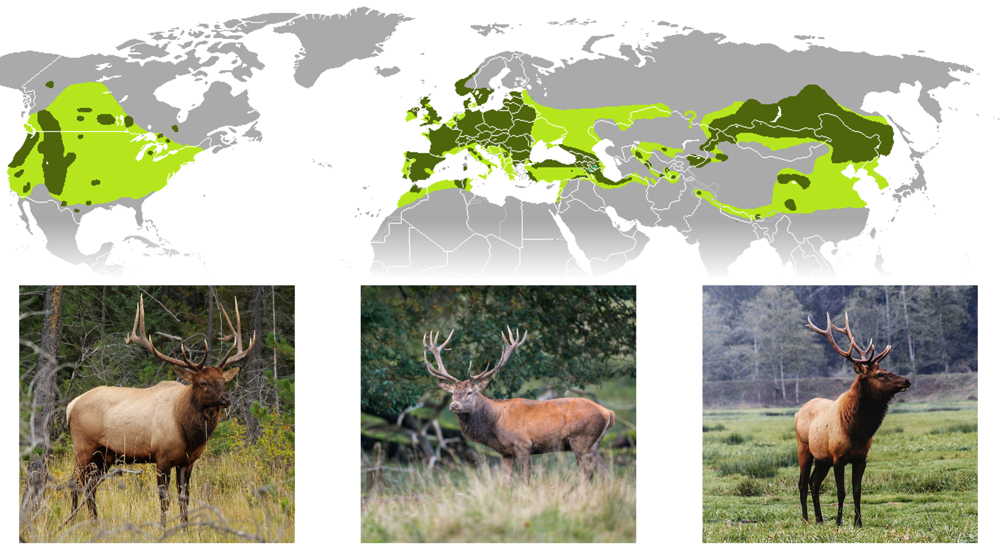

```{r include=FALSE}
library(ggplot2)
library(imager)
library(grid)
library(gridExtra)
library(magick)
library(ggpubr)
library(ggrepel)
library(tidyr)
library(learnPopGen)
library(RColorBrewer)
```

# Speciation

Our considerations thus far have dealt with the effects of different evolutionary forces on populations of the same species; we have not explored how lineages split to form new species. In this chapter, we will take a close look at the speciation processes. We will first clarify what a species actually is, and then discuss how the different evolutionary forces---mutation, selection, genetic drift, and migration---impact the emergence of reproductive isolation between diverging lineages.

## Species and Species Concepts

Species are a basic evolutionary unit. Species typically consist of multiple populations, each connected by gene flow but independently shaped by mutation, selection, and genetic drift. Hence, species form the boundary for the spread of alleles. While this notion of a species is in principle simple, determining those boundaries is not. As a consequence, biologists have developed a wide variety of species concepts that use more straightforward criteria to determine the species status of different populations (see below). All of these concepts have different strengths, weaknesses, and applicabilities; but rather than dissecting these, I will just leave it with Darwin's slightly facetious insight, because nothing has really changed since 1859:

> "*I shall not discuss the various definitions which have been given of the term species. No one definition has as yet satisfied all naturalists; yet every naturalist knows vaguely what he means when he speaks of a species."*
>
> Charles Darwin

I will say, however, that the biological species concept is the only species concept that recognizes and treats species as real natural entities. Classifications based on other species concepts are inevitably proxies, and as such, human constructs. This is not necessarily bad, because it provides the practicality needed for working with organisms---whether that is in biomedical research, argiculture, wildlife management, or conservation. It is just important to remember that species classifications do not always correspond precisely to actual biological species, a point we will return to later in this chapter. 

I will briefly provide more background information on the biological species concept. As the only species concept that recognizes species as real natural entities, the biological species is critical if we want to understand the speciation process; it sets the criteria for when the process is completed and a single lineage has split into two.

::: {.alert .alert-block .alert-info}
<b>Species Concepts: A Selection</b>

A wide variety of concepts have been proposed to recognize, describe, and classify biodiversity. To learn more about the history and debates surrounding different species concepts, check out the article "[Species Concepts](https://blogs.scientificamerican.com/evo-eco-lab/species-concepts/)" by Kevin Zelnio.

A selection of species concepts can be found below. Note that there have been concerted efforts in the recent past to unify different species concepts in an attempt to make species delimitation more consistent across taxonomic groups (De Queiroz 2007).

-   **Biological Species Concept:** A species is a group of actually or potentially interbreeding natural populations, which are reproductively isolated from other such groups.

-   **Cohesion Species Concept:** A species is the most inclusive group of organisms having the potential for genetic and/or demographic exchangeability; a group of organisms having the potential for phenotypic cohesion through intrinsic mechanisms.

-   **Competition Species Concept:** A species is the most extensive units in the natural economy such that reproductive competition occurs among their parts.

-   **Ecological Species Concept:** A species is a set of organisms exploiting or adapted to a single niche (or adaptive zone).

-   **Evolutionary Species Concept:** A species is a lineage (an ancestral-descendant sequence of populations) evolving separately from others and with its own unitary evolutionary roles, tendencies, and historical fate.

-   **Geneological Species Concept:** A species is an exclusive group of organisms whose members more closely resemble one another than members of any outside group.

-   **Genetic Cluster Species Concept:** A species is a group of individuals forming a distinct genotypic cluster without intermediates between other such clusters.

-   **Isolation Species Concept:** A species is a system of populations, the gene exchange between which is prevented by absence of interbreeding between heterospecific organisms based on intrinsic properties.

-   **Morphological (or Phenetic) Species Concept:** A species is a set of organisms that look similar to each other and is distinct from other sets.

-   **Phylogenetic Species concept:** A species is the smallest monophyletic group distinguishable by shared derived (synapomorphic) characteristics.

-   **Recognition Species Concept:** A species is is a group of individuals with a shared specific mate recognition or fertilization system.

-   **Typological Species Concept:** A species is a group of organisms conforming to a common morphological plan, emphasizing the species as an essentially static, non-variable assemblage.
:::

### The Biological Species Concept

The biological species concept was first proposed by Ernst Mayr, who defined a species as a group of actually or potentially interbreeding natural populations, which are reproductively isolated from other such groups. Hence, species are defined by reproductive compatibility, which is meaningful from an evolutionary perspective because it hinges on the lack of gene flow.

It is important to stress some nuances in this definition. First of all, Mayr explicitly emphasized *natural* populations in his definition, because the ability of two species to hybridize---especially outside of their typical ecological context---does not negate their species status. As we shall see, interspecific matings between many species can lead to perfectly viable and fertile offspring, yet such matings rarely occur in their natural environment due to the reproductive barriers that prevent individuals from different species from meeting or recognizing each other as potential mates. Thus, evidence of two species hybridizing outside of their ecological context, especially in captivity, does not mean that such hybridization would occur naturally.

The term "potentially interbreeding" also creates frequent misconceptions. It does not refer to potential interbreeding in artificial contexts, but to potential interbreeding in the face of physical barriers that prevent individuals from different populations meeting one another. Mayr argued that we are unable to determine the species status of allopatric populations, where interbreeding is currently impossible due to physical separation. What would happen if a physical barrier was removed? For example, consider the large ungulates of the genus *Cervus* that we know as wapiti (elk) and that Europeans know as red deer. There are three disjunct populations: one in North America, one in Europe and western Asia, and one in East Asia (Figure \@ref(fig:wapiti)). Would animals from these different populations interbreed if their ranges reconnected, or would they remain separate, reproductively isolated species? Obviously there is no way to test this in practice, and our inability to determine the species status of allopatric populations is in fact one of the biggest shortcomings of the biological species concept. Hence, taxonomist have resorted to alternative species concepts in the case of wapiti and red deer. For a long time, the different populations were considered the same species (*C. elaphus*) based on their morphological similarity and shared evolutionary history. However, recent genetic analyses have restricted *C. elpahus* to the European and western Asian forms, and the east Asian and North American forms are classified as *C. canadensis*. Which is right? Well, it's simply a matter of perspective, because such classifications are human constructs. Note that even in populations with adjacent or overlapping ranges, determining species status based on the biological species concept can be costly and time consuming, which is why in most cases biological classification operationally still hinges on other concepts.

```{r wapiti, echo=FALSE, out.width='100%', fig.cap = "Distrubution of wapiti and red deer in North America and Eurasia. The species occurs in three disjunct populations. North American wapiti picture by Membeth (CC0); red deer picture by the [Wasp Factory](https://www.flickr.com/photos/thewaspfactory74/) ([CC BY-NC-SA 2.0](https://creativecommons.org/licenses/by-nc-sa/2.0/)); Asian wapiti picture by Membeth (CC0)."}

```

Finally, it is important to mention that the biological species concept does not apply in contexts where reproductive compatibility cannot be assessed or simply does not exist. For example, we cannot determine reproductive isolation for extinct species that we only know from the fossil record. This contributes to a long-standing debate about how many species of humans roamed this planet in prehistoric times. Human fossils are classified based on morphological traits, and twelve species are recognized in the genus *Homo* alone. However, we just don't know whether the different phenotypic variants represent a single, morphologically diverse species, or whether there were in fact multiple, reproductively isolated species of *Homo* coexisting at one time. Similarly, the biological species concept does not apply to organisms that reproduce asexually, because different asexual individuals---by definition---are reproductively isolated from all other individuals. If there is no sex and recombination, the spread of alleles is strictly limited from mothers to daughters, and there is no other exchange of genetic material among individuals or populations.

## Speciation as a Gradual Process

If species are groups of actually or potentially interbreeding natural populations, which are reproductively isolated from other such groups, then speciation is the process by which reproductive isolation evolves between populations. The evolution of reproductive isolation is typically a gradual process, starting from a single variable population, continuing to differentiated populations that are still connected by gene flow, and finally ending in distinct and reproductively isolated species. This gradient is known as the speciation continuum (Figure \@ref(fig:speccont2)). Note that movement along this speciation continuum can be bidirectional; lineages can split by accruing more and more reproductive isolation, but lineages can also merge together through hybridization.

Just like the evolution of other traits, changes in the degree of reproductive isolation tend to evolve gradually through time, and we can consequently observe populations at different stages along the speciation continuum in natural systems. Such systems with ongoing speciation are valuable study objects for examining how and why reproductive isolation evolves.

```{r speccont2, echo=FALSE, out.width='100%', fig.cap = "Speciation is not typically an instantaneous process. Rather, species evolve gradually along a speciation continuum that ranges from a single population, to differentiated populations connected by gene flow, to distinct and reproductively isolated populations."}
knitr::include_graphics('images/speciation_continuum.png')
```

Note that the gradual and dynamic nature of speciation is one reason for why taxonomic species may not align well with biological realities. Some natural populations can be strongly differentiated and diagnosable based on a number of other species concepts. At the same time, there may still be a lot of genes flow with other populations, and even slight changes in environmental conditions could counteract existing reproductive barriers and reverse the speciation process. In other words, not all aspects of nature can be neatly classified into different categories, and we have to contend with the fact that variation in nature is continuous because speciation is a gradual and not an instantaneous process.

## Mechanisms of Reproductive Isolation

If speciation is the evolution of reproductive isolation between populations, we first need to understand what mechanisms can mediate reproductive isolation. Only then can we consider how those mechanisms actually evolve. Broadly speaking, mechanisms of reproductive isolation can be categorized into three groups, depending on whether they prevent mating between individuals from different populations (pre-mating isolation), whether they prevent successful fertilization and the formation of a zygote (post-mating, pre-zygotic isolation), or whether they prevent the success of interpopulation hybrids (post-zygotic isolation). In this section, we will discuss some common mechanisms of reproductive isolation using illustrative examples from empirical studies.

### Pre-Mating Isolation

Pre-mating isolation describes reproductive barriers that reduce the frequency or success of interpopulation mating. This can happen because members of different populations do not meet, do not recognize each other, or are not compatible with each other during mating.

#### Ecological Isolation {.unnumbered}

Ecological isolation reduces the probability that members of different populations encounter each other, for example as consequence of adaptation to different niches that causes spatial segregation of population. Such spatial segregation can occur at large spatial scales (*e.g.*, adaptation to different habitat types) or at small spatial scales (*e.g.*, adaptation to different host plants that grow in the same habitat patch). Two mechanisms can maintain spatial segregation between populations:

(1) Spatial segregation can be a consequence of selection against migrants, where individuals that disperse across habitats have a reduced survivability, and, thus, a lower likelihood of encountering potential mates. Such selection against migrants is evident in desert spiders (*Agelenopsis aperta*) that have adapted to different habitat types. Woodland spiders are limited by web-sites and prey, and are selected for bold and aggressive behaviors toward prey and conspecifics alike. In contrast, riparian spider populations are released from competition but suffer from increased predation by birds, favoring more shy and reclusive behaviors (Riechert & Hall 2000). Experimental translocation of spiders between woodland and riparian habitats have indicated selection against migrants, as individuals moved across habitats had significantly lower survival rates than individuals translocated within habitat types (Figure \@ref(fig:habiso)A). Hence, any spiders that would naturally move across habitat boundaries would be selected against, reducing the likelhood of cross-population mating.

(2) Spatial segregation can also be a consequence of differential habitat preferences. When individuals from locally adapted populations choose habitats based on suitability, interpopulation encounter rates can be low even in absence of strong selection against migrants. For example, stickleback fish (*Gasterosteus aculeatus*) locally adapted to either lake or stream habitats have a strong affinity to their particular habitat type (Bolnick et al. 2009). Over 80 % of marked individuals that were released at the confluence of a stream and a lake were eventually recaptured in their habitat of origin (Figure \@ref(fig:habiso)B). They segregated spatially simply because of divergent behavioral preferences.

```{r habiso, echo=FALSE, message=FALSE, warning=FALSE, fig.height=4, fig.width=8, out.width='100%', fig.cap="A. Translocation experiments in desert spiders (*Agelenopsis aperta*) across habitats reveals selection again migrants; translocated spiders exhibit significantly lower survival than residents in each habitat. [Data](data/11_habitat-iso2.csv) from Riechert and Hall (2000). B. Sticklebacks (*Gasterosteus aculeatus*) adapted to lake and stream habitats exhibit a strong behavioral preference for their habitat of origin. [Data](data/11_habitat-iso1.csv) from Bolnick et al. (2009)."}
habiso1 <- read.csv("data/11_habitat-iso1.csv")
habiso2 <- read.csv("data/11_habitat-iso2.csv")

temp.iso.p1 <- ggplot(habiso1, aes(x=habitat, y=proportion, fill=population))+
    geom_bar(position="dodge", stat="identity")+
    labs(x="Habitat of origin", y="Proportion of individuals recaptured", fill="Recapture location")+
    ylim(0,1)+
    theme_classic()+
    theme(legend.position = c(0.5,0.95), legend.direction="horizontal")+
    scale_fill_brewer(palette = "Set2")

temp.iso.p2 <- ggplot(habiso2, aes(x=habitat, y=survivors, color=population, group=population)) +
    geom_point(position=position_dodge(width = .5)) +
    geom_errorbar(aes(ymin = survivors-se, ymax = survivors+se), width = 0.2, position=position_dodge(width = .5))+
    geom_line(position=position_dodge(width = .5))+
    labs(x="Habitat of origin", y="Number of survivors per replicate", color="Test habitat")+
    theme_classic()+
    theme(legend.position = c(0.75,0.9))+
    scale_color_brewer(palette = "Set2")

ggarrange(temp.iso.p2,temp.iso.p1, labels = c("A", "B"), ncol=2)
```

Segregation of populations can also occur temporally, when members of different populations are (reproductively) active during different times of the day or year. Evidence for temporal isolation comes from many flowering plants, insects, and amphibians. For example, three species of frog in the *Rana pipiens* complex have largely allopatric distributions, but their ranges overlap in parts of Texas and Oklahoma. In allopatric populations, the breeding seasons of all three species also overlap: all three species have coincident peaks in their breeding activity in the spring, and two species (*R. sphenocephala* and R. *berlandieri*) again in the fall (Figure \@ref(fig:tempiso)). However, at sites where the three species occur sympatrically, each species has evolved a unique temporal niche, and peak breeding activities do not overlap: *R. sphenocephala* breeds in early spring, *R. blairi* in late spring, and *R. berlandieri* late summer and into fall. The secondary peaks in breeding activity of allopatric *R. sphenocephala* and R. *berlandieri* have disappeared completely in sympatry (Figure \@ref(fig:tempiso)). So, even as members of the three species occupy the same habitats, the likelihood of interbreeding is significantly reduced because they are not thinking about reproduction at the same time.

```{r tempiso, echo=FALSE, message=FALSE, warning=FALSE, out.width='100%', fig.cap="Three species in the *Rana pipiensis* complex have largely overlapping breeding seasons when they occur in allopatry. However, when they coexist in the same location, breeding seasons shift such that each species is temporally isolated. [Data](data/11_temporal-iso.csv) from Hillis (1981)."}
temp.iso <- read.csv("data/11_temporal-iso.csv")
temp.iso$breeding4 <- ifelse(temp.iso$breeding2 == 0, NA, temp.iso$breeding2)
temp.iso$breeding5 <- ifelse(temp.iso$breeding3 == "No", NA, temp.iso$breeding3)

ggplot(temp.iso, aes(x=day, y=species))+
    geom_line(aes(size = 0.5*breeding4))+
    theme_classic()+
    labs(x="Day", y="", size="Breeding activity")+
    facet_wrap(~setting, nrow = 2) +
    scale_size_identity()
```

Finally, a form of ecological isolation that is important for reproductive isolation in plants is pollinator isolation. Pollinator isolation occurs when animal pollinators do not transfer pollen between plants of different populations, usually as a consequence of coevolution between floral traits and pollinator preferences. For example, two closely related species of columbines (*Aquilegia formosa* and *A. pubescens*) coexist in the same habitat, but they have different flower colors and morphologies that attract different species. *A. formosa* has red, hanging flowers, while *A. pubescens* has white, erect flowers (Figure \@ref(fig:polliiso)A and B). Since the red flowers are primarily visited by hummingbirds and the white flowers by hawkmoths, pollen is primarily distributed from *A. formosa* to *A. formosa* and from *A. pubescens* to *A. pubenscens*, while interspecific fertilization is rare \@ref(fig:polliiso)C). Other groups of plants have diverged in flower coloration along a yellow-red gradient, exploiting differences in the visual systems of insect pollinators (with biases for yellow and UV) and bird pollinators (with biases for red).

```{r polliiso, echo=FALSE, message=FALSE, warning=FALSE, fig.height=2.666, fig.width=8, out.width='100%', fig.cap="A. *Aquilegia formosa*. Photo: Steve Berardi, [CC BY-SA 2.0](https://creativecommons.org/licenses/by-sa/2.0). B. *Aquilegia pubescens*. Photo: Dcrjsr, [CC BY-SA 3.0](https://creativecommons.org/licenses/by-sa/3.0). C. Due different pollinator preferences in flower color and morphology, cross-pollination between species of *Aquilegia* is relatively rare. [Data](data/11_pollinator-iso.csv) from Hodges and Arnold (1994)."}
polli.iso <- read.csv("data/11_pollinator-iso.csv")
polli.iso$species <- factor(polli.iso$species, levels = c("A. pubescens", "A. formosa"))
formosa.pic <- rasterGrob(load.image("images/Aquilegia_formosa.jpg"))
pubescens.pic <- rasterGrob(load.image("images/Aquilegia_pubescens.jpg"))

polli.iso.p <- ggplot(polli.iso, aes(x=species, y=visits, color=pollinator, group=pollinator))+
    geom_point(position=position_dodge(width = .5))+
    geom_errorbar(aes(ymin = visits-se, ymax = visits+se), width = 0.2, position=position_dodge(width = .5))+
    geom_line(position=position_dodge(width = .5))+
    labs(x="Species", y="Visits per flower per hour", color="Pollinator")+
    theme_classic()+
    theme(legend.position = c(0.75,0.92), legend.title = element_blank())+
    scale_color_brewer(palette = "Set2")

ggarrange(formosa.pic,pubescens.pic,polli.iso.p, labels = c("A", "B", "C"), ncol=3)
```

#### Behavioral isolation {#behavioral-isolation .unnumbered}

Behavioral isolation occurs when individuals from different populations do not recognize each other as potential mates. For example, populations may differ in species-recognition mechanisms, where changes in a particular signal (*e.g.*, the chemical composition of a pheromone or the color for a visual signal) alters the perception of individuals as con- vs. heterospecific, or their attractiveness during mate choice. Behavioral isolation is evident in many species of birds (especially based on song), fishes (especially based on coloration), and insects (especially based on chemical signals).

*Heliconius* butterflies are an example of behavioral isolation. Sympatric species are able to produce fertile offspring, but they typically do not hybridize because of assortative mating preferences. Males of the sympatric *H. cydno* (Figure \@ref(fig:behiso)A) and *H. melpomene* (Figure \@ref(fig:behiso)B), for example, almost exclusively court females of their own species (Figure \@ref(fig:behiso)C). Hence, the existence of species-specific signals and matching mating preferences can significantly reduce the probability of gene flow among closely related species.

```{r behiso, echo=FALSE, message=FALSE, warning=FALSE, fig.height=5, fig.width=8, out.width='100%', fig.cap="A. *Heliconius cydno*. Photo: Greg Hume, [CC BY-SA 3.0](https://creativecommons.org/licenses/by-sa/3.0). B. *Heliconius melpomene*. Photo: Charles J. Sharp, [CC BY-SA 4.0](https://creativecommons.org/licenses/by-sa/4.0). C. Males of both species have assortative mating preferences and almost exclusively court females of their own species. [Data](data/11_heliconius.csv) from Jiggins et al.(2001)."}
beiso <- read.csv("data/11_heliconius.csv")
melpomene.pic <- rasterGrob(load.image("images/Heliconius_melpomene.jpg"))
cydno.pic <- rasterGrob(load.image("images/Heliconius_cydno.jpg"))

beiso.p <- ggplot(beiso, aes(x=male, y=courting.time, color=female, group=female))+
    geom_point(position=position_dodge(width = .5))+
    geom_errorbar(aes(ymin = courting.time-sd, ymax = courting.time+sd), width = 0.2, position=position_dodge(width = .5))+
    geom_line(position=position_dodge(width = .5))+
    labs(x="Male", y="Mean courting time [s]", color="Female")+
    theme_classic()+
    theme(legend.position = c(0.2,0.89))+
    ylim(NA,50)+
    scale_color_brewer(palette = "Set2")

beiso.pix <- ggarrange(cydno.pic, melpomene.pic, labels = c("A", "B"), ncol=1)

ggarrange(beiso.pix,beiso.p, labels = c("", "C"), ncol=2, widths = c(1,1.75))
```

#### Mechanical isolation {.unnumbered}

Mechanical isolation occurs when individuals of two populations meet, recognize each other as potential mates, and attempt to copulate, but copulations are unsuccessful because of some mechanical incompatibility. Mechanical incompatibilities can be caused by size-mismatches between populations, or because of genital incompatibilities that arise through genital coevolution. Coevolution of male and female genital traits can arise through a variety of mechanisms, including sexual conflict (see [Chapter 10](social-behavior-and-sexual-selection.html#sexual-conflict)). As consequence, genitals in many animal groups evolve and diversify rapidly, with stark differences even among closely related species. Compatibility of male and female genitalia have been likened to a lock-and-key mechanisms, where the males' "key" will only fit species-specific female "locks". Accordingly, heterospecific matings would not lead to successful sperm transfer and fertilization even when copulation is attempted. Mechanical isolation can also occur in plants, when closely related species have stamens and styles in different configurations. For example, black sage (*Salvia mellifera*) have stamens and style positioned along the upper lip of the flower; hence, pollen is transferred from flower to flower on the backs of small pollinating bees. In contrast, the syntopic white sage (*S. apiana*) exhibits two long stamens and a long, forked style that extends out and away from the flower. This configuration primarily transfers pollen to the wings of larger carpenter and bumble bees. So even if the same pollinator visits flowers of both species, successful transfer of pollen from one species to the style of the other species is unlikely.

Another fascinating example of mechanical isolation comes from evolution experiments using feather lice. These avian parasites must be small enough to fit between the feather barbs of their host to avoid being removed during preening. On the other hand, there is selection for larger body size due to the higher fecundity of larger individuals. Since larger hosts also have a larger distance between the barbs of their feathers, there is a correlation between host and parasite body size. Scott Villa and his colleagues investigated the evolution of feather lice (*Columbicola columbae*) on domesticated pigeons (*Columba livia*) of different body size over a period of four years (60 louse generations). As expected, lice that lived on large hosts evolved a larger body size over this period of time. Interestingly, this also led to the evolution of mechanical isolation between lice from large hosts and lice from small hosts. While males were still eager to mate with females of the other strain, size mismatched individuals were unable to copulate effectively with each other (check out the videos of a mating of a [size-matched pair](https://movie-usa.glencoesoftware.com/video/10.1073/pnas.1901247116/video-1), [a male of the large strain trying to copulate with a female of the small strain](https://movie-usa.glencoesoftware.com/video/10.1073/pnas.1901247116/video-2), and [a male of the small strain trying to copulate with a female of the large strain](https://movie-usa.glencoesoftware.com/video/10.1073/pnas.1901247116/video-3)). These mismatches resulted in reduced copulation times, a reduced probability of egg production, and a reduced number of offspring produced in interlineage matings (Figure \@ref(fig:copiso)). Hence, mechanical incompatibility has the capacity to reduce gene flow between populations adapted to different host sizes.

```{r copiso, echo=FALSE, message=FALSE, warning=FALSE, fig.height=2.666, fig.width=8, out.width='100%', fig.cap="Even though male feather lice (*Columbicola columbae*) of different sized lineages attempt to copulate with females that are too large or too small (as indicated by point outside of the gray shaded area), those copulations are not necessrily successful. A. Lice within the typical range of sexual size dimorphism exhibited longer copulation duration compared to matings between individuals with large size disparities. [Data](data/11_lice-copulation.csv) from Villa et al. (2019). B. Lice within the typical range of sexual size dimorphism were more likely to produced eggs when kept in experimental vials. [Data](data/11_lice-eggs.csv) from Villa et al. (2019). C. Lice within the typical range of sexual size dimorphism were more likely to produced offspring on a natural host. [Data](data/11_lice-reprod.csv) from Villa et al. (2019)."}
li.cop <- read.csv("data/11_lice-copulation.csv")
li.egg <- read.csv("data/11_lice-eggs.csv")
li.rep <- read.csv("data/11_lice-reprod.csv")
lim.max = -268
lim.min = -492

lim.p1 <- ggplot(li.cop, aes(x=Length.Dimorphism, y=Copulating..min.))+
    geom_rect(aes(xmin=lim.max, xmax=lim.min, ymin=-0.5, ymax=40), fill="gray86")+
    geom_point()+
    labs(x="Body length dimorphism", y="Copulation time [min]")+
    scale_x_continuous(breaks=c(-600,-400,-200))+
    theme_classic()

lim.p2 <- ggplot(li.egg, aes(x=Length.Dimorphism, y=EGG.))+
    geom_rect(aes(xmin=lim.max, xmax=lim.min, ymin=-0.01, ymax=1.01), fill="gray86")+
    geom_point()+
    labs(x="Body length dimorphism", y="Egg production")+
    scale_x_continuous(breaks=c(-600,-400,-200))+
    scale_y_continuous(breaks=c(0,1))+
    theme_classic()

lim.p3 <- ggplot(li.rep, aes(x=Length.Diff, y=Nymphs))+
    geom_rect(aes(xmin=lim.max, xmax=lim.min, ymin=-0.05, ymax=5.05), fill="gray86")+
    geom_point()+
    labs(x="Body length dimorphism", y="Number of offspring")+
    scale_x_continuous(breaks=c(-600,-400,-200))+
    theme_classic()

ggarrange(lim.p1,lim.p2,lim.p3, labels = c("A", "B", "C"), ncol=3)
```

### Post-Mating, Pre-zygotic Isolation

Post-mating, prezygotic isolation describes reproductive barriers that reduce the frequency or success of inter-population fertilization, if mating between members of different populations has occurred. Post-mating prezygotic isolation mechanisms can be associated with sperm competition and cryptic female choice, or---most importantly---with a gametic incompatibilities.

#### Gametic Isolation {.unnumbered}

Gametic isolation occurs when male and female gametes cannot merge to form a zygote. Such gametic incompatibilities are frequently mediated by interactions of proteins on the surface of eggs and sperm. Co-evolution of sperm and egg surface proteins can create a lock-and-key mechanism, just like co-evolution of male and female genitalia. Gametic isolation is particularly well-studied in aquatic broadcast spawners (*e.g.*, in Porifera, Cnidaria, and Echinodermata), where individuals release their gametes directly into the water, which of course limits the possibility for pre-mating isolation. For example, there are strong gametic incompatibilities among populations of a tropical sea urchin, *Echinometra mathaei* (Palumbi & Metz 1991). Mixing eggs and sperm from different populations clearly indicates high fertilization rates when eggs are encountering sperm from the same population, irrespective of sperm concentration (Figure \@ref(fig:urch)). In contrast, only 2-9 % of eggs were fertilized when sperm and eggs of different populations were combined. Hence, chemical interactions between eggs and sperm can be critical for determining the degree of reproductive isolation between populations. It is important to note that gametic isolation can also contribute to reproductive isolation between populations of species with other reproductive modes---including some with internal fertilization; however, mechanisms mediating gametic incompatibilities in those taxa are not as thoroughly investigated.

```{r urch, echo=FALSE, message=FALSE, warning=FALSE, fig.height=2.666, fig.width=6, , out.width='100%', fig.cap="xxx. [Data](data/11_sea-urchin.csv) from Palumbi and Metz (1991)."}
urch <- read.csv("data/11_sea-urchin.csv")

ggplot(urch, aes(x=as.factor(sperm.conc), y=fertilized, color=treatment))+
    geom_point()+
    geom_errorbar(aes(ymin = fertilized-sd, ymax = fertilized+sd), width = 0.2)+
    labs(x="Relative sperm concentration", y="Proportion of fertilized eggs", color="Treatment")+
    theme_classic()+
    scale_color_brewer(palette = "Set2")
```

### Post-Zygotic Isolation

Post-zygotic isolation occurs when individuals from different populations mate successfully and their gametes form a zygote that starts to develop, but the resulting hybrids have reduced fitness compared to either of the parents. Reduced hybrid fitness can be caused by both intrinsic and extrinsic factors.

#### Intrinsic Incompatibilities {.unnumbered}

Intrinsic hybrid incompatibilities are reductions in hybrid fitness that are independent of environmental conditions. Intrinsic barriers primarily arise due to epistatic effects and are also known as genetic incompatibilities. Such incompatibilities can be severe and cause hybrid inviability, where the development of hybrids ceases at early stages, long before such individuals are born. In other cases, genetic incompatibilities cause hybrid sterility (*e.g.*, sterility in mules, which are hybrids between horses and donkeys), or quantitative reductions in hybrid survival or reproduction.

Genetic incompatibilities can arise through coevolution of different genes that contribute to the same protein complex or the sample physiological pathway. For example, enzymes involved the mitochondrial respiratory chain are protein complexes composed of amino acid chains derived from both the nuclear and mitochondrial genomes, and different protein subunits need to be compatible and work together to form a functional protein. Evolutionary change in one subunit may consequently be accompanied by corresponding changes in other subunits. Breaking up such co-evolved gene complexes during hybridization, where an individual might inherit the mitochondria from one parent but nuclear subunits from another, can cause issues with protein complex assembly or function, ultimately leading to mitochondrial, cellular, and organismal dysfunctions. These cases of genetic incompatibilities are also known as mito-nuclear incompatibilities.

Another well-studied example of a genetic incompatibility occurs through the coevolution of tumor and tumor-suppression genes in swordtail fishes of the genus *Xiphophorus*. *X. malinche* has a tumor gene with low activity and a matching tumor-suppressor gene with low activity, while *X. birchmanni* has a tumor gene with high activity and a matching tumor suppressor gene with high activity (Powell et al. 2020). Hybridization can disrupt the balance between tumor genes and their suppressors. Particularly, *X. malinche* and *X. birchmanni* hybrids that inherit at least one high activity tumor allele from *X. birchmanni* (on chromosome 21) and only low activity tumor-suppressor genes from *X. malinche* (on chromosome 5) have an increased chance of developing invasive melanocytes, which cause melanoma (a form of skin cancer; Figure \@ref(fig:xiph)A). Mismatches of tumor and tumor-suppressor genes in hybrids have clear consequences for hybrid phenotypes and fitness. For example, hybrids exhibit larger melanistic spots on their tails (Figure \@ref(fig:xiph)B), and---consistent with the higher invasiveness of melanocytes---their caudal spots grow faster and larger over time (Figure \@ref(fig:xiph)C). In addition, the frequency of fish with a caudal spot deceases across age classes in hybrid populations, indicating that individuals with spots are selected against (Figure \@ref(fig:xiph)D). This decrease is particularly evident in hybrid populations with a higher caudal spot frequency (populations hybrid 2 and 3 in Figure \@ref(fig:xiph)D), where the high-activity tumor gene derived from *X. birchmanni* is more common.

```{r xiph, echo=FALSE, message=FALSE, warning=FALSE, fig.height=8, fig.width=8, out.width='100%', fig.cap="A. Frequency of invasive melanocytes in *Xiphophorus* fish with different genotypes at a tumor suppressor locus (on chromosome 5) and tumor locus (on chromosome 21). Only fish that are homozygous for the low activity tumor suppressor allele from *X. malinche* and have at least one tumor allele from *X. birchmanni* develop a high frequency of invasive tumor cells. [Data](data/11_xipho1.csv) from Powell et al. (2020). B. Caudal spot frequencies in parental *X. birchmanni* and *X. malinche* populations, and natural populations with hybridization between the two species (Hybrid 1-3). [Data](data/11_xipho2.csv) from Powell et al. (2020). C. Caudal spots grow faster and larger in hybrids compared to *X. birchmanni*. [Data](data/11_xipho3.csv) from Powell et al. (2020). D. The decrease in caudal spot frequency from juveiles to adults in two populations of *Xiphophorus* hybrids indicate an increased mortality of fish with a caudal spot. [Data](data/11_xipho4.csv) from Powell et al. (2020)."}
xiph1 <- read.csv("data/11_xipho1.csv")
xiph2 <- read.csv("data/11_xipho2.csv")
xiph3 <- read.csv("data/11_xipho3.csv")
xiph4 <- read.csv("data/11_xipho4.csv")
xiph1$population <- factor(xiph1$population, levels = c("X. birchmanni", "Hybrid 1", "Hybrid 2", "Hybrid 3", "X. malinche"))
xiph2$population <- factor(xiph2$population, levels = c("X. birchmanni", "Hybrid 3"))
xiph4$population <- factor(xiph4$population, levels = c("X. birchmanni", "Hybrid 1", "Hybrid 2", "Hybrid 3"))
xiph4$age.class <- factor(xiph4$age.class, levels = c("Juvenile", "Adult"))
xiph3.obs <- xiph3[which(xiph3$group=='observed'),]
xiph3.pre <- xiph3[which(xiph3$group=='expected'),]
xiph3.obs$label <- paste(xiph3.obs$chr5, xiph3.obs$chr21, sep = "\n")

xiph.p1 <- ggplot(xiph1, aes(x=population, y=spot.freq)) +
    geom_point()+
    geom_errorbar(aes(ymin = spot.freq-sd, ymax = spot.freq+sd), width = 0.2)+
    labs(x="Population", y="Caudal spot frequency")+
    theme_classic()

xiph.p2 <- ggplot(xiph2, aes(x=population, y=growth)) +
    geom_point()+
    geom_errorbar(aes(ymin = growth-sd, ymax = growth+sd), width = 0.2)+
    labs(x="Population", y="Growth in invasion area")+
    theme_classic()

xiph.p3 <- ggplot(xiph3.obs, aes(x=reorder(label, -invasion.frequency), y=invasion.frequency))+
    geom_col()+
    geom_hline(yintercept = xiph3.pre$invasion.frequency, linetype="dashed")+
    labs(x="Genotype", y="Invasion frequency")+
    theme_classic()+
    annotate("text", x=0.1, y=-0.044, label="Chr 5:\nChr 21: ", size=2.7)+
    coord_cartesian(ylim = c(0, 0.4), clip = "off")

xiph.p4 <- ggplot(xiph4, aes(x=population, y=spotted.freq, color=age.class)) +
    geom_point(position=position_dodge(width = .5))+
    geom_errorbar(aes(ymin = spotted.freq-se, ymax = spotted.freq+se), width = 0.2, position=position_dodge(width = .5))+
    labs(x="Population", y="Caudal spot frequency", color="Age class")+
    theme_classic()+
    theme(legend.position = c(0.85,0.2))+
    scale_color_brewer(palette = "Set2")

ggarrange(xiph.p3,xiph.p1,xiph.p2,xiph.p4, labels = c("A", "B", "C","D"), ncol=2, nrow=2)
```

#### Extrinsic Incompatibilities {.unnumbered}

Extrinsic incompatibilities occur when hybrids face reduced fitness because of a mismatch between their phenotype and their abiotic or biotic environment. In this case, hybrids are generally viable and fertile under laboratory conditions, but are ecologically inviable under natural conditions--- either because they cannot tolerate the stressful environmental conditions that periodically arise in nature, or because they are competitively inferior to either parent in their respective niche. For example, some North American postglacial lakes harbor two species of stickleback (*Gasterosteus aculeatus*): a smaller limnetic species that lives in the open water and primarily feeds on zooplankton, and a larger benthic species that lives in the littoral zone and feeds on macroinvertebrates (Schluter 1995). Hybrids between the two species are viable and fertile. However, cage experiments in natural habitats revealed that hybrids are ecologically inferior compared to either parental species in the parents' native habitat; hybrids have a lower growth rate than benthic stickleback in the littoral zone and also have a lower growth rate than the limnetic parents in open water (Figure \@ref(fig:hybsel)A). Hence, ecological selection limits hybrid success in the natural context.

Hybrids may also be behaviorally sterile. Behavioral sterility may arise by hybrids not recognizing members of either parental species as potential mates, or because they themselves are not recognized as potential mates. In other words, behavioral sterility in hybrids is a consequence mismatched signals involved in species recognition, mate choice, and associated mating preferences. An example of reduced hybrid fitness caused by mate choice comes from the same *Heliconius* butterflies that we already discussed in the context of behavioral isolation. *Heliconius melpomene* females---and to a lesser degree those of *H. cydno*---exhibit mating preferences for males of their own species, as opposed to F1 hybrid males stemming from a cross between the two species (Figure \@ref(fig:hybsel)B). Notably, however, females of both species also prefer to mate with hybrids over males from the opposite species, indicating that behavioral sterility is not complete.

```{r hybsel, echo=FALSE, message=FALSE, warning=FALSE, fig.height=4, fig.width=8, out.width='100%', fig.cap="A. Ecological selection against hybrids as evidenced in stickleback (*Gasterosteus aculeatus*). Hybrids between benthic and limnetic stickleback have lower growth rates than either parent in their native habitat. [Data](data/11_hyb-sel.csv) from Schluter (1995). B. Sexual selection against hybrids as evidenced in *Heliconius* butterflies. Females of *H. cydno* and especially *H. melpomene* tend to avoid hybrid males during mate choice. [Data](data/11_heliconius-hybrid.csv) from Naisbit et al. (2001)."}
hybsel <- read.csv("data/11_hyb-sel.csv")
hybsel2 <- read.csv("data/11_heliconius-hybrid.csv")
hybsel2$mate <- factor(hybsel2$mate, levels = c("H. cydno", "F1 hybrid", "H. melpomene"))

hybsel.p1 <- ggplot(hybsel, aes(x=growth.open, y=growth.littoral, color=group, label=group))+
    geom_point()+
    geom_errorbar(aes(ymin = growth.littoral-se.y, ymax = growth.littoral+se.y), width = 0)+
    geom_errorbarh(aes(xmin = growth.open-se.x, xmax = growth.open+se.x), height = 0)+
    labs(x="Growth rate in open water [mg/d]", y="Growth rate in littoral zone [mg/d]")+
    theme_classic()+
    geom_text_repel(nudge_x=1.5, nudge_y=.5)+
    theme(legend.position = "none")+
    scale_color_brewer(palette = "Set2")

hybsel.p2 <- ggplot(hybsel2, aes(x=species, y=percent, fill=mate, color=mate)) +
    geom_bar(position="dodge", stat="identity")+
    labs(x="Parental species", y="Percent of successful matings", fill="Mating partner")+
    theme_classic()+
    theme(legend.position = c(0.2, 0.85))+
    scale_fill_brewer(palette = "Set2")+
    scale_color_brewer(palette = "Set2", guide="none")

ggarrange(hybsel.p1,hybsel.p2, labels = c("A", "B"), ncol=2)
```

### Reproductive Isolation as a Complex Trait

It is important to note that different mechanisms of reproductive isolation are not mutually exclusive. Between any population pair, many mechanisms may coincide such that total reproductive isolation is a composite of mechanisms that reduce the probability of mating between different populations, reduce the probability of fertilization should mating happen, and reduce the success of hybrids should fertilization happen. More over, as we will see below, the evolution of one reproductive isolation mechanism can profoundly impact the evolution of other reproductive barriers. Hence, it many natural systems it is critical not to just examine different mechanisms in isolation, but to also consider how different mechanisms interact to keep gene pools separated from one another.

```{r incomps, echo=FALSE, out.width='100%', fig.cap = "Different mechanisms of reproductive isolation often act in concert and can influence each other evolutionarily."}

```

## The Evolution of Reproductive Isolation

Now that we have examined what mechanisms can cause reproductive isolation between populations, we can ask how those isolating barriers actually arise. Understanding how different evolutionary forces impact the evolution of reproductive isolation ultimately sheds light on the speciation process. We will consider three distinct scenarios: (1) Polyploidization and the evolution of instantaneous reproductive isolation, (2) allopatric speciation that includes periods of geographical separation between populations, and (3) ecological speciation, where reproductive isolation between populations can arise as a byproduct of adaptation even in the presence of ongoing gene flow.

### Polyploidization and Instantaneous Speciation

Polyploidization is a form of mutation that leads to the duplication of entire genomes, typically due to meiotic errors leading to unreduced gametes. Fertilization of unreduced gametes with other unreduced gametes causes the formation of fertile polyploid lineages (*i.e.*, from diploid to tetraploid, from tetraploid to octoploid, etc.) (Figure \@ref(fig:polploid)A). Polyploid lineages are immediately isolated from their ancestral lineage because of dysfunctional chromosome complements in crosses between individuals of different ploidy. Such auto-polyploid speciation is particularly common in plants and other organisms for which self-fertilization is possible, because the combination of two unreduced gametes is a strong limiting factor in the formation of polyploids. Accordingly, up to 4 % of plant species are thought to have arisen through auto-polyploid speciation (Figure \@ref(fig:polploid)B), while this phenomenon is rare in animals.

Polyploid speciation can also occur through the combination of two genomes derived from different species, a process called allo-polyploid speciation (Figure \@ref(fig:polploid)C). In this case, an unreduced gamete of one species is fertilized with a normal gamete from another, creating a hybrid with an uneven number of chromosomes. When unreduced gametes from that hybrid are then fertilized by a normal gamete from the second species, a fertile hybrid with the full genome set of each parent arises. Allo-polyploidy is extremely common in plants, and about 80 % of plant species may be allo-polyploids by some estimations. The common bread wheat (*Triticum aestivum*), for example, is an allo-hexaploid that contains three distinct sets of chromosomes from three different species of grass in the genus *Aegilops*. Similarly, various vegetables in the cabbage family (mustard, collard greens, cauliflower, kale, bok choi, rape seed, etc.) represent different allo-polyploid combinations of three species, *Brassica nigra*, *B. rapa*, and *B. olarecea*. In contrast, allo-polyploids are rare among animals, but some cases have been documented in insects, fish, amphibians, and reptiles.

```{r polploid, echo=FALSE, out.width='100%', fig.cap = "A. Auto-polyploidization occurs through the combination of two unreduced gametes, which usually occirs through self-fertilization. The resulting ployploids are instantaneously isolated from ancestral lineages with lower ploidy. B. Blackberries of the genus *Rubus* represent a polyploid species complex, including species with 2, 4, 8, 16, and 32 sets of chromosomes. Without genetic or cytological analyses, species with different ploidy levels are almost impossible to distinguish. C. Allo-polyploidization oocurs through the combination of two genomes derived from different species. It is a multi-step process that first involves the production of hybrids with uneven chromosome sets."}

```

### Allopatric Speciation and Hybridization

The allopatric speciation model was first introduced by Ernst Mayr in his seminal book *Systematics and the Origin of Species*. This model postulates that the speciation process unfolds in three distinct steps: (1) The subdivision of an initial population through a geographic barrier, (2) population divergence in isolation, and (3) secondary contract of incipient species. In the following sections, we will examine these three steps in detail, along with pertinent examples.

::: {.alert .alert-block .alert-info}
<b>Explore More: Systematics and the Origin of Species</b>

Ernst Mayr's book "*Systematics and the Origin of Species*" is available for free through [archive.org](https://archive.org/details/in.ernet.dli.2015.20284).
:::

#### Geographic Isolation {.unnumbered}

An initial stage of geographic isolation is central to the allopatric speciation model. Geographic isolation drives reproductive isolation and limits the spread of alleles within the separate populations. Two mechanisms can create geographically isolated populations from an initial ancestor: dispersal and vicariance.

Dispersal occurs when individuals of an original population overcome an existing geographic barrier and colonize a new and previously unoccupied habitat (Figure \@ref(fig:dispersal)A). Classic examples of dispersal occur during the colonization of new oceanic islands. For example, the Hawai'ian archipelago arose as Earth's crust moved over a volcanic hot spot from east to west. Accordingly, the western most island (Kaua'i; \~4.2--5 million years old) is the oldest, and islands get progressively younger towards the east; Hawai'i, as the youngest island, rose out of the ocean only 0.3--1.0 million years ago. *Drosophila* fruitflies that colonized the archipelago early during its formation provide a formidable example of dispersal. For two independent clades within the genus, the sequence of phylogenetic divergence corresponds to the sequence in which different islands arose from the ocean. In the *D. planitibia* subgroup (green clade in Figure \@ref(fig:dispersal)B), dispersal occurred from O'ahu to Maui to Hawai'i; in the *D.* *mitchelli*, subgroup dispersal occurred from O'ahu to Moloka'i to Hawai'i. This pattern is consistent with the idea that species diversified through step-wise colonization of new habitats as they became available. Similar processes also gave rise to the diversity we observe in other oceanic archipelagos, like the Galapagos. It is important to emphasize that dispersal across geographic barriers and colonization of novel habitats is important in other ecological contexts as well. For example, lakes are the terrestrial equivalent of oceanic islands. Species may also overcome mountain ranges that separate suitable habitats, or valleys that separate mountain tops. Furthermore, island-like situations occur in the apparently well-connected habitats within oceans. For example, patches of coral reefs or deep-sea hydrothermal vents are separated by vast stretches of unsuitable habitats, which migrants must overcome.

```{r dispersal, echo=FALSE, out.width='100%', fig.cap = "A. Dispersal is the colonization of a new habitat across a geographic barrier. B. Patterns of diversification in *Drosophila* fruitflies are consistent with dispersal. In two clades (green and orange), the sequence of species divergence corresponds to colonization of younger islands in the archipelago (adopted from Obbard et al. 2012). The inset photo shows *D. silvestris* (KarlM, [CC BY-SA 3.0](https://creativecommons.org/licenses/by-sa/3.0))."}
knitr::include_graphics('images/dispersal.png')
```

Vicariance occurs when the distributional range of a species is subdivided by an emerging geographic barrier (Figure \@ref(fig:vicariance)A). For example, islands---or even entire continents---may be divided as a consequence of rising sea levels associated with climate change; as water levels flood low laying valleys, regions with higher elevations become separated. Similarly, volcanic activity and plate tectonics can shift land masses and create novel barriers of unsuitable habitat across which movement of organisms becomes limited. For example, the ancestor of ratites, which includes a number of flightless birds, had a Gondwanian distribution. As the supercontinent broke up into smaller pieces and landmasses drifted apart, geographic isolation gave rise to today's flightless birds in South America, Africa, Australia and New Guinea, and New Zealand (Figure \@ref(fig:vicariance)B). Other classic examples of vicariance include paired species of crustaceans, fish, and other marine animals that occur in either side of the Central American land bridge (i.e., sister species in the Pacific and the Caribbean) and in the Atlantic and the Mediterranean Sea.

```{r vicariance, echo=FALSE, out.width='100%', fig.cap = "A. Vicariance is the subsetting of an original population by an emerging geographic barrier B. Patterns of diversification in ratites are a consequence of vicariance. The ancestral, contiguous range of this group on Gondwana was broken apart as a consequence of continental drift."}
knitr::include_graphics('images/vicariance.png')
```

#### Population Divergence {.unnumbered}

The second step of the allopatric speciation model is population divergence in isolation. Such population divergence was long thought to be driven primarily by mutation and genetic drift; different sets of mutations arise and drift to fixation in each of the isolated populations, ultimately causing them to diverge. However, it is now well-recognized that natural and sexual selection also play a critical role in driving the differentiation of isolated populations. Differences in abiotic and biotic environmental conditions can drive local adaptation, potentially causing substantial phenotypic and genetic differences between populations. Thus, divergent selection can accelerate population divergence, though it is not requisite for allopatric speciation to occur.

#### Secondary Contact and Reproductive Isolation {.unnumbered}

The fate of populations that diverged in isolation is determined in the third stage of the allopatric speciation model. When populations come into secondary contact after the initial period of isolation, there is an entire range of potential outcomes. Divergent populations are often referred to as incipient species at this stage.

If divergence between incipient species was relatively minor and does not affect their ability to interbreed, secondary contact may simply cease the speciation process. In this case, the two lineages hybridize and fuse back together into a single panmictic population.

Alternatively, at least some degree of reproductive isolation may have accrued between incipient lineages. Consistent with the idea that drift was critical in driving population divergence, genetic incompatibilities were long thought to be a primary mechanism of reproductive isolation. In particular, secondary contact and hybridization between incipient species brings together alleles that previously drifted to fixation in the isolated lineages, and some of the new allelic combinations can be deleterious due to negative epistatic interactions (Figure \@ref(fig:dmincomp)). Such genetic incompatibilities that reduce hybrid fitness upon secondary contact are also known as Dobzhansky-Muller incompatibilities.

There are two more important points to make here: (1) Dobzhansky-Muller incompatibilities do not only arise as a consequence of population differences that evolved through genetic drift. Alternate alleles that rise to high frequencies in different populations through divergent selection can also be subject to negative epistatic interactions and cause reductions in hybrid fitness. So, while the Dobzhansky-Muller model was primarily developed under the assumption that mutation and genetic drift are the primary drivers of population divergence, the model also applies when other evolutionary forces contribute to population differentiation. (2) Reproductive isolation between incipient species can not only be mediated by genetic incompatibilities (intrinsic post-zygotic isolation), but by any other mechanism of reproductive isolation as well. Evolution in isolation may have inadvertent consequences on ecological, behavioral, and morphological traits, which then affect the probability of mating and successful fertilization between incipient species. In addition, though there may be no genetic incompatibilities that limit hybrid success, hybrids may still be selected against by natural or sexual selection.

```{r dmincomp, echo=FALSE, out.width='100%', fig.cap = "Dobzhansky-Muller incompatibilities arise as a consequence of evolution in geographic isolation. Specifically, new sets of mutations arise in geographic isolation and eventually drift to fixation. Upon secondary contact, recombination of these new alleles in hybrids can be subject to negative epistatic interactions. The novel alleles a and b have no evolutionary history of interacting, and if the alleles are incompatible, hybrid fitness is reduced."}

```

Irrespective of what mechanisms mediate reproductive isolation between incipient species, reproductive isolation is rarely complete upon secondary contact, as evidenced by the commonality of hybridization in nature. Hybridization, in these cases, is not evidence that incipient species are not species, but rather that the speciation process is still ongoing and has yet to be completed. Ultimately, there are three alternative outcomes upon secondary contact besides complete fusion of the the incipient species: completion of the speciation process through reinforcement, stable hybrid zones of contact, and hybrid speciation.

##### Reinforcement and the Completion of the Speciation Process {.unnumbered}

Reductions of hybrid fitness upon secondary contract---whether caused by genetic incompatibilities or by natural or sexual selection against hybrids---should exert direct selection on assortative mating preferences in both incipient species. Individuals that exhibit preferences for mating partners from their own incipient species and discriminate against heterospecifics ultimately have higher fitness, because they avoid producing unfit hybrid offspring. The process of natural selection increasing the degree of reproductive isolation between incipient species is known as reinforcement. In practice, reinforcement often leads to reproductive character displacement, where differences in reproductive traits---both in terms of signals and the corresponding preferences---are accentuated whenever closely related species coexist. A particular trait may be similar between two species in allopatry, but starkly differentiated in sympatry (Figure \@ref(fig:reinforcement)). In the end, reproductive character displacement strengthens pre-zygotic reproductive isolation and can lead to the completion of the speciation process.

```{r reinforcement, echo=FALSE, out.width='100%', fig.cap = "Reinforcement can lead to reproductive character displacement, where differences between species are accentuated in sympatry."}
knitr::include_graphics('images/Character_Displacement.png')
```

The importance of reinforcement in maintaining species boundaries upon secondary contact has been studied in *Ficedula* flycatchers, a group of small, Old World songbirds. Allopatric populations of the collared flycatcher (*F. albicollis*) and the pied flycatcher (*F. hypoleuca*) both exhibit black and white plumage and look almost identical to the untrained eye (Figure \@ref(fig:piefly)A and B). However, the two species are very easy to tell apart when they co-occur in sympatry, because the pied flycatchers are actually brown and white (Figure \@ref(fig:piefly)C). A series of elegant behavioral experiments has revealed how these changes in plumage coloration are a consequence of reinforcement (Stre et al. 1997). It turns out that plumage similarities not only make it difficult for humans to distinguish allopatric populations of collared and pied flycatchers; one third of matings actually occur *between* species when females from sympatric populations have a choice between the allopatric color morphs of the two species. This finding is in stark contrast to the strong assortative mating observed when females can choose between males of sympatric color morphs (Figure \@ref(fig:piefly)D). Consequently, differences in plumage coloration reduce the probability of hybridization, as predicted by the reinforcement hypothesis. Moreover, experiments with female pied flycatchers have revealed evidence for the evolution of mating preferences between sympatric and allopatric populations. While sympatric females prefer males with the brown plumage of sympatric males, allopatric females prefer to mate with males that exhibit the characteristically black plumage of allopatric males (Figure \@ref(fig:piefly)E). Hence, reinforcement has not only acted on a signal for species recognition and caused character displacement in male plumage coloration, but it has also acted on the corresponding female preference to increase pre-zygotic reproductive isolation.

```{r piefly, echo=FALSE, fig.height=8, fig.width=8, message=FALSE, warning=FALSE, out.width='100%', fig.cap="A. Collared flycatcher (*Ficedula albicollis*). Photo: [Andrej Chudy](https://www.flickr.com/photos/andrej_chudy), [CC BY-SA 2.0](https://creativecommons.org/licenses/by-sa/2.0). B. Allopatric pied flycatchers (*Ficedula hypoleuca*) are black and white like collared flycatchers. Photo: Francesco Veronesi, [CC BY-SA 2.0](https://creativecommons.org/licenses/by-sa/2.0). C. Sympatric pied flycatchers (*Ficedula hypoleuca*) are brown and white. Photo: Steve Garvie, [CC BY-SA 2.0](https://creativecommons.org/licenses/by-sa/2.0). D. While there is strong assortative mating when female flycatchers have a choice between males of the two species that exhibit the sympatric color combination, nearly a third of matings are heterospecific when females are given a choice between males from the two species that exhibit the allopatric color combination. [Data](data/11_flycatcher_spec_rec.csv) from Stre et al. (1997). E. Evidence for the evolution of female mating preferences in pied flycatchers. Females from sympatric populations prefer to mate with males that exhibit the brown plumage typical for sympatric males; females from allopatric populations prefer males with the black plumage typical for allopatric males. [Data](data/11_flycatcher_mate_pref.csv) from from Stre et al. (1997)."}
col.fly <- rasterGrob(load.image("images/Collared_flycatcher.jpg"))
pie.fly <- rasterGrob(load.image("images/Pied_Flycatcher.jpg"))
pie.fly2 <- rasterGrob(load.image("images/European_Pied_Flycatcher.jpg"))

pie.fly.spec <- read.csv("data/11_flycatcher_spec_rec.csv")
pie.fly.spec$phenotype <- factor(pie.fly.spec$phenotype, levels = c("Sympatric color", "Allopatric color"))
pie.fly.pref <- read.csv("data/11_flycatcher_mate_pref.csv")
pie.fly.pref$female <- factor(pie.fly.pref$female, levels = c("Sympatric", "Allopatric"))
pie.fly.pref$male <- factor(pie.fly.pref$male, levels = c("Sympatric", "Allopatric"))

pie.fly.p1 <- ggplot(pie.fly.spec, aes(x=male, y=proportion, fill=phenotype))+
    geom_bar(position="dodge", stat="identity")+
    labs(x="Male type", y="Proportion of females", fill="Color combination")+
    ylim(0,1)+
    theme_classic()+
    theme(legend.position = c(0.85,0.9))+
    scale_fill_brewer(palette = "Set2")

pie.fly.p2 <- ggplot(pie.fly.pref, aes(x=female, y=proportion, fill=male))+
    geom_bar(position="dodge", stat="identity")+
    labs(x="Female type", y="Proportion of females", fill="Male type")+
    ylim(0,1)+
    theme_classic()+
    theme(legend.position = "none")+
    scale_fill_brewer(palette = "Set2")

pie.fly.pix <- ggarrange(col.fly,pie.fly,pie.fly2, labels = c("A", "B", "C"), nrow=3)
pie.fly.graph <- ggarrange(pie.fly.p1,pie.fly.p2, labels = c("D", "E"), nrow=2)
ggarrange(pie.fly.pix,pie.fly.graph, ncol=2, widths = c(1,2))
```

##### Hybrid Zones {.unnumbered}

Secondary contact between incipient species can lead to stable hybrid zones in geographically restricted areas where lineages meet and cross-breed. Stable hybrid zones can either be maintained in so-called "tension zones", or in areas of bounded hybrid superiority.

Tension zones are geographic regions where continuous dispersal and hybridization between parental species is balanced by selection against hybrids. Although hybrids are continuously produced, the integrity of species boundaries is largely maintained, because hybrids have lower fitness than either parental species and are continuously selected against. It is important to note, however, that backcrossing between hybrids and parentals can lead to the the introgression of neutral and adaptive alleles between species.

In contrast, the bounded hybrid superiority hypothesis postulates that hybrids have a higher fitness than either of the parental species in environments that are intermediate to those typically occupied by the parentals. In this case, hybrid zones are expected particularly along environmental gradients that separate the niches of the parental species. For example, hybrids between the two swordtail fishes *X. malinche* (a high elevation species) and *X. birchmanni* (a low elevation species) primarily occur at intermediate elevations. Hybrids have a higher heat tolerance than *X. malinche* and a higher cold tolerance than *X. birchmanni*, which allows them to outcompete either of the parental species at at intermediate elevations, where it gets too hot for *X. malinche* in the summer and too cold for *X. birchmanni* in the winter.

##### Hybrid Speciation {.unnumbered}

Last but not least, hybridization upon secondary contact can lead to homoploid hybrid speciation; *i.e.*, the formation a new species, reproductively isolated from both parentals but without a change in ploidy levels. While not common, such hybrid speciation has been documented in insects, fishes, amphibians, birds, and even a marine mammal (the clymene dolphin, *Stenella clymene*, which arose through hybridization between spinner dolphin, *S. longirostris*, and striped dolphin, *S. coeruleoalba*).

Another notable example of hybrid speciation includes the Darwin's finches on Daphne Major Island in the Galapagos Archipelago, which we studied in detail in [Chapter 2](evidence-for-evolution.html#case-study-darwins-finches) and [Chapter 3](/a-mechanism-for-change.html#darwins-logic). In the 1980s, a male Espaola cactus finch (*Geospiza conirostris*) dispersed to Daphne Major and bred with female medium ground finches (*G. fortis*) that were already there. This hybridization event gave rise to a new lineage (also known as big bird lineage due to its size), which is endemic to Daphne Major and reproductively isolated from the other species that occur on the island.

::: {.alert .alert-block .alert-info}
<b>Explore More: Big Bird and Hybrid Speciation</b>

To learn more about the fantastic tale of hybrid speciation in Darwin's finches as directly observed by humans, check out Jordana Cepelewicz' article "[New Bird Species Arises from Hybrids, as Scientists Watch](https://www.quantamagazine.org/new-bird-species-arises-from-hybrids-as-scientists-watch-20171213/)" in Quanta Magazine.
:::

### Ecological Speciation

The allopatric speciation model dominated our understanding of the speciation process for over half a century. But with the rise of genetic tools, there was increasing evidence for sister species that occur in the same location without apparent periods of geographic separation. New species---it seemed---were also arising without physical separation, a process known as sympatric speciation. The big question, however, was how reproductive isolation can evolve between diverging populations when ongoing gene flow keeps homogenizing gene pools.

Both theoretical models and empirical evidence have since revealed that speciation with gene flow is possible if there is strong divergent selection driving sympatric populations apart. When selection is sufficiently strong, it can overcome the homogenizing effects of gene flow, leading to significant population differentiation (Figure \@ref(fig:msdspec)). Hence, speciation becomes a mere consequence of adaptation to different environmental conditions. Speciation with gene flow in response to divergent selection is also known as ecological speciation.

It is important to note that ecological speciation does not only happen in sympatry, but also in allopatry and other geographical contexts (peri- and parapatry). Hence, the geographic context is less of a focus in ecological speciation research. Rather, research primarily focuses on how exactly adaptation in response to divergent selection translates to reproductive isolation between incipient species.

```{r msdprep, include=FALSE}
msd1 <- msd(p0=c(0.5,0.5), Ne=c(1000,1000), w=list(c(1,0.975,0.95),c(0.95,0.975,1)), m=c(0.05,0.05), ngen=200, colors=c("red","blue"))
msd2 <- msd(p0=c(0.5,0.5), Ne=c(1000,1000), w=list(c(1,0.9,0.8),c(0.8,0.9,1)), m=c(0.05,0.05), ngen=200, colors=c("red","blue"))
msd3 <- msd(p0=c(0.5,0.5), Ne=c(1000,1000), w=list(c(1,0.8,0.6),c(0.6,0.8,1)), m=c(0.05,0.05), ngen=200, colors=c("red","blue"))
msd4 <- msd(p0=c(0.5,0.5), Ne=c(1000,1000), w=list(c(1,0.5,0.25),c(0.25,0.5,1)), m=c(0.05,0.05), ngen=200, colors=c("red","blue"))
time <- 0:200

res <- data.frame(time, msd1[[1]], msd1[[2]], msd2[[1]], msd2[[2]], msd3[[1]], msd3[[2]], msd4[[1]], msd4[[2]])
names(res) <- c("time", "scenario1.p", "scenario1.q", "scenario2.p", "scenario2.q", "scenario3.p", "scenario3.q", "scenario4.p", "scenario4.q")

msd.p1 <- ggplot(res)+
    geom_line(aes(time, scenario1.p), color="#66c2a5")+
    geom_line(aes(time, scenario1.q), color="#fc8d62")+
    ylim(0,1)+
    labs(x="", y="Allele frequency")+
    theme_classic()
msd.p2 <- ggplot(res)+
    geom_line(aes(time, scenario2.p), color="#66c2a5")+
    geom_line(aes(time, scenario2.q), color="#fc8d62")+
    ylim(0,1)+
    labs(x=" ", y="")+
    theme_classic()
msd.p3 <- ggplot(res)+
    geom_line(aes(time, scenario3.p), color="#66c2a5")+
    geom_line(aes(time, scenario3.q), color="#fc8d62")+
    ylim(0,1)+
    labs(x="Time [generations]", y="Allele frequency")+
    theme_classic()
msd.p4 <- ggplot(res)+
    geom_line(aes(time, scenario4.p), color="#66c2a5")+
    geom_line(aes(time, scenario4.q), color="#fc8d62")+
    ylim(0,1)+
    labs(x="Time [generations]", y="")+
    theme_classic()
```

```{r msdspec, echo=FALSE, message=FALSE, warning=FALSE, out.width='100%', fig.cap="Divergence between populations connected by gene flow is a reflection of the balance between divergent selection and the rate of migration. As selection gets stronger, the homogenizing effect of migration gets smaller. Each simulation conists of two populations (represented in red and blue) that are connected by migration at the rate of 0.05 per generation. However, similations differ in the strength of divergent selection. A. *w*<sub>migrants</sub>=0.95, *w*<sub>hybrids</sub>=0.975; B. *w*<sub>migrants</sub>=0.8, *w*<sub>hybrids</sub>=0.9; C. *w*<sub>migrants</sub>=0.6, *w*<sub>hybrids</sub>=0.8; D. *w*<sub>migrants</sub>=0.25, *w*<sub>hybrids</sub>=0.5."}
ggarrange(msd.p1,msd.p2,msd.p3, msd.p4, ncol=2, nrow=2, labels = c("A", "B", "C", "D"))
```

#### Reproductive Isolation as a Byproduct of Adaptation {.unnumbered}

A wide variety of divergent sources of selection have been identified as driving forces in ecological speciation. For example, divergent selection can be caused by environmental differences in habitat structure, climate, or resource availability, as well as different communities of competitors, predators, or parasites. In addition, divergent selection may be driven by sexual selection, particularly when environmental variation causes selection on secondary sexual traits or on sensory systems.

Reproductive isolation during ecological speciation evolves incidentally, as a byproduct of adaption caused by divergent selection. Adaptation to different environmental conditions simply reduces the likelihood that individuals from diverging populations meet, that they recognize each other as potential mates if they do meet, that they are compatible during mating if they attempt to, and that they produce competitive hybrid offspring if eggs get fertilized. With the exception of gametic isolation, ecological speciation has been associated with every possible mechanism of reproductive isolation described above.

A classic example of ecological speciation stems from mosquitofish (*Gambusia hubbsi*) that inhabit blue holes on the Bahamas islands. Blue holes are water-filled sinkholes that were created when underground caverns collapsed. Some of the Bahamas islands are dotted with isolated blue holes (Figure \@ref(fig:bahagamb)A), and most have been colonized by mosquitofish. These blue holes, however, differ in whether other fish species have also arrived. In some, the mosquitofish live by themselves; in others, they have to share their habitat with bigmouth sleepers (*Gobiomorus dormitor*), a large predatory fish. Mosquitofish in different blue holes have adapted to the local ecological conditions. In habitats without predators, mosquitofish have convergently evolved streamlined bodies that allow for energy efficient swimming, while those in habitats with predators have evolved bodies that allow for rapid acceleration during predator escape movements. How has adaptation to the different predation regimes impacted the emergence of reproductive isolation? Brian Langerhans and colleagues (2007) conducted mate choice experiments with mosquitofish from different ecological settings. They first quantified the strength of female preference for a male of their own population, as opposed to a male from a different blue hole with the same predator regime, or a male from a different blue hole with the opposite predator regime. The results indicated that assortative mating (i.e., a preference for the male from the female's own population) was much stronger when females were confronted with a foreign male derived from different environmental conditions (Figure \@ref(fig:bahagamb)B). So, females from no-predation habitats preferred to mate with males from no-predation habitats, while those from blue holes with bigmouth sleeper preferred to mate with males from other high-predation habitats. Females made mating decisions based on male traits that are directly related to adaptation to different predation environments, as evidenced by the negative correlation between morphological dissimilarity and the relative strength in mating preference (Figure \@ref(fig:bahagamb)C). In other words, females from both environments prefer to mate with males exhibiting a body shape that matches their specific ecological context. Adaptive evolution of a morphological trait consequently had inadvertent repercussions for mate choice, and ultimately caused behavioral isolation between diverging lineages.

```{r bahagamb, echo=FALSE, fig.height=2.666, fig.width=8, message=FALSE, warning=FALSE, out.width='100%', fig.cap="A. Watling's Blue Hole, southwestern San Salvador Island, eastern Bahamas. Photo: [James St. John](https://www.flickr.com/people/47445767@N05), [CC BY 2.0](https://creativecommons.org/licenses/by/2.0). B. Assortative mating preferences of female mosquitofish that could choose beteen a male from their own population or a male that either came from a different blue hole with the same predation environment or a different blue hole from a different predation environment. Assortative mating with the male from the female's own population is much strong when she is confronted with a foreign male from a different environment. [Data](data/11_gambusia-assortative-mating.csv) form Langerhans et al. (2007). C. Female mating preferences are parimarily based on body shape, and relative mating preferences decrease with increasing dissimilarity of a male's body shape to the locally adapted form. [Data](data/11_gambusia-assortative-mating2.csv) form Langerhans et al. (2007)."}
gamb0 <- rasterGrob(load.image("images/bluehole.jpg"))
gamb1 <- read.csv("data/11_gambusia-assortative-mating.csv")
gamb2 <- read.csv("data/11_gambusia-assortative-mating2.csv")
gamb3 <- read.csv("data/11_gambusia-assortative-mating3.csv")

gamb.p1 <- ggplot(gamb1, aes(x=comparison, y=ass.mat.index))+
    geom_point()+
    geom_errorbar(aes(ymin = ass.mat.index-se, ymax = ass.mat.index+se), width = 0.2)+
    labs(x="Alternative male habitat", y="Assortative mating index")+
    theme_classic()


gamb.p2 <- ggplot(gamb2, aes(x=morph.dist, y=mat.pref))+
    geom_smooth(method = "lm", se=FALSE)+
    geom_point()+
    labs(x="Morphological dissimilarity", y="Relative mating preference")+
    theme_classic()


gamb.p3 <- ggplot(gamb3, aes(x=ecol.dist, y=ass.mat.index))+
    geom_smooth(method = "lm", se=FALSE)+
    geom_point()+
    labs(x="Ecological dissimilarity", y="Assortative mating index")+
    theme_classic()

ggarrange(gamb0,gamb.p1,gamb.p2, ncol=3, nrow=1, labels = c("A", "B", "C"))
```

#### The Role of Sexual Selection {.unnumbered}

Even though ecological speciation is primarily driven by natural selection, sexual selection can also play a critical role in speciation processes. Specifically, ecological speciation can be facilitated when traits under divergent selection (*i.e*., traits involved in adaptation) also contribute to non-random mating (*i.e.*, behavioral isolation). Such traits are often referred to as "magic traits", because a single trait is associated with functions usually attributed to separate traits---those mediating adaptation and those mediating assortative mating.

Magic traits appear to be a common theme in ecological speciation, as many adaptive modifications are also reliable cues for mating decisions. One of my favorite examples comes again from Darwin's finches, where adaptive evolution of beak size has inadvertently affected the sounds males can produce when singing (Podos 2001). Adaptation to different food resources caused the diversification of beak sizes in finches from the genera *Camarhynchus* and *Geospiza*; species with smaller beaks tend to forage insects and other soft prey items, while those with larger beaks primarily feed on seeds. Changes in beak size have also impacted the vocal range individuals can produce. Birds with larger beaks have evolved songs with lower rates of syllable repetition and narrower frequency bandwidths, which ultimately reduces song complexity (Figure \@ref(fig:beaksound)). Adaptation to different food resources was thus inadvertently correlated with the vocal communication essential in songbird mate recognition and courtship, facilitating the emergence of reproductive isolation in conjunction with adaptive trait evolution.

```{r beaksound, echo=FALSE, message=FALSE, warning=FALSE, out.width='100%', fig.cap="Beak size evolution in Darwin's finches in correlated with song complexity, as measured by vocal deviation. Higher vocal deviation in this case corresponds to lower song complexity. [Data](data/11_beaksound.csv) from Podos (2001)."}
beaksound <- read.csv("data/11_beaksound.csv")

ggplot(beaksound, aes(x=beak.size, y=deviation, label=species))+
    geom_smooth(method="lm", se=FALSE, color="gray")+
    geom_point()+
    labs(x="Beak depth [mm]", y="Vocal deviation")+
    theme_classic()+
    geom_text_repel()
```

Magic traits can also arise from selection on sensory systems that impact mating decisions, not just mating signals themselves. For example, cichlids in Lake Victoria have adapted their eye physiology to optimize visual perception at the different depths where they live (Seehausen et al. 2008). Since ambient light becomes more red-shifted at greater depths, cichlids have evolved retinal pigments that are more apt to detect red light. As a consequence of chooser biases ([Chapter 10](social-behavior-and-sexual-selection.html#chooser-biases)), the changes in visual physiology are correlated with red shift in male nuptial coloration, such that adaptation to different light regimes has caused speciation between a population with blue nuptial coloration inhabiting shallow waters and a population with red nuptial coloration inhabiting deeper waters. Interestingly, speciation into blue and red forms has independently occurred multiple times within the lake.

## Adaptive Radiation

Adaptation and speciation are intimately linked processes; hence, the same evolutionary forces that cause organismal adaptation also drive the evolution of biodiversity. In some instances, adaptation to novel niches and speciation occur rapidly and at large scales, causing a single ancestor to diversify into a large number of derived species with unique ecological adaptations. This process is known as adaptive radiation. According to Schluter (2000), four criteria must be fulfilled to confirm an adaptive radiation: (1) *Common ancestry*: All species in an adaptive radiation must be derived from a recent common ancestor. (2) *Phenotype-environment correlation*: There should be an association between the niches organisms occupy and the phenotypic traits used to exploit those niches. (3) *Trait utility*: Traits that are correlated with niches need to provide a fitness advantage to their carriers in their specific niche. (4) *Rapid speciation*: There needs to be a burst of speciation that coincides with the ecological and phenotypic diversification of a group.

Adaptive radiations are triggered when there is a wealth of ecological opportunity (open niches) that cannot be readily colonized by species already occupying those niches elsewhere. For example, adaptive radiations often occur in isolated lakes and on oceanic islands, where individuals of a single or a few colonizing species settle into niches that are occupied by a wealth of other species elsewhere. Similarly, adaptive radiations are evident in the fossil record after mass extinction events, where surviving species capitalized on open niches that were previously occupied. For example, mammals were able to diversity into novel niches that were freed up with the dinosaur extinction at the KT-boundary. Ecological opportunities may also arise through the evolution of novel traits (so-called key innovations) that allow organisms to enter novel adaptive zones that are yet unoccupied. The evolution of flight in birds and the evolution of endothermy in birds and mammals are key innovations that have allowed these taxa to invade new niches that were previously unavailable to ectotherms.

Evidence for adaptive radiations comes from a diversity of taxa. Among the best-known are Darwin's finches, which adapted to different food resources on the Galapagos islands, honeycreepers (Fringillidae), fruitflies (*Drosophila*), and silverswords (*Argyroxiphium*) have radiated to exploit different niches on the Hawai'ian archipelago, and *Anolis* lizard exhibit parallel adaptive radiations on different Caribbean islands. The most stunning adaptive radiations, however, are found in African lakes, where cichlid fishes (family Cichlidae) have diversified into hundreds of species with unique adaptations. The largest adaptive radiations are found in Lake Victoria (\>500 species in as little as 14,000 years), Lake Tanganyika (about 200 species in 9-12 million years), and Lake Malawi (about 1,000 species in 3.4 million years). These are phenomenal numbers for single lakes, especially considering that there are more species of cichlids in African lakes than there are fish species in North America. How is it possible that so many species have evolved in such little time?

### African Cichlid Fishes

To learn more about the process of adaptive radiation, we will take a closer look at the adaptive radiations of cichlids in Lakes Victoria, Tanganyika, and Malawi. All of these lakes are huge; 3 of the top-10 largest lakes in the world. They are so big, in fact, that Livingston---on his expedition to cross the African continent---thought that he reached the Indian Ocean when he encountered Lake Malawi in 1859; imagine the disappointment when he first tasted the lake's freshwater. Lake Victoria is very shallow, very young (400,000 years, although the lake was completely dry as recently as 14,000 years ago), and primarily located in Uganda and Tanzania. Lake Tanganyika and Lake Malawi are located further south and are associated with the African Rift, a tectonic spreading zone that divides the continent. Both lakes are much older than Lake Victoria and very deep (100 m for Lake Tanganyika, 770 m for Lake Malawi), although lake levels have fluctuated massively through time.

Considering the size of the lakes, it is not surprising that they offer a diversity of niches. When the lakes were colonized by cichlids, diversification primarily occurred along three ecological axes: (1) *Macrohabitat use*: The initial diversification in each lake likely occurred as species adapted to different macrohabitats. Some examples of macrohabitats include sandy beaches, rocky reefs, and open and deep water. (2) *Trophic resource use*: Within macrohabitats, species diverged in the food resources they exploit. Modifications to jaws and dentition have allowed different species to specialize on very specific diets: there are different types of piscivores (fish-eating predators), zooplankton feeders, molluscivores that can crush the shells of snails, crevice feeders with specialized jaws, algae eaters that either gather their food or scrape it off rocks, scale-eaters that pick scales off of other fish, fin biters, ectoparasite cleaners, and so-called paedophages that specialize on eating eggs and developing young that many cichlid females incubate in their mouths. (3) *Communication*: Species with similar habitat use and trophic specialization often diverge in communication, with stark divergence in male nuptial coloration and matching female preferences. The divergence along multiple niche axes allows even ecologically similar species to coexist. In general, there are four key factors that have contributed to the massive and repeated radiations of cichlid fishes.

#### Ecological Opportunity and Key Innovation {.unnumbered}

Comparative analyses beyond the three lakes we have discussed so far provided evidence for the role of ecological opportunity in adaptive radiation. Other African lakes also harbor adaptive radiations of cichlid fishes, although they are not quite as large---and often substantially smaller---than the radiations seen in Lakes Victoria, Tanganyika, and Malawi. Comparing lake size with the number of species in each adaptive radiation clearly indicates that larger lakes---which presumably have more ecological niches---also harbor a larger number of species (Figure \@ref(fig:lakesize)). Hence, the sheer number of species in the Great African lakes is in part a consequence of their size.

Still, you might ask, why is it always cichlid fishes that have radiated in African lakes? A key innovation of cichlid fishes, which is hypothesized to have facilitated adaptation to different trophic niches, is the complexity of their jaws and the decoupling of oral and pharyngeal jaws. Cichlid do not have only one set of jaws visible from the outside (the oral jaws), but also a second internal set of jaws located at the back of the throat (pharyngeal jaws). Oral jaws are used for prey acquisition, while pharyngeal jaws are used for prey processing (e.g., shedding for plant matter or crushing of snails). The increased modularity of the jaw apparatus and the decoupling of different functions is thought to have lifted constraints in jaw evolution, making it possible for cichlids to modify their jaws in wide variety of ways and adapt to different food resources.

```{r lakesize, echo=FALSE, message=FALSE, warning=FALSE, out.width='100%', fig.cap="The relationship of lake size and species number in different adaptive radiations of cichlid fishes. [Data](data/11_cichlid-lakesize.csv) from Seehausen (2006)."}
lsize <- read.csv("data/11_cichlid-lakesize.csv", header = TRUE)

ggplot(lsize, aes(x=surface, y=species))+
    geom_smooth(method="lm", formula= (y ~ exp(3*x)), se=FALSE)+
    geom_point()+
    labs(x="Lake surface area [km2]", y="Number of species")+
    scale_x_log10()+
    scale_y_log10()+
    theme_classic()
```

#### Hybridization {.unnumbered}

Hybridization can be a powerful motor for generating functional diversity early during a radiation. Research, especially on Lake Victoria and Malawi cichlids, has indicated that these lakes were likely colonized by one or a few closely related forms that adapted to different ecological niches. Upon initial diversification, hybridization between species then suddenly created a wealth of new phenotypes. In an environment with a lot of open niches, intermediate phenotypes that arise from hybridization may be well-adapted to exploit a resource that is underused. Furthermore, hybridization can also create novel phenotypes that are outside the range of both parental species, a phenomenon called transgressive segregation. Transgressive segregation is caused by the recombination of genes with non-additive genetic effects, and the resulting novel phenotypes may be able to exploit resources that are inaccessible to the parental forms.

Hybridization can consequently lead to a burst of functional diversification. As long as open niches are available, there may be little or no cost to hybridization, because competition is low. However, as niches fill up and competition intensifies, the situation changes, and with increasing costs of hybridization, reinforcement should facilitate the evolution of reproductive barriers that reduce interspecific matings. Over time, competitive exclusion leads to the disappearance of suboptimal forms that cannot compete with others. As a consequence, species diversity does not continuously increase with the age of an adaptive radiation. Rather, species diversity is highest in relatively young adaptive radiations, where novel forms are generated rapidly through hybridization, and before selection eliminates forms that do not fall within a unique niche. The non-constant rate of speciation explains why some young adaptive radiations (like Lake Victoria) have a lot more species than older adaptive radiations (Lake Tanganyika).

#### Microallopatry and Lake Level Fluctuations {.unnumbered}

Lakes are contiguous bodies of water, and as such they seem free of any geographic barriers. Even a small fish should, in theory, be able to swim anywhere it pleases. So, at first sight, speciation within each lake seems to be happening largely in sympatry. In practice, however, fish do not just swim anywhere they please, but have fairly strict habitat associations. For example, cichlid species that are associated with rocky reef habitats are philopatric, and even short stretches of sand between rocky reefs represent a significant physical barrier that these fish do not regularly cross (a phenomenon called microallopatry). Hence, these large lakes should not be viewed as contiguous, but as composed of distinct and physically isolated habitat patches. In many ways, the rocky reefs act like isolated islands in a sea of sand. Consequently, allopatric speciation processes can also contribute to species diversification.

Besides microallopatry, lake level fluctuations can impact speciation processes. Lake Tanganyika, for example, became subdivided into multiple distinct lakes when water levels fell in the past. Divergence in allopatry and completion of the speciation process upon secondary contact explains divergence patterns in multiple groups of cichlids. In addition, lake level fluctuations can drastically change the availability of different habitat types. Imagine a population of cichlids that occupies a rocky shore when the lake level is low (Figure \@ref(fig:speciespump)A). As lake levels rise, some individuals of that species might be able to colonize new rocky reef habitats in shallower water (Figure \@ref(fig:speciespump)B). Over time, the populations diverge in allopatry, for example, due to adaptation to local environmental conditions (Figure \@ref(fig:speciespump)C). As lake levels drop and habitats in shallow areas of the lake disappear, species have to retreat to suitable habitats in deeper waters, bringing the divergent lineages into secondary contact (Figure \@ref(fig:speciespump)D). In sympatry, competitive exclusion may cause some lineages to disappear, or reinforcement could strengthen reproductive isolation and push the speciation process forward. If lake levels rise again, the newly formed species once again disperse to novel habitats in shallow water (Figure \@ref(fig:speciespump)E), where they diverge in isolation (Figure \@ref(fig:speciespump)F). As the process repeats itself, more and more species are generated until all niches are occupied by corresponding specialists. This process is called a "species-pump" and illustrates how changes in environmental conditions, in conjunction with local adaptation, can generate species diversity on small spatial scales. Some rocky reefs in Lake Malawi, which harbor unique microendemics found nowhere else in the lake, were dry just over 100 years ago when lake levels were significantly lower than today---suggesting that processes associated with species pumps are ongoing today and rapid.

```{r speciespump, echo=FALSE, out.width='100%', fig.cap = "Lake level fluctuations can drive speciation if they cause the repeated splitting and fusion of species (see text for details. Dark blue areas indicate deep areas of the lake, light blue areas shallow areas. Rocky reefs are shown in brown, and the colored circle represent different species  as they move between habitats "}
knitr::include_graphics('images/speciespump.png')
```

#### Sexual Selection {.unnumbered}

Last but not least, sexual selection has played an important role in the diversification of cichlid fishes. Sexual selection is generally strong in most cichlids from Africa's Rift lakes, since females incubate their offspring in their mouths for extended periods of time, and males court in leks without contributing to reproduction beyond the provisioning of sperm. The effect of strong sexual selection is evidenced by the wealth of species that appear to be morphologically and ecologically similar, but exhibit differences in the coloration of courting males. Even subtle differences in coloration are associated with strong patterns of assortative mating. For example, in the *Maylandia zebra* species complex of Lake Malawi, some sympatric species differ only in the extent of blue vs. orange coloration in the dorsal fin (Blais et al. 2009). Females detect these subtle differences and have clear mating preferences for their own male type (Figure \@ref(fig:cassmat)). More so, even allopatric forms that look nearly indistinguishable to the human eye will mate assortatively under laboratory conditions (Figure \@ref(fig:cassmat)). This suggests that strong divergence in female preferences and male nuptial coloration, even between closely related species and populations, represent strong reproductive barriers keeping species apart.

```{r cassmat, echo=FALSE, message=FALSE, warning=FALSE, out.width='100%', fig.cap="Mating trials with cichlids of the genus *Maylandia* indicated that both sympatric species with different color patterns and allopatric species with similar color patterns are reproductively isolated through female mate choice. [Data](data/11_cichlid-assmat.csv) from Blais et al. (2009)."}
cassmat <- read.csv("data/11_cichlid-assmat.csv")

cassmat$location <- factor(cassmat$location, levels = c("Sympatric, north", "Sympatric, south", "Allopatric, blue", "Allopatric, orange"))

ggplot(cassmat, aes(x=dam, y=proportion, fill=sire))+
    geom_bar(position="stack", stat="identity")+
    theme_classic()+
    facet_grid(.~location, scale= "free")+
    scale_fill_manual(values=c("dodgerblue", "goldenrod","dodgerblue4", "goldenrod4"))+
    labs(x="Female", y="Proportion of matings", fill="Male")
```

## Case Study: Speciation

The [R exercise associated with this chapter](exercises/BIOL520-ex10.zip) includes four case studies that further explore concepts associated with species and speciation:

1.  In the first part of this exercise, you will visualize data about morphological, phylogenetic, and behavioral traits in two putative species of butterfly and use this information to evaluate how many species are actually represented.

2.  In the second case study, you will analyze data from a classic experiment using *Drosophila* fruitflies. Researchers conducted mate choice trials between a large number of species with sympatric and allopatric distributions, which will allow you to make inferences about the evolution of pre-mating isolation.

3.  The third case study focuses on an evolution experiment, also using *Drosophila*. Researchers bred a number of replicated lines under different environmental conditions for many generations and then analyzed patterns of reproductive isolation across lines. The results of this experiment will allow you to make inferences about how adaptation to different environmental conditions relates to the emergence of reproductive isolation.

4.  Last but not least, you will explore a case study of ongoing speciation in extreme environments. Analyzing experimental and population genetic datasets, you will test whether trait divergence across populations is caused by evolutionary change, and how adaptation to extreme environments might impact reproductive isolation across small spatial scales.

## Practical Skills: Interpreting Structure Plots

From a coding perspective, there are no new graph types you need to learn about for this exercise; you will be able to apply skills that you have already learned over the past chapters. However, you will have a chance to explore some population genetic data that are commonly used to investigate ongoing speciation with gene flow. Specifically, analyses of population structure use genetic data from multiple loci to test hypotheses about the most likely number of genetically distinct clusters in a set of samples. These analyses try to identify the systematic differences in allele frequencies that arise between subpopulations as a consequence of nonrandom mating. Results from analyses of population structure are typically visualized using stacked bar plots, where each bar corresponds to an individual, and bar segments are proportional to the probability of an individual belonging to a particular cluster (this is equivalent to the proportion of an individual's genetic ancestry from one of the clusters). Sounds abstract? Let's look at some concrete scenarios.

Suppose we found this really cool species of bird that looks slightly different across two habitats, and we wanted to know whether the birds in the different habitats constitute different populations with reduced gene flow between them (*i.e.*, we want to know whether there is population structure or not). So we go out, sample 20 birds from each habitat, sequence some genes, and we calculate the probability of each individual belonging to either of two hypothesized subgroups based on allele frequency differences. If there is no population differentiation, and all birds across both habitats represent one randomly mating population, the probability for each individual belonging to either one of the two clusters is 50 %---that is no better than chance! This is illustrated in Figure \@ref(fig:admixture)A: statistically, we cannot tell apart individuals from the two habitat types based on their genetic makeup.

At the other end of the extreme, we might find very strong population structure, with two randomly mating populations but no interbreeding between them. In that case, we may be able to assign each individual to one of two clusters with 100 % probability. This scenario is illustrated in Figure \@ref(fig:admixture)B; individuals from each habitat are distinct and clearly assignable to one of two clusters based on their multilocus genotype.

In many cases, the actual results are somewhere in between (Figure \@ref(fig:admixture)C). In this case, there is significant population genetic differentiation, but there are also some individuals where the assignment probabilities are somewhere between 0 and 100 %. Such individuals provide evidence for recent gene flow between clusters through interbreeding. For example, individuals with an assignment probability of 50 % in this scenario are putative F1 hybrids between individuals from the two populations.

```{r admixture,  echo=FALSE, message=FALSE, warning=FALSE, fig.height=6, fig.width=8, out.width='100%', fig.cap="A. Hypothetical structure plot with no genetic differentiation between populations. The assignment probability for each individual to either cluster 1 or cluster 2 is 50%, which is equal to random chance. B. Hypothetical structure plot with strong genetic differentiation between populations. The assignment probability for each individual to one of the two clusters is 100%, meaning that the individuals from each populations are genetically distinct. C. Hypothetical structure plot with strong genetic differentiation and evidence for admixture between the clusters. Individuals with intermediate assignment probabilities provide evidence for recent interbreeding between the clusters."}
## Strong structure
ind <- 1:40
pop <- c(rep("Population 1", 20), rep("Population 2", 20))
cluster1 <- c(rep(0.999, 20), rep(0.001, 20))
admix1 <- data.frame(ind, pop, cluster1)
admix1$cluster2 <- 1-admix1$cluster1
admix1.2 <- gather (admix1, "cluster", "probability", 3:4)

admix.p1 <- ggplot(admix1.2, aes(x=ind, y=probability, fill=cluster))+
    geom_bar(position="stack", stat="identity")+
    labs(x="Individual", y="Assignemnt probability", fill="Population")+
    theme_classic()+
    theme(axis.title.x = element_blank(),
          axis.text.x=element_blank(),
          axis.ticks.x=element_blank(),
          plot.margin = margin(1, 0, 0, 0, "cm"))+
    coord_cartesian(ylim = c(0, 1), clip = "off")+
    scale_fill_brewer(palette = "Set2")

## No structure 
cluster1 <- rep(0.5, 40)
admix2 <- data.frame(ind, pop, cluster1)
admix2$cluster2 <- 1-admix2$cluster1
admix2.2 <- gather (admix2, "cluster", "probability", 3:4)

admix.p2 <- ggplot(admix2.2, aes(x=ind, y=probability, fill=cluster))+
    geom_bar(position="stack", stat="identity")+
    labs(x="Individual", y="Assignemnt probability", fill="Population")+
    theme_classic()+
    theme(axis.title.x = element_blank(),
          axis.text.x=element_blank(),
          axis.ticks.x=element_blank(),
          plot.margin = margin(1, 0, 0, 0, "cm"))+
    coord_cartesian(ylim = c(0, 1), clip = "off")+
    geom_segment(aes(x = 1, y = 1.05, xend = 20, yend = 1.05))+
    geom_segment(aes(x = 21, y = 1.05, xend = 40, yend = 1.05))+
    annotate("text", x=10, y=1.15, label="Individuals from population 1")+
    annotate("text", x=30, y=1.15, label="Individuals from population 2")+
    scale_fill_brewer(palette = "Set2")

## No structure 
cluster1 <- c(rep(1,15), 0.99, 0.95, 0.92, 0.8, 0.6, 0.4, 0.2, 0.08, 0.05, 0.01, rep(0,15))
admix3 <- data.frame(ind, pop, cluster1)
admix3$cluster2 <- 1-admix3$cluster1
admix3.2 <- gather (admix3, "cluster", "probability", 3:4)

admix.p3 <- ggplot(admix3.2, aes(x=ind, y=probability, fill=cluster))+
    geom_bar(position="stack", stat="identity")+
    labs(x="Individual", y="Assignemnt probability", fill="Assignment to")+
    theme_classic()+
    theme(axis.text.x=element_blank(),
          axis.ticks.x=element_blank(),
          plot.margin = margin(1, 0, 0, 0, "cm"))+
    coord_cartesian(ylim = c(0, 1), clip = "off")+
    scale_fill_brewer(palette = "Set2")

ggarrange(admix.p2,admix.p1,admix.p3, labels = c("A", "B", "C"), nrow=3, common.legend=TRUE)
```

It's important to note that structure analyses may reveal more clusters than just two (Figure \@ref(fig:admixture2)). The number of clusters in a given sample also does not have to be determined *a priori*. Rather, analyses of genetic structure are run for different numbers of clusters, and the actual number of cluster can then be determined empirically.

```{r admixture2,  echo=FALSE, message=FALSE, warning=FALSE, fig.height=3, fig.width=9, out.width='100%', fig.cap=" Hypothetical structure plot with three clusters and evidence for some genetic differentiation."}
ind <- 1:60
pop <- c(rep("Population 1", 20), rep("Population 2", 20), rep("Population 3", 20))
cluster1 <- c(runif(20,0.9,0.95), runif(40,0,0.2))
cluster2 <- c(runif(20,0,0.05), runif(20,0.6,0.8), runif(20,0,0.05))
admix1 <- data.frame(ind, pop, cluster1, cluster2)
admix1$cluster3 <- 1-admix1$cluster1-admix1$cluster2
admix1.2 <- gather (admix1, "cluster", "probability", 3:5)

admix1.2 <- admix1.2[with(admix1.2, order(cluster, probability)),]

ggplot(admix1.2, aes(x=ind, y=probability, fill=cluster))+
    geom_bar(position="stack", stat="identity")+
    labs(x="Individual", y="Assignemnt probability", fill="Assignment to")+
    theme_classic()+
    theme(axis.title.x = element_blank(),
          axis.text.x=element_blank(),
          axis.ticks.x=element_blank(),
          plot.margin = margin(1, 0, 0, 0, "cm"))+
    coord_cartesian(ylim = c(0, 1), clip = "off")+
    geom_segment(aes(x = 1, y = 1.05, xend = 20, yend = 1.05))+
    geom_segment(aes(x = 21, y = 1.05, xend = 40, yend = 1.05))+
    geom_segment(aes(x = 41, y = 1.05, xend = 60, yend = 1.05))+
    annotate("text", x=10, y=1.15, label="Individuals from population 1")+
    annotate("text", x=30, y=1.15, label="Individuals from population 2")+
    annotate("text", x=50, y=1.15, label="Individuals from population 3")+
    scale_fill_brewer(palette = "Set2")
```

## Reflection Questions

1.  What does it mean when we say that species are "evolutionarily independent" or that they form the boundaries for gene flow?

2.  What are the primary differences and commonalities of speciation by polyploidization, allopatric speciation, and ecological speciation?

3.  How long do you think it takes for speciation to occur? Do you think the speed of speciation varies among different modes of speciation?

4.  The closing of the Isthmus of Panama and the formation of the Central American land bridge had massive repercussions for biogeography. Can you contrast how this geological event may have impacted the evolution of terrestrial and marine organisms in the region?

5.  Can you describe the diverse ways hybridization may impact the evolution of biodiversity?

6.  What are the key ingredients for the occurrence of adaptive radiation?

## References

-   Blais J, M Plenderleith, C Rico, MI Taylor, O Seehausen, C van Oosterhout, GF Turner (2009). [Assortative mating among Lake Malawi cichlid fish populations is not simply predictable from male nuptial colour](https://bmcecolevol.biomedcentral.com/articles/10.1186/1471-2148-9-53). *BMC Evolutionary Biology* 9, 53.

-   Bolnick DI, LK Snowberg, C Patenia, WE Stutz, T Ingram, OL Lau (2009). [Phenotype-dependent native habitat preference facilitates divergence between parapatric lake and stream stickleback](https://onlinelibrary.wiley.com/doi/10.1111/j.1558-5646.2009.00699.x). *Evolution* 63, 2004--2016.

-   De Queiroz K (2007). [Species concepts and species delimitation](https://academic.oup.com/sysbio/article/56/6/879/1653163). *Systematic Biology* 56, 879--886.

-   Hillis DM (1981). [Premating isolating mechanisms among three species of the *Rana pipiens* complex in Texas and southern Oklahoma](https://www.jstor.org/stable/1444220?origin=crossref&seq=1#metadata_info_tab_contents). *Copeia* 1981, 312.

-   Hodges SA, ML Arnold (1994). [Floral and ecological isolation between *Aquilegia formosa* and *Aquilegia pubescens*](https://www.pnas.org/content/91/7/2493). *Proceedings of the National Academy of Sciences USA* 91, 2493--2496.

-   Jiggins CD, RE Naisbit, RL Coe, J Mallet (2001). [Reproductive isolation caused by colour pattern mimicry](https://www.nature.com/articles/35077075). *Nature* 411, 302--305.

-   Langerhans RB, ME Gifford, EO Joseph (2007). [Ecological speciation in *Gambusia* fishes](https://onlinelibrary.wiley.com/doi/10.1111/j.1558-5646.2007.00171.x). *Evolution* 61, 2056--2074.

-   Naisbit RE, CD Jiggins, J Mallet (2001). [Disruptive sexual selection against hybrids contributes to speciation between Heliconius cydno and Heliconius melpomene](https://royalsocietypublishing.org/doi/10.1098/rspb.2001.1753). *Proceedings of the Royal Society B* 268, 1849--1854.

-   Obbard DJ, J Maclennan, KW Kim, A Rambaut, PM O'Grady, FM Jiggins (2012). [Estimating divergence dates and substitution rates in the *Drosophila* phylogeny](https://academic.oup.com/mbe/article/29/11/3459/1150622). *Molecular Biology and Evolution* 29, 3459--3473.

-   Palumbi SR, EC Metz (1991). [Strong reproductive isolation between closely related tropical sea urchins (genus *Echinometra*)](https://academic.oup.com/mbe/article/8/2/227/1134109). *Molecular Biology and Evolution* 8, 227--239.

-   Podos J (2001). [Correlated evolution of morphology and vocal signal structure in Darwin's finches](https://www.nature.com/articles/35051570). *Nature* 409, 185--188.

-   Powell DL, M Garca-Olazbal, M Keegan, P Reilly, K Du, AP Daz-Loyo, ... M Schumer (2020). [Natural hybridization reveals incompatible alleles that cause melanoma in swordtail fish](https://www.science.org/lookup/doi/10.1126/science.aba5216). *Science* 368, 731--736.

-   Riechert SE, RF Hall (2000). [Local population success in heterogeneous habitats: reciprocal transplant experiments completed on a desert spider](https://onlinelibrary.wiley.com/doi/abs/10.1046/j.1420-9101.2000.00176.x). *Journal of Evolutionary Biology* 13, 541--550.

-   Stre GP, T Moum, S Bure, M Krl, M Adamjan, J Moreno (1997). [A sexually selected character displacement in flycatchers reinforces premating isolation](https://www.nature.com/articles/42451). *Nature* 387, 589--592.

-   Schluter D (1995). [Adaptive radiation in sticklebacks: trade-offs in feeding performance and growth](https://www.jstor.org/stable/1940633?seq=1#metadata_info_tab_contents). *Ecology* 76, 82--90.

-   Schluter D (2000). *The Ecology of Adaptive Radiation*. Oxford: Oxford University Press.

-   Seehausen O (2006). [African cichlid fish: a model system in adaptive radiation research](https://royalsocietypublishing.org/doi/10.1098/rspb.2006.3539). *Proceedings of the Royal Society B* 273, 1987--1998.

-   Seehausen O, Y Terai, IS Magalhaes, KL Carleton, HDJ Mrosso, R Miyagi R, ... Okada N (2008). [Speciation through sensory drive in cichlid fish](https://www.nature.com/articles/nature07285). *Nature* 455, 620--627.

-   Villa SM, JC Altuna, JS Ruff, AB Beach, LI Mulvey, EJ Poole ... DH Clayton (2019). [Rapid experimental evolution of reproductive isolation from a single natural population](https://www.pnas.org/content/116/27/13440). *Proceedings of the National Academy of Sciences USA* 116, 13440--13445.
