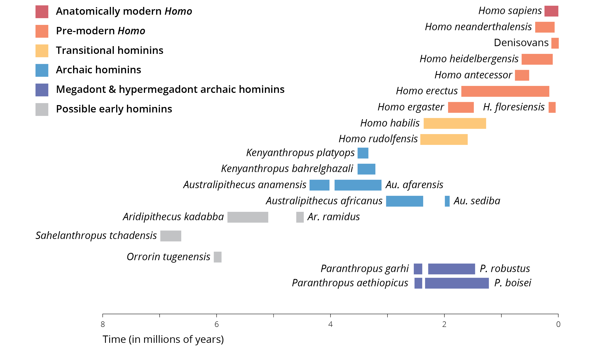

```{r include=FALSE}
library(ggplot2)
library(ggrepel)
library(ggpubr)
library(RColorBrewer)
```

# Human Evolution

Viewing the world through the eyes of an evolutionary biologist allows us to appreciate the origins of biodiversity and develop tangible solutions to some of the world's major problems. But it also raises a number of questions about ourselves: How did humans come about? Why did we start to walk on two feet, use tools, and make art? And are we still evolving today? Darwin recognized how his ideas challenged the prevailing dogma that humans are somehow separate from the rest of God's creation. Like other naturalists before him, he aptly observed our apparent relationship to other primates, and his ideas implied that the resemblance of traits between humans and other apes was a consequence of descent from a common ancestor. Hence, he concluded in *The Origin of Species*:

> "Man could no longer be regarded as the Lord of Creation, a being apart from the rest of nature. He was merely the representative of one among many families of the order Primates in the class Mammalia." ---Darwin, 1859

Considering how meticulously Darwin collected evidence in support of his hypotheses on descent with modification and natural selection, he offered surprisingly little insight about the implications of his ideas on the origin of modern humans. Instead, he left his audience with a cliffhanger:

> "In the distant future I see open fields for far more important researches, [and] light will be thrown on the origin of man and his history." ---Darwin, 1859

Darwin did not omit a discussion of human evolution in *The Origin of Species* due to the lack of interest. Rather, he feared that the discussion of human evolution would be perceived as too radical, and he did not want distract from the debate about the scientific merits of his ideas. Twelve years after the publication of *The Origin of Species*, Darwin followed up with a book devoted to human evolution and sexual selection (The Descent of Man, and Selection in Relation to Sex, first published in 1871); he wrote:

> "During many years I collected notes on the origin or descent of man, without any intention of publishing in the subject, but rather with the determination not to publish, as I thought that I should thus only add to the prejudices against my views." ---Darwin, 1871

Undoubtedly, Darwin was right. Over 160 years after the publication of *The Origin of Species*, evolutionary biology is still a controversial topic in some segments of our society, even though other scientific theories that clash with a literal interpretation of scripture---for example, the idea that Earth is round, heliocentrism, the Big Bang theory, and the germ theory of disease---have been more widely accepted. Be that as it may, Darwin predicted accurately; now, in the distant future from his time, researchers have thrown light on the origin of man. A treasure trove of fossil artifacts have not only provided clues about changes in our morphology and geographic distribution, but have also taught us how our ancestors manufactured tools, used fire, and hunted big game in prehistoric time. In addition, population genetic analyses of modern human populations---and more recently, genetic analyses of ancient DNA left by long-extinct ancestors---has shed light on human movement patterns, adaptation, and interaction with extinct lineages. In this chapter, we will first establish the evidence for the human phylogenetic position. Then, we will briefly explore what we have learned about human origins from the fossil record, and how modern molecular genetic approaches have transformed our ability to ask question about our nature and where we come from.

## Phylogenetic Position

In 1735, Linnaeus was the first to classify humans alongside other animals. He assigned our species to the class called Quadrupeds (which later became Mammalia) and in the order Anthropomorpha (which later became Primates). Besides humans (genus *Homo*), Linnaeus' Anthropomorpha also included the genera *Simia* (apes) and *Bradypus* (sloths). Thomas Henry Huxley---a fervent supporter of evolutionary thought that earned him the nickname "Darwin's bulldog"---was the first to systematically investigate the phylogenetic position of humans relative to other primates, and since the publication of his work in 1863, countless studies have followed. Humans (*Homo sapiens*) are part of the taxon Catarrhini (Old World monkeys), which includes the superfamily Cercopithecoidea (24 genera with 138 species; including baboons, macaques, colobus, vervet, mangabey, mandrill, proboscis monkey, and many others) and the superfamily Hominoidea. Hominoidea is composed of two families (Figure \@ref(fig:apes)): the Hylobatidae (4 genera and 18 species of gibbons) and the Homonidae (4 genera and 8 species of Great Apes). Hence, humans are closely related to the chimpanzees of Africa (genus *Pan* with 2 species), the gorillas of Africa (genus *Gorilla* with 2 species), and the orangutans of Indonesia and Malaysia (genus *Pongo* with 3 species).

While morphological traits commonly used for phylogenetic inference and taxonomic classification unequivocally group humans with the other great apes, they do not offer sufficient information to resolve relationships within the family Hominidae. Specifically, morphological data alone was not able to falsify hypotheses about the relative position of humans, chimpanzees, and gorillas. For a long time, it was unclear whether humans and chimpanzees together were sister to gorillas, whether humans and gorillas together were sister to chimpanzees, or whether chimpanzees and gorillas together were sister to humans. Only the advent of molecular genetic approaches in 1960s and 1970s provided conclusive evidence that humans and the two species of chimpanzees are closely related with each other (Figure \@ref(fig:apes)). Both genera are derived from a shared ancestor that lived in sub-Saharan Africa between 6.5-9.3 million years ago, which is consistent with fossil evidence estimating the divergence time at 6-10 million years ago (Moorjani et al. 2016).

```{r apes, echo=FALSE, out.width='100%', fig.cap = "The phylogenetic position of humans relative to other species within the taxon Catarrhini, which includes the family Hominidae (great apes) and Hylobatidae (gibbons). Adopted from Chatterjee et al. (2009)."}
knitr::include_graphics('images/primate_phylogeny.png')
```

Molecular genetic analyses---spearheaded by the Human Genome Project that produced draft genomes for both humans and chimpanzees---have since revealed just how similar we are to our forest-dwelling cousins. At first sight, the key genetic difference between humans and chimpanzees appears to be a difference in chromosome numbers (chimps have 24 pairs, humans only 23). However, the human chromosome 2 is a composite of two chimpanzee chromosomes that fused into one, sometime after the split of our lineages. The order of genes on our second chromosome precisely matches the order of genes on the analogous chromosomes in chimpanzees. In addition, genome-wide analyses of sequence similarity have indicated that humans and chimpanzees share over 98 % of the nucleotide sequences---even 99.2 % in protein-coding regions. There are however, substantial differences in patterns of gene expression especially in the brain, suggesting that regulatory changes have played an important role in shaping the phenotypic differences between species.

| Sequence type          | Percent difference |
|:-----------------------|-------------------:|
| Pseudogenes            |               1.68 |
| Non-coding, intergenic |               1.24 |
| Non-coding, intronic   |               0.93 |
| Coding, synonymous     |               1.11 |
| Coding, nonsynonymous  |               0.80 |

: Table 14.1: Percent sequence difference between the genomes of humans and chimpanzees for different genetic regions.

## What the Fossils Say

Humans and chimpanzees may look very similar from a genomic perspective, but nobody can deny just how different we are in phenotype, especially in our lifestyles and behaviors. So, how did these differences arise? How did modern humans evolve from the ancestors we shared with chimpanzees just 6-10 million years ago? To address these questions, we first turn to the fossil record. Over the past century, scientists have unearthed fossil remnants that represent thousands of individual specimens, as well as stone tools and other artifacts that provide us with insights into human evolution. And unlike the gradual ape-to-man illustration so popular in museums and cartoons, the fossils show that there was no straight line of evolution from a distant ancestor to our present form. Instead, fossils indicate that there was a diversity of hominid forms that lived in sub-Saharan Africa and other portions of the planet. As we will see, how many different species this diversity represents and the relationship between different lineages is less clear.

```{r fossils, echo=FALSE, out.width='100%', fig.cap = "Overview of key fossil representatives since the human lineage split from the last common ancestor with chimpanzees. Additional details are provided in the text. Adopted from Wood and Grabowski (2015)."}

```

### An Abridged Timeline

To provide a general overview of the different types of fossils that we currently have available, I will briefly introduce some key groups that span the past 7 million years. This overview is by no means comprehensive, especially because the taxonomy of human fossil remains is constantly changing.

#### Possible Early Hominids {.unnumbered}

Remnants assigned to three different genera, *Sahelanthropus*, *Orrorin*, and *Aridipithecus*, are typically considered early hominins that represent lineages on the human side of the branch since the last common ancestor with chimpanzees. These fossils vary in age from about 7 million years (*Sahelanthropus*) to about 4.5 million years (*Aridipithecus*). All of these forms lack the characteristic features of later hominids. However, their are assumed to be among our ancestors because of peculiarities in their dentition and morphological adaptations of the pelvis and the hind limbs that suggest habitual (obligate) bipedal locomotion.

```{r earlyhom, echo=FALSE, out.width='100%', fig.cap = "A. Skull cast of *Sahelenthropus tchadensis*. Photo by Rama, [CC BY-SA 3.0 FR](https://creativecommons.org/licenses/by-sa/3.0/fr/deed.en). B. Sketch of an *Aridipithecus* skeleton. Illustration by Ori~, [CC BY-SA 3.0](https://creativecommons.org/licenses/by-sa/3.0)."}
knitr::include_graphics('images/earlyhominins.png')
```

#### Archaic Hominins {.unnumbered}

Fossils assigned to two genera---*Australipithecus* and *Kenyanthropus*---are considered archaic hominins (also known as slender australopithecines) and span a time frame from roughly 2 to 4 million years ago. These forms are unambiguously hominin with predominantly bipedal locomotion, although their upper limb morphology suggest that they were still effective climbers. Evidence for bipedalism has not only been inferred from morphological adaptations in the skeleton, but also from spectacular footprints attributed to *Australipithecus afarensis* found in Laetoli, Tanzania (Figure \@ref(fig:archaic)). Archaic humans also exhibited apelike skulls with projecting faces and large chewing teeth, albeit with reduced canines. All archaic hominins were relatively small (1.1-1.5 m tall; 30-45 kg). The brains of archaic hominins were slightly larger than those of earlier forms, but still substantially smaller than those of species from the genus *Homo* that evolved later. Note that assignment of different forms to either *Australipithecus* or *Kenyanthropus,* and the differentiation of species within those genera, largely depends on variation in the size and shape of teeth and other cranial features.

```{r archaic, echo=FALSE, out.width='100%', fig.cap = "A. Reconstruction of the skull of Lucy, an *Australopithecus afarensis*. Photo by Pbuergler, [CC BY-SA 3.0](https://creativecommons.org/licenses/by-sa/3.0). B. Footprints attributed to *Australopithecus afarensis* from Laetoli (Tanzania). Masao et al. (2016)."}
knitr::include_graphics('images/archaic.png')
```

#### Megadont and Hyper-Megadont Archaic Hominins {.unnumbered}

About 2.5 million years ago, two distinctly different lineages appear in the fossil record: one includes fossils with more and more similarities to modern humans and is assigned to the genus *Homo*; the other has quite distinct cranial features and includes the genus *Paranthropus* (also known as robust australopithecines). *Paranthropus* includes so-called megadont and hyper-megadont forms that are characterized by extremely large post-canine teeth with exceptionally thick enamel. In addition, most *Paranthropus* exhibited a cranial crest that we also observe in modern carnivores. The cranial crest serves as an attachment point for powerful jaw muscles. Together, the dental modifications and cranial crest suggests that these hominins were adapted to powerful chewing (hence their nickname, nutcracker man). Otherwise, *Paranthropus* exhibited similar traits to the slender australopithecines; *i.e.*, they were of small stature, had large faces, small brains, and predominantly bipedal locomotion. Interestingly, it has been suggested that *Paranthropus* exhibited a thumb morphology required for the manufacturing of simple tools. Some researchers have hypothesized that *Paranthropus* was responsible for the manufacturing of the oldest known stone tools (Oldowan tool) that are about 2.5 million years old.

```{r megadont, echo=FALSE, out.width='100%', fig.cap = "A. The skull of *Paranthropus boisei*, known as KNM ER 406, photographed at the Nairobi National Museum. Photo by Bjørn Christian Tørrissen, [CC BY-SA 3.0](https://creativecommons.org/licenses/by-sa/3.0). B. Oldowan stone chopper. Photo by José-Manuel Benito Álvarez, [CC BY-SA 2.5](https://creativecommons.org/licenses/by-sa/2.5)."}
knitr::include_graphics('images/paranthropus.png')
```

#### Transitional Hominins {.unnumbered}

Concurrently with *Paranthropus*, forms with unmistakably human characteristics started to appear about 2.5 million years ago. The oldest forms assigned to the genus *Homo* are *H. habilis* and *H. rudolfensis*. Both forms show a mix of morphology, with some traits seen in pre-modern *Homo* and some in archaic hominins. Hence, the generic placement of the two species is somewhat controversial, and some researchers argue that they should be placed in either *Australipithecus* or *Kenyanthropus* instead.

Traits shared with older forms include long arms, a flat face, and large mandibles and postcanine teeth, which indicated that *H. habilis* and *H. rudolfensis* consumed mechanically demanding diets. Both forms, however, exhibited larger brain volumes and statures than archaic humans. Especially *H. habilis* fossils are frequently found with remains of butchered animals and simple stone tools, suggesting that they were hunters. They are widely considered to be the first humans to have manufactured stone tools at a large scales; hence, the epithet *habilis* (handy man).

```{r transitional, echo=FALSE, out.width='100%', fig.cap = "A. Skull of *Homo habilis*. B. Skull of *H. rudolfensis*. Photos by Hawks et al. (2017)."}


```

#### Pre-Modern Hominins and *Homo sapiens* {.unnumbered}

Starting about 1.8 million years ago, lineages appear that have modern humans' characteristic postcranial morphology. Older forms still lack the distinctive size and shape of the modern human cranium, and they exhibit larger teeth and more robust jaws, but the similarities to modern humans get closer the younger the fossils are. Not surprisingly, there is tremendous variation in brain size in this group, ranging from about 600 to over 1,300 cm^3^.

The two earliest forms among pre-modern hominins are *H. ergaster* and *H. erectus*, which many scientists consider to the be same species (*H. erectus*). *H. erectus* is significant for many reasons, including its huge temporal range (1.8 million to 30,000 years ago) that overlapped with modern humans. In addition, *H. erectus* was the first hominin that left sub-Saharan Africa and colonized wide portions of Eurasia and and southeastern Asia. Compared to modern humans, *H. erectus* exhibited a smaller brain volume, larger teeth, and lacked a chin (Figure \@ref(fig:erectheidel)A). However, *H. erectus* was of similar size and stature as us, and it was also the first human species to exhibit a flat face with a prominent nose and possibly a reduced coverage of body hair. Much controversy surrounds *H. erectus*' ability to speak, but some researchers proposed that they communicated using some proto-language. African populations of *H. erectus* are likely the ancestors of later human forms (*H. heidelbergensis* and *H. antecessor*), which then gave rise to modern humans. Similarly, Asian populations of *H. erectus* have been hypothesized to be ancestral to *H. floresiensis* and other Asian hominins.

Two species that temporarily overlapped with *H. erectus,* and are likely derived from it, are *H. antecessor* (found in Spain) and *H. heidelbergensis* (found in primarily in Europe, but also northern Africa and parts of Asia; Figure \@ref(fig:erectheidel)B). Fossils of these forms are about 100,000-600,000 years old. Both forms differ from modern humans in details of their cranial and dental morphology and bear a more robust postcranial skeleton, but they have increasingly large brains. *H. heidelbergensis* fossils are also accompanied by changing stone tools, suggesting technological advances compared to *H. erectus*. For example, there is evidence for the emergence of hafting (the attachment of rock tips to wooden shafts to create spears and axes) and for the regular use of fire in daily life about 400,000 years ago. Depending on the authority, *H. antecessor* or *H. heidelbergensis* is considered the direct ancestor of neanderthals and modern humans.

```{r erectheidel, echo=FALSE, out.width='100%', fig.cap = "A. *Homo ergaster* skull from Nariokotome, Lake Turkana area, Kenya. B. *Homo heidelbergensis* skull from Kabwe, central Zambia, southern Africa. Photos by [James St. John](https://www.flickr.com/photos/jsjgeology/), [CC BY 2.0](https://www.flickr.com/photos/jsjgeology/)."}
knitr::include_graphics('images/erect_heidel.png')

```

Finally, there is fossil evidence for three additional species that survived until relatively recently: *H. neanderthalensis* from Europe, the Middle East, and part of Asia (400,000-20,000 years ago); an undescribed form known as Denisovans from Siberia that we will talk about in more detail later in this chapter; and *H. florisiensis* from the Indonesian island of Flores (74,000-16,000 years ago). All three forms widely coexisted with modern humans that start to appear in the fossil record about 300,000 years ago.

Neanderthals were very similar to modern humans but exhibited a distinctly thick, double-arched brow ridge, a large nose, and other cranial peculiarities (Figure \@ref(fig:sapnea)). On average, they had a larger brain volume than modern humans, and their hyoid bone---which in modern humans is associated with tongue mobility and speech---was identical to ours. Hence, it is widely assumed that *H. neanderthalensis* communicated through language. They used sophisticated technology; besides stone tools, they created fire, built cave hearths, made adhesives from plant sap, crafted clothes, wove, and traveled across stretches of water in rafts. Neanderthals are also suspected to have manufactured ornaments, simple instruments, and created the some of the oldest cave paintings that were previously attributed to modern humans.

```{r sapnea, echo=FALSE, out.width='100%', fig.cap = "Comparison of modern human (left) and Neanderthal skulls from the Cleveland Museum of Natural History. Illustration by hairymuseummatt (original photo) and DrMikeBaxter (derivative work), [CC BY-SA 2.0](https://creativecommons.org/licenses/by-sa/2.0)."}
knitr::include_graphics('images/sapiens_neanderthals.png')
```

In comparison, *H. floriensis* was spatially much more restricted and only occurred on a single island (Flores) in Indonesia (Figure \@ref(fig:flores)). Adults only reached about 1.1 m in height, which is why this species is nicknamed "the hobbit". *H. floriensis* is not closely related to the lineages the gave rise to modern humans, but is instead thought to be derived from *H. erectus*. Its small size is likely an example of island dwarfism, as also evidenced by diminutive elephants and hippos that existed alongside them. The discovery of *H. florisensis* in 2004 caused extensive media attention because it suggested that other hominins roamed Earth just 12,000 years ago.

```{r flores, echo=FALSE, out.width='100%', fig.cap = "Cave where the remainings of *Homo floresiensis* where discovered in 2003, Liang Bua, Flores, Indonesia. Photo by [Rosino](https://www.flickr.com/photos/rosino/), [CC BY-SA 2.0](https://creativecommons.org/licenses/by-sa/2.0/)."}
knitr::include_graphics('images/liangbua.jpg')
```

### Evolutionary Trends

The fossil record of hominins spans almost 8 million years, revealing evolutionary trends. Many modifications pertain to attributes of the skull. For example, there is a gradual forward movement of the foramen magnum (the hole in the base of the skull through which the spinal chord enters) that is likely a consequence of changed posture and bipedalism. In addition, canines become smaller, molars larger, and there is a decrease in prognathism (*i.e.*, the extent to which the bottom part of the face juts forward). Finally, there is a clear increase in cranial capacity and a general rounding of the skull. All of these morphological changes are reflective or correlated with three major trends: the evolution of bipedal locomotion, a non-honing chewing complex and changed diets, and a stark encephalization of the brain.

#### Bipedalism {.unnumbered}

While other great apes are capable of facultative bipdalism, human habitually walk on two feet (we are obligate bipeds). The transition from quadrupedalism to bipedalism is actually one of the earliest evolutionary trends, and skeletal modifications associated with increased bipedalism have been inferred even in early hominids (*Sahelanthropus*, *Orrorin*, and especially *Aridipithecus*). The transition toward bipedal locomotion is associated with a wealth of skeletal changes, from the position of the foramen magnum, to the shape of the spinal chord and the structure of lumbar vertebrae, to the shape and position of the pelvis. In addition, there were changes in leg and foot anatomy, and the arms shorted as climbing and swinging became less important modes of locomotion. All of these changes occurred gradually across several million years of evolution, and fully bipedal locomotion likely did not occur until about 4 million years ago with *Australipithecus*. Why exactly hominins shifted from walking on all fours to walking on two feet remains a matter of controversy. Some of the most prominent hypotheses highlight the efficiency of locomotion and predator recognition in open savannas (as opposed to the ancestral forested habitats). In addition, a shift to bipedalism may have freed up the hands to perform tasks other than locomotion, such as the carrying of food or offspring or the use of tools.

#### Non-Honing Chewing Complex {.unnumbered}

Compared to other great apes, humans have highly reduced canines and enlarged molars (Figure \@ref(fig:canine)). The large canines in the upper jaw of apes are equipped with a sharpened posterior edge. Every time the jaws close, that edge is sharpened by rubbing against the third premolar in the lower jaw, which makes up the so-called "honing (sharpening) complex". Not surprisingly, the sharp canines play an important role in great ape foraging, as they cut and shred leaves, fruit, and other foods. In contrast, along with the reduction in canine size, humans have gradually lost the honing complex. The overall changes in dentition likely reflects changes in dietary habits, tool use, and the use of fire to cook food items prior to consumption.

```{r canine, echo=FALSE, fig.height=4, fig.width=8, message=FALSE, warning=FALSE, fig.cap="The size of canines in the upper and lower jaw from different species of great apes, including humans and two species of *Australopithecus*. [Data](data/14_canine_size.csv) from Ward et al. (2010)."}
canine <- read.csv("data/14_canine_size.csv")
canine$species <- factor(canine$species, levels = c("Homo sapiens", "Australopithecus afarensis", "Australopithecus anamensis","Pan troglodytes","Gorilla gorilla","Pongo pygmaeus"))

ggplot(canine, aes(x=species,y=canine.height, color=jaw))+
    geom_point(position = position_dodge(width = 0.4))+
    geom_errorbar(aes(ymin = canine.height-se, ymax = canine.height+se), width = 0, position = position_dodge(width = 0.4))+
    coord_flip()+
    labs(x="Species", y="Canine crown height (mm)", color="Location")+
    theme_classic()+
    scale_color_brewer(palette = "Set2")
```

#### Brain Encephalization {.unnumbered}

Perhaps most importantly, human evolution is characterized by a continuous increase of brain size---both in terms of the size of the brain relative to body mass and absolute brain size. Gains in cranial volume increased only moderately at first; but starting with early forms of *Homo,* brains got substantially bigger very quickly (Figure \@ref(fig:brain)A). In *H. erectus* alone, brain volume increased by about 50 % compared to transitional *Homo*. The largest brains were found in *H. neanderthalensis*, which had slightly bigger brains than anatomically modern humans. Note that the same patterns were found when researchers inferred the amount of blood flow through the internal carotid artery, which supplies the brain (Figure \@ref(fig:brain)B).

Consistent with increases in brain size, there is also evidence for changes in brain structure and morphology. For example, the brains of non-human primates and early hominins were symmetrical, and there is evidence for increasing lateralization (tendency for some neural functions or cognitive processes to be specialized to one side of the brain or the other) through time. The subdivision into a left and right side of the brain is not only evident in modern humans, but also in endocasts---trace fossils of that arise when minerals replace soft tissues during fossilization---from earlier hominins. Endocasts also indicate significant changes in the cerebellum (associated with learned motor activities), the limbic system (involved in emotion and social communication), and the cerebral cortex (processing of sensory experiences). It is tempting to speculate that these changes in brain structure---and likely function---were directly related to changes in social organization, technological advances, and cultural practices like language.

```{r brain, echo=FALSE, fig.height=4, fig.width=8, message=FALSE, warning=FALSE, fig.cap="A. Endocranial volume for different fossilized hominids, including presentatives from archaic homonids (*Australopithecus*), hyper-megadonts (*Paranthropus*), transitional form of *Homo* (*H. habilis* and *H. rudolfensis*), and premodern *Homo* (*H. erectus* and *H. heidelbergensis*). [Data](data/14_human_brain.csv) from Du et al. (2018). B. Estimates of blood frow through the internal carotid artery into the brain for different hominids. [Data](data/14_human_brain.csv) from Seymour et al. (2016)."}
brainbvol <- read.csv("data/14_brainsize.csv")
brainbvol$group <- factor(brainbvol$group, levels = c("Archaic", "Hyper-megadont", "Transitional", "Premodern"))
brain.p1 <- ggplot(brainbvol, aes(x=-age, y=ecv1, color=group))+
    geom_smooth(method="lm", se=FALSE, color="gray", formula=y~exp(x))+
    geom_point()+
    labs(x="Time (in million years)", y="Endocranial volume (cm3)", color="Group")+
    theme_classic()+
    theme(legend.position = c(0.24,0.8))+
    scale_color_brewer(palette = "Set2")

brain <- read.csv("data/14_human_brain.csv")
brain2 <- brain[which(brain$group=="hominins"),]
brain3 <- brain[which(brain$group=="apes"),]

brain.p2 <- ggplot(brain2, aes(x=-time, y=int.car.blood.flow, label=species))+
    geom_smooth(method="lm", se=FALSE, color="gray", formula=y~exp(x))+
    geom_point()+
    geom_point(data=brain3, aes(x=-time, y=int.car.blood.flow, label=species), color="gray")+
    geom_text_repel(box.padding = .75, max.overlaps = Inf)+
    geom_text_repel(data=brain3, box.padding = .75, max.overlaps = Inf, color="gray")+
    labs(x="Time (in million years)", y="Internal carotid blood flow rate")+
    theme_classic()

ggarrange(brain.p1, brain.p2, labels = c("A", "B"), nrow = 1)
```

### A Lone Survivor of an Extinct Radiation

The fossil record clearly disproves the common notion of a straight evolutionary line between the common ancestor we shared with chimpanzees and modern humans, with gradual changes from small-brained quadrupeds to large-brained bipeds. Rather, there is clear evidence for a diversification of lineages around 4 million years ago. For most of the time since, multiple species of humans have coexisted in different parts of Africa and Eurasia, and in some cases there is also clear evidence that these species interacted ecologically. While the diversity of prehistoric humans reached a peak around 2 million years ago, there is robust evidence that even modern humans---which appear in the fossil record a mere 300,000 years ago---temporally overlapped with *H. neanderthalensis*, *H. heidelbergensis*, *H. floresiensis*, and likely even *H. erectus*. As we will see, there is also direct evidence that anatomically modern humans interacted with *H. neanderthalensis*, Denisovans, *H. heidelbergensis* and other distinct lineages that we do not know in detail. Hence, our lineage---the contemporary *H. sapiens*---represents a lone survivor from a considerable and likely underestimated diversity of related forms that existed for the better part of the past 4 million years.

While the fossil record has offered profound insights into our origins, it is important to also emphasize what it cannot tell us about human evolution. First and foremost, we do not know what forms actually represent different species incapable of interbreeding. The taxonomy of fossil remains hinges on the analysis of skeletal characteristics, assessed mostly from incomplete skeletons. Hence, we may be overestimating the past species diversity, if some of the more subtle morphological differences are reflective of intraspecific variation, perhaps in relation to geography. However, we may also be underestimating the past species diversity if the current fossil record is incomplete or if important species differences are not inferable from the partial remains that we have available.

The fossil record also leaves us largely ignorant about the phylogenetic relationship of different forms we know. Remember, Huxley was unable to resolve the phylogenetic relationship among gorillas, chimpanzees, and humans based on the analysis of skeletal traits. Needless to say that this task is not made any easier when more closely related and less complete skeletons are analyzed. So, while *Astralopithecus afarensis* is often assumed to be the ancestor of *Paranthropus* and *Homo* species, or *H. heidelbergensis* the ancestor of *H. neanderthalensis* and *H. sapiens*, we cannot test those hypotheses conclusively with the data available. Inferring evolutionary relationships and processes, especially in deeper time, is challenging because of the comparatively scant lines of evidence. However, it is important to remember just how young we are as a species. If we ask how exactly modern humans arose from the diversity of lineages that are evident in the fossil record, we can leverage a much broader toolset to test hypotheses framed on the basis of insights provided by fossils.

## Modern Human Origins

A number of of hypotheses have been proposed to explain the origin of *Homo sapiens*. The different hypotheses cover a range of possibilities about how anatomically modern forms may have arisen from more archaic hominids. I will briefly introduce each hypothesis, and then we will examine the evidence for the alternative scenarios.

### Hypotheses

On one extreme of the spectrum of modern human origins is the candelabra hypothesis, whose most prominent proponent was anthropologist Carleton Coon. The candelabra hypothesis posits that anatomically modern humans arose in Africa, Asia, and Europe from archaic forms that had colonized these regions earlier (Figure \@ref(fig:hypotheses)A). Under this scenario, modern humans in different geographic regions evolved independently, and shared characteristics among lineages would be the product of convergent evolution. Coon mostly used this idea to justify and propagate his racist ideologies. He believed---without actual evidence, of course---that the transformation from archaic to modern humans started in European populations first, which in his eyes proved why Europeans were so advanced compared to he considered to be more primitive peoples of other regions. The candelabra hypothesis is firmly rooted in scientific racism and eugenics, both debunked pseudosciences that remind us of the painful historical track record of biology and notions of race. Even if we set the racist connotations aside, there is just no merit to the idea that modern humans represent multiple, deeply divergent evolutionary lineages, which is why candelabra is mentioned here more as a historical side note.

Similar to candelabra, the second hypothesis of modern human origins---the multiregional evolution hypothesis---proposes that archaic humans colonized Eurasia from Africa about 1 million years ago, and they then diverged in different geographic regions while remaining connected through gene flow (Figure \@ref(fig:hypotheses)B). The time estimate of emigration out of Africa is based on the age of *H. erectus* fossils that appear in Eurasia around that time.

In contrast, the third hypothesis---the out-of-Africa hypothesis---proposes that there were two waves of emigration of African *Homo* that colonized Eurasia. A first wave involved *H. erectus*, which colonized Eurasia about 1 million years ago; again, consistent with the fossil record for that species. However, the out-of-Africa hypothesis also postulates that anatomically modern human originated in Africa. Modern humans then dispersed out of Africa much more recently (100,000-200,000 years ago) and displaced the other hominins in Eurasia that settled there before (Figure \@ref(fig:hypotheses)C). The replacement of ancient lineages by modern *H. sapiens* derived from Africa is why this hypothesis is also known as the African replacement hypothesis.

Last but not least, the hybridization-and-assimilation hypothesis is very similar to the out-of-Africa hypothesis, in that it assumes an African origin of modern humans. However, instead of replacing more ancient lineages during the colonization of Eurasia, this hypothesis proposes that newly-arriving modern *H. sapiens* hybridized with other forms of *Homo* that colonized these areas (Figure \@ref(fig:hypotheses)D). Hybridization essentially led to the assimilation---or fusion---of different lineages.

In the following sections, we will first address the multiregional evolution and the out-of-Africa hypotheses, which make contrasting predictions that can be address using phylogenetic and population genetic analyses of extant human populations. As you will see, there is overwhelming evidence for an African origin of modern humans and relatively recently migrations to colonize Eurasia and other portions of the planet. In a second step, we will then weigh the evidence for the out-of-Africa and the hybridization and assimilation hypotheses. Juxtaposing these alternative scenarios has become feasible in the past decade, as technological breakthroughs have enabled us to sequence the DNA of long-dead ancestors, including members of *H. neanderthalensis* and other extinct species.

```{r hypotheses, echo=FALSE, out.width='100%', fig.cap = "Hypotheses explaining the origin of modern himans (see text for details): A. candelabra hypothesis; B. multiregional; C. out-of-Africa (or African replacement) hypothesis; D. hybridization-and-assimilation hypothesis."}
knitr::include_graphics('images/human_hypotheses.png')
```

### Multiregional Evolution *vs*. Out-Of-Africa

The multiregional evolution and out-of-Africa hypotheses make contrasting predictions that are based on evidence from the fossil record. We know that *H. erectus* was the first hominin to leave Africa and colonize Eurasia. Evidence of fossil bones and manufactured tools suggest that migrations of *H. erectus* started about 1.8 million years ago, and within 500,000 years the distribution of these ancient humans reached as far as China and Indonesia. It is important to note that these are conservative estimates, especially since new fossil discoveries from China suggest that the start of Eurasian colonization may in fact have occurred significantly earlier than what we had assumed. In contrast, fossil remains of anatomically modern humans are much younger. The oldest known fossils are between 200,000 and 300,000 years old and were all found on the African continent, including Morocco, Ethiopia, and South Africa. The oldest *H. sapiens* fossil outside of Africa was recently discovered in Israel and is about 185 million years old. In addition, a wealth of other modern human remains have been found in the Middle East and are dated at 90,000-120,000 years before present.

If the multiregional evolution hypothesis were true and modern humans in different geographic regions were derived from *H.-erectus*-like forms, then we would predict the divergence time between extant African and non-African human populations to be more than 1 million years, consistent with the fossil traces left behind by *H. erectus*. In contrast, if modern humans arose in Africa and then emigrated to and replaced more ancient humans in Eurasia, then the divergence time between African and non-African populations should be less than 200,000 years. The two hypotheses also make contrasting predictions about the location of ancestral lineages; they should be dispersed randomly across Africa and Eurasia if the multiregional evolution hypothesis was true, but restricted to Africa if the out-of-Africa hypothesis was true. Both of these predictions---the one related to divergence time and the one related to the location of ancestral lineages---can be addressed through phylogenetic analyses of extant human populations.

Two additional predictions arise from the population genetic consequences of dispersal and the effects of genetic drift associated with founder effects. As discussed in [Chapter 6](evolutionary-mechanisms-ii-mutation-genetic-drift-migration-and-non-random-mating.html#genetic-drift-the-random-force), founder effects occur when a random subset of individuals in a population disperses to a new geographic area and establishes new populations. In this case, only a subset of alleles present in the ancestral population is carried along. The out-of-Africa hypothesis---in which such a founder effect occurs---consequently predicts reduced genetic diversity and the presence of only a subset of neutral alleles in non-African populations compared to Africans. In contrast, the multiregional evolution hypothesis---in which such a founder effect does not occur---predicts that levels of genetic diversity are equal and the presence of sets of neutral alleles randomly distributed among human populations in different geographic regions. This second set of hypotheses are testable through population genetic analyses of extant human populations.

| Prediction                                                  | Multiregional evolution                                                                          | Out-of-Africa                                                                                                            |
|:-----------------|:-----------------------|:-----------------------------|
| Divergence time between African and non-African populations | \>1,000,000 years                                                                                | \<200,000 years                                                                                                          |
| Location of ancestral lineages                              | Random                                                                                           | Africa                                                                                                                   |
| Levels of genetic diversity                                 | Not significantly different among geographic regions                                             | Highest in Africa, reduced everywhere else                                                                               |
| Sets of neutral alleles                                     | Each geographic regions has unique alleles; no region's alleles are a subset of another region's | Only African populations have unique alleles; alleles present in non-African populations are a subset of those in Africa |

: Table 14.1: Summary of contrasting predictions between the out-of-Africa and the multiregional evolution hypotheses.

So, what is the evidence for and against the multiregional evolution and out-of-Africa hypotheses? Max Ingman and his colleagues (2000) were among the first to rigorously test these phylogenetic predictions by analyzing the mitochondrial DNA of 53 humans of diverse geographic provenance. The phylogeny they reconstructed (Figure \@ref(fig:modhuphy)) provides unequivocal support for the out-of-Africa hypotheses. The age of the shared ancestor of all modern human population was estimated at about 170,000 years. More importantly, the age of the youngest clade containing both African and non-African populations (marked with an orange dot in Figure \@ref(fig:modhuphy)) was estimated at around 52,000 years, falling squarely within the range of predictions for out-of-Africa, but not multiregional evolution. In addition, the phylogeny also indicated that ancestral lineages are restricted to the African continent, and they do not occur randomly across the continents as predicted by the multiregional evolution hypothesis. More recent phylogenetic analyses based on partial and whole-genome sequences of nuclear DNA have largely corroborated these results, even though humans have likely left Africa earlier. The most recent estimates put the exodus of modern humans from Africa at around 200,000 years ago.

```{r modhuphy, echo=FALSE, out.width='100%', fig.cap = "Phylogeny based on mitochondrial DNA sequences of extant human populations. African and non-African populations are indicated in color, and the estimated divergence times are indicated for the last common ancestor of all humans as well as the youngest clade containing both African and non-African populations. Adopted from Ingman et al. (2000)."}
knitr::include_graphics('images/modernhumanphylo.png')
```

Just like phylogenetic analyses, population genetic analyses that survey patterns of genetic variation have also uncovered evidence for the out-of-Africa hypothesis. Research on mitochondrial DNA, hypervariable microsatellites, transposable elements, and---most recently---whole-genome sequencing has found the highest levels of genetic variation in African populations, and reduced variation in non-African populations. For example, genetic variation estimated in 51 populations at 650,000 loci within the human genome revealed a clear negative correlation between heterozygosity and the distance of a population to Addis Ababa, Ethiopia, which is proximate to the presumed cradle of modern humans (Figure \@ref(fig:gendiv)A). This is consistent with sequential founder effects that reduced genetic variation as bands of humans ventured ever farther away and established new populations, even in distant and isolated regions of Oceania and the Americas. Genetic analyses have also revealed that unique neutral alleles are not randomly distributed across different geographic regions. Rather, unique alleles are largely restricted to Africa, and alleles in other regions represent a mere subset of African alleles (Figure \@ref(fig:gendiv)B).

```{r gendiv, echo=FALSE, fig.height=4, fig.width=8, message=FALSE, warning=FALSE, fig.cap="A. Relationship between the genetic diversity (heterozygosity) of 51 human populations and their distance from Addis Ababa, Ethiopia. [Data](data/14_humanheterozygosity.csv) from Li et al. (2008). B. Frequency of different CD4 STRP alleles in African and non-African populations both for Alu(+) and Alu(-) chromosomes. Non-African alleles are clearly a subset of alleles present in African populations. [Data](data/14_subsets.csv) from Tishkoff et al. (1996)."}
huhet <- read.csv("data/14_humanheterozygosity.csv")
subsets <- read.csv("data/14_subsets.csv")

gendiv.p1 <- ggplot(huhet, aes(x=distance, y=heterozygosity))+
    geom_smooth(method = "lm", se=FALSE, color="gray")+
    geom_point(aes(color=region))+
    labs(x="Distance from AA", y="Average heterozygosity", color="Geographic region")+
    theme_classic()+
    theme(legend.position = c(0.75,0.85),
          legend.title = element_blank(),
          legend.text.align = 1,
          legend.background = element_rect(fill="transparent"),
          legend.key.size = unit(0.8, 'lines'))+
    guides(color = guide_legend(label.position = "left"))+
    scale_color_brewer(palette = "Set2")

gendiv.p2 <- ggplot(subsets, aes(x=allele, y=frequency))+
    geom_col(position = "dodge")+
    facet_grid(population~chromosome)+
    theme_classic()

ggarrange(gendiv.p1, gendiv.p2, labels=c("A","B"), nrow=1)
```

Consequently, both phylogenetic and population genetic analyses have resoundingly rejected the multiregional evolution hypothesis. Modern humans in different geographic regions are not derived from ancient *H. erectus* that left Africa in excess of 1,000,000 years ago. Instead, our species originated on the African continent relatively recently and then left to colonize the rest of the world around 200,000 years ago. The question then becomes: what happened as those modern human colonizers encountered other forms of *Homo* that had already settled all across Eurasia? The fossil evidence clearly indicates that those areas were not only occupied by *H. erectus*, but also *H. heidelbergensis*, *H. neanderthalensis*, and other lesser-known members of the genus *Homo.* Insights into the outcome of the interactions between modern humans and other homominids have only become available recently, as we have developed the capability to analyzing ancient DNA left behind by our ancestors.

### Out-of-Africa *vs*. Hybridization-and-Assimilation

In 1997, a rumble went through the science world. For the first time in history, Svante Pääbo and his team were able to extract DNA from the skeletal remains of an extinct human, a specimen of *H. neanderthalensis* that lived about 40,000 years ago (Krings et al. 1997). By 2017, scientists had sequenced partial or complete genomes from more than 1,100 ancient human and archaic hominin individuals, rewriting our understanding of our own evolutionary history. While analyses of these ancient DNA samples confirmed an African origin of anatomically modern humans, followed by dispersal to other portions of our planet, the new findings also revised the timing of events in our history and shed new light into how we interacted with other forms of *Homo* that had already settled all over Eurasia.

Sequencing of ancient DNA confirmed that Neanderthals indeed represented a distinct evolutionary lineage that diverged about 500,000 years ago from the ancestors of anatomically modern humans (Figure \@ref(fig:ancientphylo)). Furthermore, clues left behind in the DNA of those ancient bones also revealed that we are likely underestimating the diversity of hominins that lived in the recent past and interacted with modern humans. For example, DNA extracted from finger bones found in the Denisova cave in Siberia turned out to be neither modern human nor Neanderthal in origin. Instead, these finger bones are the remains of a lineage that diverged from our shared ancestors with Neandertals roughly 900,000 years ago (Figure \@ref(fig:ancientphylo)). Besides information encoded in the DNA, we have little knowledge about these so-called Denisovans, which is why they still await formal scientific description. The current lack of fossil traces, beyond the finger bones we currently have available, makes it impossible to know how the Denisovan's features may have compared to ours and other extinct lineages.

DNA sequencing also shed light into the identity of fossils found in Sima de los Huesos, Spain. These fossils have long stirred controversy about the age and identity of Neanderthals, because they bear a striking resemblance to Neanderthals even though they are much older than all the other Neanderthal fossils we know. DNA analyses settled these debates to some degree, as the fossils from Sima de los Huesos are not actually closely related to Neanderthals. Rather, these ancient fossils are more closely related to the Denisovans, with which they shared a common ancestor around 700,000 years ago. Given the deep divergences, some researchers have speculated that that the Sima de los Huesos fossils may represent *H. heidelbergensis*. Overall, these exciting findings clearly show how a wealth of pre-modern humans existed not only in Africa but over wide stretches Eurasia as well. Given that DNA preserves best in the colder climates of northern latitudes but degrades fast in warmer and more humid subtropical and tropical climates, we are likely underestimating the past diversity simply because we have no ancient DNA specimens from those locations.

```{r ancientphylo, echo=FALSE, out.width='100%', fig.cap = "Phylogeny modern humann and pre-modern *Homo* for which we have ancient DNA available. This tree was derived from mitochondrial genome sequences and includes divergence time estimates for critical nodes. Adopted from Meyer et al. (2014). Inserts show crania collected at Lima de los Huesos. Photo of lateral view by UtaUtaNapishtim, [CC BY-SA 4.0](https://creativecommons.org/licenses/by-sa/4.0), photo of frontal view from Sala et al. (2015). "}
knitr::include_graphics('images/ancientdnaphylo.png')
```

The availability of ancient DNA not only allowed us to confirm the evolutionary distinctness of different pre-modern humans and clarify the temporal patterns of diversification, but it also provided the template necessary to ask whether any modern humans exhibit genetic similarities to extinct forms. In other words, ancient DNA allows us to contrast the out-of -Africa and the hybridization-and-assimilation hypotheses (Figure \@ref(fig:hypotheses)C-D). If modern humans indeed replaced pre-modern forms as they dispersed out of Africa, we would not expect to find any DNA sequences with close similarities to those from pre-modern humans in extant populations. Alternatively, if at least some modern humans carry DNA that bears similarities to the DNA of Neanderthals or other extinct forms, then interactions between the modern new arrivals from Africa and the more ancient lineages already settled in Eurasia may not have been purely antagonistic. Instead, it would indicate that modern humans hybridized with those ancient forms.

Perhaps not surprisingly, we now have unequivocal evidence that modern humans indeed interbred with Neanderthals as they emigrated out of Africa. Introgression of Neanderthal DNA is especially common in Eurasia, the Middle East, and North Africa, where we also have evidence for the sympatry of both species based on the fossil record (Figure \@ref(fig:nea)). In contrast, evidence for introgression is comparatively rare in extant human populations from sub-Saharan Africa, which did not exhibit significant range overlap with Neanderthals (Figure \@ref(fig:nea)). These findings substantially rewrite the history of human evolution, because they suggest that Neanderthals never really went extinct. Instead, they were simply assimilated into the gene pool of modern humans, and hence, traces of their existence continue to live on in many of us. Rather than being some distant relative that also inhabited this planet in the past, Neanderthals are actually among our ancestors.

The bits of Neaderthal DNA still present in non-African extant humans are not simply non-functional stretches of junk DNA, but many remain functional and impact the expression in phenotypic traits. For example, Neanderthal DNA has been linked to the morphology of our cranium and brain, the coloration of eyes, hair, and skin, as well as aspects of our immune system. If you have light skin, blond or red hair, or blue or green eyes, you most certainly have inherited those traits from your Neanderthal ancestors. Introgression of these specific genes may have been driven by natural selection and helped newly arriving human populations adapt to life at higher latitudes. By the time modern humans arrived from Africa, Neanderthals had already lived and adapted to the specific environmental conditions at high latitudes for about 300,000 years, carrying allelic variants that had proven beneficial. Interbreeding allowed these beneficial alleles to be introduced into the modern human population, and selection swept them to high frequency.

```{r nea, echo=FALSE, fig.height=4, fig.width=8, message=FALSE, warning=FALSE, fig.cap="Estimated proportions of Neanderthal introgression in different human populations (based on a metric called f4 ratio). [Data](data/14_neanderthal_introgression.csv) from Vyas and Mulligan (2019)"}
nea.int <- read.csv("data/14_neanderthal_introgression.csv")

ggplot(nea.int, aes(x=reorder(population, -f4.ratio), y=f4.ratio))+
    geom_point()+
    geom_errorbar(aes(ymin = f4.ratio-se, ymax = f4.ratio+se), width = 0)+
    coord_flip()+
    labs(x="Population", y="Degree of introgression (f4 ratios)")+
    theme_classic()
```

Interbreeding, it turns out, was not restricted to Neanderthals and modern humans. We also have evidence for interbreeding between Neanderthals and Denisovans, as well as Denisovans and modern humans (Figure \@ref(fig:humanintro)). For example, about 5 % of the genome of people from Oceania is derived from Denisovans. Again, traits associated with pigmentation and immune function in those populations are likely derived from these extinct ancestors. Moreover, genes that have been associated with high-elevation adaptation in Tibetans also appear to have originated from admixture with Denisovans. Finally, analyses of genomic similarities across modern humans, Neanderthals, and Denisovans suggests that patterns of interbreeding also include a fourth member of the genus *Homo*. So far, we don't know the identity of this fourth species, because we do not have a matching reference genome. However, scientists have speculated that it may be *H. heidelbergensis* or *H. erectus* based on the fossil record, which overlapped with the other species both spatially and temporally.

```{r humanintro, echo=FALSE, out.width='100%', fig.cap = "Patterns of historical gene flow between different lineages of pre-modern and modern *Homo*. Adopted from Pfrüfer et al. (2014)."}
knitr::include_graphics('images/humanintroduction.png')
```

In conclusion, the history of recent human evolution is not really a bifurcating phylogenetic tree. Rather it may be better represented by a web of gene flow among divergent lineages. This, of course, raises questions about how many species are actually represented in the fossil record. Clearly, reproductive isolation among these lineages was not complete; otherwise, we would not be able to uncover evidence of widespread hybridization. However, depletion of Neanderthal DNA around functional genomic regions in extant humans suggests that there may have been deleterious epistatic interactions between Neanderthal and modern human alleles. One study estimated the fitness cost of hybridization with Neanderthals at about 0.5 % (Harris and Nielsen 2016)---not huge, but still sufficient for natural selection to cause substantial changes in allele frequencies through time.

The speed at which we have been---and continue to be---learning about our own evolutionary history is staggering. New studies employing revolutionary technologies and analyzing ever-more and ever-older samples are being published almost on a weekly basis. Just in February 2021, the record for the oldest DNA ever sequenced was shattered with the publication of the genome of a mammoth that lived between 1.1 and 1.6 million years ago (van der Valk 2021). No doubt, we can anticipate learning more exciting information about the nature of our ancestors and ourselves!

## What Makes Us Human?

At the end of this chapter, you might be wondering what it really is that make us human, different from all the other creatures with which we share the planet. Scientists and philosophers have pondered this question for millennia. If you ask a biologist, they are likely to talk about how the anatomy of our hand, especially an additional muscle that facilitates additional mobility of the thumb, is very different from other apes and facilitated our extensive use of tools. Or they might highlight the peculiar shape of our hyoid bone, which allows us to articulate a much wider variety of sounds and likely facilitated the evolution of our complex languages. And they will surely highlight the magnificent complexity of our large brains, which make us exquisite learners. Because of our brain, information is not just passed across generations through our DNA, but also through cultural practices that play an important role in our survival and social interactions. It's this magnificent brain that made us into the ultimate survival machine and the most invasive species on the planet. It made us into a species that appreciates art, ponders the meaning of life, and looks beyond Earth into the depths of the universe.

But who are we to say that no other animals share some of these same experiences? Certainly other creatures use tools and communicate in quite sophisticated ways. Elephants that carefully examine the remains of friends and family may experience feelings of grief, just like us. And who knows how many creatures look at the stars in the night sky, feeling humbled by how small and insignificant they are in the big scheme of things, and wondering why they are really there...

I will offer you my very own and very biased perspective of what makes us human: our ability to use fire and cook our food. No other species on the planet processes food quite the same way we do, and some researchers have speculated that food processing allowed us to extract more nutrients from our food items, thus facilitating the evolution of our costly brains... and everything that comes along with them.

So, I will end this book about evolution with a simple recipe---from my ancestors to you. Cook it for a loved one---or just for yourself, you deserve it---and I promise you will have a quintessential human experience in the process.

::: {.alert .alert-block .alert-info}
<b>Pasta Insieme A Sugo Di Pomodoro</b>

Yes... it's just pasta with tomato sauce, but it is 🤤

***Sugo***

-   4 tablespoons of olive oil

-   8 cloves of garlic, finely chopped

-   2 pounds of fresh tomatoes (get some of those sweet heirlooms if you can)

-   A dozen or two basil leaves, finely cut

-   Salt and pepper to taste

Bring some water to a boil in a sauce pan, add the tomatoes, and simmer for 3 minutes; then remove the tomatoes, peel the skin, remove the seeds, and cut them into small pieces. Then heat up the olive oil and carefully brown the garlic (slow... don't burn it), add the tomatoes, and let it simmer for about 20 minutes. Add salt and pepper to taste, and add the basil just before you are ready to serve.

***Pasta***

-   1.5 cups of wheat flour

-   1.5 cups of semola flour

-   4 large eggs

Sift the two flours together into a bowl, make a hole in the center with your hand, and add the eggs into the hole; then use your fingers mix the eggs with the flour (go slow, incorporating more and more flour as you go). Once the dough is uniform, knead it for 10 minutes (if its hard to knead because the dough is too dry, add a little water; if the dough is sticky, add a little flour); then make a ball, wrap it in plastic wrap, and let it rest for 30 minutes. After that, you can roll your dough and cut your noodles using a pasta maker, or you can use a rolling pin and a sharp knife instead. To cook the pasta, add it to a pot of well-salted boiling water for about 2 minutes.

***Serve***

Drain the pasta and add it to bowl, top it with your freshly-made sugo, and shave some Parmesan cheese on top. My ancestors typically enjoyed this with a glass of red wine:)
:::

## Case Study: Modern Human Origins

In [the case study associated with this chapter](exercises/BIOL520-ex13.zip), you will contrast different hypotheses of modern human origins. You have already learned all R skills required for the completion of this exercise.

## Reflection Questions

1.  Is it accurate to say that humans evolved from apes?

2.  What are some of the limitations inherent to information derived from the fossil record? What questions about human evolution are not addressable by looking at fossils alone?

3.  What are the key differences between the alternative hypotheses of modern human origins, how can they be tested, and what evidence do we have for and against each of them?

4.  The out-of-Africa hypothesis postulates that non-African humans are derived from African populations. A common misconception about this idea is that African peoples are consequently more "primitive" than those from other geographic regions. Can you explain the flaw in this argument?

5.  Why do you think we have such great coverage of ancient DNA samples from Eurasia but comparatively few from other geographic regions?

6.  Do you think humans are still evolving today? If so, how?

## References

-   Chatterjee HJ, Ho SYW, Barnes I, Groves C (2009). [Estimating the phylogeny and divergence times of primates using a supermatrix approach](https://bmcecolevol.biomedcentral.com/articles/10.1186/1471-2148-9-259). *BMC Evolutionary Biolology* 9: 259.

-   Du A, Zipkin AM, Hatala KG, et al (2018). [Pattern and process in hominin brain size evolution are scale-dependent](https://doi.org/10.1098/rspb.2017.2738). *Proceedings of the Royal Society B* 285. 20172738:

-   Harris K, Nielsen R (2016) [The genetic cost of Neanderthal introgression](https://www.genetics.org/content/203/2/881). *Genetics* 203: 881--891.

-   Hawks J, Elliott M, Schmid P, et al (2017). [New fossil remains of *Homo naledi* from the Lesedi Chamber, South Africa](https://doi.org/10.7554/eLife.24232). *eLife* 6: e24232.

-   Ingman M, Kaessmann H, Pääbo S, Gyllensten U (2000). [Mitochondrial genome variation and the origin of modern humans](https://www.nature.com/articles/35047064). *Nature* 408:708--713

-   Krings M, Stone A, Schmitz RW, et al (1997). [Neandertal DNA sequences and the origin of modern humans](https://www.cell.com/fulltext/S0092-8674(00)80310-4). *Cell* 90: 19--30.

-   Li JZ, Absher DM, Tang H, et al (2008) [Worldwide human relationships inferred from genome-wide patterns of variation](https://www.science.org/doi/10.1126/science.1153717). *Science* 319:1100--1104

-   Masao FT, Ichumbaki EB, Cherin M, Barili A, Boschain G, Iurino DA, Menconero S, Moggi-Cecchi J, Manzi G (2016). [New footprints from Laetoli (Tanzania) provide evidence for marked body size variation in early hominins](https://doi.org/10.7554/eLife.19568). *eLife* 5: e19568.

-   Meyer M, Fu Q, Aximu-Petri A, et al (2014). [A mitochondrial genome sequence of a hominin from Sima de los Huesos](https://www.nature.com/articles/nature12788). *Nature* 505: 403--406.

-   Prüfer K, Racimo F, Patterson N, et al (2014) [The complete genome sequence of a Neanderthal from the Altai Mountains](https://www.nature.com/articles/nature12886). *Nature* 505: 43--49.

-   Sala N, Arsuaga JL, Pantoja-Pérez A, et al (2015) [Lethal interpersonal violence in the Middle Pleistocene](https://journals.plos.org/plosone/article?id=10.1371/journal.pone.0126589). *PLoS One* 10: e0126589.

-   Seymour RS, Bosiocic V, Snelling EP (2016). [Fossil skulls reveal that blood flow rate to the brain increased faster than brain volume during human evolution](https://royalsocietypublishing-org.er.lib.k-state.edu/doi/10.1098/rsos.160305). *Royal Society Open Scienc*e 3: 160305.

-   Tishkoff SA, Dietzsch E, Speed W, et al (1996). [Global patterns of linkage disequilibrium at the CD4 locus and modern human origins](https://www.science.org/doi/abs/10.1126/science.271.5254.1380). *Science* 271: 1380--1387.

-   van der Valk T, Pečnerová P, Díez-Del-Molino D, et al (2021). [Million-year-old DNA sheds light on the genomic history of mammoths](https://www.nature.com/articles/s41586-021-03224-9). *Nature* 591: 265--269.

-   Vyas DN, Mulligan CJ (2019). [Analyses of Neanderthal introgression suggest that Levantine and southern Arabian populations have a shared population history](https://onlinelibrary.wiley.com/doi/10.1002/ajpa.23818). *American Journal of Physical Anthropology* 169: 227--239.

-   Ward CV, Plavcan JM, Manthi FK (2010). [Anterior dental evolution in the *Australopithecus anamensis-afarensis* lineage](https://royalsocietypublishing.org/doi/10.1098/rstb.2010.0039). *Philosophical Transactions of the Royal Society London B* 365: 3333--3344.

-   Wood B, Grabowski M (2015). [Macroevolution in and around the hominin clade](https://link.springer.com/chapter/10.1007/978-3-319-15045-1_11). In: Serrelli E, Gontier N (eds) *Macroevolution: Explanation, Interpretation and Evidence*. Springer International Publishing, Cham, pp 345--376.
